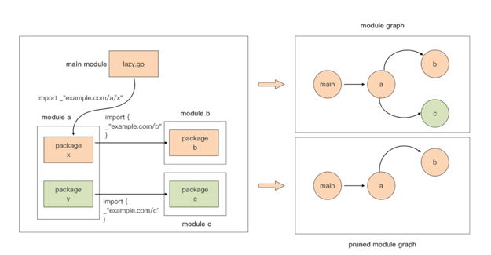
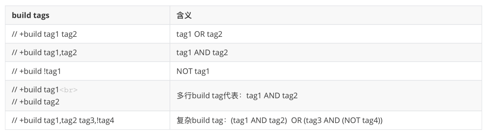

### 支持将切片转换为数组指针

通过数组切片化，可以将一个数组转换为切片，转换后数组将成为转换后的切片的底层数组，通过切片，可以直接改变数组中的元素，就像下面代码这样：

```
a := [3]int{1, 2, 3}
// 通过切片化将数组转化成切片
b := a[:]
b[1] += 10
// [1 12 3]
fmt.Printf("%v\n", a)
```

但反过来就不行了。在 Go 1.17 版本之前，Go 并不支持将切片再转换回数组类型。当然，如果你非要这么做也不是没有办法，可以通过 unsafe 包以不安全的方式实现这样的转换，如下面代码所示：
```
a := []int{1, 2, 3}
var p = (*[3]int)(unsafe.Pointer(&a[0]))
p[1] += 10
// [1 12 3]
fmt.Printf("%v\n", a)
```

但是 unsafe 包，正如其名，它的安全性没有得到编译器和 runtime 层的保证，只能由开发者自己保证，所以建议 Gopher 们在通常情况下不要使用。

Roger Peppe便提出一个issue，希望 Go 核心团队考虑在语法层面补充从切片到数组的转换语法，同时希望这种转换以及转换后的数组在使用时的下标边界，能得到编译器和 runtime 的协助检查。十二年后这个 issue 终于被 Go 核心团队接受，并在 Go 1.17 版本加入到 Go 语法特性当中。

所以，在 Go 1.17 版本中，我们可以像下面代码这样将一个切片转换为数组类型指针，不用再借助 unsafe 包的“黑魔法”了：
```
a := []int{1, 2, 3}
p := (*[3]int)(a)
p[1] += 10
// [1 12 3]
fmt.Printf("%v\n", a)
```

不过，这里要注意的是，Go 会通过运行时而不是编译器去对这类切片到数组指针的转换代码做检查，如果发现越界行为，就会触发运行时 panic。

Go 运行时实施检查的一条原则就是“转换后的数组长度不能大于原切片的长度”，注意这里是切片的长度（len），而不是切片的容量（cap）。

于是你会看到，下面的转换有些合法，有些非法：
```go
var b = []int{11, 12, 13}
var p = (*[4]int)(b) // cannot convert slice with length 3 to pointer to array with length 4
var p = (*[0]int)(b) // ok，*p = []
var p = (*[1]int)(b) // ok，*p = [11]
var p = (*[2]int)(b) // ok，*p = [11, 12]
var p = (*[3]int)(b) // ok，*p = [11, 12, 13]
var p = (*[3]int)(b[:1]) // cannot convert slice with length 1 to pointer to array with length 3 
```

另外，nil 切片或 cap 为 0 的 empty 切片都可以被转换为一个长度为 0 的数组指针，比如：
```
var b1 []int // nil切片
p1 := (*[0]int)(b1)

var b2 = []int{} // empty切片
p2 := (*[0]int)(b2)
```

说完了 Go 语法特性的变化后，再来看看 Go Module 构建模式在 Go 1.17 中的演进。

### Go Module 构建模式的变化
自从 Go 1.11 版本引入 Go Module 构建模式以来，每个 Go 大版本发布时，Go Module 都会有不少的积极变化，Go 1.17 版本也不例外。

#### 修剪的 module 依赖图
Go 1.17 版本中，Go Module 最重要的一个变化就是 pruned module graph，即修剪的 module 依赖图。要理解这个概念，先来讲什么是完整 module 依赖图。

在 Go 1.17 之前的版本中，某个 module 的依赖图是由这个 module 的直接依赖以及所有间接依赖组成的。

这样，无论某个间接依赖是否真正为原 module 的构建做出贡献，Go 命令在解决依赖时都会读取每个依赖的 go.mod，包括那些没有被真正使用到的 module，这样形成的 module 依赖图被称为完整 module 依赖图（complete module graph）。

从 Go 1.17 的版本开始，Go 不再使用“完整 module 依赖图”，而是引入了 pruned module graph，也就是修剪的 module 依赖图。修剪的 module 依赖图就是在完整 module 依赖图的基础上，将那些对构建完全没有“贡献”的间接依赖 module 修剪掉后，剩余的依赖图。使用修剪后的 module 依赖图进行构建，有助于避免下载或阅读那些不必要的 go.mod 文件，这样 Go 命令可以不去获取那些不相关的依赖关系，从而在日常开发中节省时间。

这么说还是比较抽象，用下图中的例子来详细解释一下 module 依赖图修剪的原理。


上图中的例子来自于 Go 1.17 源码中的 src/cmd/go/testdata/script/mod_lazy_new_import.txt，通过执行txtar 工具，可以将这个 txt 转换为 mod_lazy_new_import.txt 中描述的示例结构，转换命令为: txtar -x < $GOROOT/src/cmd/go/testdata/script/mod_lazy_new_import.txt。

在这个示例中，main module 中的 lazy.go 导入了 module a 的 package x，后者则导入了 module b 中的 package b。并且，module a 还有一个 package y，这个包导入了 module c 的 package c。通过 go mod graph 命令，我们可以得到 main module 的完整 module 依赖图，也就是上图的右上角的那张。

现在问题来了！package y 是因为自身是 module a 的一部分而被 main module 依赖的，它自己没有为 main module 的构建做出任何“代码级贡献”，同理，package y 所依赖的 module c 亦是如此。但是在 Go 1.17 之前的版本中，如果 Go 编译器找不到 module c，那么 main module 的构建也会失败，这会让开发者们觉得不够合理！

现在，直观地看一下在 Go 1.16.5 下，这个示例的 go.mod 是怎样的：
```
module example.com/lazy
go 1.15
require example.com/a v0.1.0
replace (
  example.com/a v0.1.0 => ./a
  example.com/b v0.1.0 => ./b
  example.com/c v0.1.0 => ./c1
  example.com/c v0.2.0 => ./c2
)
```

只需要关注 require 块中的内容就可以了，下面的 replace 块主要是为了示例能找到各种依赖 module 而设置的。

在 Go 1.16 及以前支持 Go Module 的版本建立的 Go Module 中，在 go.mod 经过 go mod tidy 后，require 块中保留的都是 main module 的直接依赖，在某些情况下，也会记录 indirect 依赖，这些依赖会在行尾用 indirect 指示符明示。但在这里，我们看不到 main module 的间接依赖以及它们的版本，我们可以用 go mod graph 来查看 module 依赖图：
```
$go mod graph
example.com/lazy example.com/a@v0.1.0
example.com/a@v0.1.0 example.com/b@v0.1.0
example.com/a@v0.1.0 example.com/c@v0.1.0
```

这个 go mod graph 的输出，和在上面图中右上角画的 module graph 是一致的。此时，如果将 replace 中的第三行（example.com/c v0.1.0 => ./c1 这一行）删除，也就是让 Go 编译器找不到 module c@v0.1.0，那么构建 main modue 时就会得到下面的错误提示：
```
$go build
go: example.com/a@v0.1.0 requires
  example.com/c@v0.1.0: missing go.sum entry; to add it:
  go mod download example.com/c
```

现在将执行权限交给 Go 1.17 看看会怎样！

这个时候，需要对 go.mod 做一些修改，也就是将 go.mod 中的 go 1.15 改为 go 1.17，这样 Go 1.17 才能起到作用。

接下来，执行 go mod tidy，让 Go 1.17 重新构建 go.mod：
```
$go mod tidy
$cat go.mod
module example.com/lazy
go 1.17
require example.com/a v0.1.0
require example.com/b v0.1.0 // indirect
replace (
  example.com/a v0.1.0 => ./a
  example.com/b v0.1.0 => ./b
  example.com/c v0.1.0 => ./c1
  example.com/c v0.2.0 => ./c2
)
```

看到执行 go mod tidy 之后，go.mod 发生了变化：增加了一个 require 语句块，记录了 main module 的间接依赖，也就是 module b@v0.10。

现在，也同样将 go.mod replace 块中的第三行（example.com/c v0.1.0 => ./c1 这一行）删除，再来用 go 1.17 构建一次 main module。

这一次我们没有看到 Go 编译器的错误提示。也就是说在构建过程中，Go 编译器看到的 main module 依赖图中并没有 module c@v0.1.0。这是因为 module c 并没有为 main module 的构建提供“代码级贡献”，所以 Go 命令把它从 module 依赖图中剪除了。这一次，Go 编译器使用的真实的依赖图是上图右下角的那张。这种将那些对构建完全没有“贡献”的间接依赖 module 从构建时使用的依赖图中修剪掉的过程，就被称为 module 依赖图修剪（pruned module graph）。

但 module 依赖图修剪也带来了一个副作用，那就是 go.mod 文件 size 的变大。因为从 Go 1.17 版本开始，每次调用 go mod tidy，Go 命令都会对 main module 的依赖做一次深度扫描（deepening scan），并将 main module 的所有直接和间接依赖都记录在 go.mod 中。考虑到依赖的内容较多，go 1.17 会将直接依赖和间接依赖分别放在多个不同的 require 块中。

所以，在 Go 1.17 版本中，go.mod 中存储了 main module 的所有依赖 module 列表，这似乎也是 Go 项目第一次有了项目依赖的完整列表。不知道会不会让你想起其他主流语言构架系统中的那个 lock 文件呢？虽然 go.mod 并不是 lock 文件，但有了完整依赖列表，至少我们可以像其他语言的 lock 文件那样，知晓当前 Go 项目所有依赖的精确版本了。

在 Go 1.17 版本中，go get 已经不再被用来安装某个命令的可执行文件了。如果你依旧使用 go get 安装，Go 命令会提示错误。

新版本中，我们需要使用 go install 来安装，并且使用 go install 安装时还要用 @vx.y.z 明确要安装的命令的二进制文件的版本，或者是使用 @latest 来安装最新版本。

除了 Go 语法特性与 Go Module 有重要变化之外，Go 编译器的变化对 Go 程序的构建与运行影响同样十分巨大，接下来就来看一下 Go 1.17 在这方面的重要变化。

### Go 编译器的变化
在 Go1.17 版本，Go 编译器的变化主要是在 AMD64 架构下实现了基于寄存器的调用惯例，以及新引入了 //go:build 形式的构建约束指示符。

#### 基于寄存器的调用惯例
Go 1.17 版本中，Go 编译器最大的变化是在 AMD64 架构下率先实现了从基于堆栈的调用惯例到基于寄存器的调用惯例的切换。

所谓“调用惯例（calling convention）”，是指调用方和被调用方对于函数调用的一个明确的约定，包括函数参数与返回值的传递方式、传递顺序。只有双方都遵守同样的约定，函数才能被正确地调用和执行。如果不遵守这个约定，函数将无法正确执行。

Go 1.17 版本之前，Go 采用基于栈的调用约定，也就是说函数的参数与返回值都通过栈来传递，这种方式的优点是实现简单，不用担心底层 CPU 架构寄存器的差异，适合跨平台，但缺点就是牺牲了一些性能。

都知道，寄存器的访问速度是要远高于内存的。所以，现在大多数平台上的大多数语言实现都使用基于寄存器的调用约定，通过寄存器而不是内存传递函数参数和返回结果，并指定一些寄存器为调用保存寄存器，允许函数在不同的调用中保持状态。Go 核心团队决定在 1.17 版本向这些语言看齐，并在 AMD64 架构下率先实现基于寄存器的调用惯例。

可以在 Go 1.17 的版本发布说明文档中看到，切换到基于寄存器的调用惯例后，一组有代表性的 Go 包和程序的基准测试显示，Go 程序的运行性能提高了约 5%，二进制文件大小典型减少约 2%。

那这里就来实测一下，看看是否真的能提升那么多。下面是一个使用多种方法进行字符串连接的 benchmark 测试源码：

[stacktoregister](stacktoregister/stacktoregister_test.go)

Go 1.16.7
```text
$ go test -bench .
goos: darwin
goarch: amd64
pkg: github.com/lcy2013/go17feature/stacktoregister
cpu: Intel(R) Core(TM) i7-7700HQ CPU @ 2.80GHz
BenchmarkConcatStringByOperator-8                        9150591               126.8 ns/op
BenchmarkConcatStringBySprintf-8                         1935243               524.5 ns/op
BenchmarkConcatStringByJoin-8                           20106243                68.42 ns/op
BenchmarkConcatStringByStringsBuilder-8                 10154496               152.4 ns/op
BenchmarkConcatStringByStringsBuilderWithInitSize-8     19239342                60.07 ns/op
BenchmarkConcatStringByBytesBuffer-8                    10905541               148.9 ns/op
BenchmarkConcatStringByBytesBufferWithInitSize-8        17436210                66.20 ns/op
PASS
ok      github.com/lcy2013/go17feature/stacktoregister  11.522s
```

Go 1.17.7
```text
$ go test -bench .
goos: darwin
goarch: amd64
pkg: github.com/lcy2013/go17feature/stacktoregister
cpu: Intel(R) Core(TM) i7-7700HQ CPU @ 2.80GHz
BenchmarkConcatStringByOperator-8                       11724108                98.21 ns/op
BenchmarkConcatStringBySprintf-8                         2606816               461.4 ns/op
BenchmarkConcatStringByJoin-8                           21006273                55.06 ns/op
BenchmarkConcatStringByStringsBuilder-8                 10380062               114.2 ns/op
BenchmarkConcatStringByStringsBuilderWithInitSize-8     23723026                48.01 ns/op
BenchmarkConcatStringByBytesBuffer-8                    14295746                80.88 ns/op
BenchmarkConcatStringByBytesBufferWithInitSize-8        22763881                51.01 ns/op
PASS
ok      github.com/lcy2013/go17feature/stacktoregister  9.600s
```

可以看到，相对于 Go 1.16.5 跑出的结果，Go 1.17 在每一个测试项上都有小幅的性能提升，有些性能提升甚至达到 10% 左右（以 BenchmarkConcatStringBySprintf 为例，它的性能提升为 (524.5-461.4)/524.5=12.03%）。也就是说你的 Go 源码使用 Go 1.17 版本重新编译一下，就能获得大约 5% 的性能提升，这种新版本带来的性能的“自然提升”显然是广大 Gopher 乐意看到的。

再来看看编译后的 Go 二进制文件的 Size 变化。

以一个自有的 1w 行左右代码的 Go 程序为例，分别用 Go 1.16.7 和 Go 1.17.7 进行编译，得到的结果如下：
```text
-rwxr-xr-x   1   staff  7264432  8 13 18:31 myapp-go1.16*
-rwxr-xr-x   1   staff  6934352  8 13 18:32 myapp-go1.17*
```

Go 1.17 编译后的二进制文件大小相比 Go 1.16 版本减少了约 4%，比 Go 官方文档发布的平均效果还要好上一些。

Go 1.17 发布说明也提到了：改为基于寄存器的调用惯例后，绝大多数程序不会受到影响。只有那些之前就已经违反 unsafe.Pointer 的使用规则的代码可能会受到影响，比如不遵守 unsafe 规则通过 unsafe.Pointer 访问函数参数，或者依赖一些像比较函数代码指针的未公开的行为。

#### //go:build 形式的构建约束指示符
此外，Go 编译器还在 Go 1.17 中引入了 //go:build 形式的构建约束指示符，以替代原先易错的 // +build 形式。

在 Go 1.17 之前，可以通过在源码文件头部放置 // +build 构建约束指示符来实现构建约束，但这种形式十分易错，并且它并不支持 && 和||这样的直观的逻辑操作符，而是用逗号、空格替代，这里你可以看下原 // +build 形式构建约束指示符的用法及含义：


但这种与程序员直觉“有悖”的形式让 Gopher 们十分痛苦，于是 Go 1.17 回归“正规正轨”，引入了//go:build 形式的构建约束指示符。一方面，这可以与源文件中的其他指示符保持形式一致，比如 //go:no 、//go:norace、//go:noinline、//go:generate 等。

另一方面，新形式将支持 && 和||逻辑操作符，这样的形式就是自解释的，这样，我们程序员就不需要再像上面那样列出一个表来解释每个指示符组合的含义了。新形式是这样的：
```text
//go:build linux && (386 || amd64 || arm || arm64 || mips64 || mips64le || ppc64 || ppc64le)
//go:build linux && (mips64 || mips64le)
//go:build linux && (ppc64 || ppc64le)
//go:build linux && !386 && !arm
```

考虑到兼容性，Go 命令可以识别这两种形式的构建约束指示符，但推荐 Go 1.17 之后都用新引入的这种形式。

另外，gofmt 也可以兼容处理两种形式。它的处理原则是：如果一个源码文件只有 // +build 形式的指示符，gofmt 会把和它等价的 //go:build 行加入。否则，如果一个源文件中同时存在这两种形式的指示符行，那么 //+build 行的信息就会被 //go:build 行的信息所覆盖。

除了 gofmt 外，go vet 工具也会检测源文件中是否同时存在不同形式的、语义不一致的构建指示符，比如针对下面这段代码：
```text
//go:build linux && !386 && !arm
// +build linux
package main
import "fmt"
func main() {
  fmt.Println("hello, world")
}
```

go vet 会提示如下问题：
> ./buildtag.go:2:1: +build lines do not match //go:build condition


