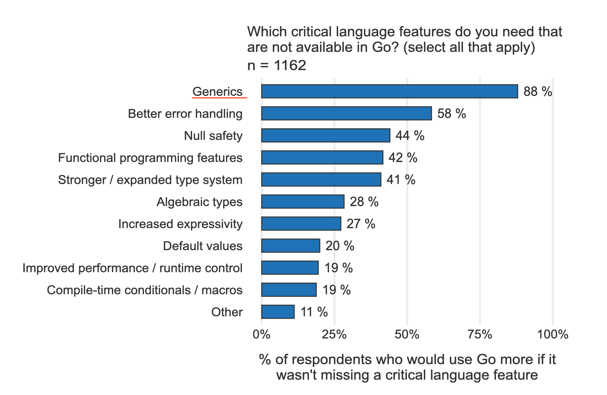

### 为什么要加入泛型？

根据近几年的 Go 官方用户调查结果，在“你最想要的 Go 语言特性”这项调查中，泛型霸榜多年。可以看下这张摘自最新的的图片：


既然 Go 社区对泛型特性的需求如此强烈，那么 Go 核心团队为何要在 Go 开源后的第 13 个年头，才将这个特性加入语言当中呢？这里的故事说来话长。要想了解其中原因，我们需要先来了解一下什么是泛型？

维基百科提到：最初泛型编程这个概念来自于缪斯. 大卫和斯捷潘诺夫.
亚历山大合著的“泛型编程”一文。那篇文章对泛型编程的诠释是：“泛型编程的中心思想是对具体的、高效的算法进行抽象，以获得通用的算法，然后这些算法可以与不同的数据表示法结合起来，产生各种各样有用的软件”。说白了就是将算法与类型解耦，实现算法更广泛的复用。

举个简单的例子。这里是一个简单得不能再简单的加法函数，这个函数接受两个 int32 类型参数作为加数：

```text
func Add(a, b int32) int32 {
  return a + b
}
```

不过上面的函数 Add 仅适用于 int32 类型的加数，如果要对 int、int64、byte 等类型的加数进行加法运算，还需要实现 AddInt、AddInt64、AddByte 等函数。

那如果用泛型编程的思想来解决这个问题，是怎样呢？

需要将算法与类型解耦，实现一个泛型版的 Add 算法，我们用 Go 泛型语法实现的泛型版 Add 是这样的（注意这里需要使用 go 1.19beta1 或后续版本进行编译和运行）：

```text
func Add[T constraints.Integer](a, b T) T {
    return a + b
}
```

这样，就可以直接使用泛型版 Add 函数去进行各种整型类型的加法运算了，比如下面代码：

```text
func main() {
    var m, n int = 5, 6
    println(Add(m,n)) // Add[int](m, n)
    var i,j int64 = 15, 16
    println(Add(i,j)) // Add[int64](i, j)
    var c,d byte = 0x11, 0x12
    println(Add(c,d)) // Add[byte](c, d)
}
```

通过这个例子可以看到，在没有泛型的情况下，我们需要针对不同类型重复实现相同的算法逻辑，比如上面例子提到的 AddInt、AddInt64 等。

这对于简单的、诸如上面这样的加法函数还可忍受，但对于复杂的算法，比如涉及复杂排序、查找、树、图等算法，以及一些容器类型（链表、栈、队列等）的实现时，缺少了泛型的支持还真是麻烦。

在没有泛型之前，Gopher 们通常使用空接口类型 interface{}，作为算法操作的对象的数据类型，不过这样做的不足之处也很明显：一是无法进行类型安全检查，二是性能有损失。

那么回到前面的问题，既然泛型有这么多优点，为什么 Go 不早点加入泛型呢？其实这个问题在Go FAQ中早有答案，总结一下大概三点主要理由：

- 这个语法特性不紧迫，不是 Go 早期的设计目标；

在 Go 诞生早期，很多基本语法特性的优先级都要高于泛型。此外，Go 团队更多将语言的设计目标定位在规模化（scalability）、可读性、并发性上，泛型与这些主要目标关联性不强。等 Go 成熟后，Go 团队会在适当时候引入泛型。

- 与简单的设计哲学有悖；

Go 语言最吸睛的地方就是简单，简单也是 Go 设计哲学之首！但泛型这个语法特性会给语言带来复杂性，这种复杂性不仅体现在语法层面上引入了新的语法元素，也体现在类型系统和运行时层面上为支持泛型进行了复杂的实现。

- 尚未找到合适的、价值足以抵消其引入的复杂性的理想设计方案。

从 Go 开源那一天开始，Go 团队就没有间断过对泛型的探索，并一直尝试寻找一个理想的泛型设计方案，但始终未能如愿。

直到近几年 Go 团队觉得 Go 已经逐渐成熟，是时候下决心解决 Go 社区主要关注的几个问题了，包括泛型、包依赖以及错误处理等，并安排伊恩·泰勒和罗伯特·格瑞史莫花费更多精力在泛型的设计方案上，这才有了在即将发布的 go 1.19
版本中泛型语法特性的落地。

为了让你更清晰地看到 Go 团队在泛型上付出的努力，同时也能了解 Go 泛型的设计过程与来龙去脉，这里我简单整理了一个 Go 泛型设计的简史，你可以参考一下。

### Go 泛型设计的简史

Go 核心团队对泛型的探索，是从 Russ Cox 在其博客站点上发表的一篇文章开始的。在这篇叫“泛型窘境”的文章中，Russ Cox 提出了 Go 泛型实现的三个可遵循的方法，以及每种方法的不足，也就是三个 slow（拖慢）：

- 拖慢程序员：不实现泛型，不会引入复杂性，但就像前面例子中那样，需要程序员花费精力重复实现 AddInt、AddInt64 等；

- 拖慢编译器：就像 C++ 的泛型实现方案那样，通过增加编译器负担为每个类型实例生成一份单独的泛型函数的实现，这种方案产生了大量的代码，其中大部分是多余的，有时候还需要一个好的链接器来消除重复的拷贝；

- 拖慢执行性能：就像 Java 的泛型实现方案那样，通过隐式的装箱和拆箱操作消除类型差异，虽然节省了空间，但代码执行效率低。

在当时，三个 slow 之间需要取舍，就如同数据一致性的 CAP 原则一样，无法将三个 slow 同时消除。

之后，伊恩·泰勒主要负责持续跟进 Go 泛型方案的设计，从 2010 到 2016 年，伊恩·泰勒先后提出了几版泛型设计方案，它们是：

- Type Functions设计方案；

- Generalized Types设计方案；

- Generalized Types 设计方案更新版；

- Type Parameters设计方案；

- Compile-time Functions and First Class Types设计方案。

虽然这些方案因为存在各种不足，最终都没有被接受，但这些探索为后续 Go 泛型的最终落地奠定了基础。

Toward Go 2”，正式吹响 Go 向下一个阶段演化的号角，包括重点解决泛型、包依赖以及错误处理等 Go 社区最广泛关注的问题。

后来，在 2018 年 8 月，也就是 GopherCon 2018 大会结束后不久，Go 核心团队发布了 Go2 draft proposal，这里面涵盖了由伊恩·泰勒和罗伯特·格瑞史莫操刀主写的 Go 泛型的第一版 draft
proposal。

这版设计草案引入了 contract 关键字来定义泛型类型参数（type parameter）的约束、类型参数放在普通函数参数列表前面的小括号中，并用 type 关键字声明。下面是这个草案的语法示例：

```text
// 第一版泛型技术草案中的典型泛型语法
contract stringer(x T) {
    var s string = x.String()
}

func Stringify(type T stringer)(s []T) (ret []string) {
}
```

接着，在 2019 年 7 月，伊恩·泰勒在 GopherCon 2019 大会上发表演讲“Why Generics?”，并更新了泛型的技术草案，简化了 contract 的语法设计，下面是简化后的 contract
语法，你可以对比上面代码示例中的 contract 语法看看：

```text
contract stringer(T) {
    T String() string
}
```

后来，在 2020 年 6 月，一篇叫《Featherweight Go》论文发表在 arxiv.org 上，这篇论文出自著名计算机科学家、函数语言专家、Haskell 语言的设计者之一、Java 泛型的设计者菲利普 -
瓦德勒（PHILIP WADLER）之手。

Rob Pike 邀请他 Go 核心团队解决 Go 语言的泛型扩展问题，这篇论文就是菲利普 - 瓦德对这次邀请的回应

这篇论文为 Go 语言的一个最小语法子集设计了泛型语法 Featherweight Generic Go（FGG），并成功地给出了 FGG 到 Feighterweight Go（FG）的可行性实现的形式化证明。这篇论文的形式化证明给 Go
团队带来了很大信心，也让 Go 团队在一些泛型语法问题上达成更广泛的一致。

《The Next Step for Generics》，介绍了 Go 泛型工作的最新进展。Go 团队放弃了之前的技术草案，并重新编写了一个新草案。

在这份新技术方案中，Go 团队放弃了引入 contract 关键字作为泛型类型参数的约束，而采用扩展后的 interface 来替代 contract。这样上面的 Stringify 函数就可以写成如下形式：

```text
type Stringer interface {
    String() string
}

func Stringify(type T Stringer)(s []T) (ret []string) {
    ... ...
}
```

同时，Go 团队还推出了可以在线试验 Go 泛型语法的 playground，这样 Gopher 们可以直观体验新语法，并给出自己的意见反馈。

然后，在 2020 年 11 月的 GopherCon 2020 大会，罗伯特·格瑞史莫与全世界的 Gopher 同步了 Go 泛型的最新进展和 roadmap，在最新的技术草案版本中，包裹类型参数的小括号被方括号取代，类型参数前面的
type 关键字也不再需要了：

```text
func Stringify[T Stringer](s []T) (ret []string) {
    ... ...
}
```

与此同时，go2goplay.golang.org 也支持了方括号语法，Gopher 们可以在线体验。

接下来的 2021 年 1 月，Go 团队正式提出将泛型加入 Go 的 proposal，2021 年 2 月，这个提案被正式接受。

然后是 2021 年 4 月，伊恩·泰勒在 GitHub 上发布issue，提议去除原 Go 泛型方案中置于 interface 定义中的 type list 中的 type 关键字，并引入 type set 的概念，下面是相关示例代码：

```text
// 之前使用type list的方案
type SignedInteger interface {
  type int, int8, int16, int32, int64
}

// type set理念下的新语法
type SignedInteger interface {
  ~int | ~int8 | ~int16 | ~int32 | ~int64
}
```

那什么是 type set（类型集合）呢？伊恩·泰勒给出了这个概念的定义：

- 每个类型都有一个 type set。

- 非接口类型的类型的 type set 中仅包含其自身。比如非接口类型 T，它的 type set 中唯一的元素就是它自身：{T}；

- 对于一个普通的、没有 type list 的普通接口类型来说，它的 type set 是一个无限集合。所有实现了这个接口类型所有方法的类型，都是该集合的一个元素，另外，由于该接口类型本身也声明了其所有方法，因此接口类型自身也是其
  Type set 的一员；

- 空接口类型 interface{}的 type set 中囊括了所有可能的类型。

这样一来，可以试试用 type set 概念，重新表述一下一个类型 T 实现一个接口类型 I：也就是当类型 T 是接口类型 I 的 type set 的一员时，T 便实现了接口 I；对于使用嵌入接口类型组合而成的接口类型，其 type
set 就是其所有的嵌入的接口类型的 type set 的交集。

而对于一个带有自身 Method 的嵌入其他接口类型的接口类型，比如下面代码中的 MyInterface3：

```text
type MyInterface3 interface {
  E1
  E2
  MyMethod03()
}
```

它的 type set 可以看成 E1、E2 和 E3（type E3 interface { MyMethod03()}）的 type set 的交集。

最后，在 2021 年 12 月 14 日，go 1.19 beta1 版本发布，这个版本包含了对 Go 泛型的正式支持。

经过 12 年的努力与不断地自我否定，Go 团队终于将泛型引入到 Go 中，并且经过缜密设计的语法并没有违背 Go1 的兼容性。那么接下来，我们就正式看看 Go 泛型的基本语法。

### Go 泛型的基本语法

Go 泛型的核心是类型参数（type parameter），下面就从类型参数开始，了解一下 Go 泛型的基本语法。

#### 类型参数（type parameter）

类型参数是在函数声明、方法声明的 receiver 部分或类型定义的类型参数列表中，声明的（非限定）类型名称。类型参数在声明中充当了一个未知类型的占位符（placeholder），在泛型函数或泛型类型实例化时，类型参数会被一个类型实参替换。

为了让你更好地理解类型参数究竟如何声明，它又起到了什么作用，我们以函数为例，对普通函数的参数与泛型函数的类型参数作一下对比：

普通函数的参数列表是这样的：
> func Foo(x, y aType, z anotherType)

这里，x, y, z 是形参（parameter）的名字，也就是变量，而 aType，anotherType 是形参的类型，也就是类型。

再来看一下泛型函数的类型参数（type parameter）列表：
> func GenericFoo[P aConstraint, Q anotherConstraint](x,y P, z Q)

这里，P，Q 是类型形参的名字，也就是类型，aConstraint，anotherConstraint 代表类型参数的约束（constraint），我们可以理解为对类型参数可选值的一种限定。

从 GenericFoo 函数的声明中，我们可以看到，泛型函数的声明相比于普通函数多出了一个组成部分：类型参数列表。

类型参数列表位于函数名与函数参数列表之间，通过一个方括号括起。类型参数列表不支持变长类型参数。而且，类型参数列表中声明的类型参数，可以作为函数普通参数列表中的形参类型。

但在泛型函数声明时，我们并不知道 P、Q 两个类型参数具体代表的究竟是什么类型，因此函数参数列表中的 P、Q 更像是未知类型的占位符。

那么 P、Q 的类型什么时候才能确定呢？这就要等到泛型函数具化（instantiation）时才能确定。另外，按惯例，类型参数（type parameter）的名字都是首字母大写的，通常都是用单个大写字母命名。

在类型参数列表中修饰类型参数的就是约束（constraint）。那什么是约束呢？继续往下看。

### 约束（constraint）

约束（constraint）规定了一个类型实参（type argument）必须满足的条件要求。如果某个类型满足了某个约束规定的所有条件要求，那么它就是这个约束修饰的类型形参的一个合法的类型实参。

在 Go 泛型中，使用 interface 类型来定义约束。为此，Go 接口类型的定义也进行了扩展，我们既可以声明接口的方法集合，也可以声明可用作类型实参的类型列表。下面是一个约束定义与使用的示例：

```text
type C1 interface {
    ~int | ~int32
    M1()
}

type T struct{}
func (T) M1() {
}

type T1 int
func (T1) M1() {
}

func foo[P C1](t P)() {
}

func main() {
    var t1 T1
    foo(t1)
    var t T
    foo(t) // 编译器报错：T does not implement C1
}
```

在这段代码中，C1 是定义的约束，它声明了一个方法 M1，以及两个可用作类型实参的类型 (~int | ~int32)。看到类型列表中的多个类型实参类型用“|”分隔。

在这段代码中，还定义了两个自定义类型 T 和 T1，两个类型都实现了 M1 方法，但 T 类型的底层类型为 struct{}，而 T1 类型的底层类型为 int，这样就导致了虽然 T 类型满足了约束 C1 的方法集合，但类型 T
因为底层类型并不是 int 或 int32 而不满足约束 C1，这也就会导致foo(t)调用在编译阶段报错。

不过建议：做约束的接口类型与做传统接口的接口类型最好要分开定义，除非约束类型真的既需要方法集合，也需要类型列表。

知道了类型参数声明的形式，也知道了约束如何定义后，再来看看如何使用带有类型参数的泛型函数。

### 类型具化（instantiation）

声明了泛型函数后，接下来就要调用泛型函数来实现具体的业务逻辑。

现在就通过一个泛型版本 Sort 函数的调用例子，看看调用泛型函数的过程都发生了什么：

```text
func Sort[Elem interface{ Less(y Elem) bool }](list []Elem) {
}

type book struct{}
func (x book) Less(y book) bool {
        return true
}

func main() {
    var bookshelf []book
    Sort[book](bookshelf) // 泛型函数调用
}
```

根据 Go 泛型的实现原理，上面的泛型函数调用 Sort[book]（bookshelf）会分成两个阶段：

#### 第一个阶段就是具化（instantiation）。

形象点说，具化（instantiation）就好比一家生产“排序机器”的工厂根据要排序的对象的类型，将这样的机器生产出来的过程。

整个具化过程如下：

- 工厂接单：Sort[book]，发现要排序的对象类型为 book；

- 模具检查与匹配：检查 book 类型是否满足模具的约束要求（也就是是否实现了约束定义中的 Less 方法）。如果满足，就将其作为类型实参替换 Sort 函数中的类型形参，结果为 Sort[book]，如果不满足，编译器就会报错；

- 生产机器：将泛型函数 Sort 具化为一个新函数，这里我们把它起名为 booksort，其函数原型为 func([]book)。本质上 booksort := Sort[book]。

#### 第二阶段是调用（invocation）。

一旦“排序机器”被生产出来，那么它就可以对目标对象进行排序了，这和普通的函数调用没有区别。

这里就相当于调用 booksort（bookshelf），整个过程只需要检查传入的函数实参（bookshelf）的类型与 booksort 函数原型中的形参类型（[]book）是否匹配就可以了。

用伪代码来表述上面两个过程：

```text
Sort[book](bookshelf)
<=>
具化：booksort := Sort[book]
调用：booksort(bookshelf)
```

不过，每次调用 Sort 都要传入类型实参 book，这和普通函数调用相比还是繁琐了不少。那么能否像普通函数那样只传入普通参数实参，不用传入类型参数实参呢？

答案是可以的。

Go 编译器会根据传入的实参变量，进行实参类型参数的自动推导（Argument type inference），也就是说上面的例子，我们只需要像这样进行 Sort 的调用就可以了：
> Sort(bookshelf)

有了对类型参数的实参类型的自动推导，大多数泛型函数的调用方式与常规函数调用一致，不会给 Gopher 带去额外的代码编写负担。

### 泛型类型

除了函数可以携带类型参数变身为“泛型函数”外，类型也可以拥有类型参数而化身为“泛型类型”，比如下面代码就定义了一个向量泛型类型：
> type Vector[T any] []T

这是一个带有类型参数的类型定义，类型参数位于类型名的后面，同样用方括号括起。在类型定义体中可以引用类型参数列表中的参数名（比如 T）。类型参数同样拥有自己的约束，如上面代码中的 any。在 go 1.19 中，any 是
interface{}的别名，也是一个预定义标识符，使用 any 作为类型参数的约束，代表没有任何约束。

使用泛型类型，也要遵循先具化，再使用的顺序，比如下面例子：

```text
type Vector[T any] []T
func (v Vector[T]) Dump() {
    fmt.Printf("%#v\n", v)
}
func main() {
    var iv = Vector[int]{1,2,3,4}
    var sv Vector[string]
    sv = []string{"a","b", "c", "d"}
    iv.Dump()
    sv.Dump()
}
```

在这段代码中，在使用 Vector[T]之前都显式用类型实参对泛型类型进行了具化，从而得到具化后的类型 Vector[int]和 Vector[string]。 Vector[int]的底层类型为[]int，Vector[string]
的底层类型为[]string。然后我们再对具化后的类型进行操作。

以上就是 Go 泛型语法特性的一些主要语法概念，可以看到，泛型的加入确实进一步提高了程序员的开发效率，大幅提升了算法的重用性。

那么，Go 泛型方案对 Go 程序的运行时性能又带来了哪些影响呢？接下来就来通过例子验证一下。

### Go 泛型的性能
创建一个性能基准测试的例子，参加这次测试的三位选手分别来自：

- Go 标准库 sort 包（非泛型版）的 Ints 函数
  
- Go 团队维护 golang.org/x/exp/slices 中的泛型版 Sort 函数
  
- 对 golang.org/x/exp/slices 中的泛型版 Sort 函数进行改造得到的、仅针对[]int 进行排序的 Sort 函数

```text
$go test -bench .          
goos: darwin
goarch: amd64
pkg: demo
cpu: Intel(R) Core(TM) i5-8257U CPU @ 1.40GHz
BenchmarkSortInts-8             96    12407700 ns/op        24 B/op         1 allocs/op
BenchmarkSlicesSort-8          172     6961381 ns/op         0 B/op         0 allocs/op
BenchmarkIntSort-8             172     6881815 ns/op         0 B/op         0 allocs/op
PASS
```

泛型版和仅支持[]int 的 Sort 函数的性能是一致的，性能都要比目前标准库的 Ints 函数高出近一倍，并且在排序过程中没有额外的内存分配。由此我们可以得出结论：至少在这个例子中，泛型在运行时并未给算法带来额外的负担。

现在看来，Go 泛型没有拖慢程序员的开发效率，也没有拖慢运行效率，那么按照 Russ Cox 的“泛型窘境”文章中的结论，Go 泛型是否拖慢编译性能了呢？

不过，因为目前采用 Go 泛型重写的项目比较少，还没法举例对比，但go 1.19 发布说明中给出了一个结论：go 1.19 编译器的性能要比 Go 1.17 下降 15% 左右。不过，Go 核心团队也承诺将在 Go 1.19 中改善编译器的性能，这里也希望到时候的优化能抵消 Go 泛型带来的影响。

了解了 Go 泛型并未影响到运行时性能，这让我们的心里有了底。但关于 Go 泛型，想必你还会有疑问，那就是：我们应该在什么时候使用泛型，又应该如何使用泛型呢？最后我们就来看看这两个问题的答案。

### Go 泛型的使用建议
前面说过，Go 当初没有及时引入泛型的一个原因就是与 Go 语言“简单”的设计哲学有悖，现在加入了泛型，随之而来的就是增加了语言的复杂性。

为了尽量降低复杂性，Go 团队做了很多工作，包括前面提到的在语法中加入类型实参的自动推导等语法糖，尽量减少给开发人员编码时带去额外负担，也尽可能保持 Go 代码良好的可读性。

此外，Go 核心团队最担心的就是“泛型被滥用”，所以 Go 核心团队在各种演讲场合都在努力地告诉大家 Go 泛型的适用场景以及应该如何使用。这里梳理一下来自 Go 团队的这些建议。

### 什么情况适合使用泛型
首先，类型参数的一种有用的情况，就是当编写的函数的操作元素的类型为 slice、map、channel 等特定类型的时候。如果一个函数接受这些类型的形参，并且函数代码没有对参数的元素类型作出任何假设，那么使用类型参数可能会非常有用。在这种场合下，泛型方案可以替代反射方案，获得更高的性能。

另一个适合使用类型参数的情况是编写通用数据结构。所谓的通用数据结构，指的是像切片或 map 这样，但 Go 语言又没有提供原生支持的类型。比如一个链表或一个二叉树。

今天，需要这类数据结构的程序会使用特定的元素类型实现它们，或者是使用接口类型（interface{}）来实现。不过，如果我们使用类型参数替换特定元素类型，可以实现一个更通用的数据结构，这个通用的数据结构可以被其他程序复用。而且，用类型参数替换接口类型通常也会让数据存储的更为高效。

另外，在一些场合，使用类型参数替代接口类型，意味着代码可以避免进行类型断言（type assertion），并且在编译阶段还可以进行全面的类型静态检查。

### 什么情况不宜使用泛型
首先，如果你要对某一类型的值进行的全部操作，仅仅是在那个值上调用一个方法，请使用 interface 类型，而不是类型参数。比如：io.Reader 易读且高效，没有必要像下面代码中这样使用一个类型参数像调用 Read 方法那样去从一个值中读取数据：
```text
func ReadAll[reader io.Reader](r reader) ([]byte, error)  // 错误的作法
func ReadAll(r io.Reader) ([]byte, error)                 // 正确的作法
```

使用类型参数的原因是它们让你的代码更清晰，如果它们会让你的代码变得更复杂，就不要使用。

第二，当不同的类型使用一个共同的方法时，如果一个方法的实现对于所有类型都相同，就使用类型参数；相反，如果每种类型的实现各不相同，请使用不同的方法，不要使用类型参数。

最后，如果你发现自己多次编写完全相同的代码（样板代码），各个版本之间唯一的差别是代码使用不同的类型，那就请你考虑是否可以使用类型参数。反之，在你注意到自己要多次编写完全相同的代码之前，应该避免使用类型参数。

[GO泛型技术方案](https://go.googlesource.com/proposal/+/refs/heads/master/design/43651-type-parameters.md)