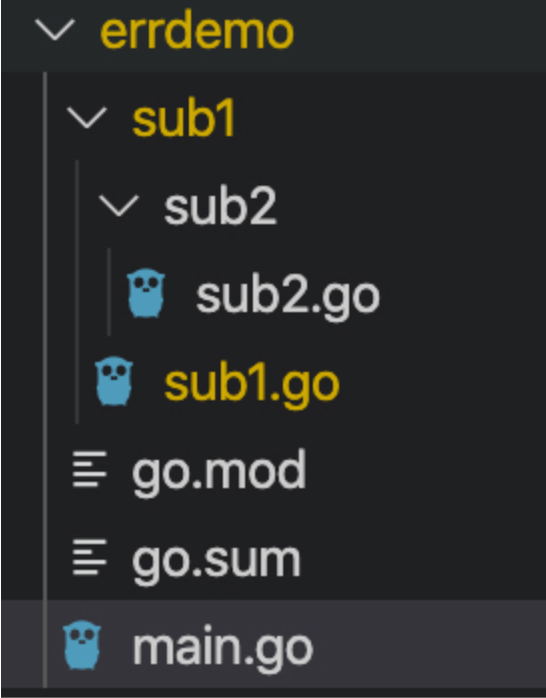
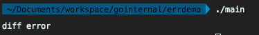
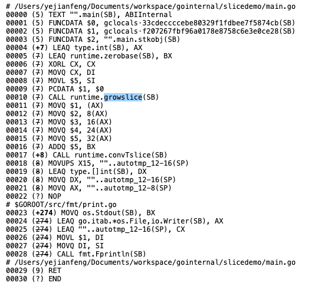
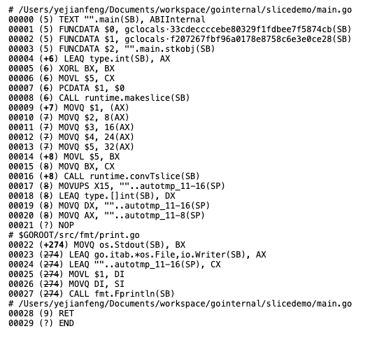
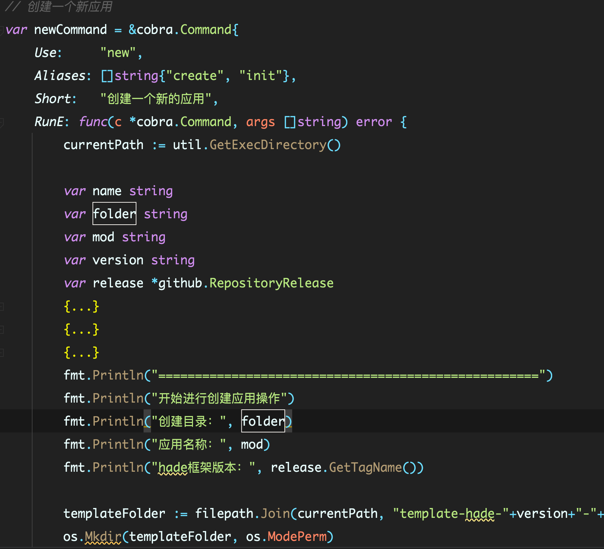

### 第一点：使用 pkg/errors 而不是官方 error 库

其实可以思考一下，在一个项目中使用错误机制，最核心的几个需求是什么？主要是这两点：

- 附加信息：希望错误出现的时候能附带一些描述性的错误信息，甚至这些信息是可以嵌套的；

- 附加堆栈：希望错误不仅仅打印出错误信息，也能打印出这个错误的堆栈信息，让我们可以知道出错的具体代码。

在 Go 语言的演进过程中，error 传递的信息太少一直是被诟病的一点。使用官方的 error 库，只能打印一条简单的错误信息，而没有更多的信息辅助快速定位错误。所以，推荐你在应用层使用 github.com/pkg/errors
来替换官方的 error 库。因为使用 pkg/errors，不仅能传递出标准库 error 的错误信息，还能传递出抛出 error 的堆栈信息。

这里，看一个例子直观感受一下。假设有一个项目叫 errdemo，他有 sub1,sub2 两个子包。sub1 和 sub2 两个包都有 Diff 和 IoDiff 两个函数。


设计的这个程序，在 sub2.go 和 sub1.go 中都抛出了错误，且错误信息都为 diff error。看下使用标准库 error 和 pkg/errors 都能返回什么信息：
> action/16_action/gosuggestion/errdemo/main.go

在这三段代码中，很不幸地将 sub1.go 中的 Diff 返回的 error 和 sub2.go 中 Diff 返回的 error，都定义为同样的字符串“diff error”：


这个时候，在 main.go 中，我们是无论如何都不能通过这个错误信息，来判断这个 error 到底是从 sub1 还是 sub2 中抛出的，调试的时候会带来很大的困扰。

而使用 github.com/pkg/errors ，就不同了，它可以把错误的堆栈信息也打印出来。而且，我们所有的代码都不需要进行修改，只需要将 import 地方进行对应的修改就可以了。

比如，在这段代码中，只需要在 main.go 中使用fmt.Printf("%+v", err) 就可以了：
> action/16_action/gosuggestion/errdemov2/main.go

运行结果：

```text
fufeng@magic ~/s/g/p/t/a/1/g/errdemov2>go run main.go 
diff error
errdemo/sub1/sub2.Diff
        /Users/magicLuoMacBook/software/go/projects/thinking-in-go/action/16_action/gosuggestion/errdemov2/sub1/sub2/sub2.go:7
errdemo/sub1.Diff
        /Users/magicLuoMacBook/software/go/projects/thinking-in-go/action/16_action/gosuggestion/errdemov2/sub1/sub1.go:14
main.main
        /Users/magicLuoMacBook/software/go/projects/thinking-in-go/action/16_action/gosuggestion/errdemov2/main.go:9
runtime.main
        /Users/magicLuoMacBook/software/go/sdks/go1.17/src/runtime/proc.go:255
runtime.goexit
        /Users/magicLuoMacBook/software/go/sdks/go1.17/src/runtime/asm_amd64.s:1581
```

可以看到，除了"diff error" 的错误信息之外，pkg/errors 还将堆栈打印出来了，能明确地看到是 sub2.go 中第 7 行抛出的错误。

那么，github.com/pkg/errors 是怎么实现这个功能的呢？其实，它的原理非常简单，它就是利用了 fmt 包的一个特性。fmt 包在打印 error 之前会判断当前打印的对象是否实现了 Formatter 接口，这个
formatter 接口只有一个 format 方法。如果要输出的对象实现了这个 Formatter 接口，则调用对象的 Format 方法来打印信息：

```text
type Formatter interface {
    Format(f State, c rune)
}
```

而 github.com/pkg/errors 中提供的各种初始化 error 方法（包括 errors.New）封装了一个 fundamental 结构，这个结构就是实现了 Formatter 接口：

```text
// fundamental is an error that has a message and a stack, but no caller.
type fundamental struct {
    msg string
    *stack
}
```

可以看到，这个 fundamental 结构中带着 error 的信息和堆栈信息。并且实现了 Format 方法。在 Format 方法中，判断调用 fmt.Printf 函数的第一个参数，如果是 +v，则打印错误内容和堆栈信息，如果是 v
或者 s，则打印错误内容，如果是 q，则打印转义后的信息：

```text
func (f *fundamental) Format(s fmt.State, verb rune){
        switch verb {
        case 'v':
                if s.Flag('+') {
                        io.WriteString(s, f.msg)
                        f.stack.Format(s, verb)
                        return
                }
                fallthrough
        case 's':
                io.WriteString(s, f.msg)
        case 'q':
                fmt.Fprintf(s, "%q", f.msg)    
        }
}
```

所以说，在实际的工作项目中，建议你尽量使用 pkg/errors 而不是官方 error 库，这样我们能在错误出现的时候获取更多的错误信息，更快地定位问题。

### 第二点：在初始化 slice 的时候尽量补全 cap

当创建一个 slice 结构，并且往 slice 中 append 元素的时候，可能有两种写法来初始化这个 slice。

#### 方法一，直接使用[]int 的方式来初始化：

```go
package main

import "fmt"

func main() {
	arr := []int{}
	arr = append(arr, 1, 2, 3, 4, 5)
	fmt.Println(arr)
}
```

#### 方法二，使用 make 关键字来初始化：

```go
package main

import "fmt"

func main() {
	arr := make([]int, 0, 5)
	arr = append(arr, 1, 2, 3, 4, 5)
	fmt.Println(arr)
}
```

可以看到，方法二相较于方法一，就只有一个区别：在初始化[]int slice 的时候在 make 中设置了 cap 的长度，就是 slice 的大小。

而且，这两种方法对应的功能和输出结果是没有任何差别的，但是实际运行的时候，方法二会比方法一少运行了一个 growslice 的命令，能够提升我们程序的运行性能。具体我们可以打印汇编码查看一下。

方法一：


方法二：


可以看到，方法一中使用了 growsslice 方法，而方法二中是没有调用这个方法的。

这个 growslice 的作用就是扩充 slice 容量，每当我们的 slice 容量小于我们需要使用的 slice
大小，这个函数就会被触发。它的机制就好比是原先我们没有定制容量，系统给了我们一个能装两个鞋子的盒子，但是当我们装到第三个鞋子的时候，这个盒子就不够了，我们就要换一个盒子，而换这个盒子，我们势必还需要将原先的盒子里面的鞋子也拿出来放到新的盒子里面。

而 growsslice 的操作是一个比较复杂的操作，它的表现和复杂度会高于最基本的初始化 make 方法。对追求性能的程序来说，应该能避免就尽量避免。

如果对 growsslice 函数的具体实现感兴趣，可以参考源码 src 的 runtime/slice.go 。

当然，我们并不是每次都能在 slice 初始化的时候，就准确预估到最终的使用容量，所以我这里说的是“尽量补全 cap”。明白是否设置 slice 容量的区别后，我们在能预估容量的时候，请尽量使用方法二那种预估容量后的 slice
初始化方式。

### 第三点：初始化一个类的时候，如果类的构造参数较多，尽量使用 Option 写法

当我们遇到一定要初始化一个类的时候，大部分时候，我们都会使用类似下列的 New 方法：

```go
package newdemo

type Foo struct {
	name string
	id   int
	age  int
	db   interface{}
}

func NewFoo(name string, id int, age int, db interface{}) *Foo {
	return &Foo{
		name: name,
		id:   id,
		age:  age,
		db:   db,
	}
}
```

在这段代码中，定义一个 NewFoo 方法，其中存放初始化 Foo 结构所需要的各种字段属性。

这个写法乍看之下是没啥问题的，但是一旦 Foo 结构内部的字段发生了变化，增加或者减少了，那么这个初始化函数 NewFoo 就怎么看怎么别扭了。

参数继续增加？那么所有调用了这个 NewFoo 方法的地方也都需要进行修改，且按照代码整洁的逻辑，参数多于 5 个，这个函数就很难使用了。而且，如果这 5 个参数都是可有可无的参数，就是有的参数可以不填写，有默认值，比如 age
这个字段，即使我们不填写，在后续的业务逻辑中可能也没有很多影响，那么我在实际调用 NewFoo 的时候，age 这个字段还需要传递 0 值：

> foo := NewFoo("jianfengye", 1, 0, nil)

乍看这行代码，你可能会以为我创建了一个 Foo，它的年龄为 0，但是实际上我们是希望表达这里使用了一个“缺省值”，这种代码的语义逻辑就不对了。

这里其实有一种更好的写法：使用 Option 写法来进行改造。

Option 写法，顾名思义，就是将所有可选的参数作为一个可选方式，一般我们会设计一个“函数类型”来代表这个
Option，然后配套将所有可选字段设计为一个这个函数类型的具体实现。在具体的使用的时候，使用可变字段的方式来控制有多少个函数类型会被执行。比如上述的代码，我们会改造为：

```text
type Foo struct {
    name string
    id int
    age int
    db interface{}
}
// FooOption 代表可选参数
type FooOption func(foo *Foo)
// WithName 代表Name为可选参数
func WithName(name string) FooOption {
   return func(foo *Foo) {
      foo.name = name
   }
}
// WithAge 代表age为可选参数
func WithAge(age int) FooOption {
   return func(foo *Foo) {
      foo.age = age
   }
}
// WithDB 代表db为可选参数
func WithDB(db interface{}) FooOption {
   return func(foo *Foo) {
      foo.db = db
   }
}
// NewFoo 代表初始化
func NewFoo(id int, options ...FooOption) *Foo {
   foo := &Foo{
      name: "default",
      id:   id,
      age:  10,
      db:   nil,
   }
   for _, option := range options {
      option(foo)
   }
   return foo
}
```

现在来解释下上面的这段代码，我们创建了一个 FooOption 的函数类型，这个函数类型代表的函数结构是 func(foo *Foo) 。这个结构很简单，就是将 foo 指针传递进去，能让内部函数进行修改。

然后针对三个初始化字段 name，age，db 定义了三个返回了 FooOption 的函数，负责修改它们：

- WithName；

- WithAge；

- WithDB。

以 WithName 为例，这个函数参数为 string，返回值为 FooOption。在返回值的 FooOption 中，根据参数修改了 Foo 指针。

```text
// WithName 代表Name为可选参数
func WithName(name string) FooOption {
   return func(foo *Foo) {
      foo.name = name
   }
}
```

顺便说一下，这种函数一般都以 With 开头，表示我这次初始化“带着”这个字段。

而最后 NewFoo 函数的参数，就改造为两个部分：一个部分是“非 Option”字段，就是必填字段，假设我们的 Foo 结构实际上只有一个必填字段 id，而其他字段皆是选填的；第二个部分就是其他所有选填字段，我们使用一个可变参数
options 替换：

> NewFoo(id int, options ...FooOption)

在具体的 NewFoo 实现中，也变化成 2 个步骤：

- 按照默认值初始化一个 foo 对象；

- 遍历 options 改造这个 foo 对象。

按照这样改造之后，具体使用 Foo 结构的函数就变成了这个样子：

```text
// 具体使用NewFoo的函数
func Bar() {
   foo := NewFoo(1, WithAge(15), WithName("foo"))
   fmt.Println(foo)
}
```

可读性是不是高了很多？这里 New 了一个 Foo 结构，id 为 1，并且带着指定 age 为 15，指定 name 为“foo”。

如果我们后续 Foo 多了一个可变属性，那么我们只需要多一个 WithXXX 的方法就可以了，而 NewFoo 函数不需要任何变化，调用方只要在指定这个可变属性的地方增加 WithXXX 就可以了，扩展性非常好。

这种 Option 的写法在很多著名的库中都有使用到，比如 gorm, go-redis 等。所以我们要把这种方式熟悉起来，一旦我们需要对一个比较复杂的类进行初始化的时候，这种方法应该是最优的方式了。

### 第四点：巧用大括号控制变量作用域
在写 Go 的过程中，你一定有过为 := 和 = 烦恼的时刻。一个变量，到写的时候，我还要记得前面是否已经定义过了，如果没有定义过，使用 := ，如果已经定义过，使用 =。

当然很多时候你可能并不会犯这种错误，如果变量命名得比较好的话，我们是很容易记得这个变量前面是否有定义过的。但是更多时候，对于 err 这种通用的变量名字，你可能就不一定记得了。

这个时候，巧妙使用大括号，就能很好避免这个问题。

我举一个我之前写过的一个命令行工具的例子。我们都知道写命令行工具，对传递的参数的解析需要有一些逻辑：“如果参数中有某个字段，那么就解析并存储到变量中，如果没有，就记录 error”，这里我就使用了大括号，将每个参数的解析和处理错误的逻辑都封装起来。

代码大概是这样的：
```text
var name string
var folder string
var mod string
...
{
   prompt := &survey.Input{
      Message: "请输入目录名称：",
   }
   err := survey.AskOne(prompt, &name)
   if err != nil {
      return err
   }
   ...
}
{
   prompt := &survey.Input{
      Message: "请输入模块名称(go.mod中的module, 默认为文件夹名称)：",
   }
   err := survey.AskOne(prompt, &mod)
   if err != nil {
      return err
   }
   ...
}
{
   // 获取hade的版本
   client := github.NewClient(nil)
   prompt := &survey.Input{
      Message: "请输入版本名称(参考 https://github.com/gohade/hade/releases，默认为最新版本)：",
   }
   err := survey.AskOne(prompt, &version)
   if err != nil {
      return err
   }
   ...
}
```

简单解释下这段代码。首先，整段代码的作用是解析出三个变量 name、mod、version。最开始我们先定义这三个变量，然后使用三个大括号，分别将这三个变量的解析逻辑封装在里面。这样，每个大括号里面的 err 变量的作用域就完全局限在括号中了。所以，我们每次都可以直接使用 := 来创建一个新的 err 并处理它，不用再额外思考这个 err 变量是否前面已经创建过了。

你可以自己观察一下，大括号在代码语义上还有一个好处，就是归类和展示。

归类的意思就是，这个大括号里面的变量和逻辑是一个完整的部分，他们内部创建的变量不会泄漏到外部。这个等于告诉后续的阅读者，你在阅读的时候，如果对这个逻辑不感兴趣，可以不阅读里面的内容；如果你感兴趣，就可以进入里面进行阅读。

基本上所有 IDE 都支持对大括号封装的内容进行压缩。这里我使用的是 Goland，压缩后，我的命令行的主体逻辑就更清晰了：




