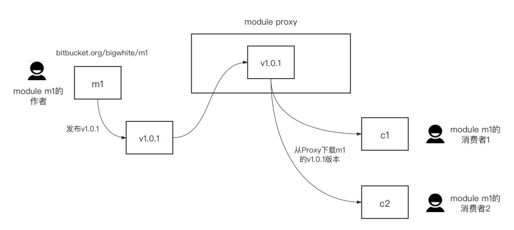
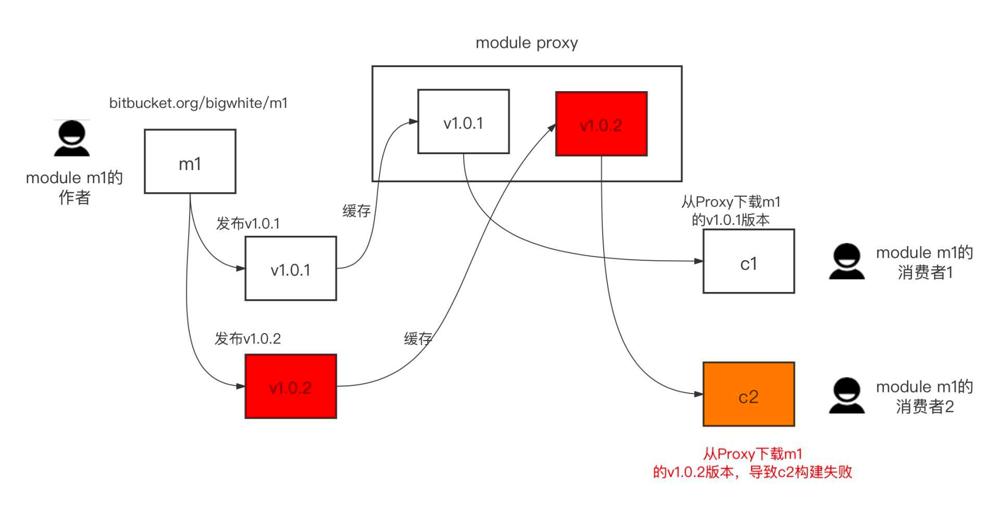
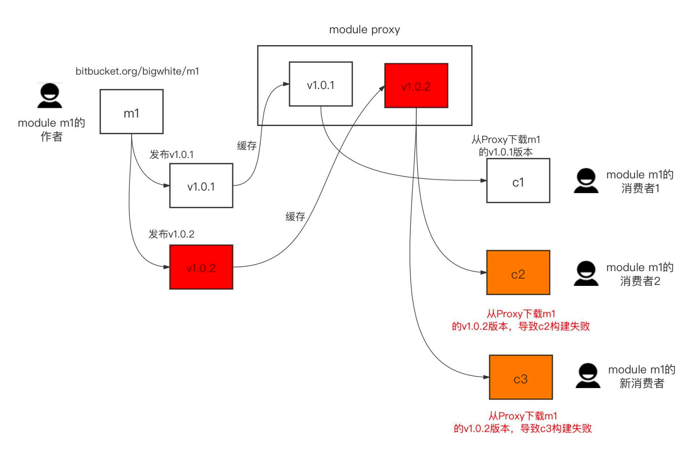
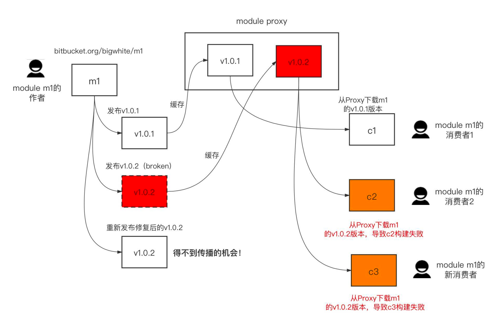
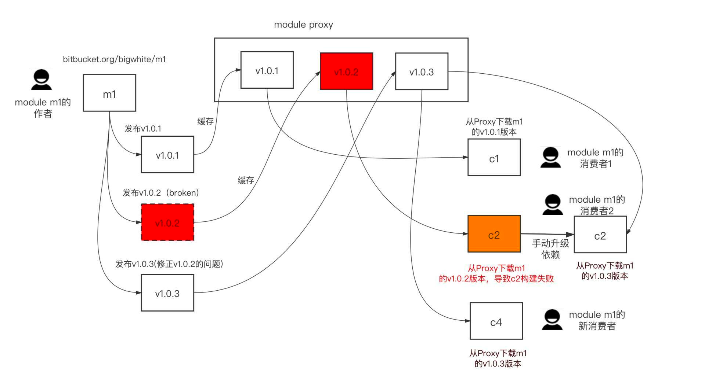
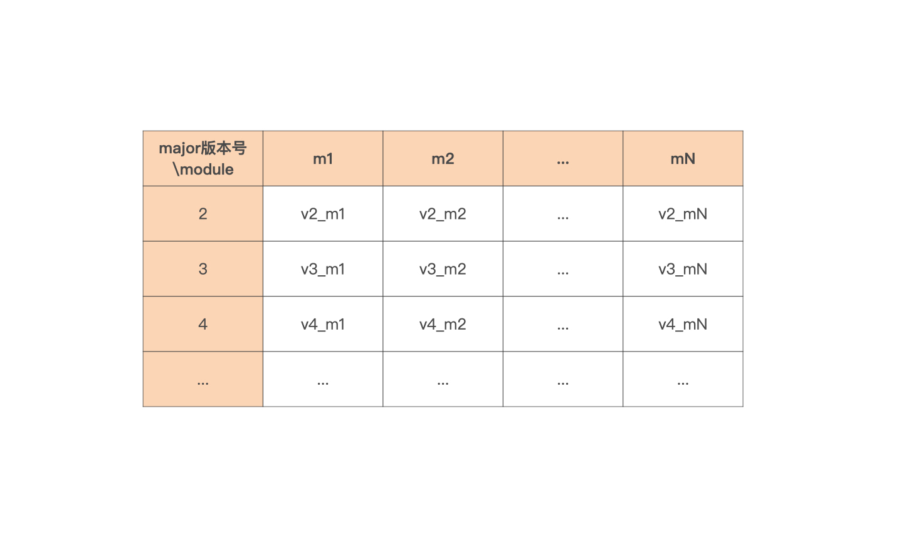

### 仓库布局：是单 module 还是多 module
如果没有单一仓库（monorepo）的强约束，那么在默认情况下，你选择一个仓库管理一个 module 是不会错的，这是管理 Go Module 的最简单的方式，也是最常用的标准方式。这种方式下，module 维护者维护起来会很方便，module 的使用者在引用 module 下面的包时，也可以很容易地确定包的导入路径。

举个简单的例子，在 github.com/lcy2013/srsm 这个仓库下管理着一个 Go Module（srsm 是 single repo single module 的缩写）。

通常情况下，module path 与仓库地址保持一致，都是 github.com/lcy2013/srsm，这点会体现在 go.mod 中：
```
// go.mod
module github.com/lcy2013/srsm

go 1.17
```

然后对仓库打 tag，这个 tag 也会成为 Go Module 的版本号，这样，对仓库的版本管理其实就是对 Go Module 的版本管理。

如果这个仓库下的布局是这样的：
./srsm
├── go.mod
├── go.sum
├── pkg1/
│   └── pkg1.go
└── pkg2/
    └── pkg2.go

那么这个 module 的使用者可以很轻松地确定 pkg1 和 pkg2 两个包的导入路径，一个是 github.com/lcy2013/srsm/pkg1，另一个则是 github.com/lcy2013/srsm/pkg2。

如果 module 演进到了 v2.x.x 版本，那么以 pkg1 包为例，它的包的导入路径就变成了 github.com/lcy2013/srsm/v2/pkg1。

如果组织层面要求采用单一仓库（monorepo）模式，也就是所有 Go Module 都必须放在一个 repo 下，那只能使用单 repo 下管理多个 Go Module 的方法了。

记得 Go Module 的设计者 Russ Cox 曾说过：“在单 repo 多 module 的布局下，添加 module、删除 module，以及对 module 进行版本管理，都需要相当谨慎和深思熟虑，因此，管理一个单 module 的版本库，几乎总是比管理现有版本库中的多个 module 要容易和简单”。

这里是一个单 repo 多 module 的例子，假设 repo 地址是 github.com/lcy2013/srmm。

这个 repo 下的结构布局如下（srmm 是 single repo multiple modules 的缩写）：
```
./srmm
├── module1
│   ├── go.mod
│   └── pkg1
│       └── pkg1.go
└── module2
    ├── go.mod
    └── pkg2
        └── pkg2.go
```

srmm 仓库下面有两个 Go Module，分为位于子目录 module1 和 module2 的下面，这两个目录也是各自 module 的根目录（module root）。这种情况下，module 的 path 也不能随意指定，必须包含子目录的名字。

以 module1 为例分析一下，它的 path 是 github.com/lcy2013/srmm/module1，只有这样，Go 命令才能根据用户导入包的路径，找到对应的仓库地址和在仓库中的相对位置。同理，module1 下的包名同样是以 module path 为前缀的，比如：github.com/lcy2013/srmm/module1/pkg1。

在单仓库多 module 模式下，各个 module 的版本是独立维护的。因此，在通过打 tag 方式发布某个 module 版本时，tag 的名字必须包含子目录名。比如：如果我们要发布 module1 的 v1.0.0 版本，不能通过给仓库打 v1.0.0 这个 tag 号来发布 module1 的 v1.0.0 版本，正确的作法应该是打 module1/v1.0.0 这个 tag 号。

### 发布 Go Module
当 module 完成开发与测试，module 便可以发布了。发布的步骤也十分简单，就是为 repo 打上 tag 并推送到代码服务器上就好了。

如果采用单 repo 单 module 管理方式，那么就给 repo 打的 tag 就是 module 的版本。如果采用的是单 repo 多 module 的管理方式，那么需要注意在 tag 中加上各个 module 的子目录名，这样才能起到发布某个 module 版本的作用，否则 module 的用户通过 go get xxx@latest 也无法看到新发布的 module 版本。

而且，这里还有一个需要你特别注意的地方，如果在发布正式版之前先发布了 alpha 或 beta 版给大家公测使用，那么一定要提醒你的 module 的使用者，让通过 go get 指定公测版本号来显式升级依赖，比如：
> $ go get github.com/lcy2013/srsm@v1.1.0-beta.1

这样，go get 工具才会将使用者项目依赖的 github.com/lcy2013/srsm 的版本更新为 v1.1.0-beta.1。而通过go get github.com/lcy2013/srsm@latest，是不会获取到像上面 v1.1.0-beta.1 这样的发布前的公测版本的。

多数情况下，Go Module 的维护者可以正确地发布 Go Module。但人总是会犯错的，作为 Go Module 的作者或维护者，偶尔也会出现这样的低级错误：将一个处于 broken 状态的 module 发布了出去。那一旦出现这样的情况，我们该怎么做呢？

### 作废特定版本的 Go Module
先来看看如果发布了错误的 module 版本会对 module 的使用者带去什么影响。

直接来看一个例子。假设 bitbucket.org/lcy2013/m1 是我维护的一个 Go Module，它目前已经演进到 v1.0.1 版本了，并且有两个使用者 c1 和 c2，你可以看下这个示意图，能更直观地了解 m1 当前的状态：


某一天，一不小心，就把一个处于 broken 状态的 module 版本，m1@v1.0.2 发布出去了！此时此刻，m1 的 v1.0.2 版本还只存在于它的源仓库站点上，也就是 bitbucket/lcy2013/m1 中，在任何一个 GoProxy 服务器上都还没有这个版本的缓存。

这个时候，依赖 m1 的两个项目 c1 和 c2 依赖的仍然是 m1@v1.0.1 版本。也就是说，如果没有显式升级 m1 的版本，c1 和 c2 的构建就不会受到处于 broken 状态的 module v1.0.2 版本的影响，这也是 Go Module 最小版本选择的优点。

而且，由于 m1@v1.0.2 还没有被 GoProxy 服务器缓存，在 GOPROXY 环境变量开启的情况下，go list 是查不到 m1 有可升级的版本的：
```
// 以c2为例：
$go list -m -u all
github.com/lcy2013/c2
bitbucket.org/lcy2013/m1 v1.0.1
```

但如若绕开 GOPROXY，那么 go list 就可以查找到 m1 的最新版本为 v1.0.2（通过设置 GONOPROXY 来让 go list 查询 m1 的源仓库而不是代理服务器上的缓存）：
```lcy2013
$GONOPROXY="bitbucket.org/lcy2013/m1" go list -m -u all
github.com/lcy2013/c2
bitbucket.org/lcy2013/m1 v1.0.1 [v1.0.2]
```

之后，如果某个 m1 的消费者，比如 c2，通过 go get bitbucket.org/lcy2013/m1@v1.0.2 对 m1 的依赖版本进行了显式更新，那就会触发 GOPROXY 对 m1@v1.0.2 版本的缓存。这样一通操作后，module proxy 以及 m1 的消费者的当前的状态就会变成这样：


由于 Goproxy 服务已经缓存了 m1 的 v1.0.2 版本，这之后，m1 的其他消费者，比如 c1 就能够在 GOPROXY 开启的情况下查询到 m1 存在新版本 v1.0.2，即便它是 broken 的：
```
// 以c1为例：
$go list -m -u all
github.com/lcy2013/c1
bitbucket.org/lcy2013/m1 v1.0.1 [v1.0.2]
```
但是，一旦 broken 的 m1 版本（v1.0.2）进入到 GoProxy 的缓存，那么它的“危害性”就会“大肆传播”开。这时 module m1 的新消费者都将受到影响！

比如这里引入一个新的消费者 c3，c3 的首次构建就会因 m1 的损坏而报错：


到这里，糟糕的情况已经出现了！那怎么作废掉 m1@v1.0.2 版本来修复这个问题呢？

如果在 GOPATH 时代，废掉一个之前发的包版本是分分钟的事情，因为那时包消费者依赖的都是 latest commit。包作者只要 fix 掉问题、提交并重新发布就可以了。

但是在 Go Module 时代，作废掉一个已经发布了的 Go Module 版本还真不是一件能轻易做好的事情。这很大程度是源于大量 Go Module 代理服务器的存在，Go Module 代理服务器会将已发布的 broken 的 module 缓存起来。下面来看看可能的问题解决方法。

### 修复 broken 版本并重新发布
要解决掉这个问题，Go Module 作者有一个很直接的解决方法，就是：修复 broken 的 module 版本并重新发布。它的操作步骤也很简单：m1 的作者只需要删除掉远程的 tag: v1.0.2，在本地 fix 掉问题，然后重新 tag v1.0.2 并 push 发布到 bitbucket 上的仓库中就可以了。

但这样做真的能生效么？

理论上，如果 m1 的所有消费者，都通过 m1 所在代码托管服务器（bitbucket）来获取 m1 的特定版本，那么这种方法还真能解决掉这个问题。对于已经 get 到 broken v1.0.2 的消费者来说，他们只需清除掉本地的 module cache（go clean -modcache），然后再重新构建就可以了；对于 m1 的新消费者，他们直接得到的就是重新发布后的 v1.0.2 版本。

但现实的情况时，现在大家都是通过 Goproxy 服务来获取 module 的。

所以，一旦一个 module 版本被发布，当某个消费者通过他配置的 goproxy 获取这个版本时，这个版本就会在被缓存在对应的代理服务器上。后续 m1 的消费者通过这个 goproxy 服务器获取那个版本的 m1 时，请求不会再回到 m1 所在的源代码托管服务器。

这样，即便 m1 的源服务器上的 v1.0.2 版本得到了重新发布，散布在各个 goproxy 服务器上的 broken v1.0.2 也依旧存在，并且被“传播”到各个 m1 消费者的开发环境中，而重新发布后的 v1.0.2 版本却得不到“传播”的机会，我们还是用一张图来直观展示下这种“窘境”：


因此，从消费者的角度看，m1 的 v1.0.2 版本依旧是那个 broken 的版本，这种解决措施无效！

那可能会问，如果 m1 的作者删除了 bitbucket 上的 v1.0.2 这个发布版本，各大 goproxy 服务器上的 broken v1.0.2 版本是否也会被同步删除呢？

遗憾地告诉你：不会。

Goproxy 服务器当初的一个设计目标，就是尽可能地缓存更多 module。所以，即便某个 module 的源码仓库都被删除了，这个 module 的各个版本依旧会缓存在 goproxy 服务器上，这个 module 的消费者依然可以正常获取这个 module，并顺利构建。

因此，goproxy 服务器当前的实现都没有主动删掉某个 module 缓存的特性。当然了，这可能也不是绝对的，毕竟不同 goproxy 服务的实现有所不同。

那这种问题该怎么解决呢？这种情况下，Go 社区更为常见的解决方式就是发布 module 的新 patch 版本

依然以上面的 m1 为例，现在废除掉 v1.0.2，在本地修正问题后，直接打 v1.0.3 标签，并发布 push 到远程代码服务器上。这样 m1 的消费者以及 module proxy 的整体状态就变成这个样子了：


在这样的状态下，分别看看 m1 的消费者的情况：
- 对于依赖 m1@v1.0.1 版本的 c1，在未手工更新依赖版本的情况下，它仍然可以保持成功的构建；

- 对于 m1 的新消费者，比如 c4，它首次构建时使用的就是 m1 的最新 patch 版 v1.0.3，跨过了作废的 v1.0.2，并成功完成构建；

- 对于之前曾依赖 v1.0.2 版本的消费者 c2 来说，这个时候需要手工介入才能解决问题，也就是需要在 c2 环境中手工升级依赖版本到 v1.0.3，这样 c2 也会得到成功构建。

从 Go 1.16 版本开始，Go Module 作者还可以在 go.mod 中使用新增加的retract 指示符，标识出哪些版本是作废的且不推荐使用的。retract 的语法形式如下：
```
// go.mod
retract v1.0.0           // 作废v1.0.0版本
retract [v1.1.0, v1.2.0] // 作废v1.1.0和v1.2.0两个版本
```

用 m1 为例，将 m1 的 go.mod 更新为如下内容：
```
//m1的go.mod
module bitbucket.org/lcy2013/m1

go 1.17

retract v1.0.2
```

然后将 m1 放入 v1.0.3 标签中并发布。现在 m1 的消费者 c2 要查看 m1 是否有最新版本时，可以查看到以下内容（c2 本地环境使用 go1.17 版本）：
```
$GONOPROXY=bitbucket.org/lcy2013/m1 go list -m -u all
... ...
bitbucket.org/lcy2013/m1 v1.0.2 (retracted) [v1.0.3]
```

从 go list 的输出结果中，看到了 v1.0.2 版本上有了 retracted 的提示，提示这个版本已经被 m1 的作者作废了，不应该再使用，应升级为 v1.0.3。

但 retracted 仅仅是一个提示作用，并不影响 go build 的结果，c2 环境（之前在 go.mod 中依赖 m1 的 v1.0.2）下的 go build 不会自动绕过 v1.0.2，除非显式更新到 v1.0.3。

不过，上面的这个 retract 指示符适合标记要作废的独立的 minor 和 patch 版本，如果要提示用某个 module 的某个大版本整个作废，我们用 Go 1.17 版本引入的 Deprecated 注释行更适合。下面是使用 Deprecated 注释行的例子：
```
// Deprecated: use bitbucket.org/lcy2013/m1/v2 instead.
module bitbucket.org/lcy2013/m1
```

如果在 module m1 的 go.mod 中使用了 Deprecated 注释，那么 m1 的消费者在 go get 获取 m1 版本时，或者是通过 go list 查看 m1 版本时，会收到相应的作废提示，以 go get 为例：
```
$go get bitbucket.org/lcy2013/m1@latest
go: downloading bitbucket.org/lcy2013/m1 v1.0.3
go: module bitbucket.org/lcy2013/m1 is deprecated: use bitbucket.org/lcy2013/m1/v2 instead.
... ...
```

不过 Deprecated 注释的影响也仅限于提示，它不会影响到消费者的项目构建与使用。

### 升级 module 的 major 版本号
随着 module 的演化，总有一天 module 会出现不兼容以前版本的 change，这就到了需要升级 module 的 major 版本号的时候了。

Go Module 的语义导入版本机制，也就是 Go Module 规定：如果同一个包的新旧版本是兼容的，那么它们的包导入路径应该是相同的。反过来说，如果新旧两个包不兼容，那么应该采用不同的导入路径。

而且，Go 团队采用了将“major 版本”作为导入路径的一部分的设计。这种设计支持在同一个项目中，导入同一个 repo 下的不同 major 版本的 module，比如：
```
import (
    "bitbucket.org/lcy2013/m1/pkg1"   // 导入major版本号为v0或v1的module下的pkg1
    pkg1v2 "bitbucket.org/lcy2013/m1/v2/pkg1" // 导入major版本号为v2的module下的pkg1
)
```

可以认为：在同一个 repo 下，不同 major 号的 module 就是完全不同的 module，甚至同一 repo 下，不同 major 号的 module 可以相互导入。

这样一来，对于 module 作者 / 维护者而言，升级 major 版本号，也就意味着高版本的代码要与低版本的代码彻底分开维护，通常 Go 社区会采用为新的 major 版本建立新的 major 分支的方式，来将不同 major 版本的代码分离开，这种方案被称为“major branch”的方案。

major branch 方案对于多数 gopher 来说，是一个过渡比较自然的方案，它通过建立 vN 分支并基于 vN 分支打 vN.x.x 的 tag 的方式，做 major 版本的发布。

那么，采用这种方案的 Go Module 作者升级 major 版本号时要怎么操作呢？

以将 bitbucket.org/lcy2013/m1 的 major 版本号升级到 v2 为例看看。首先，要建立 v2 代码分支并切换到 v2 分支上操作，然后修改 go.mod 文件中的 module path，增加 v2 后缀：
```
//go.mod
module bitbucket.org/lcy2013/m1/v2

go 1.17
```

这里要特别注意一点，如果 module 内部包间有相互导入，那么在升级 major 号的时候，这些包的 import 路径上也要增加 v2，否则，就会存在在高 major 号的 module 代码中，引用低 major 号的 module 代码的情况，这也是 module 作者最容易忽略的事情。

这样一通操作后，就将 repo 下的 module 分为了两个 module 了，一个是原先的 v0/v1 module，在 master/main 分支上；新建的 v2 分支承载了 major 号为 2 的 module 的代码。major 号升级的这个操作过程还是很容易出错的，你操作时一定要谨慎。

对于消费者而言，在它依赖的 module 进行 major 版本号升级后，只需要在这个依赖 module 的 import 路径的后面，增加 /vN 就可以了（这里是 /v2），当然代码中也要针对不兼容的部分进行修改，然后 go 工具就会自动下载相关 module。

早期 Go 团队还提供了利用子目录分割不同 major 版本的方案，我们也看看这种方式怎么样。

还是以 bitbucket.org/lcy2013/m1 为例，如果这个 module 已经演化到 v3 版本了，那么这个 module 所在仓库的目录结构应该是这样的：
```
# tree m1
m1
├── pkg1
│   └── pkg1.go
├── go.mod
├── v2
│   ├── pkg1 
│   │   └── pkg1.go
│   └── go.mod
└── v3
    ├── pkg1 
    │   └── pkg1.go
    └── go.mod
```

这里直接用 vN 作为子目录名字，在代码仓库中将不同版本 module 放置在不同的子目录中，这样，go 命令就会将仓库内的子目录名与 major 号匹配并找到对应版本的 module。

从描述上看，似乎这种通过子目录方式来实现 major 版本号升级，会更“简单”一些。但我总感觉这种方式有些“怪”，而且，其他主流语言也很少有用这种方式进行 major 版本号升级的。

另外一旦使用这种方式，我们似乎也很难利用 git 工具在不同 major 版本之间进行代码的 merge 了。目前 Go 文档中似乎也不再提这种方案了，我个人也建议你尽量使用 major 分支方案。

在实际操作中，也有一些 Go Module 的仓库，始终将 master 或 main 分支作为最高 major 版本的分支，然后建立低版本分支来维护低 major 版本的 module 代码，比如：etcd、go-redis等。

这种方式本质上和前面建立 major 分支的方式是一样的，并且这种方式更符合一个 Go Module 演化的趋势和作者的意图，也就是低版本的 Go Module 随着时间的推移将渐渐不再维护，而最新最高版本的 Go Module 是 module 作者最想让使用者使用的版本。

但在单 repo 多 module 管理方式下，升级 module 的 major 版本号有些复杂，需要分为两种情况来考虑。

#### 第一种情况：repo 下的所有 module 统一进行版本发布。
在这种情况下，只需要向上面所说的那样建立 vN 版本分支就可以了，在 vN 分支上对 repo 下所有 module 进行演进，统一打 tag 并发布。当然 tag 要采用带有 module 子目录名的那种方式，比如：module1/v2.0.0。

etcd 项目对旗下的 Go Module 的统一版本发布，就是用的这种方式。如果翻看一下 etcd 的项目，你会发现 etcd 只会建立少量的像 release-3.4、release-3.5 这样的 major 分支，基于这些分支，etcd 会统一发布 moduleName/v3.4.x 和 moduleName/v3.5.x 版本。

#### 第二个情况：repo 下的 module 各自独立进行版本发布。
在这种情况下，简单创建一个 major 号分支来维护 module 的方式，就会显得不够用了，很可能需要建立 major 分支矩阵。

假设一个 repo 下管理了多个 module，从 m1 到 mN，那么 major 号需要升级时，就需要将 major 版本号与 module 做一个组合，形成下面的分支矩阵：


以 m1 为例，当 m1 的 major 版本号需要升级到 2 时，建立 v2_m1 major 分支专门用于维护和发布 m1 module 的 v2.x.x 版本。

当然上述的矩阵是一个全矩阵 (所有项中都有值)，实际项目中可能采用的是稀疏矩阵，也就是并非所有的表格项中都有值，因为 repo 下各个 module 的 major 号升级并不是同步的，有些 module 的 major 号可能已经升级到了 4，但有些 module 的 major 号可能还停留在 2。


