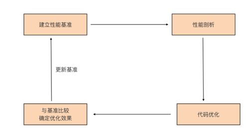

**首先我们要建立性能基准。** 要想对程序实施优化，首先要有一个初始“参照物”，这样才能在执行优化措施后，检验优化措施是否有效，所以这是优化循环的第一步。

**第二步是性能剖析。** 要想优化程序，首先要找到可能影响程序性能的“瓶颈点”，这一步的任务，就是通过各种工具和方法找到这些“瓶颈点”。

**第三步是代码优化。** 要针对上一步找到的“瓶颈点”进行分析，找出它们成为瓶颈的原因，并有针对性地实施优化。

**第四步是与基准比较，确定优化效果。** 这一步，会采集优化后的程序的性能数据，与第一步的性能基准进行比较，看执行上述的优化措施后，是否提升了程序的性能。

如果有提升，那就说明这一轮的优化是有效的。如果优化后的性能指标仍然没有达到预期，可以再执行一轮优化，这时就要用新的程序的性能指标作为新的性能基准，作为下一轮性能优化参考。

### 建立性能基准

初步实现了自定义应用层协议的通信服务端，那它的性能如何呢？

> action/16_action/network/v02/tcp-server-demo1

肯定不能拍脑门说这个程序性能很好、一般或很差吧？需要用数据说话，也就是为 Go 程序建立性能基准。

通过这个性能基准，不仅可以了解当前程序的性能水平，也可以据此判断后面的代码优化措施有没有起到效果。

建立性能基准的方式大概有两种，一种是通过编写 Go 原生提供的性能基准测试（benchmark test）用例来实现，这相当于对程序的局部热点建立性能基准，常用于一些算法或数据结构的实现，比如分布式全局唯一 ID 生成算法、树的插入 /
查找等。

另外一种是基于度量指标为程序建立起图形化的性能基准，这种方式适合针对程序的整体建立性能基准。而自定义协议服务端程序就十分适合用这种方式，接下来就来看一下基于度量指标建立基准的一种可行方案。

### 建立观测设施

这些年，基于 Web 的可视化工具、开源监控系统以及时序数据库的兴起，给建立性能基准带来了很大的便利，业界有比较多成熟的工具组合可以直接使用。

但业界最常用的还是 Prometheus+Grafana 的组合，这也是日常使用比较多的组合，所以在这里也使用这个工具组合来为程序建立性能指标观测设施。

以 Docker 为代表的轻量级容器（container）的兴起，让这些工具的部署、安装都变得十分简单，这里就使用 docker-compose 工具，基于容器安装 Prometheus+Grafana 的组合。

建议使用一台 Linux 主机来安装这些工具，因为 docker 以及 docker-compose 工具，在 Linux 平台上的表现最为成熟稳定。

这里简单描述一下安装 Prometheus+Grafana 的组合的步骤。

首先，要在 Linux 主机上建立一个目录 monitor，这个目录下，创建 docker-compose.yml 文件，它的内容是这样的：

```yaml
version: "3.2"
services:
  prometheus:
    container_name: prometheus
    image: prom/prometheus:latest
    network_mode: "host"
    volumes:
      - ./conf/tcp-server-prometheus.yml:/etc/prometheus/prometheus.yml
      - /etc/localtime:/etc/localtime
    restart: on-failure
  grafana:
    container_name: grafana
    image: grafana/grafana:latest
    network_mode: "host"
    restart: on-failure
    volumes:
      - /etc/localtime:/etc/localtime
      - ./data/grafana:/var/lib/grafana
  # linux node_exporter
  node_exporter:
    image: quay.io/prometheus/node-exporter:latest
    restart: always
    container_name: node_exporter
    command:
      - '--path.rootfs=/host'
    network_mode: host
    pid: host
    volumes:
      - '/:/host:ro,rslave'
```

docker-compose.yml 是 docker-compose 工具的配置文件，基于这个配置文件，docker-compose 工具会拉取对应容器镜像文件，并在本地启动对应的容器。

这个 docker-compose.yml 文件中包含了三个工具镜像，分别是 Prometheus、Grafana 与 node-exporter。

其中，node-exporter 是 prometheus 开源的主机度量数据的采集工具，通过 node exporter，可以采集到主机的 CPU、内存、磁盘、网络 I/O
等主机运行状态数据，结合这些数据，可以查看应用在运行时的系统资源占用情况。

docker-compose.yml 中 Prometheus 容器挂载的 tcp-server-prometheus.yml 文件放在了 monitor/conf 下面，它的内容是这样：

```yaml
global:
  scrape_interval: 5s # Set the scrape interval to every 15 seconds. Default is every 1 minute.
  evaluation_interval: 15s # Evaluate rules every 15 seconds. The default is every 1 minute.
  # scrape_timeout is set to the global default (10s).
# Alertmanager configuration
alerting:
  alertmanagers:
    - static_configs:
        - targets:
          # - alertmanager:9093
# Load rules once and periodically evaluate them according to the global 'evaluation_interval'.
rule_files:
# - "first_rules.yml"
# - "second_rules.yml"
# A scrape configuration containing exactly one endpoint to scrape:
# Here it's Prometheus itself.
scrape_configs:
  # The job name is added as a label `job=<job_name>` to any timeseries scraped from this config.
  - job_name: "prometheus"
    # metrics_path defaults to '/metrics'
    # scheme defaults to 'http'.
    static_configs:
      - targets: [ "localhost:9090" ]
  - job_name: "tcp-server"
    static_configs:
      - targets: [ "localhost:8889" ]
  - job_name: "node"
    static_configs:
      - targets: [ "localhost:9100" ]
```

可以看到，在上面 Prometheus 的配置文件的 scrpae_configs 下面，配置了三个采集 job，分别用于采集 Prometheus 自身度量数据、tcp server 的度量数据，以及 node-exporter
的度量数据。

grafana 容器会挂载本地的 data/grafana 路径到容器中，为了避免访问权限带来的问题，在创建 data/grafana 目录后，最好再为这个目录赋予足够的访问权限，比如：
> $ chmod -R 777 data

运行下面命令，docker-compose 就会自动拉取镜像，并启动 docker-compose.yml 中的三个容器：
> $ docker-compose -f docker-compose.yml up -d

等待一段时间后，执行 docker ps 命令，如果能看到下面三个正在运行的容器，就说明安装就成功了：

```shell
$docker ps
CONTAINER ID   IMAGE                                     COMMAND                  CREATED        STATUS        PORTS     NAMES
563d655cdf90   grafana/grafana:latest                    "/run.sh"                26 hours ago   Up 26 hours             grafana
65616d1b6d1a   prom/prometheus:latest                    "/bin/prometheus --c…"   26 hours ago   Up 26 hours             prometheus
b29d3fef8572   quay.io/prometheus/node-exporter:latest   "/bin/node_exporter …"   26 hours ago   Up 26 hours             node_exporter
```

为了更直观地了解到整个观测设施中各个工具之间的关系，这里画了一幅示意图，对照着这幅图，再来理解上面的配置与执行步骤会容易许多：
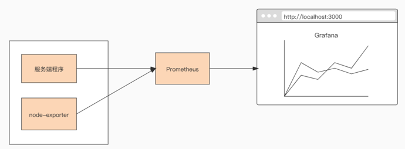

### 配置 Grafana

一旦成功启动，Prometheus 便会启动各个采集 job，从 tcp server 以及 node-exporter 中拉取度量数据，并存储在其时序数据库中，这个时候需要对 Grafana
进行一些简单配置，才能让这些数据以图形化的方式展现出来。

首先需要为 Grafana 配置一个新的数据源（data source），在数据源选择页面，选择 Prometheus，就像下图这样：
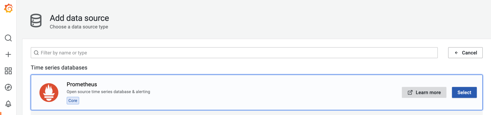

选择后，在 Prometheus 数据源配置页面，配置这个数据源的 HTTP URL 就可以了，如果你点击“Save & test”按钮后提示成功，那么数据源就配置好了。

接下来，再添加一个 node-exporter 仪表板（dashboard），把从 node-exporter 拉取的度量数据以图形化方式展示出来，这个时候不需要手工一个一个设置仪表板上的 panel，Grafana 官方有现成的
node-exporter 仪表板可用，只需要在 grafana 的 import 页面中输入相应的 dashboard ID，就可以导入相关仪表板的设置：
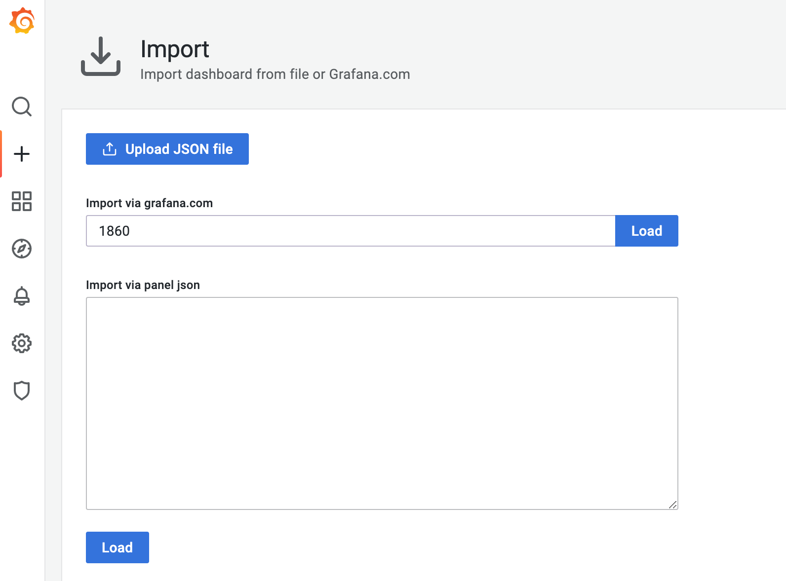

这里，使用的是 ID 为 1860 的 node-exporter 仪表板，导入成功后，进入这个仪表板页面，等待一段时间后，就可以看到类似下面的可视化结果：
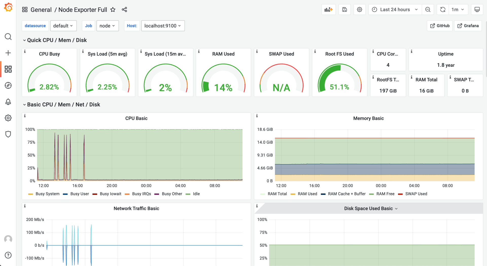

好了，到这里 node-exporter 的度量数据，已经可以以图形化的形式呈现在面前了，那么自定义协议的服务端的数据又如何采集与呈现呢？

### 在服务端埋入度量数据采集点

前面说了，要建立服务端的性能基准，那么哪些度量数据能反映出服务端的性能指标呢？这里定义三个度量数据项：

- 当前已连接的客户端数量（client_connected）。

- 每秒接收消息请求的数量（req_recv_rate）。

- 每秒发送消息响应的数量（rsp_send_rate）。

那么如何在服务端的代码中埋入这三个度量数据项呢？

action/16_action/network/v02/tcp-server-demo1 项目拷贝一份，形成 tcp-server-demo2 项目，要在 tcp-server-demo2 项目中实现这三个度量数据项的采集。

在 tcp-server-demo2 下，创建新的 metrics 包负责定义度量数据项，metrics 包的源码如下：
> tcp-server-demo2/metrics/metrics.go

在这段代码中，使用 prometheus 提供的 go client 包中的类型定义了三个度量数据项。

其中 ClientConnected 的类型为 prometheus.Gauge，Gauge 是对一个数值的即时测量值，它反映一个值的瞬时快照；而 ReqRecvTotal 和 RspSendTotal 的类型都为 prometheus.Counter。

Counter 顾名思义，就是一个计数器，可以累加，也可以减少。不过要想反映预期的每秒处理能力的指标，还需要将这两个计数器与 rate 函数一起使用才行。

在 metrics 包的 init 函数中启动了一个 http server，这个 server 监听 8889 端口，在前面 prometheus 配置文件中 tcp-server job 采集的目标地址吗？正是这个 8889 端口。也就是说，Prometheus 定期从 8889 端口拉取度量数据项的值。

有了 metrics 包以及度量数据项后，还需要将度量数据项埋到服务端的处理流程中，再来看对 main 包的改造：
> action/16_action/network/v03/tcp-server-demo2/cmd/server/main.go

可以看到，在每个连接的处理主函数 handleConn 中都埋入了各个度量数据项，并在特定事件发生时修改度量数据的值。

服务端建立完度量数据项后，还需要在 Grafana 中建立对应的仪表板来展示这些度量数据项，这一次，就需要手动创建仪表板 tcp-server-demo，并为仪表板手动添加 panel 了。

建立三个 panel：req_recv_rate、rsp_send_rate 和 client_connected，如下图所示：
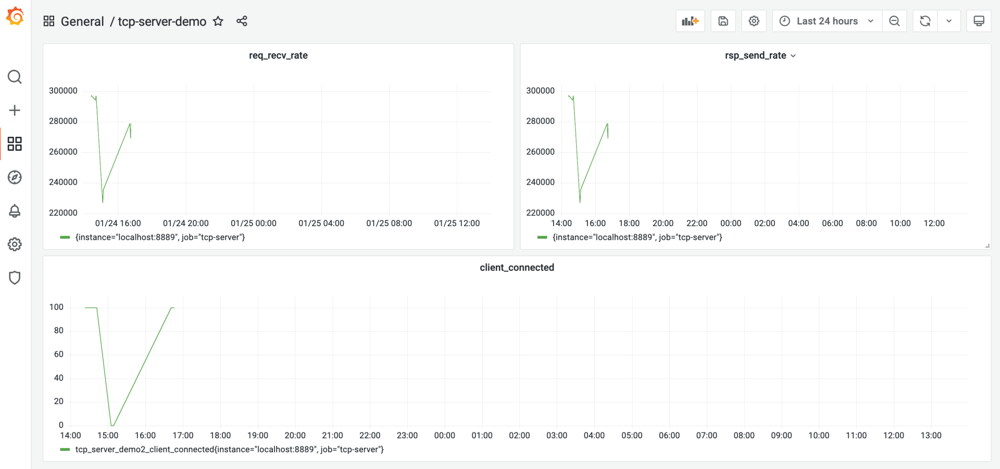

client_connected panel 比较简单，直接取 tcp_server_demo2_client_connected 这个注册到 prometheus 中的度量项的值就可以了。

而 req_recv_rate 和 rsp_send_rate 就要结合度量项的值与rate 函数来实现。以 req_recv_rate 这个 panel 为例，它的 panel 配置是这样：
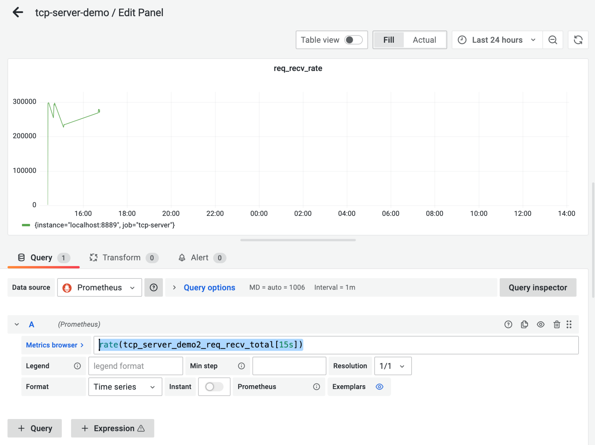

看到图中的 Metrics Browser 后面的表达式是：rate(tcp_server_demo2_req_recv_total[15s])，这个表达式返回的是在 15 秒内测得的 req_recv_total 的每秒速率，这恰恰是可以反映我们的服务端处理性能的指标。

### 第一版性能基准
要建立性能基准，还需要一个可以对服务端程序“施加压力”的客户端模拟器，可以基于 tcp-server-demo1/cmd/client 实现这个模拟器。

新版模拟器的原理与 tcp-server-demo1/cmd/client 基本一致，所以具体的改造过程我这里就不多说了，新版模拟器的代码，放在了 tcp-server-demo2/cmd/client 下面，你可以自行查看源码。

建立以及使用性能基准的前提，是服务端的压测的硬件条件要尽量保持一致，以保证得到的结果受外界干扰较少，性能基准才更有参考意义。在一个 4 核 8G 的 Centos Linux 主机上跑这个压力测试，后续的压测也是在同样的条件下。

压测的步骤很简单，首先在 tcp-server-demo2 下构建出 server 与 client 两个可执行程序。

然后先启动 server，再启动 client。运行几分钟后，停掉程序就可以了，这时，在 grafana 的 tcp-server 的仪表板中，就能看到类似下面的图形化数据展示了：
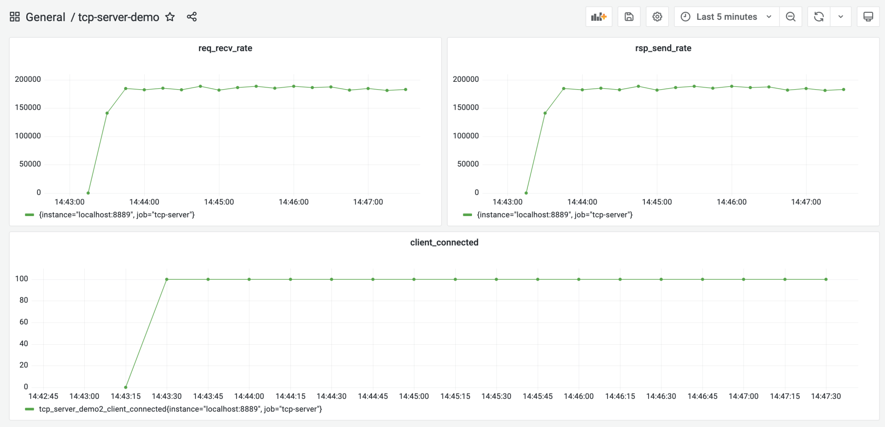

从这张图中，大约看到服务端的处理性能大约在 18.5w/ 秒左右，就将这个结果作为服务端的第一个性能基准。

### 尝试用 pprof 剖析
按照这一讲开头的 Go 应用性能优化循环的思路，接下来就应该尝试对服务端做性能剖析，识别出瓶颈点。

Go 是“自带电池”（battery included）的语言，拥有着让其他主流语言羡慕的工具链，Go 同样也内置了对 Go 代码进行性能剖析的工具：pprof。

pprof 源自Google Perf Tools 工具套件，在 Go 发布早期就被集成到 Go 工具链中了，所以 pprof 也是 Gopher 最常用的、对 Go 应用进行性能剖析的工具。这里也使用这一工具对服务端程序进行剖析。

Go 应用支持 pprof 性能剖析的方式有多种，最受 Gopher 青睐的是通过导入net/http/pprof包的方式。改造一下 tcp-server-demo2，让它通过这种方式支持 pprof 性能剖析。

改造后的代码放在 tcp-server-demo2-with-pprof 目录下，下面是支持 pprof 的 main 包的代码节选：
> action/16_action/network/v03/tcp-server-demo2/cmd/server/main.go

从这个代码变更可以看到，只需要以空导入的方式导入 net/http/pprof 包，并在一个单独的 goroutine 中启动一个标准的 http 服务，就可以实现对 pprof 性能剖析的支持。

pprof 工具可以通过 6060 端口采样到 Go 程序的运行时数据。

接下来，就来进行性能剖析数据的采集。

编译 tcp-server-demo2-with-pprof 目录下的 server 与 client，先后启动 server 与 client，让 client 对 server 保持持续的压力。

然后在自己的开发机上执行下面命令：
```shell
// 192.168.10.18为服务端的主机地址
$go tool pprof -http=:9090 http://192.168.10.18:6060/debug/pprof/profile
Fetching profile over HTTP from http://192.168.10.18:6060/debug/pprof/profile
Saved profile in /Users/magicLuoMacBook/pprof/pprof.server.samples.cpu.004.pb.gz
Serving web UI on http://localhost:9090
```

go tool pprof 命令默认会从 http://192.168.10.18:6060/debug/pprof/profile 服务上，采集 CPU 类型的性能剖析数据，然后打开本地浏览器，默认显示如下页面：
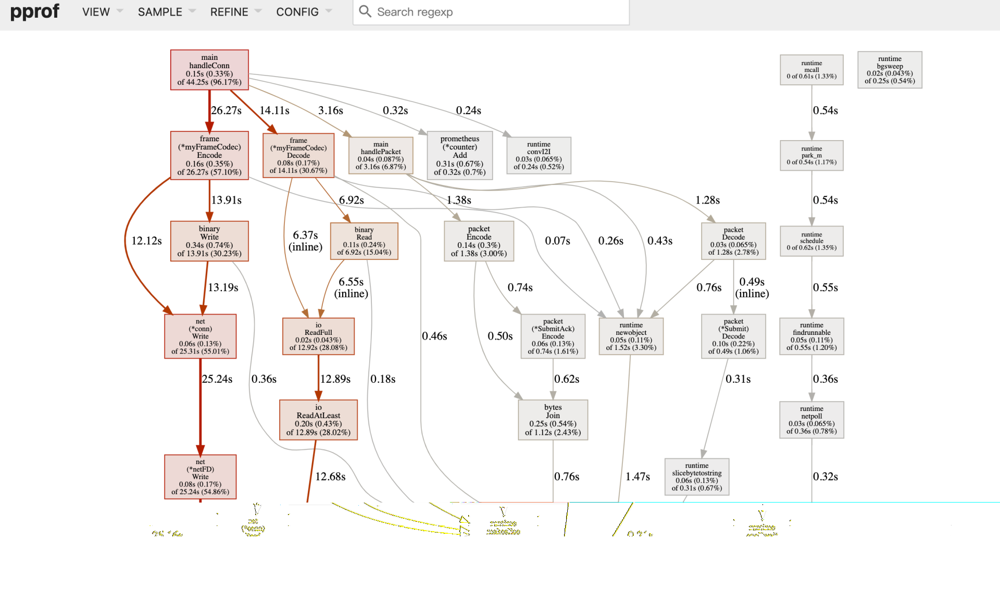

debug/pprof/profile 提供的是 CPU 的性能采样数据。CPU 类型采样数据是性能剖析中最常见的采样数据类型。

一旦启用 CPU 数据采样，Go 运行时会每隔一段短暂的时间（10ms）就中断一次（由 SIGPROF 信号引发），并记录当前所有 goroutine 的函数栈信息。

它能帮助我们识别出代码关键路径上出现次数最多的函数，而往往这个函数就是程序的一个瓶颈。上图我们沿着粗红线向下看，我们会看到下面图中的信息：
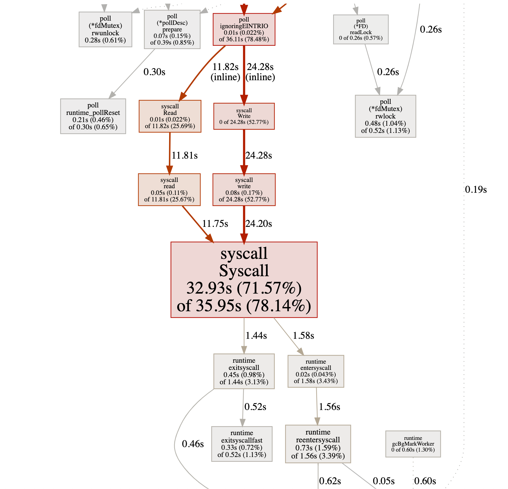

我们看到图中间的 Syscall 函数占据了一个最大的方框，并用黑体标记了出来，这就是我们程序的第一个瓶颈：花费太多时间在系统调用上了。

在向上寻找，发现 Syscall 的调用者基本都是网络 read 和 write 导致的。

### 代码优化
好了，第一个瓶颈点已经找到！该进入优化循环的第三个环节：代码优化了。那么该如何优化代码呢？我们可以分为两个部分来看。

#### 带缓存的网络 I/O
为什么网络 read 和 write 导致的 Syscall 会那么多呢？回顾一下第一版服务端的实现。

我们看到，在 handleConn 函数中，我们直接将 net.Conn 实例传给 frame.Decode 作为 io.Reader 参数的实参，这样，我们每次调用 Read 方法都是直接从 net.Conn 中读取数据，而 Read 将转变为一次系统调用（Syscall），哪怕是仅仅读取一个字节也是如此。因此，我们的优化目标是降低 net.Conn 的 Write 和 Read 的频率。

那么如何降低 net.Conn 的读写频率呢？增加缓存不失为一个有效的方法。而且，我们的服务端采用的是一个 goroutine 处理一个客户端连接的方式，由于没有竞态，这个模型更适合在读写 net.Conn 时使用带缓存的方式。

所以，下面我们就来为 tcp-server-demo2 增加 net.Conn 的缓存读与缓存写。

优化后的代码在 tcp-server-demo3 下。
> action/16_action/network/v04/tcp-server-demo3/cmd/server/main.go

tcp-server-demo3 唯一的改动，就是 main 包中的 handleConn 函数。

在这个函数中，新增了一个读缓存变量（rbuf）和一个写缓存变量（wbuf），用这两个变量替换掉传给 frameCodec.Decode 和 frameCodec.Encode 的 net.Conn 参数。

以 rbuf 为例，来看看它是如何起到降低 syscall 调用频率的作用的。

将 net.Conn 改为 rbuf 后，frameCodec.Decode 中的每次网络读取实际调用的都是 bufio.Reader 的 Read 方法。bufio.Reader.Read 方法内部，每次从 net.Conn 尝试读取其内部缓存大小的数据，而不是用户传入的希望读取的数据大小。

这些数据缓存在内存中，这样，后续的 Read 就可以直接从内存中得到数据，而不是每次都要从 net.Conn 读取，从而降低 Syscall 调用的频率。

对优化后的 tcp-server-demo3 做一次压测，看看它的处理性能到底有没有提升，压测的步骤你可以参考前面的内容。压测后，得到下面的结果：
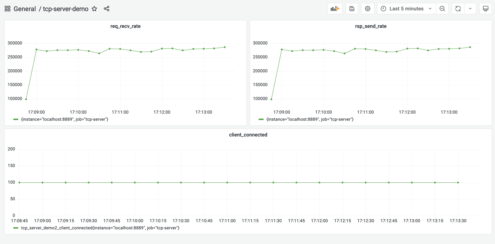

从图中可以看到，优化后的服务端的处理性能提升到 27w/s 左右，相比于第一版性能基准 (18.5w/s)，性能提升了足有 45%。

#### 重用内存对象
前面这个带缓存的网络 I/O，是从 CPU 性能采样数据中找到的“瓶颈点”。不过，在 Go 中还有另外一个十分重要的性能指标，那就是堆内存对象的分配。

因为 Go 是带有垃圾回收（GC）的语言，频繁的堆内存对象分配或分配较多，都会给 GC 带去较大压力，而 GC 的压力显然会转化为对 CPU 资源的消耗，从而挤压处理正常业务逻辑的 goroutine 的 CPU 时间。

下面就来采集一下 tcp-server-demo2 目录下的 server 的内存分配采样数据，看看有没有值得优化的点。

这次直接使用 go tool pprof 的命令行采集与交互模式。在启动 server 和 client 后，手工执行下面命令进行内存分配采样数据的获取：
```shell
$ go tool pprof http://192.168.10.18:6060/debug/pprof/allocs
Fetching profile over HTTP from http://192.168.10.18:6060/debug/pprof/allocs
Saved profile in /root/pprof/pprof.server.alloc_objects.alloc_space.inuse_objects.inuse_space.001.pb.gz
File: server
Type: alloc_space
Time: Jan 23,  at 6:05pm (CST)
Entering interactive mode (type "help" for commands, "o" for options)
```

数据获取到后，就可以使用 go tool pprof 提供的命令行交互指令，来查看各个函数的堆内存对象的分配情况，其中最常用的一个指令就是 top，执行 top 后，得到如下结果：
```shell
(pprof) top
Showing nodes accounting for 119.27MB, 97.93% of 121.79MB total
Dropped 31 nodes (cum <= 0.61MB)
Showing top 10 nodes out of 30
      flat  flat%   sum%        cum   cum%
      38MB 31.20% 31.20%    43.50MB 35.72%  github.com/lcy2013/tcp-server-demo2/packet.Decode
   28.50MB 23.40% 54.61%    28.50MB 23.40%  github.com/lcy2013/tcp-server-demo2/frame.(*innerFrameCodec).Decode
      18MB 14.78% 69.39%       79MB 64.87%  main.handlePacket
   17.50MB 14.37% 83.76%    17.50MB 14.37%  bytes.Join
       9MB  7.39% 91.15%        9MB  7.39%  encoding/binary.Write
    5.50MB  4.52% 95.66%     5.50MB  4.52%  github.com/lcy2013/tcp-server-demo2/packet.(*Submit).Decode (inline)
    1.76MB  1.45% 97.11%     1.76MB  1.45%  compress/flate.NewWriter
       1MB  0.82% 97.93%        1MB  0.82%  runtime.malg
         0     0% 97.93%     1.76MB  1.45%  bufio.(*Writer).Flush
         0     0% 97.93%     1.76MB  1.45%  compress/gzip.(*Writer).Write
```

top 命令的输出结果默认按flat(flat%)列从大到小的顺序输出。flat列的值在不同采样类型下表示的含义略有不同。

在 CPU 类型采样数据下，它表示函数自身代码在数据采样过程的执行时长；在上面的堆内存分配类型采样数据下，它表示在采用过程中，某个函数中堆内存分配大小的和。而flat%列的值表示这个函数堆内存分配大小占堆内存总分配大小的比例。

从上面的输出结果来看，packet.Decode 函数排在第一位。那么，现在就来深入探究一下 Decode 函数中究竟哪一行代码分配的堆内存量最大。使用 list 命令可以进一步进入 Decode 函数的源码中查看：
```shell
(pprof) list packet.Decode
Total: 121.79MB
ROUTINE ======================== github.com/lcy2013/tcp-server-demo2/packet.Decode in /root/magic/tcp-server-demo2-with-pprof/packet/packet.go
      38MB    43.50MB (flat, cum) 35.72% of Total
         .          .     75:  case CommandConn:
         .          .     76:    return nil, nil
         .          .     77:  case CommandConnAck:
         .          .     78:    return nil, nil
         .          .     79:  case CommandSubmit:
      38MB       38MB     80:    s := Submit{}
         .     5.50MB     81:    err := s.Decode(pktBody)
         .          .     82:    if err != nil {
         .          .     83:      return nil, err
         .          .     84:    }
         .          .     85:    return &s, nil
         .          .     86:  case CommandSubmitAck:
(pprof) 
```

可以看到，s := Submit{}这一行是分配内存的“大户”，每次服务端收到一个客户端 submit 请求时，都会在堆上分配一块内存表示 Submit 类型的实例。

这个在程序关键路径上的堆内存对象分配会给 GC 带去压力，要尽量避免或减小它的分配频度，一个可行的办法是尽量重用对象。

在 Go 中，一提到重用内存对象，就会想到了 sync.Pool。简单来说，sync.Pool 就是官方实现的一个可复用的内存对象池，使用 sync.Pool，可以减少堆对象分配的频度，进而降低给 GC 带去的压力。

继续在 tcp-server-demo3 的基础上，使用 sync.Pool 进行堆内存对象分配的优化，新版的代码放在了 tcp-server-demo3-with-syncpool 中。

新版代码相对于 tcp-server-demo3 有两处改动，第一处是在 packet.go 中，创建了一个 SubmitPool 变量，它的类型为 sync.Pool，这就是内存对象池，池中的对象都是 Submit。

这样在 packet.Decode 中收到 Submit 类型请求时，也不需要新分配一个 Submit 对象，而是直接从 SubmitPool 代表的 Pool 池中取出一个复用。

> action/16_action/network/v05/tcp-server-demo3-with-syncpool/packet/packet.go

> action/16_action/network/v05/tcp-server-demo3-with-syncpool/cmd/server/main.go

改完这两处后，内存分配优化就完成了。

和前面一样，构建一下 tcp-server-demo3-with-syncpool 目录下的服务端，并使用客户端对其进行一次压测，压测几分钟后，就能看到如下的结果：
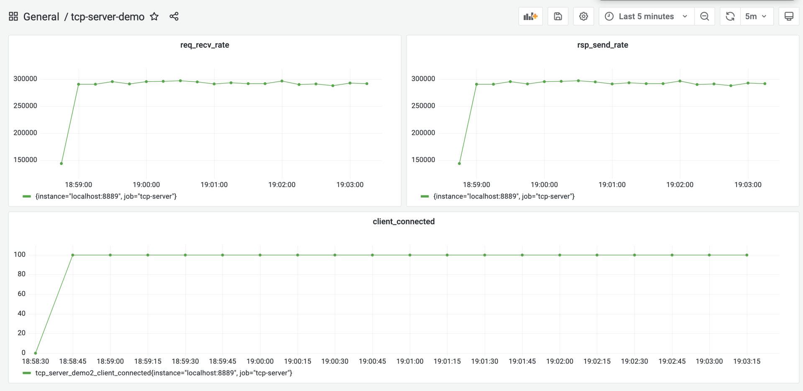

从采集的性能指标来看，优化后的服务端的处理能力平均可以达到 29.2w/s，这相比于上一次优化后的 27w/s，又小幅提升了 8% 左右。

到这里，按照开头处所讲的性能优化循环，已经完成了一轮优化了，并且取得了不错的效果，现在可以将最新的性能指标作为新一版的性能基准了。

至于是否要继续新一轮的优化，这就要看当前的性能是否能满足要求了。如果满足，就不需再进行新的优化，否则还需要继续一轮或几轮优化活动，直到性能满足要求。


