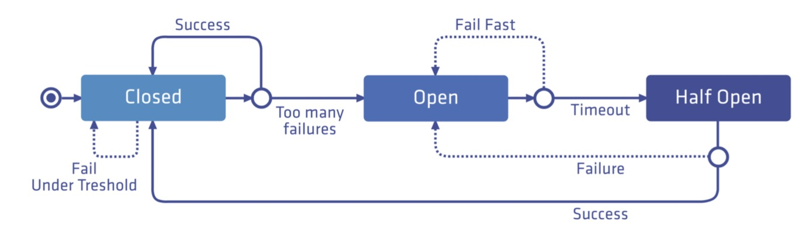
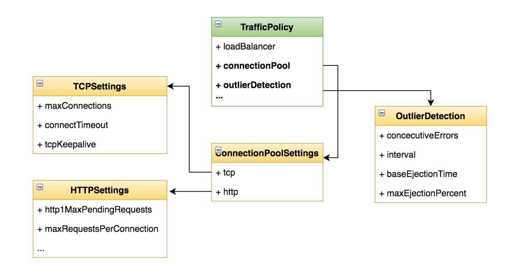

- [部署 Bookinfo](https://istio.io/latest/docs/examples/bookinfo/)

- [示例地址](https://istio.io/latest/zh/docs/tasks/traffic-management/circuit-breaking/)

### 什么是熔断(Circuit Breaking)?
- 一种过载保护的手段

- 目的:避免服务的级联失败

- 关键点:三个状态、失败计数器(阈值)、超时时钟




### 配置熔断器
- 说明
  - 为 httpbin 服务添加熔断配置 
  - 通过负载测试工具触发熔断
    
- 目标
  - 学会在 DestinationRule 中添加熔断的配置项

### 步骤
- 启用了 sidecar 自动注入，通过以下命令部署 httpbin 服务
> kubectl apply -f samples/httpbin/httpbin.yaml

- 在服务的 DestinationRule 中添加熔断设置

- 创建一个[目标规则](https://istio.io/latest/zh/docs/reference/config/networking/destination-rule/) ，在调用 httpbin 服务时应用熔断设置
```yaml
kubectl apply -f - <<EOF
apiVersion: networking.istio.io/v1alpha3
kind: DestinationRule
metadata:
  name: httpbin
spec:
  host: httpbin
  trafficPolicy:
    connectionPool:
      tcp:
        maxConnections: 1
      http:
        http1MaxPendingRequests: 1
        maxRequestsPerConnection: 1
    outlierDetection:
      consecutiveErrors: 1
      interval: 1s
      baseEjectionTime: 3m
      maxEjectionPercent: 100
EOF
```    

- 验证目标规则是否已正确创建
> kubectl get destinationrule httpbin -o yaml

> kubectl describe dr httpbin

- 使用负载测试工具触发熔断

- 创建客户端程序以发送流量到 httpbin 服务。这是一个名为 Fortio 的负载测试客户的，其可以控制连接数、并发数及发送 HTTP 请求的延迟。通过 Fortio 能够有效的触发前面 在 DestinationRule 中设置的熔断策略。

- 向客户端注入 Istio Sidecar 代理，以便 Istio 对其网络交互进行管理
> kubectl apply -f samples/httpbin/sample-client/fortio-deploy.yaml

- 登入客户端 Pod 并使用 Fortio 工具调用 httpbin 服务。-curl 参数表明发送一次调用
> FORTIO_POD=$(kubectl get pod | grep fortio | awk '{ print $1 }')

> kubectl exec -it $FORTIO_POD  -c fortio -- /usr/bin/fortio load -curl  http://httpbin:8000/get

- 在 DestinationRule 配置中，您定义了 maxConnections: 1 和 http1MaxPendingRequests: 1。 这些规则意味着，如果并发的连接和请求数超过一个，在 istio-proxy 进行进一步的请求和连接时，后续请求或 连接将被阻止。

- 发送并发数为 2 的连接（-c 2），请求 20 次（-n 20）：
> kubectl exec -it $FORTIO_POD  -c fortio -- /usr/bin/fortio load -c 2 -qps 0 -n 20 -loglevel Warning http://httpbin:8000/get

- 将并发连接数提高到 3 个：
> kubectl exec -it $FORTIO_POD  -c fortio -- /usr/bin/fortio load -c 3 -qps 0 -n 30 -loglevel Warning http://httpbin:8000/get

- 查询 istio-proxy 状态以了解更多熔断详情:
> kubectl exec $FORTIO_POD -c istio-proxy -- pilot-agent request GET stats | grep httpbin | grep pending
```text
cluster.outbound|8000||httpbin.default.svc.cluster.local.circuit_breakers.default.remaining_pending: 1
cluster.outbound|8000||httpbin.default.svc.cluster.local.circuit_breakers.default.rq_pending_open: 0
cluster.outbound|8000||httpbin.default.svc.cluster.local.circuit_breakers.high.rq_pending_open: 0
cluster.outbound|8000||httpbin.default.svc.cluster.local.upstream_rq_pending_active: 0
cluster.outbound|8000||httpbin.default.svc.cluster.local.upstream_rq_pending_failure_eject: 0
cluster.outbound|8000||httpbin.default.svc.cluster.local.upstream_rq_pending_overflow: 32
cluster.outbound|8000||httpbin.default.svc.cluster.local.upstream_rq_pending_total: 39
可以看到 upstream_rq_pending_overflow 值 32，这意味着，目前为止已有 32 个调用被标记为熔断。
```



### 清理
```text
kubectl delete destinationrule httpbin

kubectl delete deploy httpbin fortio-deploy
kubectl delete svc httpbin
```


