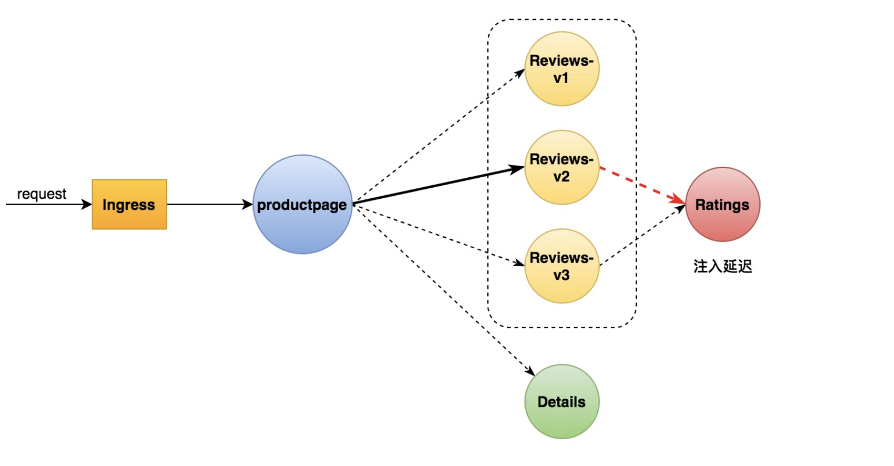
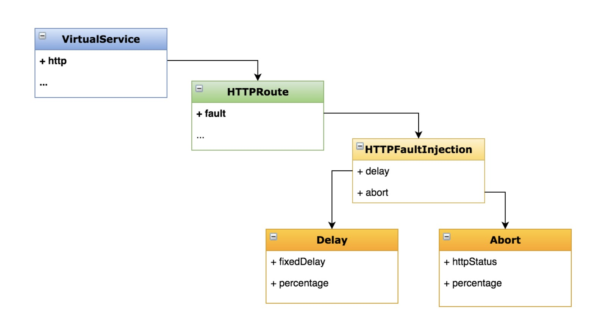

- [部署 Bookinfo](https://istio.io/latest/docs/examples/bookinfo/)

- [示例地址](https://istio.io/latest/zh/docs/tasks/traffic-management/fault-injection/)

### 了解故障注入
- Netflix Chaos Monkey

- 混沌工程(Chaos engineering)


### 配置延迟故障
- 说明
  - 为 ratings 服务添加一个延迟故障
    
- 目标
  - 学会在 VirtualService 中添加故障
  - 学习 HTTPFaultInjection 配置项

### 配置延迟故障



### 操作
- 通过执行配置请求路由任务或运行以下命令来初始化应用程序版本路由
```shell
kubectl apply -f samples/bookinfo/networking/virtual-service-all-v1.yaml
```
```yaml
apiVersion: networking.istio.io/v1alpha3
kind: VirtualService
metadata:
  name: productpage
spec:
  hosts:
  - productpage
  http:
  - route:
    - destination:
        host: productpage
        subset: v1
---
apiVersion: networking.istio.io/v1alpha3
kind: VirtualService
metadata:
  name: reviews
spec:
  hosts:
  - reviews
  http:
  - route:
    - destination:
        host: reviews
        subset: v1
---
apiVersion: networking.istio.io/v1alpha3
kind: VirtualService
metadata:
  name: ratings
spec:
  hosts:
  - ratings
  http:
  - route:
    - destination:
        host: ratings
        subset: v1
---
apiVersion: networking.istio.io/v1alpha3
kind: VirtualService
metadata:
  name: details
spec:
  hosts:
  - details
  http:
  - route:
    - destination:
        host: details
        subset: v1
---
```

- 路由到 reviews v2 版本
```shell
kubectl apply -f samples/bookinfo/networking/virtual-service-reviews-test-v2.yaml
```
```yaml
apiVersion: networking.istio.io/v1alpha3
kind: VirtualService
metadata:
  name: reviews
spec:
  hosts:
    - reviews
  http:
  - match:
    - headers:
        end-user:
          exact: jason
    route:
    - destination:
        host: reviews
        subset: v2
  - route:
    - destination:
        host: reviews
        subset: v1
```

- 经过上面两步后请求流程如下
```text
productpage → reviews:v2 → ratings (针对 jason 用户)

productpage → reviews:v1 (其他用户)
```

- 添加延迟配置
> 为了测试微服务应用程序 Bookinfo 的弹性，我们将为用户 jason 在 reviews:v2 和 ratings 服务之间注入一个 7 秒的延迟。 这个测试将会发现一个故意引入 Bookinfo 应用程序中的 bug。
> 注意 reviews:v2 服务对 ratings 服务的调用具有 10 秒的硬编码连接超时。 因此，尽管引入了 7 秒的延迟，我们仍然期望端到端的流程是没有任何错误的。
```shell
kubectl apply -f samples/bookinfo/networking/virtual-service-ratings-test-delay.yaml
```
```yaml
apiVersion: networking.istio.io/v1alpha3
kind: VirtualService
metadata:
  name: ratings
spec:
  hosts:
  - ratings
  http:
  - match:
    - headers:
        end-user:
          exact: jason
    fault:
      delay:
        percentage:
          value: 100.0
        fixedDelay: 7s
    route:
    - destination:
        host: ratings
        subset: v1
  - route:
    - destination:
        host: ratings
        subset: v1
```

- 确认规则已经创建
> kubectl get virtualservice ratings -o yaml
```yaml
apiVersion: networking.istio.io/v1beta1
kind: VirtualService
metadata:
  annotations:
    kubectl.kubernetes.io/last-applied-configuration: |
      {"apiVersion":"networking.istio.io/v1alpha3","kind":"VirtualService","metadata":{"annotations":{},"name":"ratings","namespace":"default"},"spec":{"hosts":["ratings"],"http":[{"fault":{"delay":{"fixedDelay":"7s","percentage":{"value":100}}},"match":[{"headers":{"end-user":{"exact":"jason"}}}],"route":[{"destination":{"host":"ratings","subset":"v1"}}]},{"route":[{"destination":{"host":"ratings","subset":"v1"}}]}]}}
  creationTimestamp: "2021-06-13T17:23:07Z"
  generation: 2
  managedFields:
  - apiVersion: networking.istio.io/v1alpha3
    fieldsType: FieldsV1
    fieldsV1:
      f:metadata:
        f:annotations:
          .: {}
          f:kubectl.kubernetes.io/last-applied-configuration: {}
      f:spec:
        .: {}
        f:hosts: {}
        f:http: {}
    manager: kubectl-client-side-apply
    operation: Update
    time: "2021-06-13T17:24:25Z"
  name: ratings
  namespace: default
  resourceVersion: "10910996"
  selfLink: /apis/networking.istio.io/v1beta1/namespaces/default/virtualservices/ratings
  uid: 15bddf94-f00e-4d04-8fc4-dd4bfff8951b
spec:
  hosts:
  - ratings
  http:
  - fault:
      delay:
        fixedDelay: 7s
        percentage:
          value: 100
    match:
    - headers:
        end-user:
          exact: jason
    route:
    - destination:
        host: ratings
        subset: v1
  - route:
    - destination:
        host: ratings
        subset: v1
```

- 测试
```text
1、通过浏览器打开 Bookinfo 应用。

2、使用用户 jason 登陆到 /productpage 页面。

你期望 Bookinfo 主页在大约 7 秒钟加载完成并且没有错误。 但是，出现了一个问题：Reviews 部分显示了错误消息：
Sorry, product reviews are currently unavailable for this book.

3、查看页面的响应时间：
打开浏览器的 开发工具 菜单
打开 网络 标签
重新加载 productpage 页面。你会看到页面加载实际上用了大约 6s。
```

- 原理
```text
你发现了一个 bug。微服务中有硬编码超时，导致 reviews 服务失败。

按照预期，我们引入的 7 秒延迟不会影响到 reviews 服务，因为 reviews 和 ratings 服务间的超时被硬编码为 10 秒。 但是，在 productpage 和 reviews 服务之间也有一个 3 秒的硬编码的超时，再加 1 次重试，一共 6 秒。 结果，productpage 对 reviews 的调用在 6 秒后提前超时并抛出错误了。

这种类型的错误可能发生在典型的由不同的团队独立开发不同的微服务的企业应用程序中。 Istio 的故障注入规则可以帮助您识别此类异常，而不会影响最终用户。
```

- 错误修复
```text
这种问题通常会这么解决：

1、增加 productpage 与 reviews 服务之间的超时或降低 reviews 与 ratings 的超时
2、终止并重启修复后的微服务
3、确认 /productpage 页面正常响应且没有任何错误

但是，reviews 服务的 v3 版本已经修复了这个问题。 reviews:v3 服务已将 reviews 与 ratings 的超时时间从 10 秒降低为 2.5 秒，因此它可以兼容（小于）下游的 productpage 的请求。

如果您按照流量转移任务所述将所有流量转移到 reviews:v3， 您可以尝试修改延迟规则为任何低于 2.5 秒的数值，例如 2 秒，然后确认端到端的流程没有任何错误。
```




### 练习

- 给服务配置一个HTTP 中止(abort)故障
```text
测试微服务弹性的另一种方法是引入 HTTP abort 故障。 这个任务将给 ratings 微服务为测试用户 jason 引入一个 HTTP abort。

在这种情况下，我们希望页面能够立即加载，同时显示 Ratings service is currently unavailable 这样的消息。
```

- 为用户 jason 创建一个发送 HTTP abort 的故障注入规则：
> kubectl apply -f samples/bookinfo/networking/virtual-service-ratings-test-abort.yaml
```yaml
apiVersion: networking.istio.io/v1alpha3
kind: VirtualService
metadata:
  name: ratings
spec:
  hosts:
  - ratings
  http:
  - match:
    - headers:
        end-user:
          exact: jason
    fault:
      abort:
        percentage:
          value: 100.0
        httpStatus: 500
    route:
    - destination:
        host: ratings
        subset: v1
  - route:
    - destination:
        host: ratings
        subset: v1
```

- 确认规则已经创建
> kubectl get virtualservice ratings -o yaml
```yaml
apiVersion: networking.istio.io/v1beta1
kind: VirtualService
metadata:
  annotations:
    kubectl.kubernetes.io/last-applied-configuration: |
      {"apiVersion":"networking.istio.io/v1alpha3","kind":"VirtualService","metadata":{"annotations":{},"name":"ratings","namespace":"default"},"spec":{"hosts":["ratings"],"http":[{"fault":{"abort":{"httpStatus":500,"percentage":{"value":100}}},"match":[{"headers":{"end-user":{"exact":"jason"}}}],"route":[{"destination":{"host":"ratings","subset":"v1"}}]},{"route":[{"destination":{"host":"ratings","subset":"v1"}}]}]}}
  creationTimestamp: "2021-06-13T17:23:07Z"
  generation: 3
  managedFields:
  - apiVersion: networking.istio.io/v1alpha3
    fieldsType: FieldsV1
    fieldsV1:
      f:metadata:
        f:annotations:
          .: {}
          f:kubectl.kubernetes.io/last-applied-configuration: {}
      f:spec:
        .: {}
        f:hosts: {}
        f:http: {}
    manager: kubectl-client-side-apply
    operation: Update
    time: "2021-06-13T17:37:25Z"
  name: ratings
  namespace: default
  resourceVersion: "10913176"
  selfLink: /apis/networking.istio.io/v1beta1/namespaces/default/virtualservices/ratings
  uid: 15bddf94-f00e-4d04-8fc4-dd4bfff8951b
spec:
  hosts:
  - ratings
  http:
  - fault:
      abort:
        httpStatus: 500
        percentage:
          value: 100
    match:
    - headers:
        end-user:
          exact: jason
    route:
    - destination:
        host: ratings
        subset: v1
  - route:
    - destination:
        host: ratings
        subset: v1
```

### 测试中止配置
```yaml
1、用浏览器打开 Bookinfo 应用。

2、使用用户 jason 登陆到 /productpage 页面。如果规则成功传播到所有的 pod，您应该能立即看到页面加载并看到 Ratings service is currently unavailable 消息。

3、如果您注销用户 jason 或在匿名窗口（或其他浏览器）中打开 Bookinfo 应用程序， 您将看到 /productpage 为除 jason 以外的其他用户调用了 reviews:v1（完全不调用 ratings）。 因此，您不会看到任何错误消息。
```

### 清理
删除应用程序路由规则

> kubectl delete -f samples/bookinfo/networking/virtual-service-all-v1.yaml

