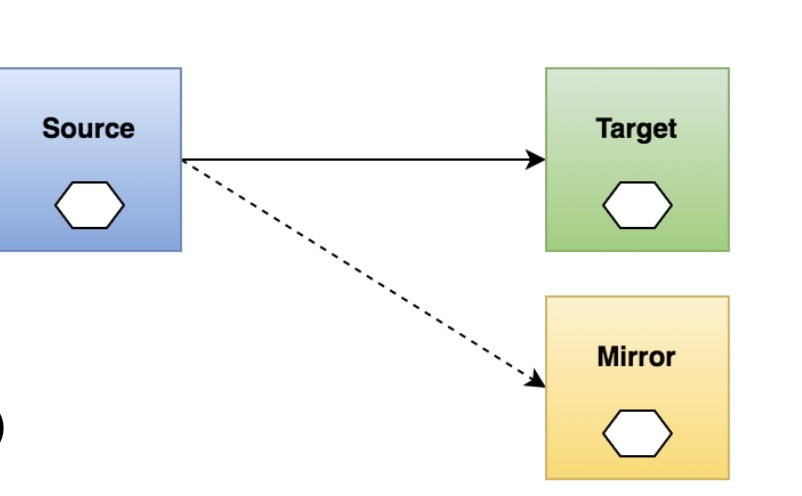
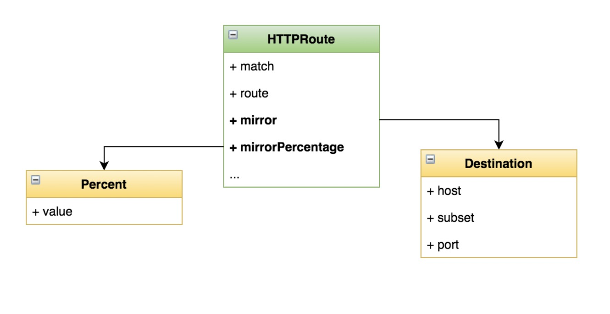

- [部署 Bookinfo](https://istio.io/latest/docs/examples/bookinfo/)

- [示例地址](https://istio.io/latest/zh/docs/tasks/traffic-management/mirroring/)

### 了解流量镜像(Traffic Mirroring)
- 实时复制请求到镜像服务 
  
- 应用场景
  - 线上问题排查(troubleshooting)
  - 观察生产环境的请求处理能力(压力测试) 
  - 复制请求信息用于分析
    


### 配置流量镜像
- 说明
• 将发送到 v1 版本的流量镜像到 v2 版本
  
- 目标
  - 学会在 VirtualService 中通过 mirror 字段配置镜像 
  - 理解流量镜像的使用场景

### 演示
- 部署 httpbin 服务的 v1、v2 版本 ，部署两个版本的 Httpbin 服务，并开启访问日志功能：

- httpbin-v1：
```yaml
cat <<EOF | istioctl kube-inject -f - | kubectl create -f -
apiVersion: apps/v1
kind: Deployment
metadata:
  name: httpbin-v1
spec:
  replicas: 1
  selector:
    matchLabels:
      app: httpbin
      version: v1
  template:
    metadata:
      labels:
        app: httpbin
        version: v1
    spec:
      containers:
      - image: docker.io/kennethreitz/httpbin
        imagePullPolicy: IfNotPresent
        name: httpbin
        command: ["gunicorn", "--access-logfile", "-", "-b", "0.0.0.0:80", "httpbin:app"]
        ports:
        - containerPort: 80
EOF
```

- httpbin-v2：
```yaml
cat <<EOF | istioctl kube-inject -f - | kubectl create -f -
apiVersion: apps/v1
kind: Deployment
metadata:
  name: httpbin-v2
spec:
  replicas: 1
  selector:
    matchLabels:
      app: httpbin
      version: v2
  template:
    metadata:
      labels:
        app: httpbin
        version: v2
    spec:
      containers:
      - image: docker.io/kennethreitz/httpbin
        imagePullPolicy: IfNotPresent
        name: httpbin
        command: ["gunicorn", "--access-logfile", "-", "-b", "0.0.0.0:80", "httpbin:app"]
        ports:
        - containerPort: 80
EOF
```

- 开启两个命令行窗口，执行打印上面两个应用的日志
> kubectl logs -f httpbin-v1-668497b5cb-hbpvt -c httpbin

>  kubectl logs -f httpbin-v2-f859d4598-mxwfc -c httpbin

- httpbin Kubernetes service：
```yaml
kubectl create -f - <<EOF
apiVersion: v1
kind: Service
metadata:
  name: httpbin
  labels:
    app: httpbin
spec:
  ports:
  - name: http
    port: 8000
    targetPort: 80
  selector:
    app: httpbin
EOF
```

- 启动 sleep 服务，这样就可以使用 curl 来提供负载：
```yaml
cat <<EOF | istioctl kube-inject -f - | kubectl create -f -
apiVersion: apps/v1
kind: Deployment
metadata:
  name: sleep
spec:
  replicas: 1
  selector:
    matchLabels:
      app: sleep
  template:
    metadata:
      labels:
        app: sleep
    spec:
      containers:
      - name: sleep
        image: tutum/curl
        command: ["/bin/sleep","infinity"]
        imagePullPolicy: IfNotPresent
EOF
```

- 配置镜像

- 创建一个默认路由规则，将所有流量路由到服务的 v1 版本：
```yaml
kubectl apply -f - <<EOF
apiVersion: networking.istio.io/v1alpha3
kind: VirtualService
metadata:
  name: httpbin
spec:
  hosts:
    - httpbin
  http:
  - route:
    - destination:
        host: httpbin
        subset: v1
      weight: 100
---
apiVersion: networking.istio.io/v1alpha3
kind: DestinationRule
metadata:
  name: httpbin
spec:
  host: httpbin
  subsets:
  - name: v1
    labels:
      version: v1
  - name: v2
    labels:
      version: v2
EOF
```
现在所有流量都转到 httpbin:v1 服务。

- 向服务发送一部分流量：
```shell
export SLEEP_POD=$(kubectl get pod -l app=sleep -o jsonpath={.items..metadata.name})
kubectl exec "${SLEEP_POD}" -c sleep -- curl -sS http://httpbin:8000/headers
```

- 分别查看 httpbin Pod的 v1 和 v2 两个版本的日志。您可以看到 v1 版本的访问日志条目，而 v2 版本没有日志：
```text
export V1_POD=$(kubectl get pod -l app=httpbin,version=v1 -o jsonpath={.items..metadata.name})
kubectl logs "$V1_POD" -c httpbin
日志：127.0.0.6 - - [13/Jun/2021:18:31:23 +0000] "GET /headers HTTP/1.1" 200 525 "-" "curl/7.35.0"

export V2_POD=$(kubectl get pod -l app=httpbin,version=v2 -o jsonpath={.items..metadata.name})
kubectl logs "$V2_POD" -c httpbin
日志：空...
```  

- 镜像流量到 v2

- 改变流量规则将流量镜像到 v2：
```yaml
kubectl apply -f - <<EOF
apiVersion: networking.istio.io/v1alpha3
kind: VirtualService
metadata:
  name: httpbin
spec:
  hosts:
    - httpbin
  http:
  - route:
    - destination:
        host: httpbin
        subset: v1
      weight: 100
    mirror:
      host: httpbin
      subset: v2
    mirrorPercent: 100
EOF
```
```text
这个路由规则发送 100% 流量到 v1 版本。最后一节表示您将 100% 的相同流量镜像（即发送）到 httpbin:v2 服务。当流量被镜像时，请求将发送到镜像服务中，并在 headers 中的 Host/Authority 属性值上追加 -shadow。例如 cluster-1 变为 cluster-1-shadow。

此外，重点注意这些被镜像的流量是『 即发即弃』的，就是说镜像请求的响应会被丢弃。

您可以使用 mirror_percent 属性来设置镜像流量的百分比，而不是镜像全部请求。为了兼容老版本，如果这个属性不存在，将镜像所有流量。
```

- 发送流量：
> kubectl exec "${SLEEP_POD}" -c sleep -- curl -sS http://httpbin:8000/headers

现在就可以看到 v1 和 v2 版本中都有了访问日志。v2 版本中的访问日志就是由镜像流量产生的，这些请求的实际目标是 v1 版本。

```text
kubectl logs "$V1_POD" -c httpbin
日志：
127.0.0.6 - - [13/Jun/2021:18:31:23 +0000] "GET /headers HTTP/1.1" 200 525 "-" "curl/7.35.0"
127.0.0.6 - - [13/Jun/2021:18:34:44 +0000] "GET /headers HTTP/1.1" 200 525 "-" "curl/7.35.0"

kubectl logs "$V2_POD" -c httpbin
日志：
127.0.0.6 - - [13/Jun/2021:18:25:57 +0000] "GET /headers HTTP/1.1" 200 532 "-" "curl/7.35.0"
```



### 操作
- 通过调整镜像百分比实现采样率

### 清理
删除规则
```shell
kubectl delete virtualservice httpbin
kubectl delete destinationrule httpbin
```

关闭 [Httpbin](https://github.com/istio/istio/tree/release-1.10/samples/httpbin) 服务和客户端
```shell
kubectl delete deploy httpbin-v1 httpbin-v2 sleep
kubectl delete svc httpbin
```
