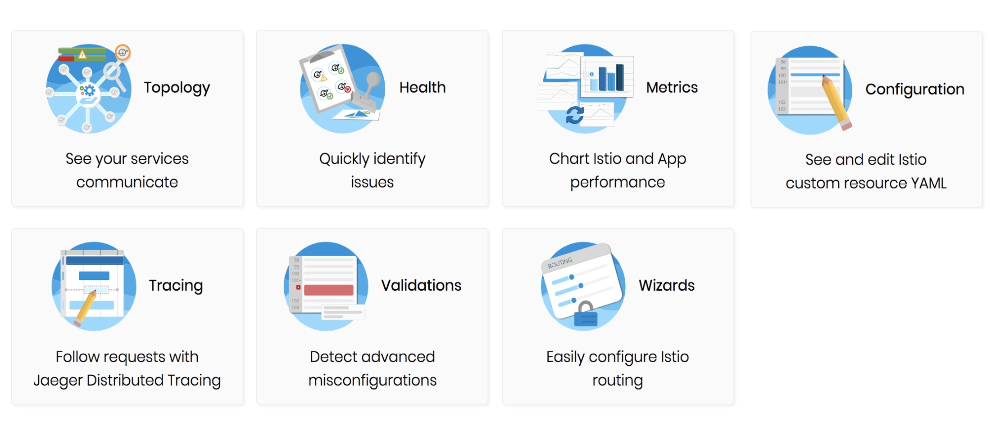
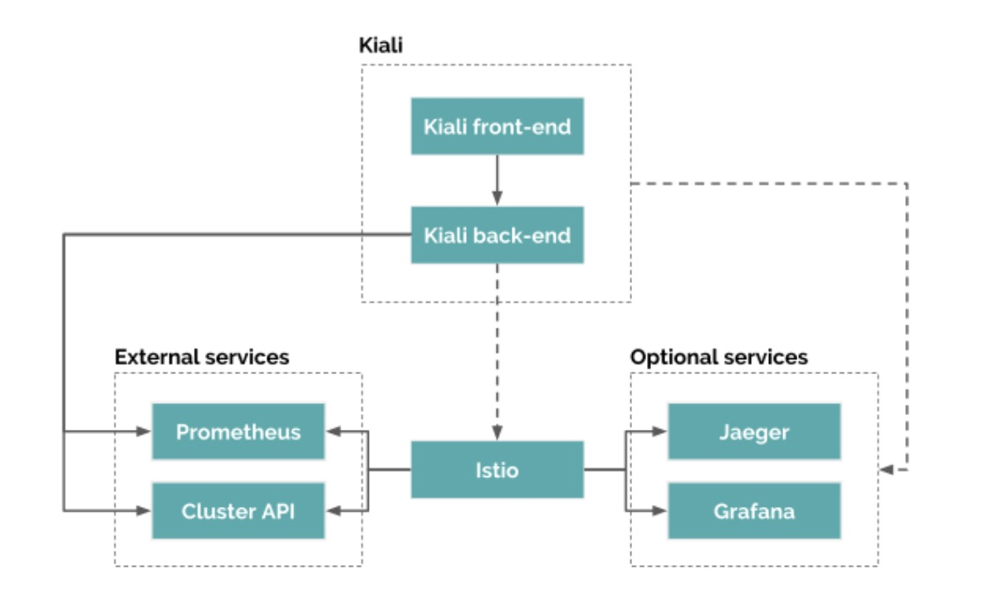

- [部署 Bookinfo](https://istio.io/latest/docs/examples/bookinfo/)

- [示例地址](https://istio.io/latest/zh/docs/tasks/observability/kiali/)

### 微服务架构可视化的重要性
- 痛点
  - 服务间依赖关系错综复杂
  - 问题排查困难，扯皮甩锅时有发生
    
- 优势
  - 梳理服务的交互关系
  - 了解应用的行为与状态

### 什么是 Kiali(望远镜)
- 官方定义:
  - Istio 的可观察性控制台
  - 通过服务拓扑帮助你理解服务网格的结构 
  - 提供网格的健康状态视图
  - 具有服务网格配置功能
    
- 名字含义
  
- Istio 作为宿主

### Kiali 的功能

### Kiali 架构图

### 操作
- 基本页面

- 总体拓扑
  - 服务信息
  - 工作负载信息
  - 配置验证
  
- 向导功能

