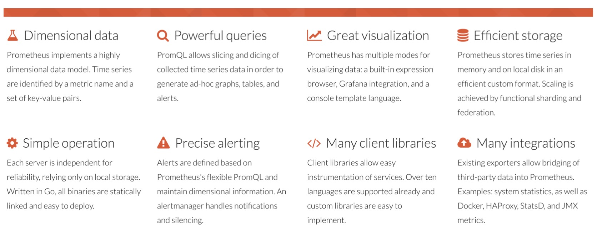
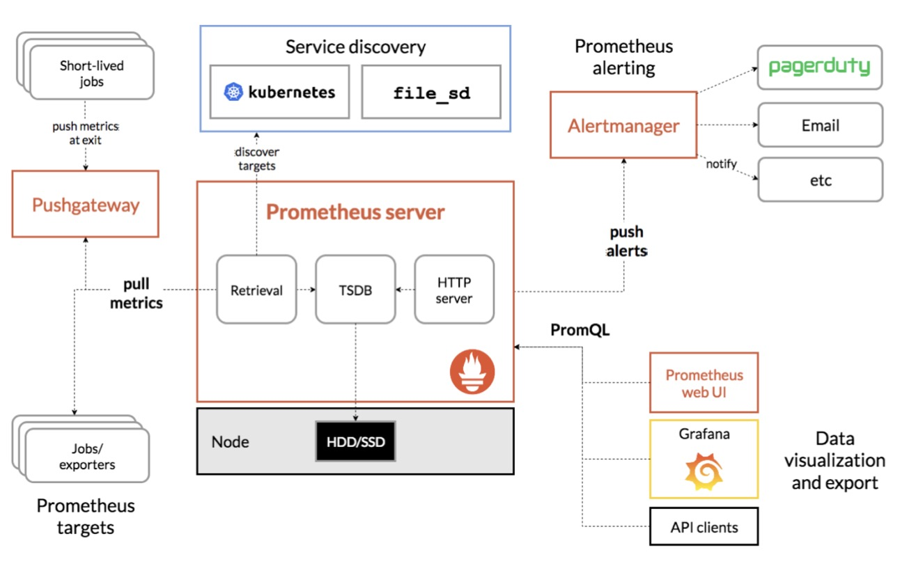
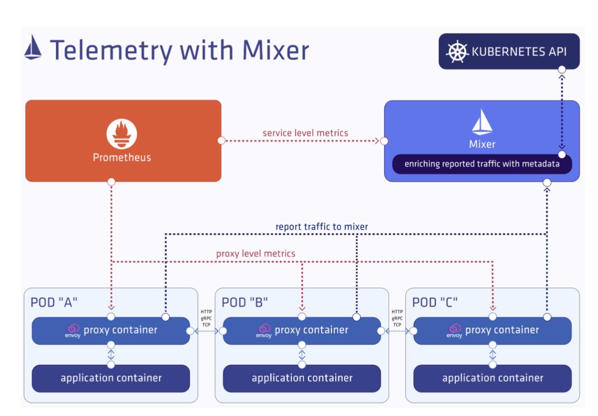
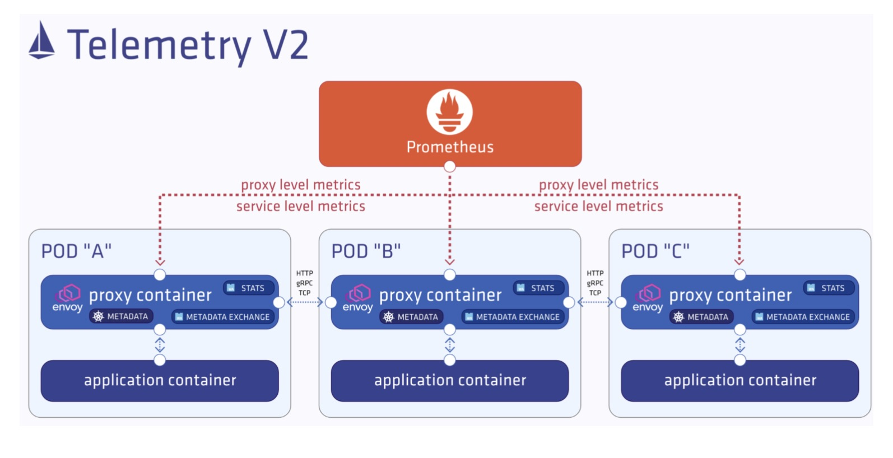
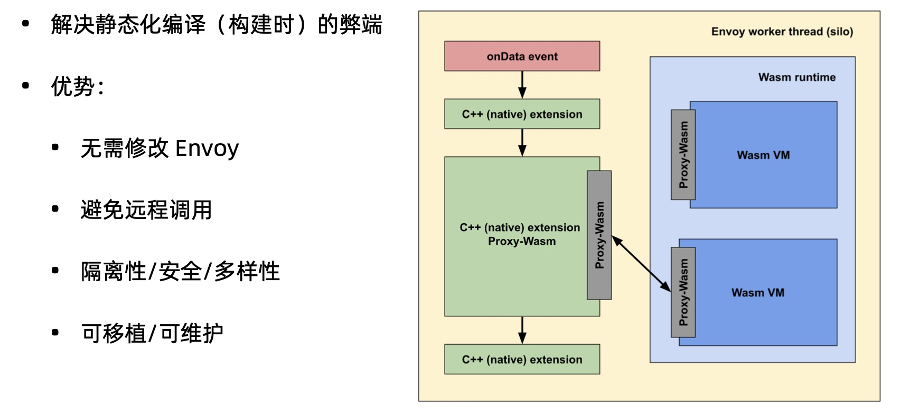

- [部署 Bookinfo](https://istio.io/latest/docs/examples/bookinfo/)

- [示例地址](https://istio.io/latest/zh/docs/tasks/observability/metrics/querying-metrics/)

### Prometheus 简介

### Prometheus 架构

### 收集指标
- 说明
  - 通过 Prometheus 收集指标并查看指标数据 

- 目标
  - 用 Prometheus 查看指标数据
  - 了解 Istio 1.5 中新的遥测方法 (Telemetry V2)

### 示例
- 启动Prometheus控制台
> istioctl d --address 192.168.0.180 prometheus

- 查看服务指标

- 查看 Envoy 代理指标 

- 查看控制平面指标

### Istio 1.5 的遥测指标
- 请求数(istio_requests_total)
- 请求时长(istio_request_duration_milliseconds)
- 请求大小(istio_request_bytes)
- 响应大小(istio_response_bytes)
- TCP 发送字节数(istio_tcp_sent_bytes_total)
- TCP 接受字节数(istio_tcp_received_bytes_total)
- TCP 连接打开数(istio_tcp_connections_opened_total)
- TCP 连接关闭数(istio_tcp_connections_closed_total)

### Istio 1.5 遥测的变化

### WebAssembly in Envoy

### 操作
- 查询 Istio 度量指标

- 验证自身集群中运行着 prometheus 服务。
> kubectl -n istio-system get svc prometheus

- 向网格发送流量。(以 Bookinfo 为例，在 web 浏览器中访问 http://$GATEWAY_URL/productpage 或执行如下命令：)
> curl http://$GATEWAY_URL/productpage

- 打开 Prometheus UI。
> istioctl dashboard prometheus

- 执行一个 Prometheus 查询
> istio_requests_total

- 请求 productpage 服务的总次数：
> istio_requests_total{destination_service="productpage.default.svc.cluster.local"}

- 请求 reviews 服务 V3 版本的总次数：
> istio_requests_total{destination_service="reviews.default.svc.cluster.local", destination_version="v3"}

- 过去 5 分钟 productpage 服务所有实例的请求频次：
> rate(istio_requests_total{destination_service=~"productpage.*", response_code="200"}[5m])

### 关于 Prometheus 插件
Prometheus 插件是预先配置抓取 Istio 端点收集指标的 Prometheus 服务器。它提供了一种持久存储和查询 Istio 指标的机制。

有关查询Prometheus的更多信息，请阅读他们的 [查询文档](https://prometheus.io/docs/querying/basics/)

### 清除
- 使用 control-C 或以下命令删除可能仍在运行的所有 stioctl 进程：
> killall istioctl

- 如果您不打算探索任何后续任务，请参阅 [Bookinfo 清理说明](https://istio.io/latest/zh/docs/examples/bookinfo/#cleanup) 清理说明关闭应用程序。

