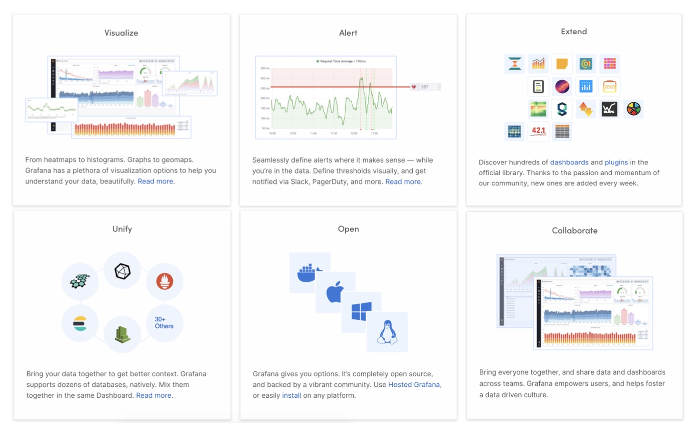
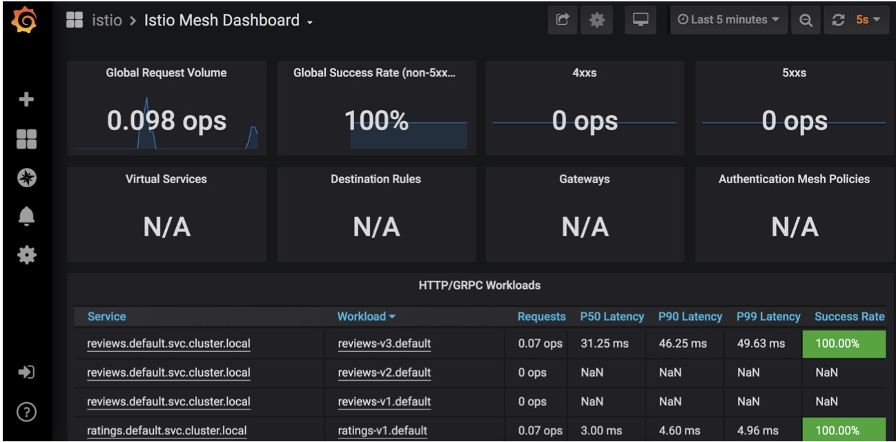

- [部署 Bookinfo](https://istio.io/latest/docs/examples/bookinfo/)

- [示例地址](https://istio.io/latest/zh/docs/tasks/observability/metrics/using-istio-dashboard/)

### Grafana 简介

### Istio Dashboard
- Mesh Dashboard:查看应用(服务)数据 
  - 网格数据总览
  - 服务视图
  - 工作负载视图
    
- Performance Dashboard:查看 Istio 自身(各组件)数据
  - Istio 系统总览
  - 各组件负载情况

### 指标可视化
- 使用 Grafana 查看指标生成的 Istio Dashboard

### 操作
- 确保集群中已安装 Grafana
  - --set values.grafana.enabled=true
- 启动 Grafana
- 查看 Dashboard
- 通过 bookinfo 应用产生指标数据

- 验证 prometheus 服务正在集群中运行
> kubectl -n istio-system get svc prometheus

- 验证 Grafana 服务正在集群中运行
> kubectl -n istio-system get svc grafana

- 通过 Grafana UI 打开 Istio Dashboard
> istioctl d --address 192.168.0.180 grafana

- 浏览器打开
> http://192.168.0.180:3000/dashboard/db/istio-mesh-dashboard

- 发送流量到网格
> curl http://$GATEWAY_URL/productpage

### 清除
> killall kubectl

