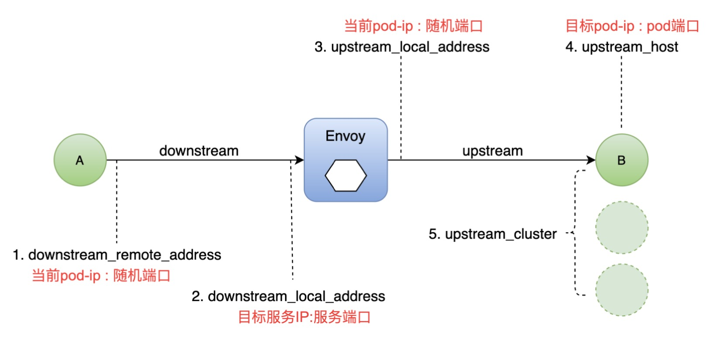

- [部署 Bookinfo](https://istio.io/latest/docs/examples/bookinfo/)

- [示例地址](https://istio.io/latest/zh/docs/tasks/observability/logs/access-log/)

### 查看 Envoy 日志
- 通过查看 Envoy 日志了解流量信息 
  
- 学会通过分析日志调试流量异常

### 演示
- 确认 Envoy 日志配置开启
  - --set values.global.proxy.accessLogFile="/dev/stdout"
- 访问服务产生流量输出
- 查看 Envoy (istio-proxy) 日志输出

### 日志项分析
```json
{
    "method":"GET",
    "request_id":"4d28d003-690a-9111-8dfe-4674a728b71c",
    "bytes_sent":178,
    "authority":"details:9080",
    "user_agent":"Mozilla/5.0 (Macintosh; Intel Mac OS X 10_15_7) AppleWebKit/537.36 (KHTML, like Gecko) Chrome/91.0.4472.101 Safari/537.36",
    "start_time":"2021-06-13T21:03:03.406Z",
    "bytes_received":0,
    "requested_server_name":null,
    "path":"/details/0",
    "response_code_details":"via_upstream",
    "protocol":"HTTP/1.1",
    "response_flags":"-",
    "upstream_service_time":"2",
    "duration":3,
    "route_name":"default",
    "downstream_remote_address":"100.99.85.45:45540",
    "x_forwarded_for":null,
    "response_code":200,
    "upstream_transport_failure_reason":null,
    "upstream_cluster":"outbound|9080||details.default.svc.cluster.local",
    "upstream_local_address":"100.99.85.45:38544",
    "upstream_host":"100.99.85.44:9080",
    "connection_termination_details":null,
    "downstream_local_address":"10.107.109.209:9080"
}
```

### Envoy 流量五元组


### 调试关键字段:RESPONSE_FLAGS
- UH:upstream cluster 中没有健康的 host，503
- UF:upstream 连接失败，503
- UO:upstream overflow(熔断)
- NR:没有路由配置，404
- URX:请求被拒绝因为限流或最大连接次数 
-......

### Envoy 日志配置项
```text
配置项                                     说明
global.proxy.accessLogFile              日志输出文件，空为关闭输出
global.proxy.accessLogEncoding          日志编码格式:JSON、TEXT
global.proxy.accessLogFormat            配置显示在日志中的字段，空为默认格式
global.proxy.logLevel                   日志级别，空为 warning，可选 trace\|debug\|info\|warning\|error\|critical\|off
```

### 操作
- 尝试修改日志项，并进行日志分析

- 确认istio 关于envoy的配置项打开
> kubectl describe configmap istio -n istio-system

- 追踪envoy日志(bookinfo - productpage服务为例)
> kubectl logs -f productpage-v1-6b746f74dc-pn98t istio-proxy

- 开启 Envoy 访问日志
> istioctl manifest apply --set values.global.proxy.accessLogFile="/dev/stdout"

> 您也可以通过设置 accessLogEncoding 为 JSON 或 TEXT 来在两种格式之间切换。

> 您也许希望通过设置 accessLogFormat 来自定义访问日志的格式。


- 将 sleep 示例应用程序部署为发送请求的测试源。 如果您启用了自动 sidecar 注入，运行以下命令部署示例应用程序：
> kubectl apply -f samples/sleep/sleep.yaml

- 为了发送请求，您需要创建 SOURCE_POD 环境变量来存储源 pod 的名称：
> export SOURCE_POD=$(kubectl get pod -l app=sleep -o jsonpath={.items..metadata.name})

- 启动 httpbin 样例程序。
> kubectl apply -f samples/httpbin/httpbin.yaml

- 测试访问日志

- 从 sleep 向 httpbin 发送一个请求:
> kubectl exec -it $(kubectl get pod -l app=sleep -o jsonpath='{.items[0].metadata.name}') -c sleep -- curl -v httpbin:8000/status/418

- 检查 sleep 的日志:
> kubectl logs -l app=sleep -c istio-proxy
```json
{
    "connection_termination_details":null,
    "downstream_local_address":"10.101.37.107:8000",
    "downstream_remote_address":"100.99.85.52:40346",
    "upstream_transport_failure_reason":null,
    "upstream_service_time":"55",
    "requested_server_name":null,
    "start_time":"2021-06-13T21:08:39.520Z",
    "response_code_details":"via_upstream",
    "x_forwarded_for":null,
    "bytes_received":0,
    "path":"/status/418",
    "duration":55,
    "bytes_sent":135,
    "user_agent":"curl/7.77.0-DEV",
    "upstream_cluster":"outbound|8000||httpbin.default.svc.cluster.local",
    "upstream_local_address":"100.99.85.52:58056",
    "request_id":"d5b6f4ee-0b6a-9073-98e2-341c7ca98f8c",
    "response_flags":"-",
    "protocol":"HTTP/1.1",
    "response_code":418,
    "route_name":"default",
    "upstream_host":"100.118.229.46:80",
    "method":"GET",
    "authority":"httpbin:8000"
}
```

- 检查 httpbin 的日志:
> kubectl logs -l app=httpbin -c istio-proxy
```json
{
    "upstream_transport_failure_reason":null,
    "downstream_local_address":"100.118.229.46:80",
    "upstream_host":"100.118.229.46:80",
    "route_name":"default",
    "duration":3,
    "upstream_cluster":"inbound|80||",
    "authority":"httpbin:8000",
    "start_time":"2021-06-13T20:59:51.919Z",
    "request_id":"d5b6f4ee-0b6a-9073-98e2-341c7ca98f8c",
    "method":"GET",
    "upstream_local_address":"127.0.0.6:49917",
    "x_forwarded_for":null,
    "upstream_service_time":"2",
    "requested_server_name":"outbound_.8000_._.httpbin.default.svc.cluster.local",
    "path":"/status/418",
    "bytes_sent":135,
    "downstream_remote_address":"100.99.85.52:58056",
    "user_agent":"curl/7.77.0-DEV",
    "protocol":"HTTP/1.1",
    "response_code_details":"via_upstream",
    "connection_termination_details":null,
    "response_code":418,
    "bytes_received":0,
    "response_flags":"-"
}
```
> 请注意，与请求相对应的信息分别出现在源（sleep）和目标（httpbin）的 Istio 代理日志中。您可以在日志中看到 HTTP 动词(GET)、HTTP 路径(/status/418)、响应码(418) 和其他请求相关信息。

### 清除
- 关闭 sleep 和 httpbin 服务:
```shell
kubectl delete -f samples/sleep/sleep.yaml
kubectl delete -f samples/httpbin/httpbin.yaml
```

### 关闭 Envoy 的访问日志
编辑 istio 配置文件然后设置 accessLogFile 为 ""
> istioctl manifest apply
