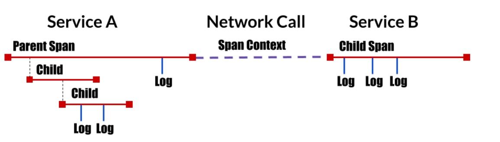
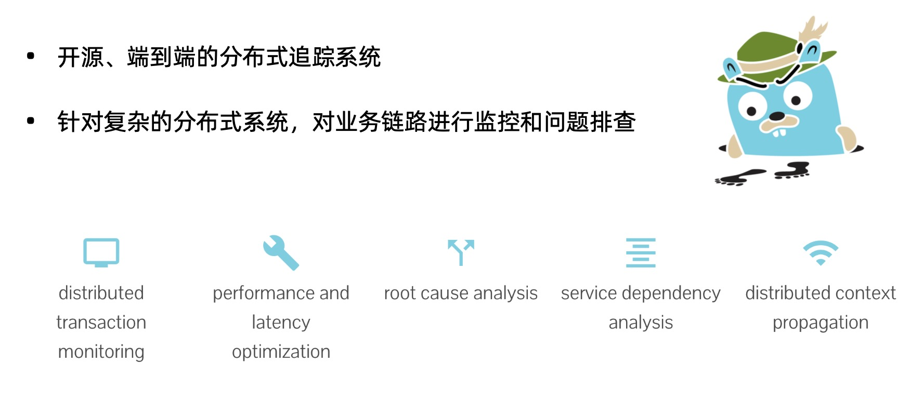
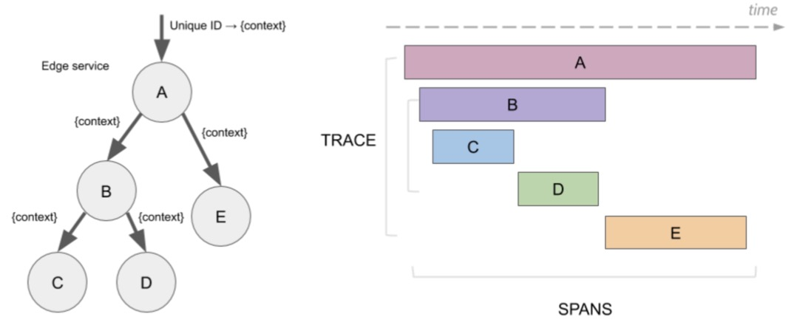
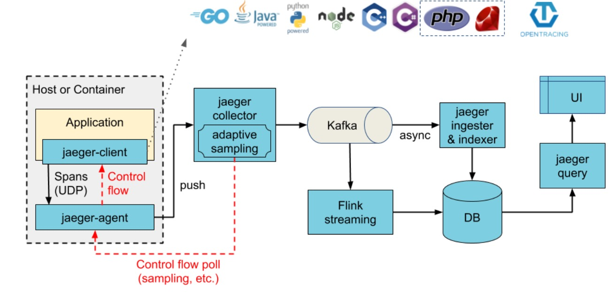

- [部署 Bookinfo](https://istio.io/latest/docs/examples/bookinfo/)

- [示例地址](https://istio.io/latest/zh/docs/tasks/observability/distributed-tracing/jaeger/)

### 分布式追踪概念

- 分析和监控应用的监控方法 
- 查找故障点、分析性能问题 
- 起源于 Google 的 Dapper 
- OpenTracing:
  - API 规范、框架、库的组合

### 什么是 Jaeger

### 术语

- Span:
  - 逻辑单元
  - 有操作名、执行时间
  - 嵌套、有序、因果关系 

- Trace:
  - 数据/执行路径 
  - Span 的组合

### Jaeger 架构

- 组件
  - Client libraries
  - Agent
  - Collector
  - Query
  - Ingester

### 演示
- 确认 Jaeger 安装
  - --set values.tracing.enabled=true
  - --set values.global.tracer.zipkin.address = <jaeger-collector-service>.<jaeger - collector-namespace>:9411
    
- 打开 Jaeger UI

- 访问 bookinfo 生成 trace 数据

- 对于测试（或临时访问），您也可以使用端口转发。假设已将 Jaeger 部署到 istio-system 命名空间，请使用以下内容：
>  istioctl d --address 192.168.0.180 jaeger

- 使用 Bookinfo 示例产生追踪

- 当 Bookinfo 应用程序启动并运行时，访问 http://$GATEWAY_URL/productpage 一次或多次以生成追踪信息。 要查看追踪数据，必须向服务发送请求。请求的数量取决于 Istio 的采样率。 采样率在安装 Istio 时设置，默认采样速率为 1%。在第一个跟踪可见之前，您需要发送至少 100 个请求。 使用以下命令向 productpage 服务发送 100 个请求：
> for i in `seq 1 100`; do curl -s -o /dev/null http://$GATEWAY_URL/productpage; done

- 从仪表盘左边面板的 Service 下拉列表中选择 productpage 并点击 Find Traces：

- 点击位于最上面的最近一次追踪，查看对应最近一次访问 /productpage 的详细信息：

- 追踪信息由一组 Span 组成，每个 Span 对应一个 Bookinfo Service。这些 Service 在执行 /productpage 请求时被调用，或是 Istio 内部组件，例如：istio-ingressgateway。

### 清理
1、使用 Control C 或删除任何可能仍在运行的 istioctl 进程：

> $ killall istioctl

2、如果您没有计划探索任何接下来的任务，请参考 [Bookinfo](https://istio.io/latest/zh/docs/examples/bookinfo/#cleanup) 清理中的说明，关闭整个应用程序。
