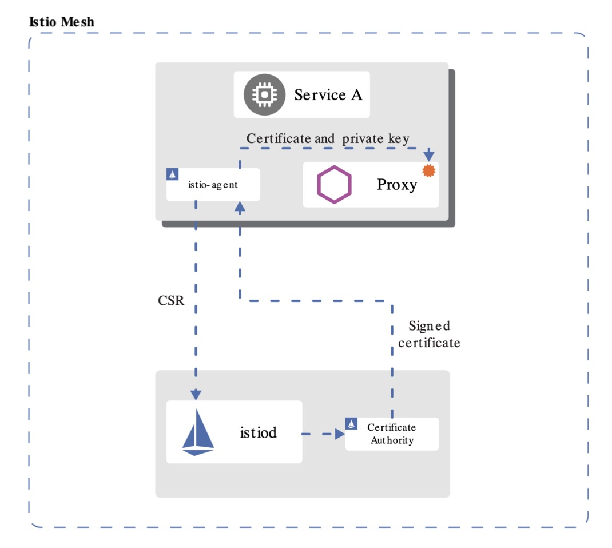
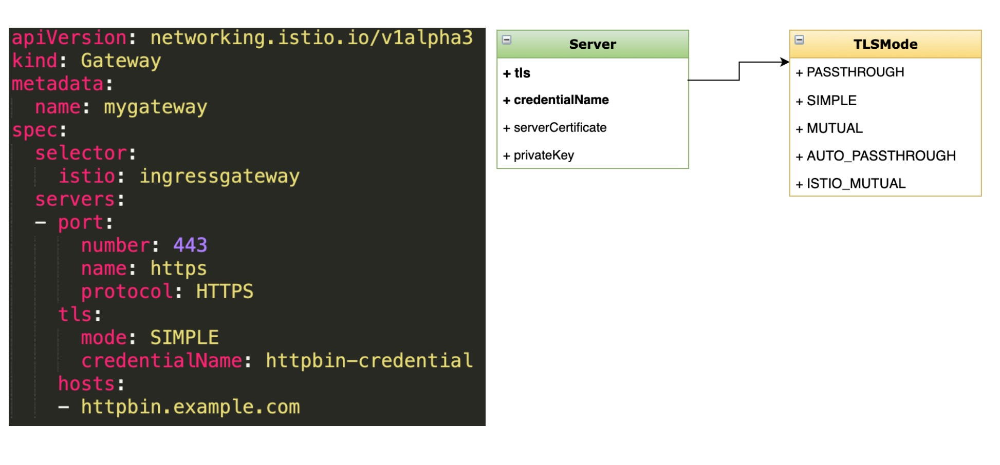

- [部署 Bookinfo](https://istio.io/latest/docs/examples/bookinfo/)

- [示例地址](https://istio.io/latest/zh/docs/tasks/security/cert-management/plugin-ca-cert/)

- 查询curl是否是LibreSSL编译
> curl --version | grep LibreSSL

### Istio 1.5 的安全更新
- SDS (安全发现服务)趋于稳定、默认开启
- 对等认证和请求认证配置分离
- 自动 mTLS 从 alpha 变为 beta，默认开启
- Node agent 和 Pilot agent 合并， 简化 Pod 安全策略的配置
- 支持 first-party-jwt (ServiceAccountToken) 作为 third-party-jwt 的备用 
- ...

### 配置基于 SDS 的安全网关
- 说明
  - 配置安全网关，为外部提供 HTTPS 访问方式
    
- 目标
  - 学习配置全局自动的 TLS、mTLS
  - 了解 SDS 及工作原理

### 安全发现服务(SDS)


- 身份和证书管理
- 实现安全配置自动化 
- 中心化 SDS Server 
- 优点:
  - 无需挂载 secret 卷
  - 动态更新证书，无需重启 
  - 可监视多个证书密钥对

### 演示
- 确认 curl 命令的编译包 
- 生成证书、密钥
- 配置 TLS 网关和路由
- curl 测试



### 命令
- 1.为服务创建根证书和私钥：
> openssl req -x509 -sha256 -nodes -days 365 -newkey rsa:2048 -subj '/O=example Inc./CN=example.com' -keyout example.com.key -out example.com.crt

- 2.为httpbin.example.com创建证书和私钥：
> openssl req -out httpbin.example.com.csr -newkey rsa:2048 -nodes -keyout httpbin.example.com.key -subj "/CN=httpbin.example.com/O=httpbin organization"

> openssl x509 -req -days 365 -CA example.com.crt -CAkey example.com.key -set_serial 0 -in httpbin.example.com.csr -out httpbin.example.com.crt

- 3. 创建secret
> kubectl create -n istio-system secret tls httpbin-credential --key=httpbin.example.com.key --cert=httpbin.example.com.crt

- 4.部署 httpbin 和 sleep 示例服务, 定义网关,vs
> kubectl apply -f <(istioctl kube-inject -f samples/httpbin/httpbin.yaml)

> kubectl apply -f <(istioctl kube-inject -f samples/sleep/sleep.yaml)

gw
```yaml
kubectl apply -f - <<EOF
apiVersion: networking.istio.io/v1alpha3
kind: Gateway
metadata:
  name: mygateway
spec:
  selector:
    istio: ingressgateway 
  servers:
  - port:
      number: 443
      name: https
      protocol: HTTPS
    tls:
      mode: SIMPLE
      credentialName: httpbin-credential
    hosts:
    - httpbin.example.com
EOF
```
vs
```yaml
kubectl apply -f - <<EOF
apiVersion: networking.istio.io/v1alpha3
kind: VirtualService
metadata:
  name: httpbin
spec:
  hosts:
  - "httpbin.example.com"
  gateways:
  - mygateway
  http:
  - match:
    - uri:
        prefix: /status
    - uri:
        prefix: /delay
    route:
    - destination:
        port:
          number: 8000
        host: httpbin
EOF
```

- 查询集群
> kubectl get svc istio-ingressgateway -n istio-system
```text
NAME                   TYPE           CLUSTER-IP     EXTERNAL-IP   PORT(S)                                                                      AGE
istio-ingressgateway   LoadBalancer   10.97.138.99   <pending>     15021:31387/TCP,80:30371/TCP,443:30829/TCP,31400:30312/TCP,15443:32026/TCP   38h
```

- 5. 请求验证
> curl -v -HHost:httpbin.example.com \
--resolve httpbin.example.com:30829:192.168.0.180 \
--cacert example.com.crt "https://httpbin.example.com:30829/status/418"

### 清空
> kubectl delete gw mygateway

> kubectl delete vs httpbin

> kubectl delete -n istio-system secret  httpbin-credential

> kubectl delete -f samples/httpbin/httpbin.yaml

> kubectl delete -f samples/sleep/sleep.yaml

### 官方示例
- 在 Istio 安装包的顶层目录下，创建一个目录来存放证书和密钥：
> mkdir -p certs

> pushd certs

- 生成根证书和密钥
> make -f ../tools/certs/Makefile.selfsigned.mk root-ca

将会生成以下文件：
```text
root-cert.pem：生成的根证书
root-key.pem：生成的根密钥
root-ca.conf：生成根证书的 openssl 配置
root-cert.csr：为根证书生成的 CSR
```

- 对于每个集群，为 Istio CA 生成一个中间证书和密钥。 以下是集群 cluster1 的例子：
> make -f ../tools/certs/Makefile.selfsigned.mk cluster1-cacerts

运行以上命令，将会在名为 cluster1 的目录下生成以下文件：
```text
ca-cert.pem：生成的中间证书
ca-key.pem：生成的中间密钥
cert-chain.pem：istiod 使用的生成的证书链
root-cert.pem：根证书
```
> 您可以使用一个您选择的字符串来替换 cluster1。例如，使用 cluster2-cacerts 参数，您可以在一个名为 cluster2 的目录中创建证书和密钥。 如果您正在离线机器上进行此操作，请将生成的目录复制到可以访问集群的机器上。

- 在每个集群中，创建一个私密 cacerts，包括所有输入文件 ca-cert.pem，ca-key.pem，root-cert.pem 和 cert-chain.pem。例如，在 cluster1 集群上：
> kubectl create namespace istio-system

> kubectl create secret generic cacerts -n istio-system \
--from-file=cluster1/ca-cert.pem \
--from-file=cluster1/ca-key.pem \
--from-file=cluster1/root-cert.pem \
--from-file=cluster1/cert-chain.pem

- 返回 Istio 安装的顶层目录：
> popd

- 部署 httpbin 和 sleep 示例服务。
> kubectl create ns foo

> kubectl apply -f <(istioctl kube-inject -f samples/httpbin/httpbin.yaml) -n foo

> kubectl apply -f <(istioctl kube-inject -f samples/sleep/sleep.yaml) -n foo

- 为 foo 命名空间中的工作负载部署一个策略，使其只接受相互的 TLS 流量。
```yaml
kubectl apply -n foo -f - <<EOF
apiVersion: security.istio.io/v1beta1
kind: PeerAuthentication
metadata:
  name: "default"
spec:
  mtls:
    mode: STRICT
EOF
```

- 验证证书

> 本节中，验证工作负载证书是否已通过插入到 CA 中的证书签署。验证的前提要求机器上安装有 openssl。

- 在检索 httpbin 的证书链之前，请等待 20 秒使mTLS策略生效。由于本例中使用的 CA 证书是自签的，所以可以预料 openssl 命令返回 verify error:num=19:self signed certificate in certificate chain。

> sleep 20; kubectl exec "$(kubectl get pod -l app=sleep -n foo -o jsonpath={.items..metadata.name})" -c istio-proxy -n foo -- openssl s_client -showcerts -connect httpbin.foo:8000 > httpbin-proxy-cert.txt

- 解析证书链上的证书。
> sed -n '/-----BEGIN CERTIFICATE-----/{:start /-----END CERTIFICATE-----/!{N;b start};/.*/p}' httpbin-proxy-cert.txt > certs.pem

> awk 'BEGIN {counter=0;} /BEGIN CERT/{counter++} { print > "proxy-cert-" counter ".pem"}' < certs.pem

- 确认根证书与管理员指定的证书是否相同：
> openssl x509 -in certs/cluster1/root-cert.pem -text -noout > /tmp/root-cert.crt.txt

> openssl x509 -in ./proxy-cert-2.pem -text -noout > /tmp/pod-root-cert.crt.txt

> diff -s /tmp/root-cert.crt.txt /tmp/pod-root-cert.crt.txt

- 验证 CA 证书与管理员指定的证书是否相同：
> openssl x509 -in certs/cluster1/ca-cert.pem -text -noout > /tmp/ca-cert.crt.txt

> openssl x509 -in ./proxy-cert-1.pem -text -noout > /tmp/pod-cert-chain-ca.crt.txt

> diff -s /tmp/ca-cert.crt.txt /tmp/pod-cert-chain-ca.crt.txt

- 验证从根证书到工作负载证书的证书链：
> openssl verify -CAfile <(cat certs/cluster1/ca-cert.pem certs/cluster1/root-cert.pem) ./proxy-cert-1.pem

### 清理
- 从本地磁盘中删除证书、密钥和中间文件：
> rm -rf certs

- 删除私密 cacerts、foo 和 istio-system 命名空间：
> kubectl delete secret cacerts -n istio-system

> kubectl delete ns foo


