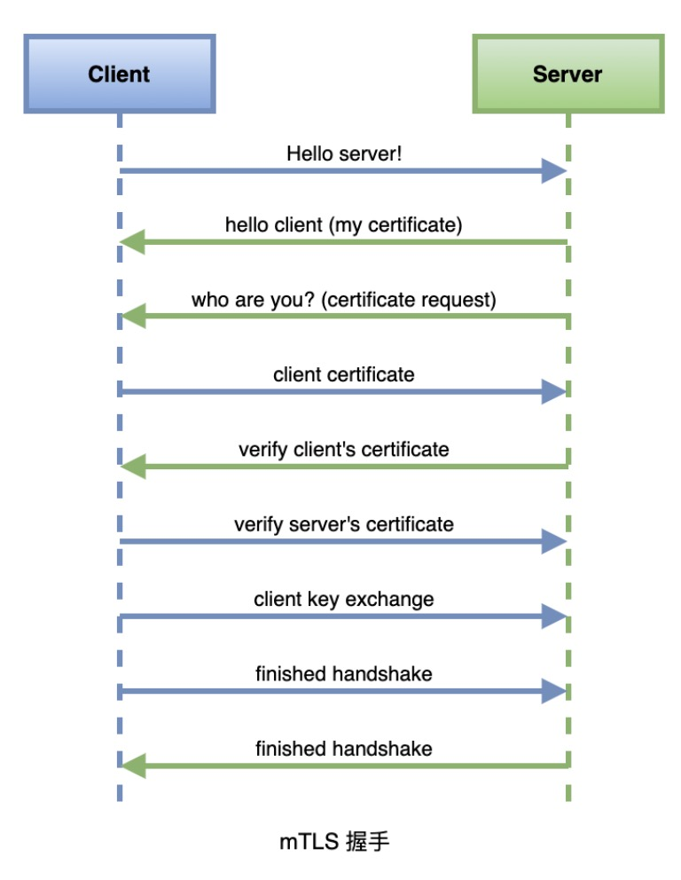
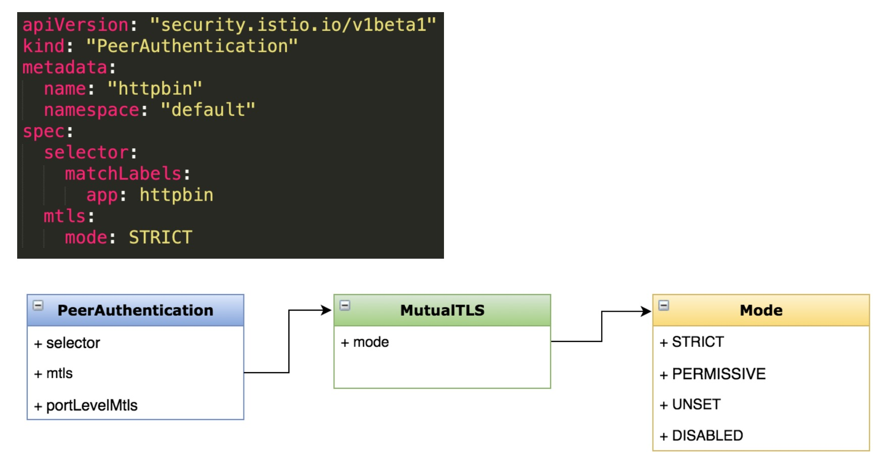

- [部署 Bookinfo](https://istio.io/latest/docs/examples/bookinfo/)

- [示例地址](https://istio.io/latest/zh/docs/tasks/security/authentication/mtls-migration/)

### 认证策略
- 认证策略的分类
  - 对等认证(PeerAuthentication)
  - 请求认证(RequestAuthentication)

- 认证策略范围 
  - 网格
  - 命名空间
  - 特定服务
    
- 优先级:最窄原则

### 任务:开启 mTLS
- 说明
  - 为网格内的服务开启自动 mTLS
  
- 目标
  - 学会配置不同级别的 mTLS 策略 
  - 理解对等认证的应用场景

### mTLS 工作原理


- TLS:客户端根据服务端证书验证其身份
- mTLS:客户端、服务端彼此都验证对方身份

### 演示
- 准备测试用的客户端(sleep)和服务端(httpbin) 
- 添加对等认证策略
- 测试基于 namespace 的 mTLS 策略

### 配置分析


### 操作
- 给default添加命名空间策略
- 兼容模式
```yaml
kubectl apply -f - <<EOF
apiVersion: "security.istio.io/v1beta1"
kind: "PeerAuthentication"
metadata:
  name: "default"
  namespace: "default"
spec:
  mtls:
    mode: PERMISSIVE
EOF
```

- 严格模式
```yaml
kubectl apply -f - <<EOF
apiVersion: "security.istio.io/v1beta1"
kind: "PeerAuthentication"
metadata:
  name: "default"
  namespace: "default"
spec:
  mtls:
    mode: STRICT
EOF
```
- 注入即可访问
> kubectl apply -f <(istioctl kube-inject -f samples/sleep/sleep.yaml) -n testauth

- 添加全局策略，只添加
```yaml
kubectl apply -f - <<EOF
apiVersion: "security.istio.io/v1beta1"
kind: "PeerAuthentication"
metadata:
  name: "default"
spec:
  mtls:
    mode: STRICT
EOF
```

### 官方示例
- 准备一个 Kubernetes 集群并部署好 Istio，不要开启全局双向 TLS （如：可以使用安装步骤中提供的 demo 配置 profile，或者将安装选项 global.mtls.enabled 设置为 false）。

#### demo 准备
- 创建如下命名空间并在其中都部署上 httpbin 和 sleep，注入 sidecar。
  - foo
  - bar

- 创建如下命名空间并在其中部署 sleep，不注入 sidecar
  - legacy

```shell
kubectl create ns foo
kubectl apply -f <(istioctl kube-inject -f samples/httpbin/httpbin.yaml) -n foo
kubectl apply -f <(istioctl kube-inject -f samples/sleep/sleep.yaml) -n foo
kubectl create ns bar
kubectl apply -f <(istioctl kube-inject -f samples/httpbin/httpbin.yaml) -n bar
kubectl apply -f <(istioctl kube-inject -f samples/sleep/sleep.yaml) -n bar
kubectl create ns legacy
kubectl apply -f samples/sleep/sleep.yaml -n legacy
```

- 使用 curl 命令）从每个 sleep pod （命名空间为 foo，bar 或 legacy）分别向 httpbin.foo 发送 http 请求。所有请求都应成功响应，返回 HTTP code 200。
> for from in "foo" "bar" "legacy"; do kubectl exec $(kubectl get pod -l app=sleep -n ${from} -o jsonpath={.items..metadata.name}) -c sleep -n ${from} -- curl http://httpbin.foo:8000/ip -s -o /dev/null -w "sleep.${from} to httpbin.foo: %{http_code}\n"; done
```text
sleep.foo to httpbin.foo: 200
sleep.bar to httpbin.foo: 200
sleep.legacy to httpbin.foo: 200
```

- 验证没有在系统中设置认证策略或目标规则（控制面板除外）：
> kubectl get policies.authentication.istio.io --all-namespaces

> kubectl get destinationrule --all-namespaces
```text
NAMESPACE   NAME          HOST          AGE
default     details       details       24h
default     productpage   productpage   24h
default     ratings       ratings       24h
default     reviews       reviews       24h
```

### 配置客户端发送双向 TLS 请求
- 设置 DestinationRule，配置 Istio 服务发送双向 TLS 请求。
```yaml
cat <<EOF | kubectl apply -n foo -f -
apiVersion: "networking.istio.io/v1alpha3"
kind: "DestinationRule"
metadata:
  name: "example-httpbin-istio-client-mtls"
spec:
  host: httpbin.foo.svc.cluster.local
  trafficPolicy:
    tls:
      mode: ISTIO_MUTUAL
EOF
```
sleep.foo 和 sleep.bar 开始向 httpbin.foo 发送双向 TLS 请求。因为 sleep.legacy 没有注入 sidecar，DestinationRule 不会对其起作用，所以 sleep.legacy 仍然向 httpbin.foo 发送明文请求。

- 现在，我们确认一下，所有发送至 httpbin.foo 的请求仍会响应成功。
> for from in "foo" "bar" "legacy"; do kubectl exec $(kubectl get pod -l app=sleep -n ${from} -o jsonpath={.items..metadata.name}) -c sleep -n ${from} -- curl http://httpbin.foo:8000/ip -s -o /dev/null -w "sleep.${from} to httpbin.foo: %{http_code}\n"; done
```text
sleep.foo to httpbin.foo: 200
sleep.bar to httpbin.foo: 200
sleep.legacy to httpbin.foo: 200
```
也可以指定一部分客户端使用 DestinationRule 中设置的 ISTIO_MUTUAL 双向 TLS 通信模式。 检查 Grafana to monitor 验证设置起效后，再扩大作用范围，最终应用到所有的 Istio 客户端服务。

### 锁定为双向 TLS
- 当所有客户端服务都成功迁移至 Istio 之后，注入 Envoy sidecar，便可以锁定 httpbin.foo 只接收双向 TLS 请求。
```yaml
cat <<EOF | kubectl apply -n foo -f -
apiVersion: "security.istio.io/v1beta1"
kind: "PeerAuthentication"
metadata:
  name: "default"
spec:
  mtls:
    mode: STRICT
EOF
```

- 此时，源自 sleep.legacy 的请求将响应失败。
> for from in "foo" "bar" "legacy"; do kubectl exec $(kubectl get pod -l app=sleep -n ${from} -o jsonpath={.items..metadata.name}) -c sleep -n ${from} -- curl http://httpbin.foo:8000/ip -s -o /dev/null -w "sleep.${from} to httpbin.foo: %{http_code}\n"; done
```text
sleep.foo to httpbin.foo: 200
sleep.bar to httpbin.foo: 200
sleep.legacy to httpbin.foo: 000
command terminated with exit code 56
```

- 如果你安装 Istio 时带有参数 values.global.proxy.privileged=true，那么你可以使用 tcpdump 来验证流量是否被加密。
> kubectl exec -n foo "$(kubectl get pod -n foo -l app=httpbin -o jsonpath={.items..metadata.name})" -c istio-proxy -it -- sudo tcpdump dst port 80  -A

当分别从 sleep.legacy 和 sleep.foo 发送请求时，您将在输出中看到纯文本和加密文本。

若无法将所有服务迁移至 Istio （注入 Envoy sidecar），则必须开启 PERMISSIVE 模式。 然而，开启 PERMISSIVE 模式时，系统默认不对明文请求进行认证或授权检查。 推荐使用 Istio 授权来为不同的请求路径配置不同的授权策略。

### 清除
- 清除所有资源。
> kubectl delete ns foo bar legacy

