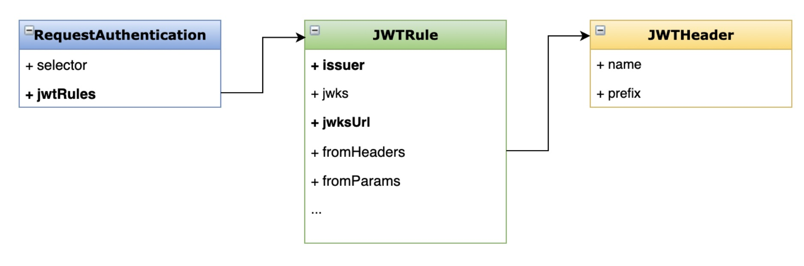
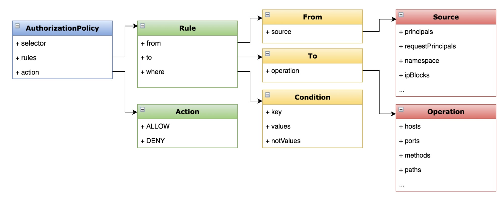
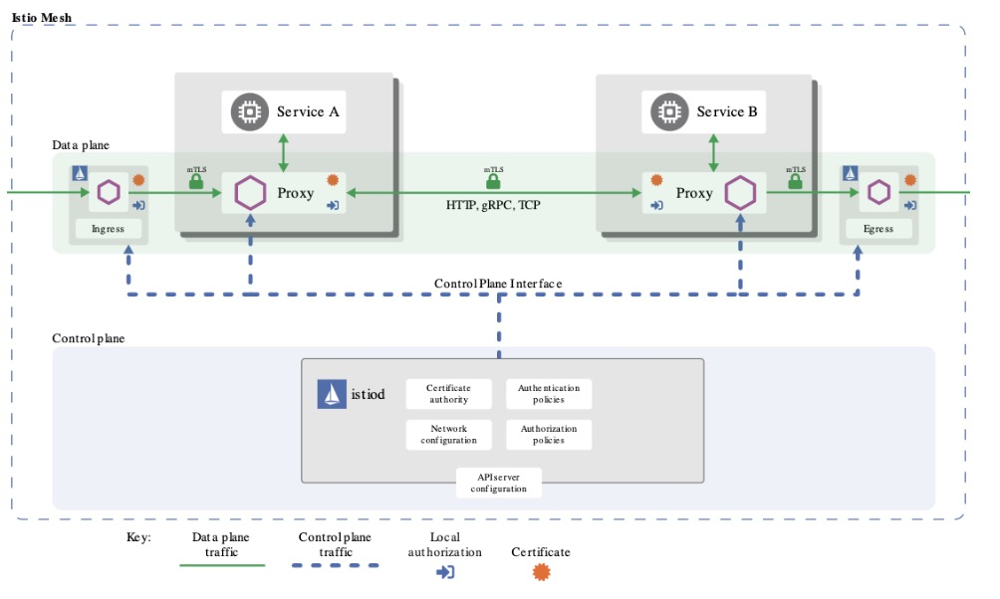

- [部署 Bookinfo](https://istio.io/latest/docs/examples/bookinfo/)

- [示例地址](https://istio.io/latest/zh/docs/tasks/security/authorization/authz-jwt/)

### 什么是 JWT
- JSON Web Token
- 以 JSON 格式传递信息 
- 应用场景
  - 授权
  - 信息交换 
- 组成部分
  - Header、payload、signature

### 添加 JWT 的授权策略
- 说明
  - 实现基于 JWT 的授权访问
- 目标
  - 学会配置 JWT 的认证与授权 
  - 了解授权策略的配置选项

### 演示
- 创建测试服务
- 配置基于 JWT 的认证策略 
- 配置 JWT 的授权策略
- 验证

### 配置分析


### 授权策略配置


### 课后练习
- 实现对特定请求来源的授权
- 提示:在授权规则(Rule.condition)中添加 request.headers 的条件判断
- [条件参考链接](https://istio.io/docs/reference/config/security/conditions/)

### 总结
-认证(authentication):you are who you say you are

- 授权(authorization):you can do what you want to do

- 验证(validation):input is correct

### Istio 的安全机制


- 透明的安全层
- CA:密钥和证书管理
- API Server:认证、授权策略分发
- Envoy:服务间安全通信(认证、加密)

### 操作
- 创建命名空间
> kubectl create ns testjwt

- 创建请求认证
```yaml
kubectl apply -f - <<EOF
apiVersion: "security.istio.io/v1beta1"
kind: "RequestAuthentication"
metadata:
  name: "jwt-example"
  namespace: testjwt
spec:
  selector:
    matchLabels:
      app: httpbin
  jwtRules:
  - issuer: "testing@secure.istio.io"
    jwksUri: "https://raw.githubusercontent.com/LCY2013/thinking-in-go/0e6e7e7ed1a8e7a5b2022aa9d44743de5baa2ec6/cicd/istio/jwks.json"
EOF
```

- 测试不合法的jwt访问
> kubectl exec $(kubectl get pod -l app=sleep -n foo -o jsonpath={.items..metadata.name}) -c sleep -n testjwt -- curl "http://httpbin.testjwt:8000/headers" -H "Authorization: Bearer invalidToken"

- 测试没有授权策略时，都可以访问
> kubectl exec $(kubectl get pod -l app=sleep -n foo -o jsonpath={.items..metadata.name}) -c sleep -n testjwt -- curl "http://httpbin.testjwt:8000/headers" -s -o /dev/null -w "%{http_code}\n"

- 创建授权策略
```yaml
kubectl apply -f - <<EOF
apiVersion: security.istio.io/v1beta1
kind: AuthorizationPolicy
metadata:
  name: require-jwt
  namespace: testjwt
spec:
  selector:
    matchLabels:
      app: httpbin
  action: ALLOW
  rules:
  - from:
    - source:
       requestPrincipals: ["testing@secure.istio.io/testing@secure.istio.io"]
EOF
```

- 解析token
> TOKEN=$(curl https://raw.githubusercontent.com/malphi/geektime-servicemesh/master/c3-19/demo.jwt -s) && echo $TOKEN | cut -d '.' -f2 - | base64 --decode -

- 测试带token的请求
> kubectl exec $(kubectl get pod -l app=sleep -n foo -o jsonpath={.items..metadata.name}) -c sleep -n testjwt -- curl "http://httpbin.foo:8000/headers" -s -o /dev/null -H "Authorization: Bearer $TOKEN" -w "%{http_code}\n"

### 官方示例
- 在开始这个任务之前，请先完成以下操作： 
  - 阅读授权和身份验证的相关内容。

  - 参照 Istio 安装向导 安装 Istio。

  - 部署两个工作负载（workload）：httpbin 和 sleep。将它们部署在同一个命名空间中，例如 foo。每个工作负载都在前面运行一个 Envoy 代理。 你可以使用以下命令来部署它们：
  > kubectl create ns foo

  > kubectl apply -f <(istioctl kube-inject -f samples/httpbin/httpbin.yaml) -n foo

  > kubectl apply -f <(istioctl kube-inject -f samples/sleep/sleep.yaml) -n foo

  - 使用下面的命令验证 sleep 能够正常访问 httpbin 服务：
  > kubectl exec "$(kubectl get pod -l app=sleep -n foo -o jsonpath={.items..metadata.name})" -c sleep -n foo -- curl http://httpbin.foo:8000/ip -sS -o /dev/null -w "%{http_code}\n"
  
```text
200
```

### 允许包含有效 JWT 和 列表类型声明的请求
- 以下命令为 foo 命名空间下的 httpbin 工作负载创建一个名为 jwt-example 的身份验证策略。这个策略使得 httpbin 工作负载接收 Issuer 为 testing@secure.istio.io 的 JWT 令牌：
```yaml
kubectl apply -f - <<EOF
apiVersion: "security.istio.io/v1beta1"
kind: "RequestAuthentication"
metadata:
  name: "jwt-example"
  namespace: foo
spec:
  selector:
    matchLabels:
      app: httpbin
  jwtRules:
  - issuer: "testing@secure.istio.io"
    jwksUri: "https://raw.githubusercontent.com/istio/istio/release-1.10/security/tools/jwt/samples/jwks.json"
EOF
```

- 验证使用无效 JWT 的请求被拒绝：
> kubectl exec "$(kubectl get pod -l app=sleep -n foo -o jsonpath={.items..metadata.name})" -c sleep -n foo -- curl "http://httpbin.foo:8000/headers" -sS -o /dev/null -H "Authorization: Bearer invalidToken" -w "%{http_code}\n"
```text
401
```

- 验证没有 JWT 令牌的请求被允许，因为以上策略不包含授权策略：
> kubectl exec "$(kubectl get pod -l app=sleep -n foo -o jsonpath={.items..metadata.name})" -c sleep -n foo -- curl "http://httpbin.foo:8000/headers" -sS -o /dev/null -w "%{http_code}\n"
```text
200
```

- 以下命令为 foo 命名空间下的 httpbin 工作负载创建一个名为 require-jwt 的授权策略。 这个策略要求所有发往 httpbin 服务的请求都要包含一个将 requestPrincipal 设置为 testing@secure.istio.io/testing@secure.istio.io 的有效 JWT。Istio 使用 / 连接 JWT 令牌的 iss 和 sub 以组成 requestPrincipal 字段。
```yaml
kubectl apply -f - <<EOF
apiVersion: security.istio.io/v1beta1
kind: AuthorizationPolicy
metadata:
  name: require-jwt
  namespace: foo
spec:
  selector:
    matchLabels:
      app: httpbin
  action: ALLOW
  rules:
  - from:
    - source:
       requestPrincipals: ["testing@secure.istio.io/testing@secure.istio.io"]
EOF
```

- 获取 iss 和 sub 都为 testing@secure.istio.io 的 JWT。这会让 Istio 生成的 requestPrincipal 属性值为 testing@secure.istio.io/testing@secure.istio.io：
> TOKEN=$(curl https://raw.githubusercontent.com/istio/istio/release-1.10/security/tools/jwt/samples/demo.jwt -s) && echo "$TOKEN" | cut -d '.' -f2 - | base64 --decode -
```text
{"exp":4685989700,"foo":"bar","iat":1532389700,"iss":"testing@secure.istio.io","sub":"testing@secure.istio.io"}
```

- 验证使用有效 JWT 的请求被允许：
> kubectl exec "$(kubectl get pod -l app=sleep -n foo -o jsonpath={.items..metadata.name})" -c sleep -n foo -- curl "http://httpbin.foo:8000/headers" -sS -o /dev/null -H "Authorization: Bearer $TOKEN" -w "%{http_code}\n"
```text
200
```

- 验证没有 JWT 的请求被拒绝：
> kubectl exec "$(kubectl get pod -l app=sleep -n foo -o jsonpath={.items..metadata.name})" -c sleep -n foo -- curl "http://httpbin.foo:8000/headers" -sS -o /dev/null -w "%{http_code}\n"
```text
403
```

- 以下命令更新 require-jwt 授权策略，使其同时要求 JWT 包含一个名为 groups 值为 group1 的声明：
```yaml
kubectl apply -f - <<EOF
apiVersion: security.istio.io/v1beta1
kind: AuthorizationPolicy
metadata:
  name: require-jwt
  namespace: foo
spec:
  selector:
    matchLabels:
      app: httpbin
  action: ALLOW
  rules:
  - from:
    - source:
       requestPrincipals: ["testing@secure.istio.io/testing@secure.istio.io"]
    when:
    - key: request.auth.claims[groups]
      values: ["group1"]
EOF
```
> 除非声明本身包含引号，否则请勿在 request.auth.claims 字段包含引号。

- 获取 groups 声明列表为 group1 和 group2 的 JWT：
> TOKEN_GROUP=$(curl https://raw.githubusercontent.com/istio/istio/release-1.10/security/tools/jwt/samples/groups-scope.jwt -s) && echo "$TOKEN_GROUP" | cut -d '.' -f2 - | base64 --decode -
```text
{"exp":3537391104,"groups":["group1","group2"],"iat":1537391104,"iss":"testing@secure.istio.io","scope":["scope1","scope2"],"sub":"testing@secure.istio.io"}
```

- 验证包含 JWT 且 JWT 中包含名为 groups 值为 group1 声明的请求被允许：
> kubectl exec "$(kubectl get pod -l app=sleep -n foo -o jsonpath={.items..metadata.name})" -c sleep -n foo -- curl "http://httpbin.foo:8000/headers" -sS -o /dev/null -H "Authorization: Bearer $TOKEN_GROUP" -w "%{http_code}\n"
```text
200
```

- 验证包含 JWT，但 JWT 不包含 groups 声明的请求被拒绝：
> kubectl exec "$(kubectl get pod -l app=sleep -n foo -o jsonpath={.items..metadata.name})" -c sleep -n foo -- curl "http://httpbin.foo:8000/headers" -sS -o /dev/null -H "Authorization: Bearer $TOKEN" -w "%{http_code}\n"
```text
403
```

### 清理
- 删除 foo 命名空间：
> kubectl delete namespace foo
