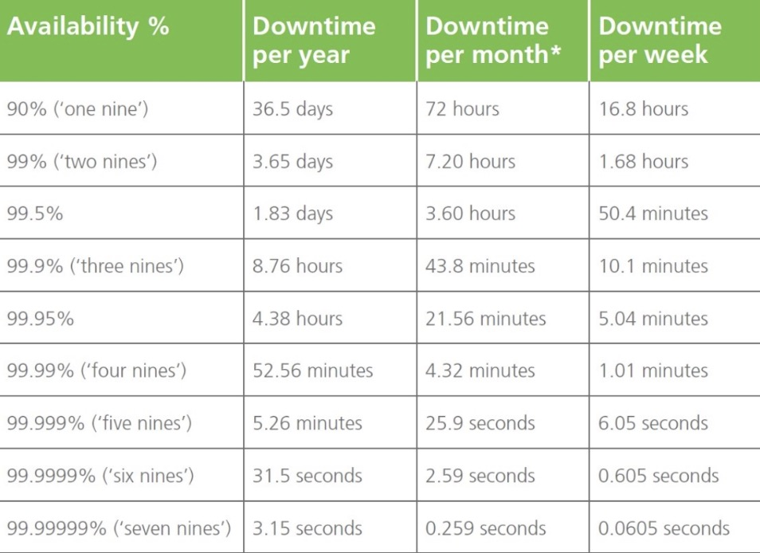
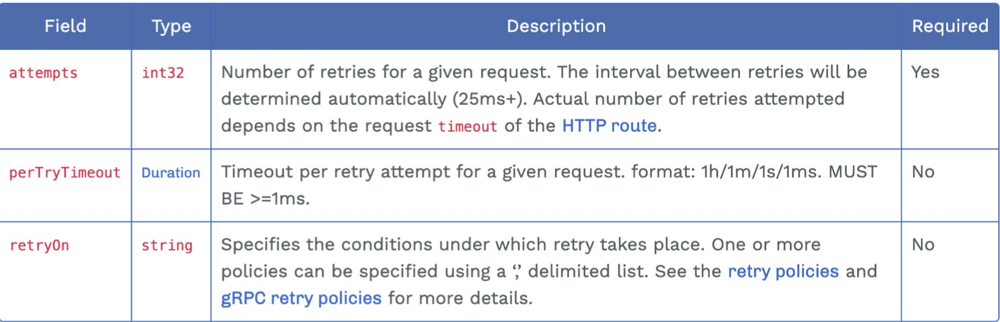
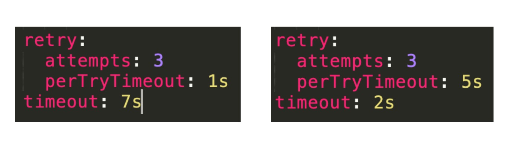
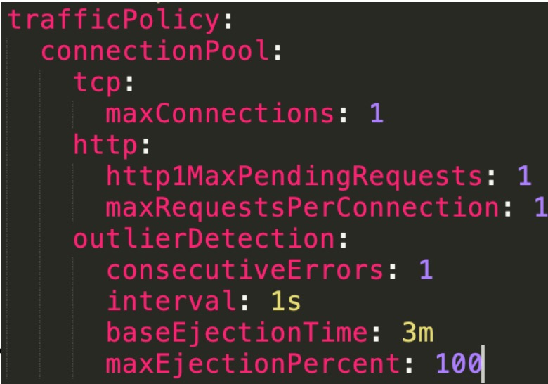

[熔断](https://istio.io/latest/zh/docs/tasks/traffic-management/circuit-breaking/)

[超时](https://istio.io/latest/zh/docs/tasks/traffic-management/request-timeouts/)

[故障注入](https://istio.io/latest/zh/docs/tasks/traffic-management/fault-injection/)

### 系统可用性度量

- 服务级别协议(SLA – Service Level Agreement) 
  
- 可用性计算公式
  




### 弹性设计
- 应对故障的一种方法，让系统具有容错和适应能力 
- 防止故障(Fault)转化为失败(Failure)
- 主要包括:
  - 容错性:重试、幂等
  - 伸缩性:自动水平扩展(autoscaling) 
  - 过载保护:超时、熔断、降级、限流
  - 弹性测试:故障注入

### Istio 的弹性能力
- 超时
- 重试
- 熔断
- 故障注入

### 重试配置项


- x-envoy-retry-on: 5xx, gateway-error, reset, connect-failure...
- x-envoy-retry-grpc-on: cancelled, deadline-exceeded, internal, unavailable...

### 超时配置规则
- timeout & retries.perTryTimout 同时存在时
- 超时生效 = min (timeout, retry.perTryTimout * retry.attempts)



### 熔断配置
- TCP 和 HTTP 连接池大小为 1
- 只容许出错 1 次
- 每秒 1 次请求计数
- 可以从负载池中移除全部 pod
- 发生故障的 pod 移除 3m 之后才能再次加入



### 实战任务
- 为 demo 应用提供弹性能力 
- 配置超时
- 配置重试 
- 配置熔断

### order
- 正常vs
```yaml
apiVersion: networking.istio.io/v1alpha3
kind: VirtualService
metadata:
  name: httpbin
  namespace: demo
spec:
  hosts:
  - "*"
  gateways:
  - httpbin-gateway
  http:
  - route:
    - destination:
        host: httpbin
        port:
          number: 8000
```

- 超时
```yaml
apiVersion: networking.istio.io/v1alpha3
kind: VirtualService
metadata:
  name: httpbin
  namespace: demo
spec:
  hosts:
    - "*"
  gateways:
    - httpbin-gateway
  http:
    - route:
        - destination:
            host: httpbin
            port:
              number: 8000
      timeout: 1s
```

- 重试
```yaml
apiVersion: networking.istio.io/v1alpha3
kind: VirtualService
metadata:
  name: httpbin
  namespace: demo
spec:
  hosts:
  - "*"
  gateways:
  - httpbin-gateway
  http:
  - route:
    - destination:
        host: httpbin
        port:
          number: 8000
    retry:
      attempts: 3
      perTryTimeout: 1s
    timeout: 8s
```

- 熔断
```yaml
apiVersion: networking.istio.io/v1alpha3
kind: DestinationRule
metadata:
  name: httpbin
  namespace: demo
spec:
  host: httpbin
  trafficPolicy:
    connectionPool:
      tcp:
        maxConnections: 1
      http:
        http1MaxPendingRequests: 1
        maxRequestsPerConnection: 1
      outlierDetection:
        consecutiveErrors: 1
        interval: 1s
        baseEjectionTime: 3m
        maxEjectionPercent: 100
```


