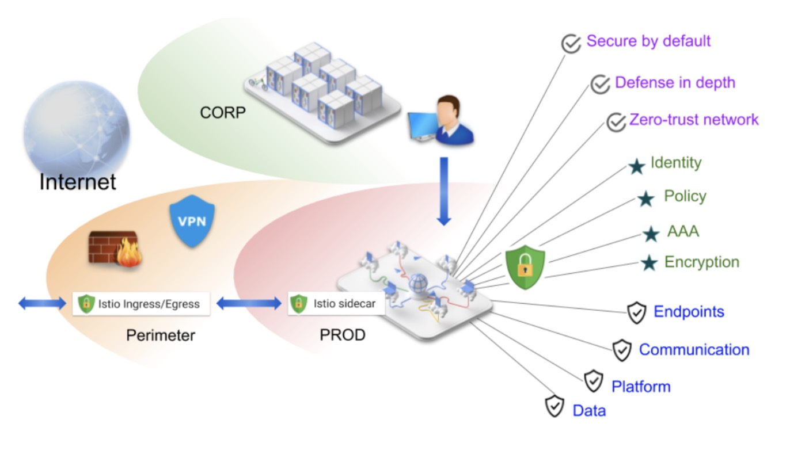
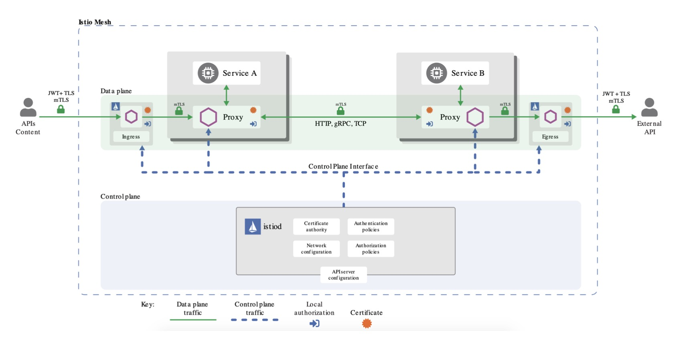
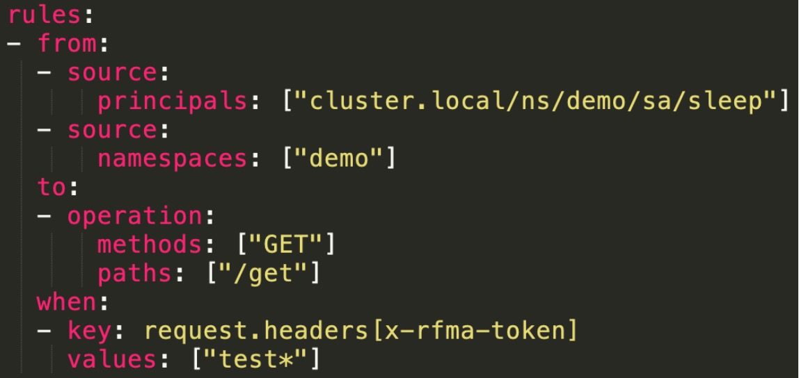

[官方地址](https://istio.io/latest/zh/docs/tasks/security/)

### Istio 的安全解决方案


### Istio 安全架构


### 实战任务
多样化授权

- 特定服务

- 特定来源 

- 特定接口 

- 特殊条件

### 配置分析


- 来源(source):
  - principal/namespace/ipBlock
    
- 操作(to):
  - host/method/path
    
- 条件(when): 
  - request
  - source/destination

### order
- 在fufeng命名空间下启动istio的sidecar自动注入
> kubectl label namespace fufeng istio-injection=enabled

- 创建应用
```yaml
apiVersion: v1
kind: ServiceAccount
metadata:
  name: httpbin
  namespace: fufeng
---
apiVersion: v1
kind: Service
metadata:
  name: httpbin
  namespace: fufeng
  labels:
    app: httpbin
    service: httpbin
spec:
  ports:
  - name: http
    port: 8000
    targetPort: 80
  selector:
    app: httpbin
---
apiVersion: apps/v1
kind: Deployment
metadata:
  name: httpbin
  namespace: fufeng
spec:
  replicas: 1
  selector:
    matchLabels:
      app: httpbin
      version: v1
  template:
    metadata:
      labels:
        app: httpbin
        version: v1
    spec:
      serviceAccountName: httpbin
      containers:
      - image: docker.io/kennethreitz/httpbin
        imagePullPolicy: IfNotPresent
        name: httpbin
        ports:
        - containerPort: 80
---
apiVersion: apps/v1
kind: Deployment
metadata:
  name: httpbin-v2
  namespace: fufeng
spec:
  replicas: 1
  selector:
    matchLabels:
      app: httpbin-v2
      version: v2
  template:
    metadata:
      labels:
        app: httpbin-v2
        version: v2
    spec:
      serviceAccountName: httpbin
      containers:
        - image: docker.io/kennethreitz/httpbin
          imagePullPolicy: IfNotPresent
          name: httpbin-v2
          ports:
            - containerPort: 80
---
apiVersion: v1
kind: ServiceAccount
metadata:
  name: sleep
  namespace: fufeng
---
apiVersion: v1
kind: Service
metadata:
  name: sleep
  namespace: fufeng
  labels:
    app: sleep
    service: sleep
spec:
  ports:
    - port: 80
      name: http
  selector:
    app: sleep
---
apiVersion: apps/v1
kind: Deployment
metadata:
  name: sleep
  namespace: fufeng
spec:
  replicas: 1
  selector:
    matchLabels:
      app: sleep
  template:
    metadata:
      namespace: fufeng
      labels:
        app: sleep
    spec:
      terminationGracePeriodSeconds: 0
      serviceAccountName: sleep
      containers:
        - name: sleep
          image: curlimages/curl
          command: ["/bin/sleep", "3650d"]
          imagePullPolicy: IfNotPresent
          volumeMounts:
            - mountPath: /etc/sleep/tls
              name: secret-volume
      volumes:
        - name: secret-volume
          secret:
            secretName: sleep-secret
            optional: true
---
apiVersion: v1
kind: ServiceAccount
metadata:
  name: sleep
  namespace: ff
---
apiVersion: v1
kind: Service
metadata:
  name: sleep
  namespace: ff
  labels:
    app: sleep
    service: sleep
spec:
  ports:
    - port: 80
      name: http
  selector:
    app: sleep
---
apiVersion: apps/v1
kind: Deployment
metadata:
  name: sleep
  namespace: ff
spec:
  replicas: 1
  selector:
    matchLabels:
      app: sleep
  template:
    metadata:
      namespace: ff
      labels:
        app: sleep
    spec:
      terminationGracePeriodSeconds: 0
      serviceAccountName: sleep
      containers:
        - name: sleep
          image: curlimages/curl
          command: ["/bin/sleep", "3650d"]
          imagePullPolicy: IfNotPresent
          volumeMounts:
            - mountPath: /etc/sleep/tls
              name: secret-volume
      volumes:
        - name: secret-volume
          secret:
            secretName: sleep-secret
            optional: true
```

- 创建授权 - 特定服务，注意没有rule，表示deny当前服务
```yaml
kubectl apply -f - <<EOF
apiVersion: security.istio.io/v1beta1
kind: AuthorizationPolicy
metadata:
  name: httpbin
  namespace: fufeng
spec:
  selector:
    matchLabels:
      app: httpbin
EOF
```
> 不通过：kubectl exec -it -n fufeng sleep-6bdb595bcb-wg6bc -c sleep -- curl "http://httpbin.fufeng:8000/get"

> 通过：kubectl exec -it -n fufeng sleep-6bdb595bcb-wg6bc -c sleep -- curl "http://httpbin-v2.fufeng:8000/get"

- 来源必须是fufeng ns
```yaml
apiVersion: security.istio.io/v1beta1
kind: AuthorizationPolicy
metadata:
 name: httpbin
 namespace: fufeng
spec:
 action: ALLOW
 rules:
 - from:
   - source:
       principals: ["cluster.local/ns/fufeng/sa/sleep"]
   - source:
       namespaces: ["fufeng"]
```
> 通过：kubectl exec -it -n fufeng sleep-6bdb595bcb-wg6bc -c sleep -- curl "http://httpbin.fufeng:8000/get"

> 不通过： kubectl exec -it -n ff sleep-57ddb67999-bwbkq -c sleep -- curl "http://httpbin.fufeng:8000/get"

> 修改service account ff, 通过

- 只容许特定接口
```yaml
kubectl apply -f - <<EOF
apiVersion: security.istio.io/v1beta1
kind: AuthorizationPolicy
metadata:
 name: httpbin
 namespace: fufeng
spec:
 action: ALLOW
 rules:
 - from:
   - source:
       principals: ["cluster.local/ns/fufeng/sa/sleep"]
   - source:
       namespaces: ["fufeng"]
   to:
   - operation:
       methods: ["GET"]
       paths: ["/get"]
EOF
```
> 通过：kubectl exec -it -n fufeng sleep-6bdb595bcb-wg6bc -c sleep -- curl "http://httpbin.fufeng:8000/get"

> 不通： kubectl exec -it -n fufeng sleep-6bdb595bcb-wg6bc -c sleep -- curl "http://httpbin.fufeng:8000/ip"

- 其他特定条件 - 请求头
```yaml
kubectl apply -f - <<EOF
apiVersion: security.istio.io/v1beta1
kind: AuthorizationPolicy
metadata:
 name: httpbin
 namespace: fufeng
spec:
 action: ALLOW
 rules:
 - from:
   - source:
       principals: ["cluster.local/ns/fufeng/sa/sleep"]
   - source:
       namespaces: ["fufeng"]
   to:
   - operation:
       methods: ["GET"]
       paths: ["/get"]
   when:
   - key: request.headers[x-rfma-token]
     values: ["test*"]
EOF
```
> 不通过：kubectl exec -it -n fufeng sleep-6bdb595bcb-wg6bc -c sleep -- curl "http://httpbin.fufeng:8000/get"

> 加token通过：kubectl exec -it -n fufeng sleep-6bdb595bcb-wg6bc -c sleep -- curl "http://httpbin.fufeng:8000/get" -H x-rfma-token:test1


