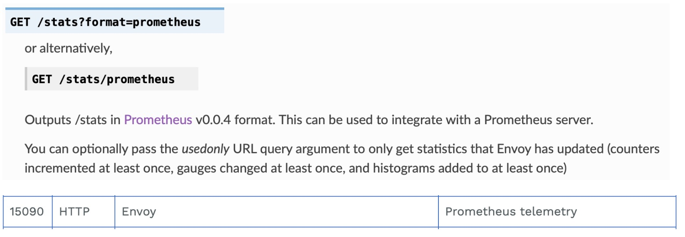
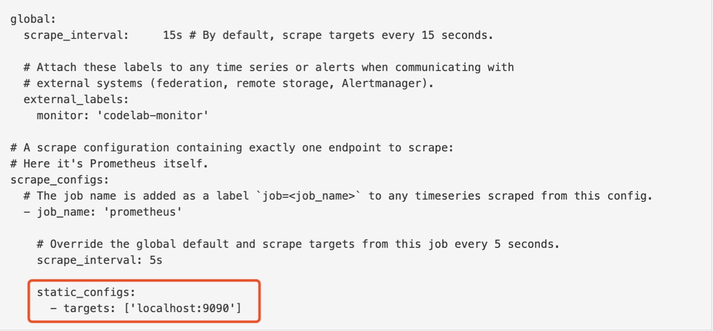

### Istio 的指标接口
- /metrics

- /stats/prometheus


### Prometheus 配置方式
- 静态配置:


### Prometheus 的服务发现机制
- kubernetes_sd_config - role
  - node:集群节点
  - service:服务，常用于黑盒监控 
  - pod:以pod中容器为目标
  - endpoints:端点
  - ingress:入口网关
- relabel_configs 过滤机制

### 任务
- 集成现有 Prometheus
- 整合 Grafana
  - 添加数据源
  - 导入 Dashboard

### order

> kubectl exec -it -n fufeng sleep-68f7df5556-t5n7n -c sleep -- curl http://httpbin.fufeng:15090/stats/prometheus

> kubectl get svc -n istio-system

- 部署prometheus和grafana
```yaml
apiVersion: extensions/v1beta1
kind: Deployment
metadata:
  name: prometheus
  namespace: monitoring
  labels:
    app: prometheus
spec:
  template:
    metadata:
      labels:
        app: prometheus
    spec:
      serviceAccount: appmesh-prometheus
      serviceAccountName: appmesh-prometheus
      containers:
      - image: prom/prometheus:v2.13.1
        name: prometheus
        command:
        - "/bin/prometheus"
        args:
        - "--config.file=/etc/prometheus/prometheus.yml"
        - "--storage.tsdb.path=/prometheus"
        - "--storage.tsdb.retention=24h"
        - "--web.enable-admin-api"  
        - "--web.enable-lifecycle"  
        ports:
        - containerPort: 9090
          protocol: TCP
          name: http
        volumeMounts:
        - mountPath: /etc/prometheus
          name: config-volume
        - mountPath: /prometheus/data
          name: data-volume
        resources:
          requests:
            cpu: 100m
            memory: 512Mi
          limits:
            cpu: 100m
            memory: 512Mi
      securityContext:
        runAsUser: 0
      volumes:
      - configMap:
          name: prometheus-config
        name: config-volume
      - emptyDir: {}
        name: data-volume
---
apiVersion: v1
kind: Service
metadata:
  name: prometheus
  namespace: monitoring
  labels:
    app: prometheus
spec:
  selector:
    app: prometheus
  type: NodePort
  ports:
    - name: web
      port: 9090
      targetPort: http
```

- 普通prometheus配置
```yaml
apiVersion: v1
kind: ConfigMap
metadata:
  name: prometheus-config
  namespace: monitoring
data:
  prometheus.yml: |
    global:
      scrape_interval: 15s
      scrape_timeout: 15s
    scrape_configs:
    - job_name: 'prometheus'
      static_configs:
      - targets: ['localhost:9090']
```

- prometheus 配置istio相关
```yaml
apiVersion: v1
kind: ConfigMap
metadata:
  name: prometheus-config
  namespace: monitoring
data:
  prometheus.yml: |-
    global:
      scrape_interval: 15s
      scrape_timeout: 15s
    scrape_configs:
    - job_name: 'prometheus'
      static_configs:
      - targets: ['localhost:9090']

    - job_name: envoy-stats
      honor_timestamps: true
      metrics_path: /stats/prometheus
      scheme: http
      kubernetes_sd_configs:
      - role: pod
      relabel_configs:
      - source_labels: [__meta_kubernetes_pod_container_port_name]
        separator: ;
        regex: .*-envoy-prom
        replacement: $1
        action: keep
      - source_labels: [__address__, __meta_kubernetes_pod_annotation_prometheus_io_port]
        separator: ;
        regex: ([^:]+)(?::\d+)?;(\d+)
        target_label: __address__
        replacement: $1:15090
        action: replace
      - separator: ;
        regex: __meta_kubernetes_pod_label_(.+)
        replacement: $1
        action: labeldrop
      - source_labels: [__meta_kubernetes_namespace]
        separator: ;
        regex: (.*)
        target_label: namespace
        replacement: $1
        action: replace
      - source_labels: [__meta_kubernetes_pod_name]
        separator: ;
        regex: (.*)
        target_label: pod_name
        replacement: $1
        action: replace  
```

- grafana
```yaml
apiVersion: apps/v1
kind: Deployment
metadata:
  labels:
    app: grafana
  name: grafana
  namespace: monitoring
spec:
  replicas: 1
  selector:
    matchLabels:
      app: grafana
  template:
    metadata:
      labels:
        app: grafana
    spec:
      containers:
      - name: grafana
        image: grafana/grafana:latest
        imagePullPolicy: IfNotPresent
        ports:
        - containerPort: 3000
          name: grafana
        env:
        - name: GRAFANA_PORT
          value: "3000"
        - name: GF_AUTH_BASIC_ENABLED
          value: "false"
        - name: GF_AUTH_ANONYMOUS_ENABLED
          value: "true"
        - name: GF_AUTH_ANONYMOUS_ORG_ROLE
          value: Admin
        resources:
          limits:
            cpu: 100m
            memory: 256Mi
          requests:
            cpu: 100m
            memory: 256Mi
        volumeMounts:
          - mountPath: /var/lib/grafana
            name: grafana-storage
      volumes:
        - name: grafana-storage
          emptyDir: {}
---
apiVersion: v1
kind: Service
metadata:
  name: grafana
  namespace: monitoring
  labels:
    app: grafana
spec:
  selector:
    app: grafana
  type: NodePort
  ports:
    - name: http
      port: 3000
      targetPort: 3000
      nodePort: 32000
---
apiVersion: v1
kind: ServiceAccount
metadata:
  name: grafana
  namespace: monitoring
```
