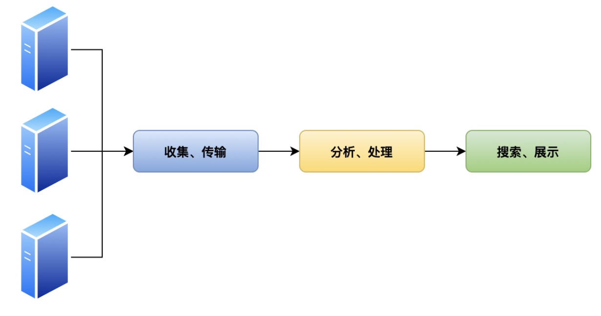
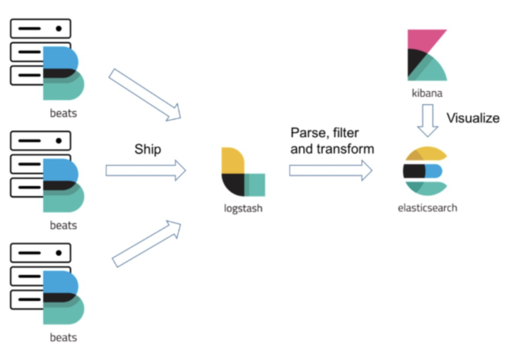
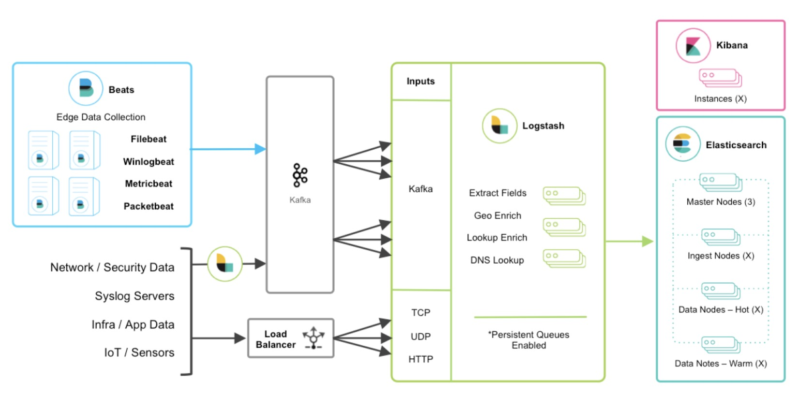

### 集中式日志架构


主要功能: 
- 收集 
  
- 处理

- 展示

### ELK Stack 日志架构


- ElasticSearch 
- Logstash
- Kibana
- LibBeats

### ELK 部署形态


### 任务
- 安装ELK套件
- 通过 ELK 完成 Envoy 日志的收集和检索

### 总结
- 集中式日志系统
- ELK Stack 的部署
- 检索 Envoy 日志

### order

> kubectl create ns elk

- ELK
```yaml
kubectl apply -n elk -f - <<EOF
kind: List
apiVersion: v1
items:
- apiVersion: apps/v1
  kind: Deployment
  metadata:
    name: kibana
  spec:
    replicas: 1
    selector:
      matchLabels:
        app: kibana
    template:
      metadata:
        name: kibana
        labels:
          app: kibana
      spec:
        containers:
        - image: docker.elastic.co/kibana/kibana:6.4.0
          name: kibana
          env:
          - name: ELASTICSEARCH_URL
            value: "http://elasticsearch:9200"
          ports:
          - name: http
            containerPort: 5601
- apiVersion: v1
  kind: Service
  metadata:
    name: kibana
  spec:
    type: NodePort
    ports:
    - name: http
      port: 5601
      targetPort: 5601 
      nodePort: 32001
    selector:
      app: kibana            
- apiVersion: apps/v1
  kind: Deployment
  metadata:
    name: elasticsearch
  spec:
    replicas: 1
    selector:
      matchLabels:
        app: elasticsearch
    template:
      metadata:
        name: elasticsearch
        labels:
          app: elasticsearch
      spec:
        containers:
        - image: docker.elastic.co/elasticsearch/elasticsearch:6.4.0
          name: elasticsearch
          env:
          #- name: network.host
          #  value: "_site_"
          - name: node.name
            value: "${HOSTNAME}"
          - name: discovery.zen.ping.unicast.hosts
            value: "${ELASTICSEARCH_NODEPORT_SERVICE_HOST}"
          - name: cluster.name
            value: "test-single"
          - name: ES_JAVA_OPTS
            value: "-Xms128m -Xmx128m"
          volumeMounts:
          - name: es-data
            mountPath: /usr/share/elasticsearch/data
        volumes:
          - name: es-data
            emptyDir: {}
- apiVersion: v1
  kind: Service
  metadata: 
    name: elasticsearch-nodeport
  spec:
    type: NodePort
    ports:
    - name: http
      port: 9200
      targetPort: 9200
      nodePort: 32002
    - name: tcp
      port: 9300
      targetPort: 9300
      nodePort: 32003
    selector:
      app: elasticsearch
- apiVersion: v1
  kind: Service
  metadata:
    name: elasticsearch
  spec:
    clusterIP: None
    ports:
    - name: http
      port: 9200
    - name: tcp
      port: 9300
    selector:
      app: elasticsearch
EOF
```

- filebeat
```yaml
kubectl apply -n elk -f - <<EOF
kind: List
apiVersion: v1
items:
- apiVersion: v1
  kind: ConfigMap
  metadata:
    name: filebeat-config
    labels:
      k8s-app: filebeat
      kubernetes.io/cluster-service: "true"
      app: filebeat-config
  data:
    filebeat.yml: |
      processors:
        - add_cloud_metadata:
      filebeat.modules:
      - module: system
      filebeat.inputs:
      - type: log
        paths:
          - /var/log/containers/*.log
        symlinks: true
      output.elasticsearch:
        hosts: ['elasticsearch:9200']
      logging.level: info        
- apiVersion: apps/v1
  kind: Deployment 
  metadata:
    name: filebeat
    labels:
      k8s-app: filebeat
      kubernetes.io/cluster-service: "true"
  spec:
    replicas: 1
    selector:
      matchLabels:
        app: filebeat
    template:
      metadata:
        name: filebeat
        labels:
          app: filebeat
          k8s-app: filebeat
          kubernetes.io/cluster-service: "true"
      spec:
        containers:
        - image: docker.elastic.co/beats/filebeat:6.4.0
          name: filebeat
          args: [
            "-c", "/home/filebeat-config/filebeat.yml",
            "-e",
          ]
          securityContext:
            runAsUser: 0
          volumeMounts:
          - name: filebeat-storage
            mountPath: /var/log/containers
          - name: varlogpods
            mountPath: /var/log/pods
          - name: varlibdockercontainers
            mountPath: /var/lib/docker/containers
          - name: "filebeat-volume"
            mountPath: "/home/filebeat-config"
        volumes:
          - name: filebeat-storage
            hostPath:
              path: /var/log/containers
          - name: varlogpods
            hostPath:
              path: /var/log/pods
          - name: varlibdockercontainers
            hostPath:
              path: /var/lib/docker/containers
          - name: filebeat-volume
            configMap:
              name: filebeat-config
- apiVersion: rbac.authorization.k8s.io/v1beta1
  kind: ClusterRoleBinding
  metadata:
    name: filebeat
  subjects:
  - kind: ServiceAccount
    name: filebeat
    namespace: elk
  roleRef:
    kind: ClusterRole
    name: filebeat
    apiGroup: rbac.authorization.k8s.io
- apiVersion: rbac.authorization.k8s.io/v1beta1
  kind: ClusterRole
  metadata:
    name: filebeat
    labels:
      k8s-app: filebeat
  rules:
  - apiGroups: [""] # "" indicates the core API group
    resources:
    - namespaces
    - pods
    verbs:
    - get
    - watch
    - list
- apiVersion: v1
  kind: ServiceAccount
  metadata:
    name: filebeat
    namespace: elk
    labels:
      k8s-app: filebeat
EOF
```
