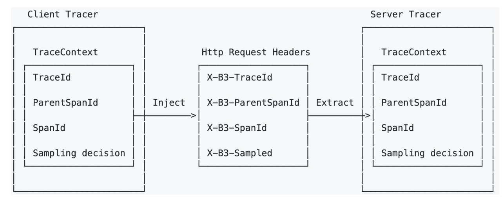
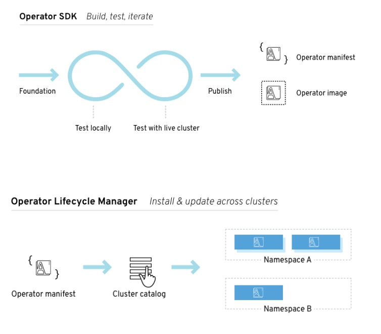

### Istio 的分布式追踪
- 基于 Envoy 实现
- 应用负责传递追踪头信息(b3 trace header)
  - https://github.com/openzipkin/b3-propagation 
- 支持采样率


### 理解 Operator
- 部署和管理 Kubernetes 应用的工具包
- 部署在集群中，使用 Kubernetes API 管理应用
- Operator Framework
  - Operator SDK
  - Operator Lifecycle Manager



### 任务
- 利用 Operator 安装 Jaeger
- 和 Istio 集成
- 自动注入 Jaeger agent
  - Deployment
  - Namespace 
- 测试

### order
- clone repo
> https://github.com/jaegertracing/jaeger-operator.git

- 修改watch namespace 为空
> WATCH_NAMESPACE =

- install crd
> kubectl create -f https://raw.githubusercontent.com/jaegertracing/jaeger-operator/master/deploy/crds/jaegertracing.io_jaegers_crd.yaml

- 创建 ns
> kubectl create ns observability

- 1. install operator
> kubectl create -n observability -f https://raw.githubusercontent.com/jaegertracing/jaeger-operator/master/deploy/service_account.yaml

> kubectl create -n observability -f https://raw.githubusercontent.com/jaegertracing/jaeger-operator/master/deploy/role.yaml

> kubectl create -n observability -f https://raw.githubusercontent.com/jaegertracing/jaeger-operator/master/deploy/role_binding.yaml

> kubectl create -n observability -f https://raw.githubusercontent.com/jaegertracing/jaeger-operator/master/deploy/operator.yaml

- install cluster role
> kubectl create -f https://raw.githubusercontent.com/jaegertracing/jaeger-operator/master/deploy/cluster_role.yaml

> kubectl create -f https://raw.githubusercontent.com/jaegertracing/jaeger-operator/master/deploy/cluster_role_binding.yaml

- apply jaeger
> kubectl apply -f examples/simplest.yaml -n observability

- 2. 集成istio
> --set values.global.tracer.zipkin.address=<jaeger-collector-service>.<jaeger-collector-namespace>:9411
```shell
istioctl manifest apply \
--set values.global.tracer.zipkin.address=simplest-collector.observability:9411 \
--set values.tracing.ingress.enabled=true \
--set values.pilot.traceSampling=100
```
> 重启pod

- 添加注入agent
```yaml
sidecar.jaegertracing.io/inject: "true"
```
> kubectl patch deployment productpage-v1 -p "{\"spec\":{\"template\":{\"metadata\":{\"labels\":{\"date\":\"`date +'%s'`\"}}}}}"


