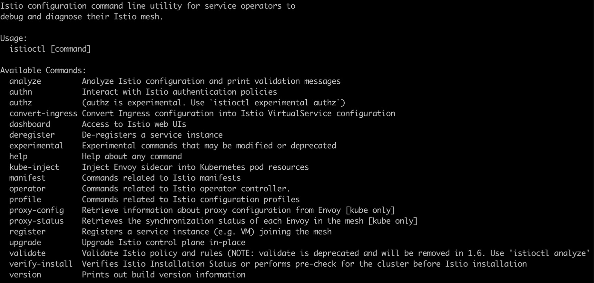
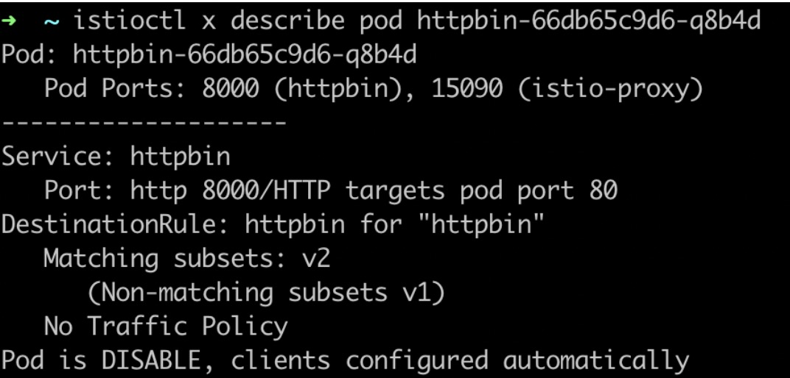
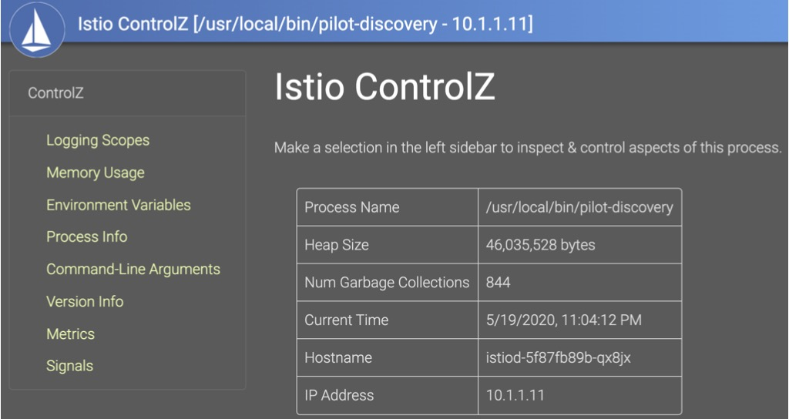
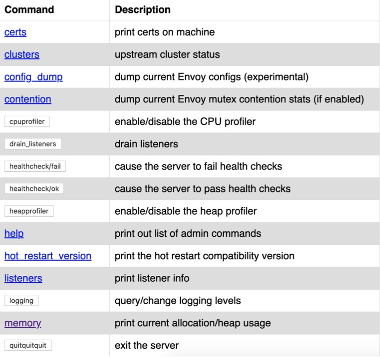
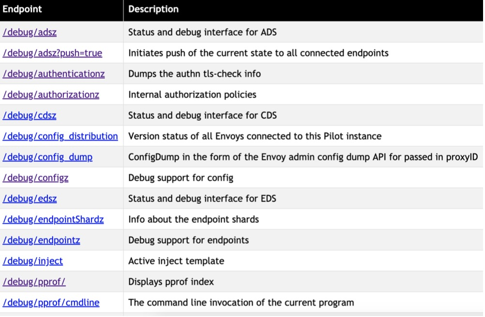

### 调试工具和方法
- istioctl 命令行
- controlZ 自检工具
- Envoy admin 接口
- Pilot debug 接口

### istioctl 命令行

### 安装部署相关
- istioctl verify-install
- istioctl manifest [apply / diff / generate / migrate / versions]
- istioctl profile [list / diff / dump]
- istioctl kube-inject
- istioctl dashboard [command]
  - controlz / envoy / Grafana / jaeger / kiali / Prometheus / zipkin

### 网格配置状态检查
- 配置同步检查
  - istioctl ps(proxy-status)
     - 状态:SYNCED / NOT SENT / STALE 
       
  - istioctl ps <pod-name>

- 配置详情
  - istioctl pc(proxy-config)
    - istioctl pc [cluster/route/...] <pod-name.namespace>

### 查看 Pod 相关网格配置信息
- istioctl x( experimental )describe pod <pod-name> 
  - 验证是否在网格内
  - 验证 VirtualService 
  - 验证 DestinationRule
  - 验证路由 
  - ...

### 网格配置诊断
- istioctl analyze [–n <namespace> / --all-namespaces]
- istioctl analyze a.yaml b.yaml my-app-config/
- istioctl analyze --use-kube=false a.yaml

### controlZ 可视化自检工具
- istioctl d controlz <istiod-podname> -n istio-system 
  - 调整日志输出级别
  - 查看内存使用情况
  - 环境变量
  - 进程信息

### Envoy admin API 接口
- istioctl d envoy <pod-name>.[namespace]
- kubectl port-forward pod-name xxx:15000
- 日志级别调整
- 性能数据分析
- 配置等信息
- 指标查看

### Pilot debug 接口
- kubectl port-forward service/istio-pilot -n istio-system 8080:8080
- http://localhost:8080/debug
- xDS 和配置信息
- 性能问题分析
- 配置同步情况

- go tool pprof x.pprof
> (pprof) top

