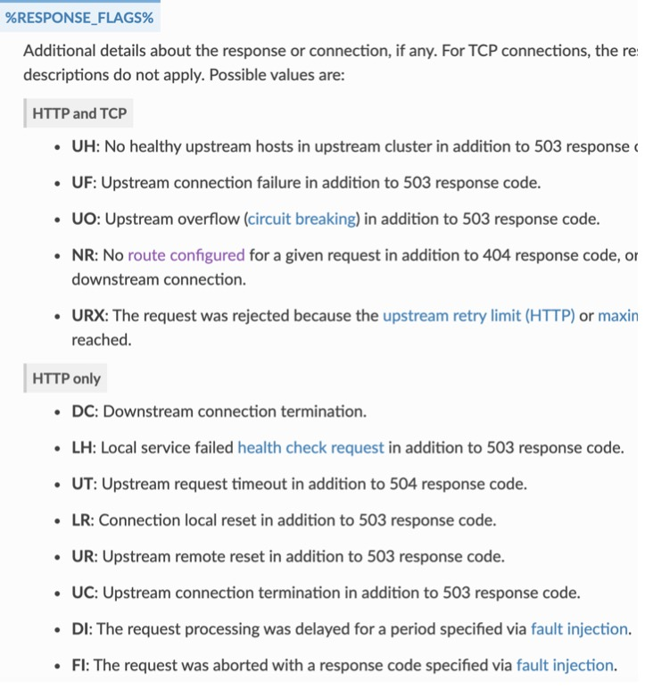
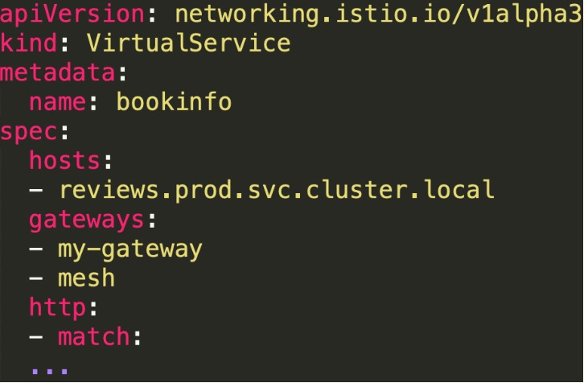
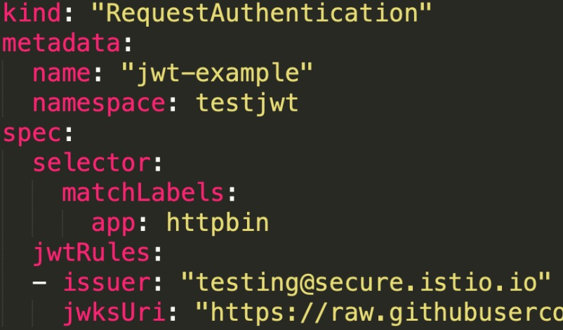
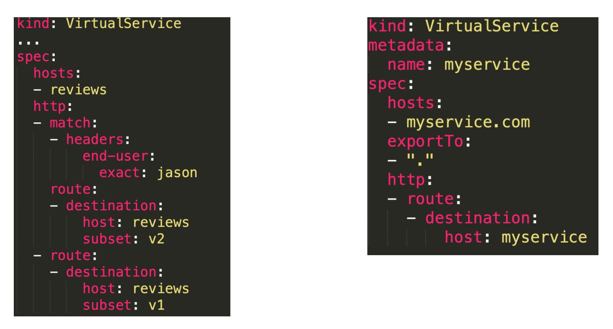
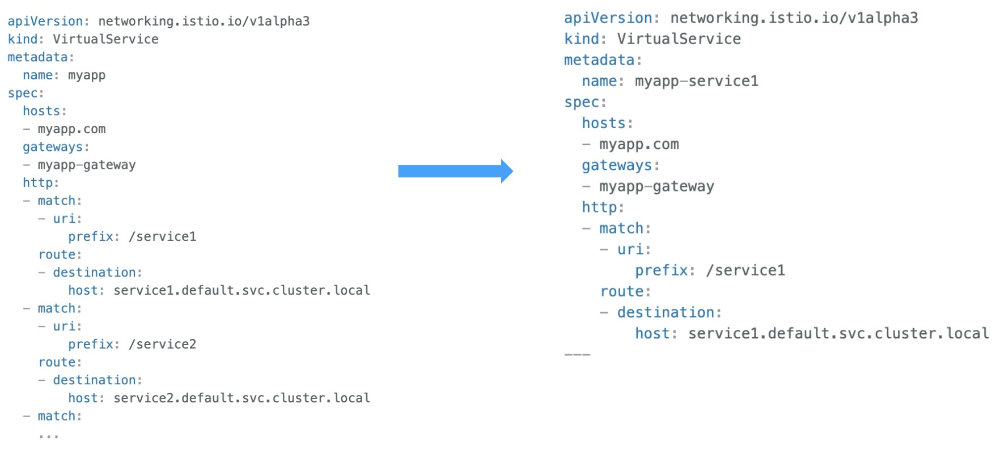
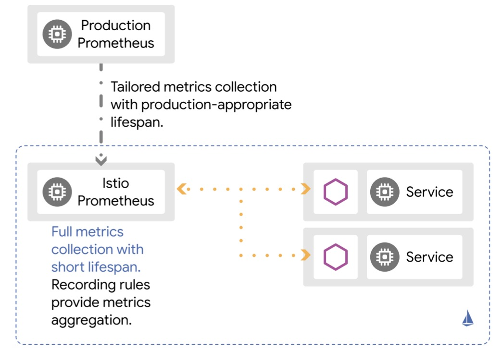

## 问题分析
### 503 错误
- 可能的原因
  - 上游服务不可用(UH);连接不上(UF) 
  - 路由配置错误(NR)
  - 熔断导致(UO)
  - 配置下发问题，可自愈

- 解决方法:
  - 根据 Envoy 日志中 RESPONSE_FLAGS 判断
  - 保证配置的可用性(先更新定义，后更新调用)

### 请求中断分析
- 因为 Envoy 的引入，无法准确判断出问题的节点 • 解决方法
- 根据 request id 串连上下游
  - 分析 Envoy 日志中的上下游元组信息
  - UPSTREAM_CLUSTER/ DOWNSTREAM_REMOTE_ADDRESS/ DOWNSTREAM_LOCAL_ADDRESS/ UPSTREAM_LOCAL_ADDRESS/ UPSTREAM_HOST

### 路由规则没有生效
- 查看是否满足 Pod 和 Service 的定义要求
  - https://istio.io/docs/ops/deployment/requirements/
- 是否占用了 Istio 默认端口 
- 是否是配置下发延迟
  - 使用 istioctl proxy-status 查看配置同步情况 
- 使用 Kiali 的配置验证

### 路由规则冲突
- 重复定义对同一 host 的路由规则 
  
-解决方案
  - 各业务维护自己的配置，避免交叉定义 
  - 通过 Kiali 进行配置验证

### VirtualService 作用域
- VirtualService 中的 gateway 字段
  - 作用于网关:< gateway-name >
  - 作用于网格内部:空 或者 [mesh] 
  - 同时生效:
     - 需要显示加上 mesh 和 gateway-name

### JWT 身份认证失败
- 确保正确设置了jwks 或 jwksUrl
- 确保 issuer 设置正确
- 确保 token 正确、没有过期 (jwt.io)

### TLS/mTLS 导致连接失败
- 确保 Citadel 运行正常 
- 确保授权策略下发正确
- 查看策略生效的作用域 – 最窄原则
- 确保客户端、服务端都正确配置了自动的 mTLS

### 性能问题分析
- 控制平面:
  - 使用 controlZ 观察内存、GC 等情况
  - 使用 pilot 的 debug 接口
- 数据平面:
  - 使用 Envoy admin API

## 最佳实践
### 部署
- 少跨集群，多用命名空间
  - 少量的大集群 好过 大量的小集群
- 考虑网络延迟 - 就近原则
- 异地多活策略
- Mesh 的部署尽可能使用 GitOps 模式

### 流量控制
- 总是配置一个默认路由
- 控制配置的命名空间可见性
- 拆分复杂的路由配置 – 单一职责 
- 注意配置生效顺序

### 默认路由、可见性

### 拆分复杂的路由配置 – 单一职责

### 注意配置生效顺序
- 先保证服务可用，再配置路由
  
- 添加 subset:
  - 更新 DestinationRules，添加新子集
  - 更新会使用它的 VirtualServices
    
- 删除 subset:
  - 从 VirtualServices 删除对该子集的所有引用
  - 从 DestinationRule 中删除子集

### 安全配置建议
- 通过命名空间隔离访问权限

- 尽可能使用 ISTIO_MUTUAL 模式(Istio 自动管理证书密钥) 
  
- 平滑过渡到安全策略
  - JWT:更新时先添加新的再删除旧的
  - mTLS:优先使用 permissive 模式 
  
- 使用三方 Service Account Token
  - --set values.global.jwtPolicy=third-party-jwt

### 可观察性配置建议
- 使用 Prometheus 层级联盟(Hierarchical federation) 
- 和现有监控集成

### 问题排查(troubleshooting)
- 善用 debug 工具
  - istioctl proxy-status / proxy-config / analyze
  - istio-pilot debug 接口(8080)
  - Envoy admin 接口(15000)
- 关联故障发生时的日志、监控数据，进行分析

