### 云的能力
#### 云原生之前
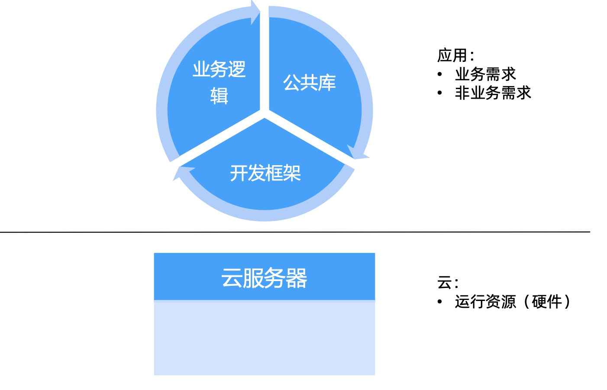

### 云原生之后
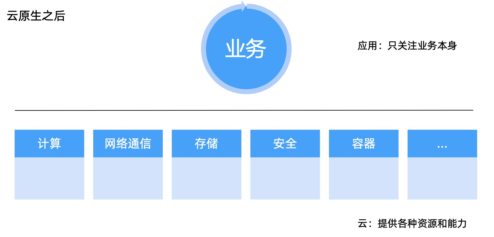

### 云服务的形态变化
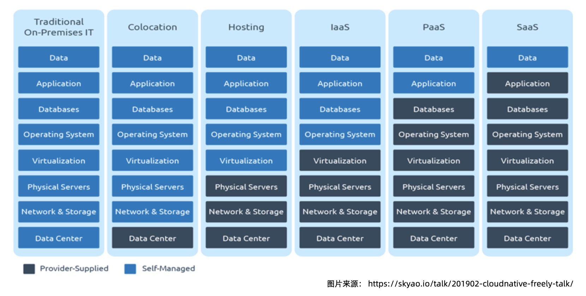

### 定义云原生
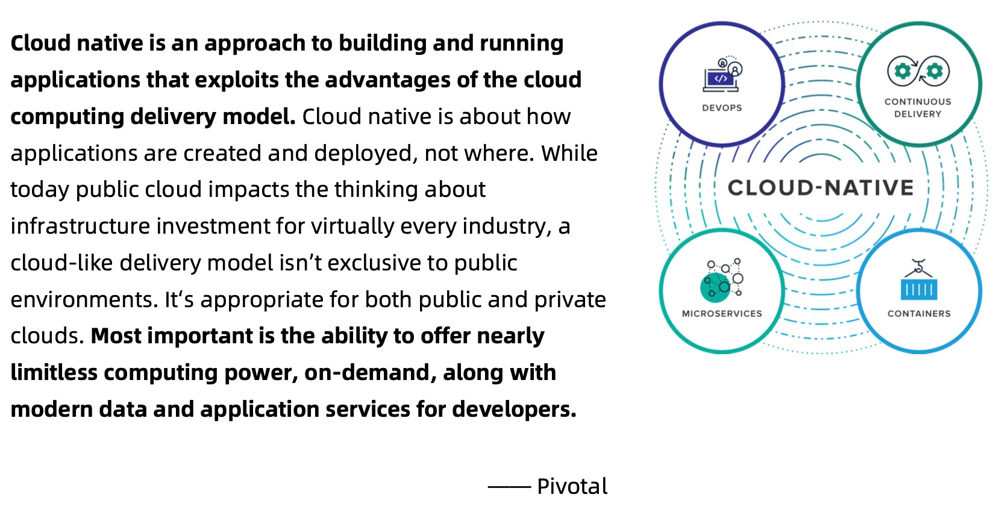

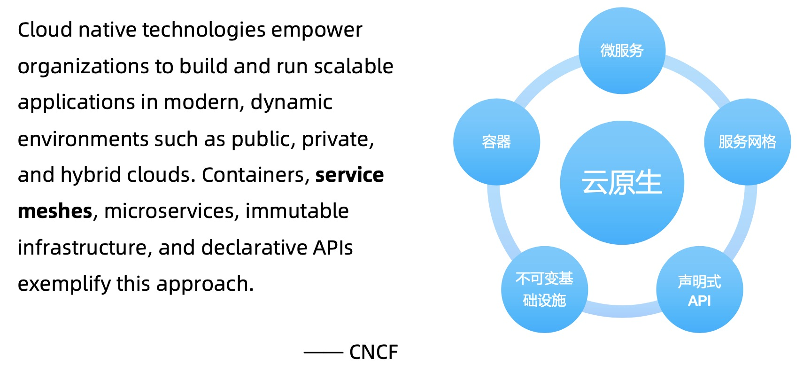

### 云原生的理念
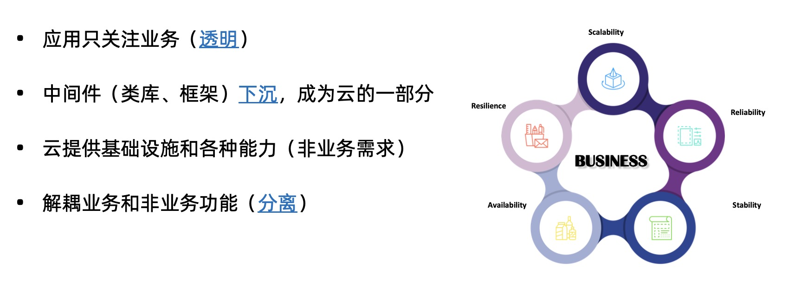

### Service Mesh 中的云原生理念
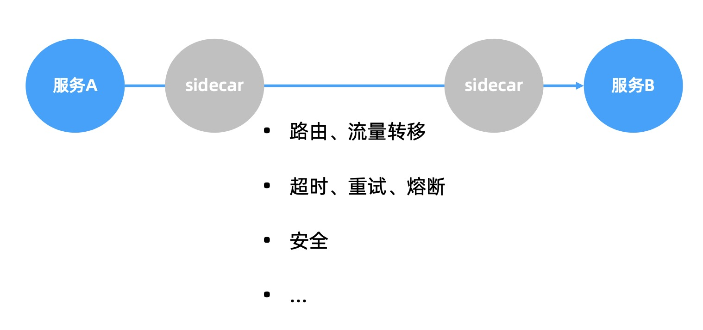

### Service Mesh 与云原生
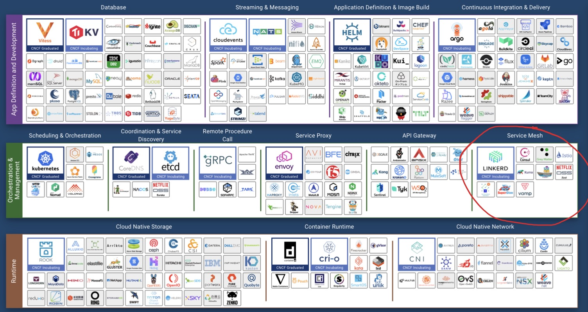

### 云原生架构
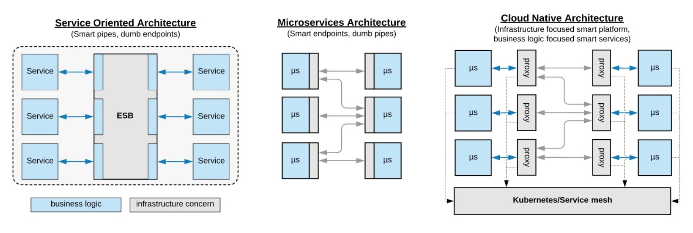

### Service Mesh 模式的扩展
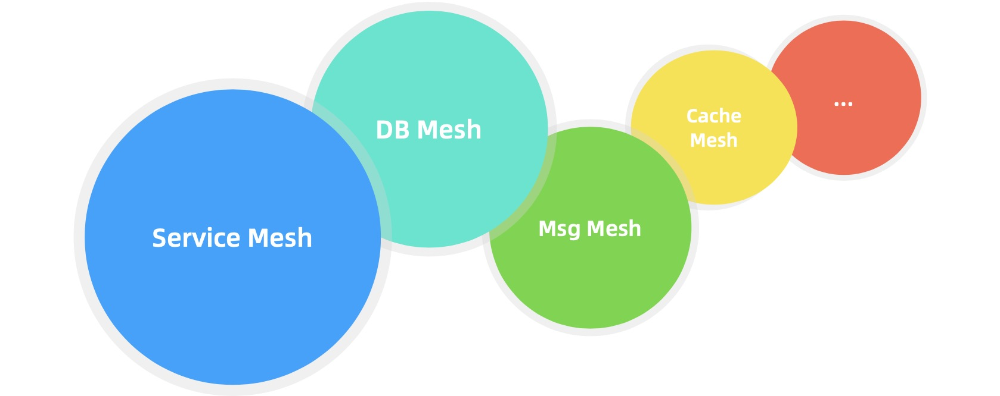

### Mecha – 云原生的最终形态?
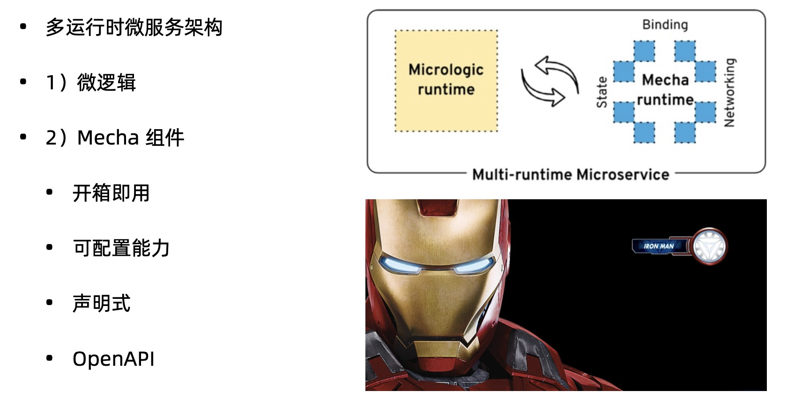

### Mecha 架构
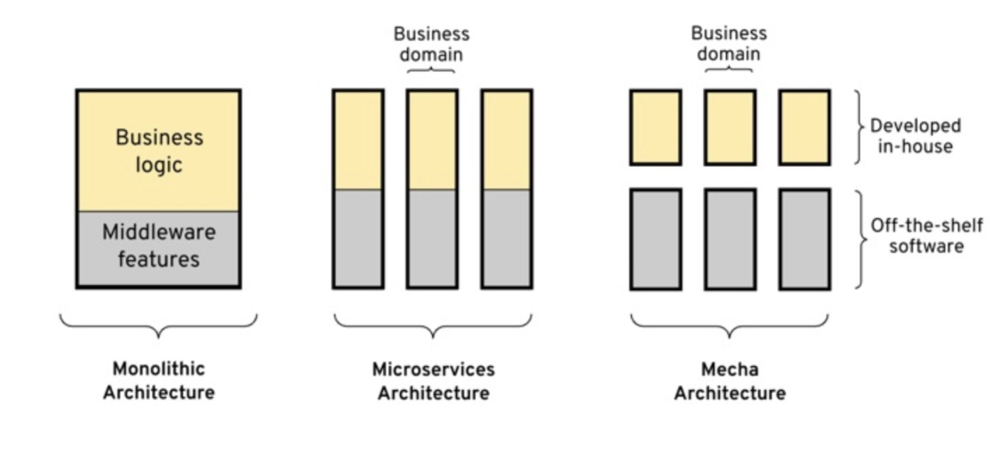
