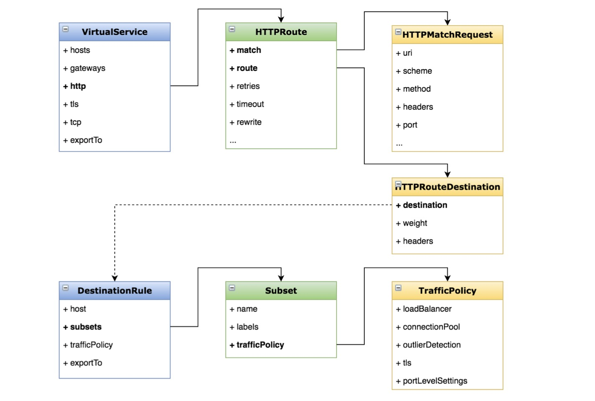

### 动态路由:用Virtual Service和 Destination Rule设置路由规则
- 虚拟服务(Virtual Service) 
  - 定义路由规则 
  - 描述满足条件的请求去哪里

- 目标规则(Destination Rule) 
  - 定义子集、策略
  - 描述到达目标的请求怎么处理
    
### 动态路由
- 将请求路由到服务的不同版本

- Virtual Service 和 Destination Rule 的配置方法

### 示例
- 应用路由规则

应用所有路由到vi版本上

> $ kubectl apply -f samples/bookinfo/networking/virtual-service-all-v1.yaml
 
> $ kubectl apply -f samples/bookinfo/networking/destination-rule-all.yaml

- 测试规则生效

> export GATEWAY_URL=192.168.0.180:30371

> http://192.168.0.180:30371/productpage

### 配置示例图



### 具体yaml配置清单
- virtual-service-all-v1.yaml
```yaml
apiVersion: networking.istio.io/v1alpha3
kind: VirtualService
metadata:
  name: productpage
spec:
  hosts:
  - productpage
  http:
  - route:
    - destination:
        host: productpage
        subset: v1
---
apiVersion: networking.istio.io/v1alpha3
kind: VirtualService
metadata:
  name: reviews
spec:
  hosts:
  - reviews
  http:
  - route:
    - destination:
        host: reviews
        subset: v1
---
apiVersion: networking.istio.io/v1alpha3
kind: VirtualService
metadata:
  name: ratings
spec:
  hosts:
  - ratings
  http:
  - route:
    - destination:
        host: ratings
        subset: v1
---
apiVersion: networking.istio.io/v1alpha3
kind: VirtualService
metadata:
  name: details
spec:
  hosts:
  - details
  http:
  - route:
    - destination:
        host: details
        subset: v1
---
```

- destination-rule-all.yaml
```yaml
apiVersion: networking.istio.io/v1alpha3
kind: DestinationRule
metadata:
  name: productpage
spec:
  host: productpage
  subsets:
  - name: v1
    labels:
      version: v1
---
apiVersion: networking.istio.io/v1alpha3
kind: DestinationRule
metadata:
  name: reviews
spec:
  host: reviews
  subsets:
  - name: v1
    labels:
      version: v1
  - name: v2
    labels:
      version: v2
  - name: v3
    labels:
      version: v3
---
apiVersion: networking.istio.io/v1alpha3
kind: DestinationRule
metadata:
  name: ratings
spec:
  host: ratings
  subsets:
  - name: v1
    labels:
      version: v1
  - name: v2
    labels:
      version: v2
  - name: v2-mysql
    labels:
      version: v2-mysql
  - name: v2-mysql-vm
    labels:
      version: v2-mysql-vm
---
apiVersion: networking.istio.io/v1alpha3
kind: DestinationRule
metadata:
  name: details
spec:
  host: details
  subsets:
  - name: v1
    labels:
      version: v1
  - name: v2
    labels:
      version: v2
---
```

### Virtual Service 和 Destination Rule 的应用场景
- 按服务版本路由

- 按比例切分流量

- 根据匹配规则进行路由

- 定义各种策略(负载均衡、连接池等)

### 将登录用户路由到 reviews 服务的 v2 版本 
- 登录用户会在 header 中添加 <key:end-user,value=登录名>

- 使用 match、headers 等属性

- 变更版本如下：
```yaml
$ kubectl get virtualservice reviews -o yaml
apiVersion: networking.istio.io/v1beta1
kind: VirtualService
...
spec:
  hosts:
    - reviews
  http:
    - match:
        - headers:
            end-user:
              exact: jason
      route:
        - destination:
            host: reviews
            subset: v2
    - route:
        - destination:
            host: reviews
            subset: v1
```


