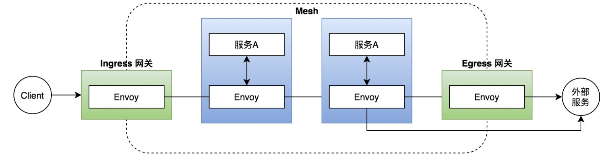
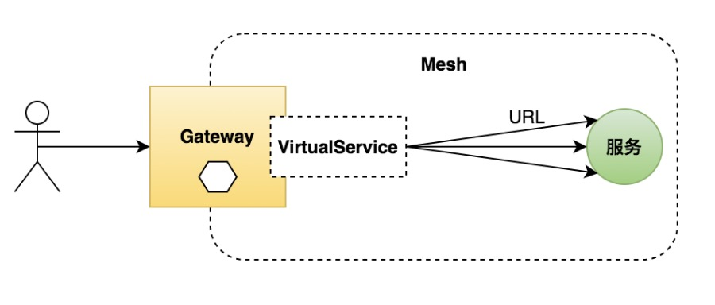
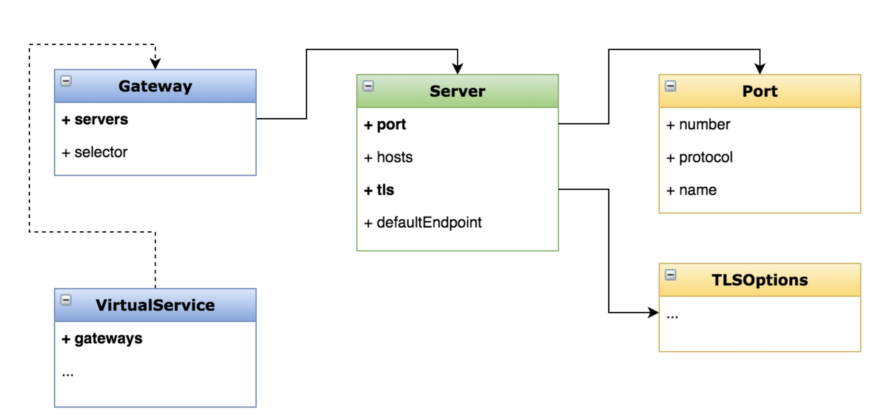

### 网关-用 Gateway 管理进入网格的流量

- 什么是网关？

  - 一个运行在网格边缘的负载均衡器

  - 接收外部请求，转发给网格内的服务

  - 配置对外的端口、协议与内部服务的映射关系



### 创建网关
- 创建一个入口网关，将进入网格的流量分发到不同地址

- 学会用 Gateway 控制入口流量

- 掌握 Gateway 的配置方法



### 操作
- 查询集群中存在的网关

> kubectl get gw
```shell
[root@b-k8s-master-180 istio-1.10.1]# kubectl get gw
NAME               AGE
bookinfo-gateway   159m
```

- 创建自定义网关

> kubectl create -f - <<EOF
... 具体内容如下的yaml文件
EOF

```yaml
apiVersion: networking.istio.io/v1alpha3
kind: Gateway
metadata:
  name: test-gateway
spec:
  selector:
    istio: ingressgateway
  servers:
  - port:
      number: 80
      name: http
      protocol: HTTP
    hosts:
    - "*"  
---
apiVersion: networking.istio.io/v1alpha3
kind: VirtualService
metadata:
  name: test-gateway
spec:
  hosts:
  - "*"
  gateways:
  - test-gateway
  http:
  - match:
    - uri: 
        prefix: /details
    - uri:
        exact: /health
    route:
    - destination:
        host: details
        port:
          number: 9080
```

### istio网关配置示意图


### Gateway 的应用场景
- 暴露网格内服务给外界访问
  
- 访问安全(HTTPS、mTLS 等)
  
- 统一应用入口，API 聚合

### 修改网关限制
- 配置一个网关，只让特定域名的请求访问服务

  - hosts 字段

- 修改如下
```yaml
apiVersion: networking.istio.io/v1alpha3
kind: Gateway
metadata:
  name: test-gateway
spec:
  selector:
    istio: ingressgateway
  servers:
  - port:
      number: 80
      name: http
      protocol: HTTP
    hosts:
    - "www.fufeng.com"  
---
apiVersion: networking.istio.io/v1alpha3
kind: VirtualService
metadata:
  name: test-gateway
spec:
  hosts:
  - "www.fufeng.com"
  gateways:
  - test-gateway
  http:
  - match:
    - uri: 
        prefix: /details
    - uri:
        exact: /health
    route:
    - destination:
        host: details
        port:
          number: 9080
```

- 测试
> curl -s -I -HHost:www.fufeng.com "http://$INGRESS_HOST:$INGRESS_PORT/details/0"

> curl -s -I -HHost:www.fufeng.com "http://192.168.0.180:30371/details/0"

> curl -s -I -HHost:www.fufeng.com "http://192.168.0.180:30371/health"

