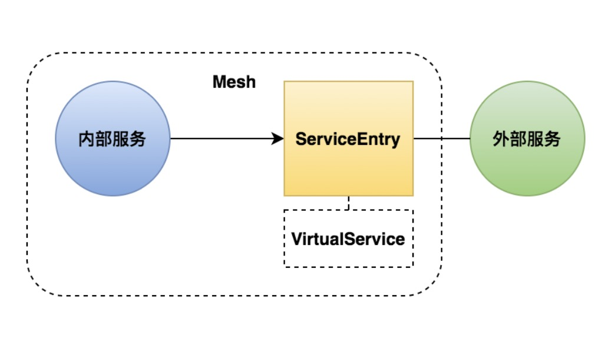
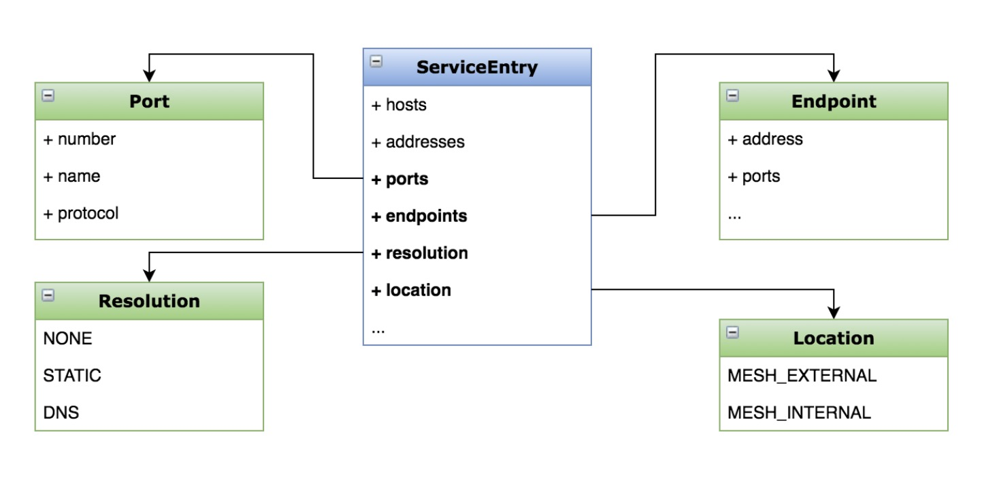

### 什么是服务入口(ServiceEntry)
- 添加外部服务到网格内
  
- 管理到外部服务的请求 
  
- 扩展网格



### 注册外部服务
- 任务说明
  - 将 httpbin 注册为网格内部的服务，并配置流控策略
    
- 任务目标
  - 学会通过 ServiceEntry 扩展网格
  - 掌握 ServiceEntry 的配置方法

### 操作
- 添加 sleep 服务
> $ kubectl apply -f samples/sleep/sleep.yaml

> $ kubectl get po 
```text
NAME                                      READY   STATUS     RESTARTS   AGE
details-v1-79f774bdb9-g2nc4               2/2     Running    0          3h35m
nfs-client-provisioner-59d7c59bcd-lpj8j   1/1     Running    17         174d
productpage-v1-6b746f74dc-479jc           2/2     Running    0          3h35m
ratings-v1-b6994bb9-nxb9z                 2/2     Running    0          3h35m
reviews-v1-545db77b95-tpklj               2/2     Running    0          3h35m
reviews-v2-7bf8c9648f-jph9h               2/2     Running    0          3h35m
reviews-v3-84779c7bbc-ngl86               2/2     Running    0          3h35m
sleep-557747455f-k4mkr                    0/2     Init:0/1   0          5s
```

> $ kubectl exec -it sleep-557747455f-k4mkr -c sleep curl http://httpbin.org/headers
```text
{
  "headers": {
    "Accept": "*/*", 
    "Host": "httpbin.org", 
    "User-Agent": "curl/7.77.0-DEV", 
    "X-Amzn-Trace-Id": "Root=1-60c4bce0-4ba0751a43bd9a2143121457", 
    "X-B3-Sampled": "1", 
    "X-B3-Spanid": "f565f338704ad2f8", 
    "X-B3-Traceid": "e996a544225636bcf565f338704ad2f8", 
    "X-Envoy-Attempt-Count": "1", 
    "X-Envoy-Peer-Metadata": "ChkKDkFQUF9DT05UQUlORVJTEgcaBXNsZWVwChoKCkNMVVNURVJfSUQSDBoKS3ViZXJuZXRlcwoZCg1JU1RJT19WRVJTSU9OEggaBjEuMTAuMQrfAQoGTEFCRUxTEtQBKtEBCg4KA2FwcBIHGgVzbGVlcAoZCgxpc3Rpby5pby9yZXYSCRoHZGVmYXVsdAohChFwb2QtdGVtcGxhdGUtaGFzaBIMGgo1NTc3NDc0NTVmCiQKGXNlY3VyaXR5LmlzdGlvLmlvL3Rsc01vZGUSBxoFaXN0aW8KKgofc2VydmljZS5pc3Rpby5pby9jYW5vbmljYWwtbmFtZRIHGgVzbGVlcAovCiNzZXJ2aWNlLmlzdGlvLmlvL2Nhbm9uaWNhbC1yZXZpc2lvbhIIGgZsYXRlc3QKGgoHTUVTSF9JRBIPGg1jbHVzdGVyLmxvY2FsCiAKBE5BTUUSGBoWc2xlZXAtNTU3NzQ3NDU1Zi1rNG1rcgoWCglOQU1FU1BBQ0USCRoHZGVmYXVsdApJCgVPV05FUhJAGj5rdWJlcm5ldGVzOi8vYXBpcy9hcHBzL3YxL25hbWVzcGFjZXMvZGVmYXVsdC9kZXBsb3ltZW50cy9zbGVlcAoXChFQTEFURk9STV9NRVRBREFUQRICKgAKGAoNV09SS0xPQURfTkFNRRIHGgVzbGVlcA==", 
    "X-Envoy-Peer-Metadata-Id": "sidecar~100.99.85.42~sleep-557747455f-k4mkr.default~default.svc.cluster.local"
  }
}
```

- 安装istio时需要指定它的服务入口模式(默认是:ALLOW_ANY) [ALLOW_ANY,REGISTRY_ONLY]
> istioctl install <flags-you-used-to-install-Istio> --set meshConfig.outboundTrafficPolicy.mode=ALLOW_ANY


- 关闭出流量可访问权限(outboundTrafficPolicy = REGISTRY_ONLY)
> $ kubectl get configmap istio -n istio-system -o yaml | sed 's/mode: ALLOW_ANY/mode: REGISTRY_ONLY/g' | kubectl replace -n istio-system -f -

- 继续测试是否可以访问外部流量
> kubectl exec -it sleep-557747455f-k4mkr -c sleep curl http://httpbin.org/headers
```text

```

- 定义外部流量的网格服务入口
```shell
$ kubectl apply -f - <<EOF
apiVersion: networking.istio.io/v1alpha3
kind: ServiceEntry
metadata:
  name: httpbin-ext
spec:
  hosts:
  - httpbin.org
  ports:
  - number: 80
    name: http
    protocol: HTTP
  resolution: DNS
  location: MESH_EXTERNAL
EOF
```

- 服务入口配置示意图


- 开启出流量可访问权限(outboundTrafficPolicy = ALLOW_ANY)
> $ kubectl get configmap istio -n istio-system -o yaml | sed 's/mode: REGISTRY_ONLY/mode: ALLOW_ANY/g' | kubectl replace -n istio-system -f -

- 为外部服务(httpbin)配置 ServiceEntry

- 测试


- 配置基于 HTTPS 的外部服务
```text
kubectl apply -f - <<EOF
apiVersion: networking.istio.io/v1alpha3
kind: ServiceEntry
metadata:
  name: baidu
spec:
  hosts:
  - www.baidu.com
  ports:
  - number: 443
    name: https
    protocol: HTTPS
  resolution: DNS
  location: MESH_EXTERNAL
EOF
```

- 配置外部服务调用操时
```text
kubectl apply -f - <<EOF
apiVersion: networking.istio.io/v1alpha3
kind: VirtualService
metadata:
  name: httpbin-ext
spec:
  hosts:
    - httpbin.org
  http:
  - timeout: 3s
    route:
      - destination:
          host: httpbin.org
        weight: 100
EOF
```


