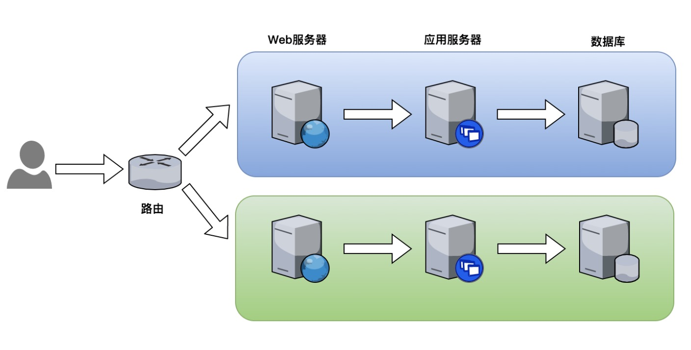

- [部署 Bookinfo](https://istio.io/latest/docs/examples/bookinfo/)

- [示例地址](https://istio.io/latest/zh/docs/tasks/traffic-management/traffic-shifting/)

### 基于权重的路由
- 任务说明
  - 将请求按比例路由到对应的服务版本
- 任务目标
  - 学会设置路由的权重
  - 理解灰度发布、蓝绿部署、A/B 测试的概念
  - 理解与 Kubernetes 基于部署的版本迁移的区别

### 蓝绿部署


### 灰度发布(金丝雀发布)
.png)

### A/B 测试


### 操作
- 利用 reviews 服务的多版本，模拟灰度发布
  
- 在 VirtualService 中配置权重 

> kubectl create -f samples/bookinfo/networking/virtual-service-reviews-50-v3.yaml

> more samples/bookinfo/networking/virtual-service-reviews-50-v3.yaml
```yaml
apiVersion: networking.istio.io/v1alpha3
kind: VirtualService
metadata:
  name: reviews
spec:
  hosts:
    - reviews
  http:
  - route:
    - destination:
        host: reviews
        subset: v1
      weight: 50
    - destination:
        host: reviews
        subset: v3
      weight: 50
```

-  测试

### 演示
- 将 Chrome 浏览器的请求路由到 reviews 的 v2 版本
  
- 提示:通过 match header 的 User-Agent 实现


