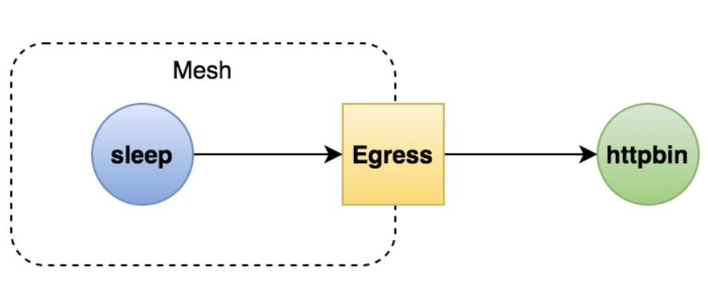
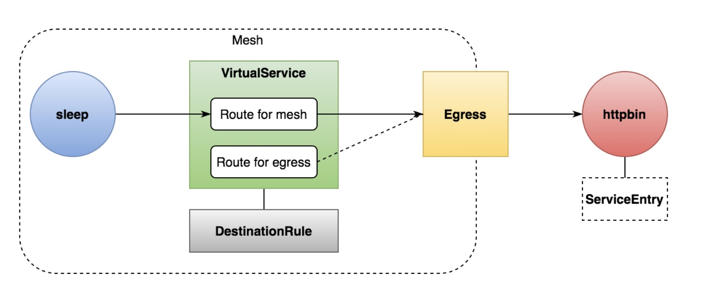

- [部署 Bookinfo](https://istio.io/latest/docs/examples/bookinfo/)

- [示例地址](https://istio.io/latest/zh/docs/tasks/traffic-management/egress/egress-gateway/)

### 访问外部服务的方法
- 配置 global.outboundTrafficPolicy.mode = ALLOW_ANY 

- 使用服务入口(ServiceEntry)

- 配置 Sidecar 让流量绕过代理

- 配置 Egress 网关

### Egress 概念
- Egress 网关
  - 定义了网格的出口点，允许你将监控、路由等功能应用于离开网格的流量
    
- 应用场景
  - 所有出口流量必须流经一组专用节点(安全因素) 
  - 为无法访问公网的内部服务做代理

### 创建 Egress 网关
- 说明
  - 创建一个 Egress 网关，让内部服务通过它访问外部服务
    
- 目标
  - 学会使用 Egress 网关
  - 理解 Egress 的存在意义



### 操作
- 测试环境搭建

> kubectl apply -f samples/sleep/sleep.yaml

- 记录sleep pod名称

> export SOURCE_POD=$(kubectl get pod -l app=sleep -o jsonpath={.items..metadata.name})


- 查看 egressgateway 组件是否存在
  
> kubectl get po -n istio-system

> kubectl get pod -l istio=egressgateway -n istio-system

- 为外部服务定义 ServiceEntry

  - 为 httpbin.org 定义一个 ServiceEntry：  
```yaml
kubectl apply -f - <<EOF
apiVersion: networking.istio.io/v1alpha3
kind: ServiceEntry
metadata:
  name: cnn
spec:
  hosts:
  - httpbin.org
  ports:
  - number: 80
    name: http-port
    protocol: HTTP
  - number: 443
    name: https
    protocol: HTTPS
  resolution: DNS
EOF
```

  - 发送 HTTP 请求到 http://httpbin.org/headers，验证 ServiceEntry 是否已正确应用。

> kubectl exec -it $SOURCE_POD -c sleep -- curl -sL -o /dev/null -D - http://httpbin.org/headers


- 定义 Egress gateway,为 httpbin.org 端口 80 创建 egress Gateway。并为指向 egress gateway 的流量创建一个 destination rule。
```yaml
kubectl apply -f - <<EOF
apiVersion: networking.istio.io/v1alpha3
kind: Gateway
metadata:
  name: istio-egressgateway
spec:
  selector:
    istio: egressgateway
  servers:
  - port:
      number: 80
      name: http
      protocol: HTTP
    hosts:
    - httpbin.org
---
apiVersion: networking.istio.io/v1alpha3
kind: DestinationRule
metadata:
  name: egressgateway-for-cnn
spec:
  host: istio-egressgateway.istio-system.svc.cluster.local
  subsets:
  - name: cnn
EOF
```
  
- 定义路由，将流量引导到 egressgateway,定义一个 VirtualService，将流量从 sidecar 引导至 egress gateway，再从 egress gateway 引导至外部服务：
  
```yaml
kubectl apply -f - <<EOF
apiVersion: networking.istio.io/v1alpha3
kind: VirtualService
metadata:
  name: direct-cnn-through-egress-gateway
spec:
  hosts:
  - httpbin.org
  gateways:
  - istio-egressgateway
  - mesh
  http:
  - match:
    - gateways:
      - mesh
      port: 80
    route:
    - destination:
        host: istio-egressgateway.istio-system.svc.cluster.local
        subset: cnn
        port:
          number: 80
      weight: 100
  - match:
    - gateways:
      - istio-egressgateway
      port: 80
    route:
    - destination:
        host: httpbin.org
        port:
          number: 80
      weight: 100
EOF
```

- 查看日志验证,再次发送 HTTP 请求到 http://httpbin.org/headers。

> kubectl exec -it $SOURCE_POD -c sleep -- curl -sL -o /dev/null -D - http://httpbin.org/headers

- 检查 istio-egressgateway pod 的日志，并查看与我们的请求对应的行。如果 Istio 部署在 istio-system 命名空间中，则打印日志的命令是：

> kubectl logs -l istio=egressgateway -c istio-proxy -n istio-system | tail
> 
> kubectl logs -l -f istio=egressgateway -c istio-proxy -n istio-system 

### 清理 HTTP gateway
```text
kubectl delete gateway istio-egressgateway
kubectl delete serviceentry cnn
kubectl delete virtualservice direct-cnn-through-egress-gateway
kubectl delete destinationrule egressgateway-for-cnn
```



### 用 Egress gateway 发起 HTTPS 请求

- 接下来尝试使用 Egress Gateway 发起 HTTPS 请求（TLS 由应用程序发起）。您需要在相应的 ServiceEntry、egress Gateway 和 VirtualService 中指定 TLS 协议的端口 443

- 为 www.baidu.com 定义 ServiceEntry：
```yaml
kubectl apply -f - <<EOF
apiVersion: networking.istio.io/v1alpha3
kind: ServiceEntry
metadata:
  name: cnn
spec:
  hosts:
  - www.baidu.com
  ports:
  - number: 443
    name: tls
    protocol: TLS
  resolution: DNS
EOF
```

- 发送 HTTPS 请求到 https://www.baidu.com?q=1，验证您的 ServiceEntry 是否已正确生效。

> kubectl exec -it $SOURCE_POD -c sleep -- curl -sL -o /dev/null -D - https://www.baidu.com?q=1

- 为 www.baidu.com 创建一个 egress Gateway。除此之外还需要创建一个 destination rule 和一个 virtual service，用来引导流量通过 egress gateway，并通过 egress gateway 与外部服务通信。

```yaml
kubectl apply -f - <<EOF
apiVersion: networking.istio.io/v1alpha3
kind: Gateway
metadata:
  name: istio-egressgateway
spec:
  selector:
    istio: egressgateway
  servers:
  - port:
      number: 443
      name: tls
      protocol: TLS
    hosts:
    - www.baidu.com
    tls:
      mode: PASSTHROUGH
---
apiVersion: networking.istio.io/v1alpha3
kind: DestinationRule
metadata:
  name: egressgateway-for-cnn
spec:
  host: istio-egressgateway.istio-system.svc.cluster.local
  subsets:
  - name: cnn
---
apiVersion: networking.istio.io/v1alpha3
kind: VirtualService
metadata:
  name: direct-cnn-through-egress-gateway
spec:
  hosts:
  - www.baidu.com
  gateways:
  - mesh
  - istio-egressgateway
  tls:
  - match:
    - gateways:
      - mesh
      port: 443
      sniHosts:
      - "www.baidu.com"
    route:
    - destination:
        host: istio-egressgateway.istio-system.svc.cluster.local
        subset: cnn
        port:
          number: 443
  - match:
    - gateways:
      - istio-egressgateway
      port: 443
      sniHosts:
      - "www.baidu.com"
    route:
    - destination:
        host: www.baidu.com
        port:
          number: 443
      weight: 100
EOF
```

- 发送 HTTPS 请求到 https://www.baidu.com?q=1。输出结果应该和之前一样。

> kubectl exec -it $SOURCE_POD -c sleep -- curl -sL -o /dev/null -D - https://www.baidu.com?q=1

- 检查 egress gateway 代理的日志。如果 Istio 部署在 istio-system 命名空间中，则打印日志的命令是：

> kubectl logs -f -l istio=egressgateway -n istio-system

### 清理 HTTPS gateway
```text
kubectl delete serviceentry cnn
kubectl delete gateway istio-egressgateway
kubectl delete virtualservice direct-cnn-through-egress-gateway
kubectl delete destinationrule egressgateway-for-cnn
```

### 清理服务
> kubectl delete -f samples/sleep/sleep.yaml
