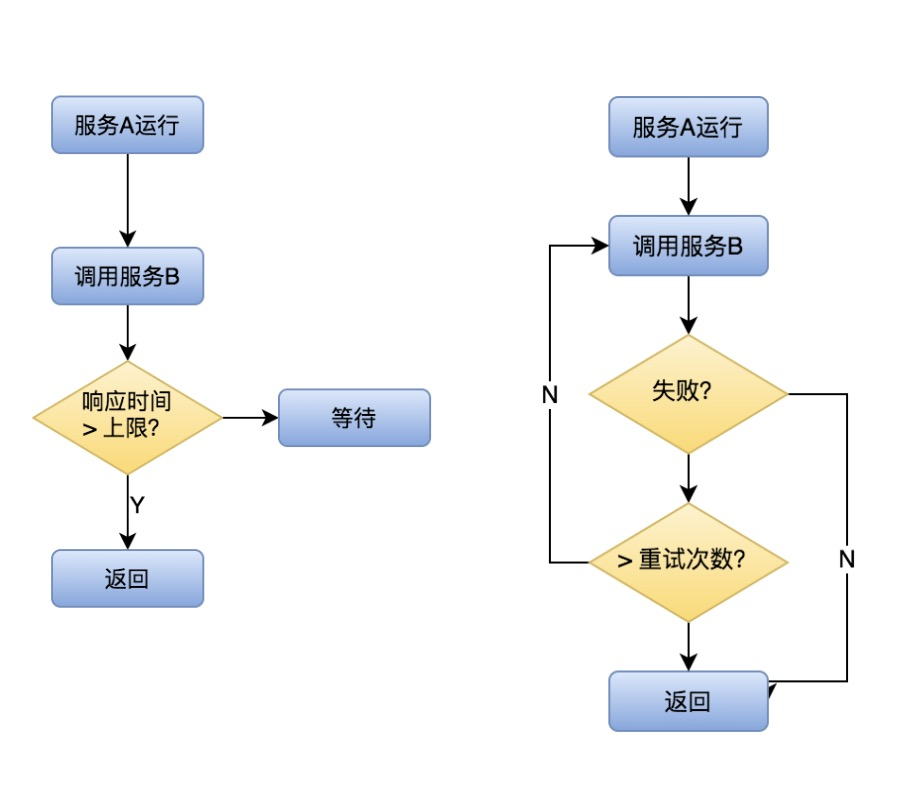
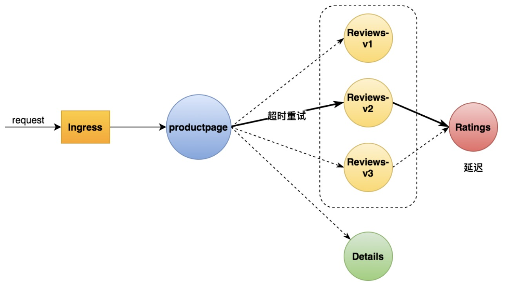
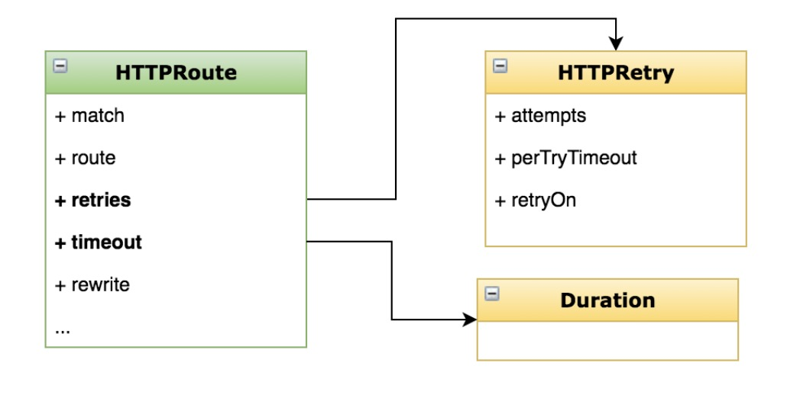

- [部署 Bookinfo](https://istio.io/latest/docs/examples/bookinfo/)

- [示例地址](https://istio.io/latest/zh/docs/tasks/traffic-management/request-timeouts/)

### 基本概念
- 超时
  - 控制故障范围，避免故障扩散
    
- 重试
  - 解决网络抖动时通信失败的问题



### 添加超时重试策略
- 说明
  - 添加超时策略 
  - 添加重试策略
  
- 目标
  - 学会在 VirtualService 中添加超时和重试的配置项 
  - 理解超时重试对提升应用健壮性的意义

### 添加超时重试策略




### 步骤

HTTP 请求的超时可以用路由规则的 timeout 字段来指定。默认情况下，超时是禁用的，本任务中，会把 reviews 服务的超时设置为 1 秒。为了观察效果，还需要在对 ratings 服务的调用上人为引入 2 秒的延迟。

- 创建示例服务

> kubectl apply -f samples/bookinfo/networking/virtual-service-all-v1.yaml

- 将请求路由到 reviews 服务的 v2 版本，它会发起对 ratings 服务的调用
```yaml
kubectl apply -f - <<EOF
apiVersion: networking.istio.io/v1alpha3
kind: VirtualService
metadata:
  name: reviews
spec:
  hosts:
    - reviews
  http:
  - route:
    - destination:
        host: reviews
        subset: v2
EOF
```

- 给 ratings 服务添加 2 秒延迟
```yaml
kubectl apply -f - <<EOF
apiVersion: networking.istio.io/v1alpha3
kind: VirtualService
metadata:
  name: ratings
spec:
  hosts:
  - ratings
  http:
  - fault:
      delay:
        percent: 100
        fixedDelay: 2s
    route:
    - destination:
        host: ratings
        subset: v1
EOF
```

- 在浏览器中打开 Bookinfo 的网址 http://$GATEWAY_URL/productpage。 这时可以看到 Bookinfo 应用运行正常（显示了评级的星型符号），但是每次刷新页面，都会有 2 秒的延迟。

- 对 reviews 服务的调用增加一个半秒的请求超时：
```yaml
kubectl apply -f - <<EOF
apiVersion: networking.istio.io/v1alpha3
kind: VirtualService
metadata:
  name: reviews
spec:
  hosts:
  - reviews
  http:
  - route:
    - destination:
        host: reviews
        subset: v2
    timeout: 0.5s
EOF
```

- 刷新 Bookinfo 页面。 这时候应该看到 1 秒钟就会返回，而不是之前的 2 秒钟，但 reviews 是不可用的。
> 即使超时配置为半秒，响应仍需要 1 秒，是因为 productpage 服务中存在硬编码重试，因此它在返回之前调用 reviews 服务超时两次。

- 给 ratings 服务添加重试策略
```yaml
kubectl apply -f - <<EOF
apiVersion: networking.istio.io/v1alpha3
kind: VirtualService
metadata:
  name: ratings
spec:
  hosts:
  - ratings
  http:
  - fault:
      delay:
        percent: 100
        fixedDelay: 5s
    route:
    - destination:
        host: ratings
        subset: v1
    retries:
      attempts: 2
      perTryTimeout: 1s
EOF
```

- 查看ratings服务的sidecar日志，看是否重试生效
> kubectl logs -f ratings-v1-b6994bb9-zqhbk -c istio-proxy



### 原理
```text
本任务中，使用 Istio 为对 reviews 微服务的调用配置了半秒的请求超时。默认情况下请求超时是禁用的。reviews 服务在处理请求时会接着调用 ratings 服务，用 Istio 在对 ratings 的调用中注入了两秒钟的延迟，这样就让 reviews 服务要花费超过半秒的时间来完成调用，因此可以观察到超时。

可以观察到，Bookinfo 的页面（调用 reviews 服务来生成页面）没显示评论，而是显示了消息：Sorry, product reviews are currently unavailable for this book. 这就是它收到了来自 reviews 服务的超时错误信息。

如果看过故障注入任务，就会发现 productpage 微服务在调用 reviews 微服务时，还有它自己的应用级的超时（3 秒）设置。注意在本任务中使用 Istio 路由规则设置了半秒的超时。如果将超时设置为大于 3 秒（比如 4 秒），则超时将不会有任何影响，因为这两个超时的限制性更强。更多细节可以参考这里。

还有一点关于 Istio 中超时控制方面的补充说明，除了像本文一样在路由规则中进行超时设置之外，还可以进行请求一级的设置，只需在应用的对外请求中加入 x-envoy-upstream-rq-timeout-ms 请求头即可。在这个请求头中的超时设置单位是毫秒而不是秒。
```

### 删除应用程序的路由规则
> kubectl delete -f samples/bookinfo/networking/virtual-service-all-v1.yaml


### 配置超时、重试策略。
- 为什么有些应用场景要使用指数级退避的重试策略?


