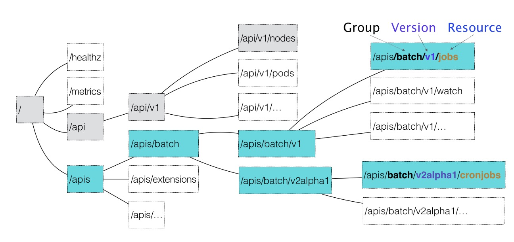
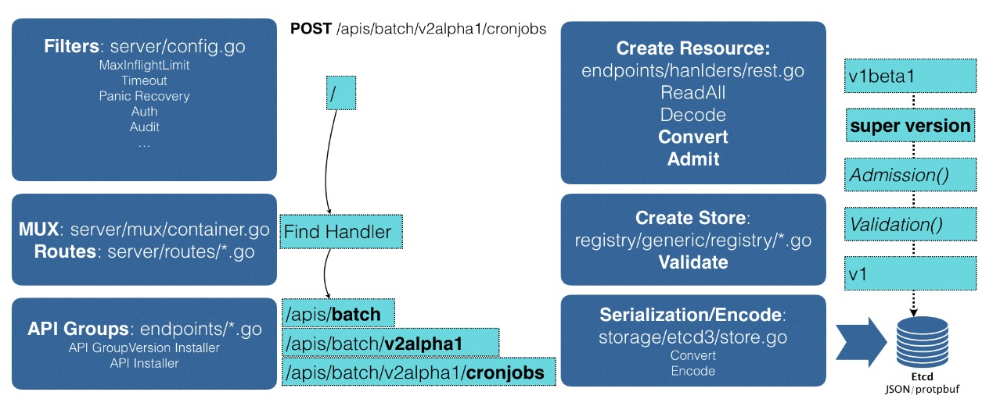

### kubernetes API对象
在 Kubernetes 项目中，一个 API 对象在 Etcd 里的完整资源路径，是由：Group（API组）、Version（API 版本）和 Resource（API 资源类型）三个部分组成的。

通过这样的结构，整个 Kubernetes 里的所有 API 对象，实际上就可以用如下的树形结构表示出来：

从上图可以看出Kubernetes 里 API 对象的组织方式，其实是层层递进的。

比如，现在我要声明要创建一个 CronJob 对象，那么我的 YAML 文件的开始部分会这么写：
```yaml
apiVersion: batch/v2
kind: CronJob
...
```
在这个 YAML 文件中，“CronJob”就是这个 API 对象的资源类型（Resource），“batch”就是它的组（Group），v2 就是它的版本（Version）。

当提交了这个 YAML 文件之后，Kubernetes 就会把这个 YAML 文件里描述的内容，转换成 Kubernetes 里的一个 CronJob 对象。

#### Kubernetes 是如何对 Resource、Group 和 Version 进行解析，从而在Kubernetes 项目里找到 CronJob 对象的定义呢？

首先，Kubernetes 会匹配 API 对象的组
```text
需要明确的是，对于 Kubernetes 里的核心 API 对象，比如：Pod、Node 等，是不需要Group 的（即：它们 Group 是“”）。所以，对于这些 API 对象来说，Kubernetes 会直接在 /api 这个层级进行下一步的匹配过程。

而对于 CronJob 等非核心 API 对象来说，Kubernetes 就必须在 /apis 这个层级里查找它对应的 Group，进而根据“batch”这个 Group 的名字，找到 /apis/batch。

不难发现，这些 API Group 的分类是以对象功能为依据的，比如 Job 和 CronJob 就都属于“batch” （离线业务）这个 Group。
```

然后，Kubernetes 会进一步匹配到 API 对象的版本号
```text
对于 CronJob 这个 API 对象来说，Kubernetes 在 batch 这个 Group 下，匹配到的版本号就是 v2。

在 Kubernetes 中，同一种 API 对象可以有多个版本，这正是 Kubernetes 进行 API 版本化管理的重要手段。这样，比如在 CronJob 的开发过程中，对于会影响到用户的变更就可以通过升级新版本来处理，从而保证了向后兼容。
```

最后，Kubernetes 会匹配 API 对象的资源类型
```text
在前面匹配到正确的版本之后，Kubernetes 就知道，要创建的是一个/apis/batch/v2 下的 CronJob 对象。
```

Kubernetes 创建API对象流程图如下：


```text
首先，当发起一个创建 CronJob 的 POST 请求之后，编写的 YAML 的信息就被提交给了 APIServer，而 APIServer 的第一个功能，就是过滤这个请求，并完成一些前置性的工作，比如授权、超时处理、审计等。

然后，请求会进入 MUX 和 Routes 流程。如果编写过 Go Web Server 的话就会知道，MUX 和 Routes 是 APIServer 完成 URL 和 Handler 绑定的场所。而 APIServer 的Handler 要做的事情，就是执行这个匹配过程，找到对应的 CronJob 类型定义。

接着，APIServer 最重要的职责就来了：根据这个 CronJob 类型定义，使用用户提交的YAML 文件里的字段，创建一个 CronJob 对象。而在这个过程中，APIServer 会进行一个 Convert 工作，即：把用户提交的 YAML 文件，转换成一个叫作 Super Version 的对象，它正是该 API 资源类型所有版本的字段全集。这样用户提交的不同版本的 YAML 文件，就都可以用这个 Super Version 对象来进行处理了。

接下来，APIServer 会先后进行 Admission() 和 Validation() 操作。Admission Controller 和 Initializer，就都属于 Admission 的内容。而 Validation，则负责验证这个对象里的各个字段是否合法。这个被验证过的 API 对象，都保存在了 APIServer 里一个叫作 Registry 的数据结构中。也就是说，只要一个 API 对象的定义能在 Registry 里查到，它就是一个有效的 Kubernetes API 对象。

最后，APIServer 会把验证过的 API 对象转换成用户最初提交的版本，进行序列化操作，并调用 Etcd 的 API 把它保存起来。

由此可见，声明式 API 对于 Kubernetes 来说非常重要。所以，APIServer 这样一个在其他项目里“平淡无奇”的组件，却成了 Kubernetes 项目的重中之重。它不仅是 Google Borg 设计思想的集中体现，也是 Kubernetes 项目里唯一一个被 Google 公司和 RedHat公司双重控制、其他势力根本无法参与其中的组件。
```

由于同时要兼顾性能、API 完备性、版本化、向后兼容等很多工程化指标，所以Kubernetes 团队在 APIServer 项目里大量使用了 Go 语言的代码生成功能，来自动化诸如Convert、DeepCopy 等与 API 资源相关的操作。这部分自动生成的代码，曾一度占到Kubernetes 项目总代码的 20%~30%，在过去很长一段时间里，在这样一个极其“复杂”的 APIServer 中，添加一个 Kubernetes 风格的 API 资源类型，是一个非常困难的工作。

在 Kubernetes v1.7 之后，这个工作就变得轻松得多了。这得益于一个全新的 API 插件机制：CRD。CRD 的全称是 Custom Resource Definition。顾名思义，它指的就是，允许用户在Kubernetes 中添加一个跟 Pod、Node 类似的、新的 API 资源类型，即：自定义 API 资源。

举例：[为 Kubernetes 添加一个名叫 Network 的 API 资源类型](https://github.com/resouer/k8s-controller-custom-resource)
```text
它的作用是，一旦用户创建一个 Network 对象，那么 Kubernetes 就应该使用这个对象定义的网络参数，调用真实的网络插件，比如 Neutron 项目，为用户创建一个真正的“网络”。这样，将来用户创建的 Pod，就可以声明使用这个“网络”了。

这个 Network 对象的 YAML 文件，名叫 example-network.yaml，它的内容如下所示：

apiVersion: samplecrd.k8s.io/v1
kind: Network
metadata:  
  name: example-network
spec:
  cidr: "192.168.0.0/16"  
  gateway: "192.168.0.1"
  
可以看到，描述“网络”的 API 资源类型是 Network；API 组是samplecrd.k8s.io；API 版本是 v1。

那么，Kubernetes 又该如何知道这个 API（samplecrd.k8s.io/v1/network）的存在呢？

上面的这个 YAML 文件，就是一个具体的“自定义 API 资源”实例，也叫CR（Custom Resource）。而为了能够让 Kubernetes 认识这个 CR，你就需要让Kubernetes 明白这个 CR 的宏观定义是什么，也就是 CRD（Custom ResourceDefinition）。

接下来，就先需编写一个 CRD 的 YAML 文件，它的名字叫作 network.yaml，内容如下所示：

apiVersion: apiextensions.k8s.io/v1beta1
kind: CustomResourceDefinition
metadata:  
  name: networks.samplecrd.k8s.io
spec:  
  group: samplecrd.k8s.io  
  version: v1  
  names:    
    kind: Network    
    plural: networks  
  scope: Namespaced

可以看到，在这个 CRD 中，指定了“group: samplecrd.k8s.io”“version:v1”这样的 API 信息，也指定了这个 CR 的资源类型叫作 Network，复数（plural）是networks。

然后，还声明了它的 scope 是 Namespaced，即：定义的这个 Network 是一个属于 Namespace 的对象，类似于 Pod。  

这就是一个 Network API 资源类型的 API 部分的宏观定义了。所以这时候，Kubernetes 就能够认识和处理所有声明了 API 类型是“samplecrd.k8s.io/v1/network”的 YAML 文件了。

接下来，还需要让 Kubernetes“认识”这种 YAML 文件里描述的“网络”部分，比如“cidr”（网段），“gateway”（网关）这些字段的含义。

$ tree $GOPATH/src/github.com/<your-name>/k8s-controller-custom-resource
├── controller.go
├── crd
│    └── network.yaml   
├── example                                                                                       
│    └── example-network.yaml
├── main.go
└── pkg
    └── apis
        └── samplecrd
            ├── register.go
            └── v1
                ├── doc.go
                ├── register.go
                └── types.go

其中，pkg/apis/samplecrd 就是 API 组的名字，v1 是版本，而 v1 下面的 types.go 文件里，则定义了 Network 对象的完整描述。

然后，我在 pkg/apis/samplecrd 目录下创建了一个 register.go 文件，用来放置后面要用到的全局变量，如下：
package samplecrd
const (
	GroupName = "samplecrd.k8s.io"
	Version   = "v1"
)

接着，需要在 pkg/apis/samplecrd 目录下添加一个 doc.go 文件（Golang 的文档源文件），如下：
// +k8s:deepcopy-gen=package

// +groupName=samplecrd.k8s.io
package v1

在这个文件中，会看到 +<tag_name>[=value] 格式的注释，这就是 Kubernetes 进行代码生成要用的 Annotation 风格的注释。

其中，+k8s:deepcopy-gen=package 意思是，请为整个 v1 包里的所有类型定义自动生成 DeepCopy 方法；而+groupName=samplecrd.k8s.io，则定义了这个包对应的 API组的名字。              

这些定义在 doc.go 文件的注释，起到的是全局的代码生成控制的作用，所以也被称为 Global Tags。

接下来，需要添加 types.go 文件。顾名思义，作用就是定义一个 Network 类型到底有哪些字段（比如，spec 字段里的内容），内容如下：
package v1

import (
	metav1 "k8s.io/apimachinery/pkg/apis/meta/v1"
)

// +genclient
// +genclient:noStatus
// +k8s:deepcopy-gen:interfaces=k8s.io/apimachinery/pkg/runtime.Object

// Network describes a Network resource
type Network struct {
	// TypeMeta is the metadata for the resource, like kind and apiversion
	metav1.TypeMeta `json:",inline"`
	// ObjectMeta contains the metadata for the particular object, including
	// things like...
	//  - name
	//  - namespace
	//  - self link
	//  - labels
	//  - ... etc ...
	metav1.ObjectMeta `json:"metadata,omitempty"`

	// Spec is the custom resource spec
	Spec NetworkSpec `json:"spec"`
}

// NetworkSpec is the spec for a Network resource
type NetworkSpec struct {
	// Cidr and Gateway are example custom spec fields
	//
	// this is where you would put your custom resource data
	Cidr    string `json:"cidr"`
	Gateway string `json:"gateway"`
}

// +k8s:deepcopy-gen:interfaces=k8s.io/apimachinery/pkg/runtime.Object

// NetworkList is a list of Network resources
type NetworkList struct {
	metav1.TypeMeta `json:",inline"`
	metav1.ListMeta `json:"metadata"`

	Items []Network `json:"items"`
}

上面这部分代码里，可以看到 Network 类型定义方法跟标准的 Kubernetes 对象一样，都包括了 TypeMeta（API 元数据）和 ObjectMeta（对象元数据）字段。

而其中的 Spec 字段，就是需要自己定义的部分。所以，在 network spec 里，定义了 Cidr 和 Gateway 两个字段。其中，每个字段最后面的部分比如json:"cidr"，指的就是这个字段被转换成 JSON 格式之后的名字，也就是 YAML 文件里的字段名字。

除了定义 Network 类型，还需要定义一个 NetworkList 类型，用来描述一组Network 对象应该包括哪些字段。之所以需要这样一个类型，是因为在 Kubernetes 中，获取所有 X 对象的 List() 方法，返回值都是List 类型，而不是 X 类型的数组，这是不一样的。

其中，+genclient 的意思是：为下面这个 API 资源类型生成对应的 Client 代码。而 +genclient:noStatus 的意思是：这个 API 资源类型定义里，没有 Status 字段。否则，生成的 Client 就会自动带上 UpdateStatus 方法。

如果定义的类型包括了 Status 字段的话，就不需要这句 +genclient:noStatus 注释了。比如下面这个例子：

// +genclient
// Network is a specification for a Network resource
type Network struct {
	metav1.TypeMeta `json:",inline"`
	metav1.ObjectMeta `json:"metadata,omitempty"`
	
	Spec NetworkSpec `json:"spec"`
	Spec NetworkSpec `json:"status"`
}

需要注意的是，+genclient 只需要写在 Network 类型上，而不用写在 NetworkList 上。因为 NetworkList 只是一个返回值类型，Network 才是“主类型”。

由于在 Global Tags 里已经定义了为所有类型生成 DeepCopy 方法，所以这里就不需要再显式地加上 +k8s:deepcopy-gen=true 了。当然，这也就意味着你可以用+k8s:deepcopy-gen=false 来阻止为某些类型生成 DeepCopy。

你可能已经注意到，在这两个类型上面还有一句+k8s:deepcopy-gen:interfaces=k8s.io/apimachinery/pkg/runtime.Object的注释。它的意思是，请在生成 DeepCopy 的时候，实现 Kubernetes 提供的 runtime.Object 接口。否则，在某些版本的 Kubernetes 里，你的这个类型定义会出现编译错误。这是一个固定的操作，记住即可。

最后，需要再编写的一个 pkg/apis/samplecrd/v1/register.go 文件

对 APIServer 工作原理的讲解中知道了，“registry”的作用就是注册一个类型（Type）给 APIServer。其中，Network 资源类型在服务器端的注册的工作，APIServer 会自动帮我们完成。但与之对应的，还需要让客户端也能“知道”Network 资源类型的定义。这就需要在项目里添加一个 register.go 文件。它最主要的功能，就是定义了如下所示的 addKnownTypes() 方法：

// addKnownTypes adds our types to the API scheme by registering
// Network and NetworkList
func addKnownTypes(scheme *runtime.Scheme) error {
	scheme.AddKnownTypes(
		SchemeGroupVersion,
		&Network{},
		&NetworkList{},
	)

	// register the type in the scheme
	metav1.AddToGroupVersion(scheme, SchemeGroupVersion)
	return nil
}

有了这个方法，Kubernetes 就能够在后面生成客户端的时候，“知道”Network 以及NetworkList 类型的定义了。

上面这种register.go 文件里的内容其实是非常固定的，以后可以直接使用这部分代码做模板，然后把其中的资源类型、GroupName 和 Version 替换成你自己的定义即可。
```

Network 对象的定义工作就全部完成了。可以看到，它其实定义了两部分内容：
```text
第一部分是，自定义资源类型的 API 描述，包括：组（Group）、版本（Version）、资源类型（Resource）等。

第二部分是，自定义资源类型的对象描述，包括：Spec、Status 等。
```

接下来，就要使用 Kubernetes 提供的代码生成工具，为上面定义的 Network 资源类型自动生成 clientset、informer 和 lister。其中，clientset 就是操作 Network 对象所需要使用的客户端，而 informer 和 lister 这两个包的主要功能。
```text
这个代码生成工具名叫k8s.io/code-generator，使用方法如下所示：

# 代码生成的工作目录，也就是我们的项目路径
$ ROOT_PACKAGE="github.com/resouer/k8s-controller-custom-resource"
# API Group
$ CUSTOM_RESOURCE_NAME="samplecrd"
# API Version
$ CUSTOM_RESOURCE_VERSION="v1"
# 安装 k8s.io/code-generator
$ go get -u k8s.io/code-generator/...
$ cd $GOPATH/src/k8s.io/code-generator
# 执行代码自动生成，其中 pkg/client 是生成目标目录，pkg/apis 是类型定义目录
$ ./generate-groups.sh all "$ROOT_PACKAGE/pkg/client" "$ROOT_PACKAGE/pkg/apis" "$CUSTOM_RESOURCE_NAME:$CUSTOM_RESOURCE_VERSION" 

代码生成工作完成之后，再查看一下这个项目的目录结构：
$ tree
.
├── controller.go
├── crd
│ └── network.yaml
├── example
│ └── example-network.yaml
├── Godeps
│ ├── Godeps.json
│ ├── OWNERS
│ └── Readme
├── main.go
├── pkg
│ ├── apis
│ │ └── samplecrd
│ │     ├── register.go
│ │     └── v1
│ │         ├── doc.go
│ │         ├── register.go
│ │         ├── types.go
│ │         └── zz_generated.deepcopy.go
│ ├── client
│ │ ├── clientset
│ │ ├── informers
│ │ ├── listers

pkg/apis/samplecrd/v1 下面的 zz_generated.deepcopy.go 文件，就是自动生成的 DeepCopy 代码文件。

整个 client 目录，以及下面的三个包（clientset、informers、 listers），都是Kubernetes 为 Network 类型生成的客户端库，这些库会在后面编写自定义控制器的时候用到。
```

在 Kubernetes 集群里创建一个 Network 类型的 API 对象
```text
首先，使用 network.yaml 文件，在 Kubernetes 中创建 Network 对象的 CRD（CustomResource Definition）：
$ kubectl apply -f crd/network.yaml
customresourcedefinition.apiextensions.k8s.io/networks.samplecrd.k8s.io create

这个操作，就告诉了 Kubernetes，现在要添加一个自定义的 API 对象。而这个对象的API 信息，正是 network.yaml 里定义的内容。可以通过 kubectl get 命令，查看这个CRD：
$ kubectl get crd

然后，就可以创建一个 Network 对象了，这里用到的是 example-network.yaml：
$ kubectl create -f example/example-network.yaml

通过这个操作，就在 Kubernetes 集群里创建了一个 Network 对象。它的 API 资源路径是samplecrd.k8s.io/v1/networks。

这时候，你就可以通过 kubectl get 命令，查看到新创建的 Network 对象：
$ kubectl get network

还可以通过 kubectl describe 命令，看到这个 Network 对象的细节：
$ kubect describe network example-network
```


### [Kubernetes 的代码生成语法](https://www.openshift.com/blog/kubernetes-deep-dive-code-generation-customresources)
