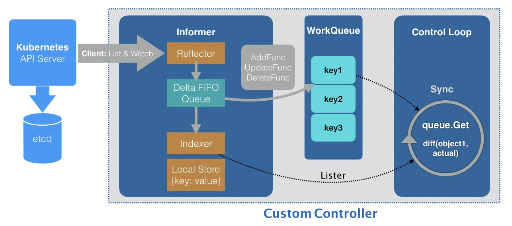

### 控制器模式
“声明式 API”并不像“命令式 API”那样有着明显的执行逻辑，这就使得基于声明式 API 的业务功能实现，往往需要通过控制器模式来“监视”API 对象的变化（比如，创建或者删除 Network），然后以此来决定实际要执行的具体工作。

总得来说，编写自定义控制器代码的过程包括：编写 main 函数、编写自定义控制器的定义，以及编写控制器里的业务逻辑三个部分。

### [自定义控制器流程](https://github.com/resouer/k8s-controller-custom-resource)

#### 首先，编写这 * 个自定义控制器的 main 函数
main 函数的主要工作就是，定义并初始化一个自定义控制器（Custom Controller），然后启动它。这部分代码的主要内容如下所示：
```text
...
cfg, err := clientcmd.BuildConfigFromFlags(masterURL, kubeconfig)
...
kubeClient, err := kubernetes.NewForConfig(cfg)
...
networkClient, err := clientset.NewForConfig(cfg)
...
networkInformerFactory := informers.NewSharedInformerFactory(networkClient, time.Second*30)

controller := NewController(kubeClient, networkClient,
    networkInformerFactory.Samplecrd().V1().Networks())

go networkInformerFactory.Start(stopCh)

if err = controller.Run(2, stopCh); err != nil {
    glog.Fatalf("Error running controller: %s", err.Error())
}
```

##### 这个 main 函数主要通过三步完成了初始化并启动一个自定义控制器的工作
第一步：main 函数根据我提供的 Master 配置（APIServer 的地址端口和 kubeconfig 的路径），创建一个 Kubernetes 的 client（kubeClient）和 Network 对象的client（networkClient）。

但是，如果没有提供 Master 配置呢？

这时，main 函数会直接使用一种名叫InClusterConfig的方式来创建这个 client。这个方式，会假设自定义控制器是以 Pod 的方式运行在 Kubernetes 集群里的。

Kubernetes里所有的 Pod 都会以 Volume 的方式自动挂载 Kubernetes 的默认 ServiceAccount。所以，这个控制器就会直接使用默认 ServiceAccount 数据卷里的授权信息，来访问APIServer。

第二步：main 函数为 Network 对象创建一个叫作 InformerFactory（即：networkInformerFactory）的工厂，并使用它生成一个 Network 对象的 Informer，传递给控制器。

第三步：main 函数启动上述的 Informer，然后执行 controller.Run，启动自定义控制器。

#### 自定义控制器的工作原理
在 Kubernetes 项目中，一个自定义控制器的工作原理，可以用下面这样一幅流程图来表示：


#####  Informer 库的工作原理
这个控制器要做的第一件事，是从 Kubernetes 的 APIServer 里获取它所关心的对象，也就是定义的 Network 对象。

这个操作，依靠的是一个叫作 Informer（可以翻译为：通知器）的代码库完成的。Informer 与 API 对象是一一对应的，所以传递给自定义控制器的，正是一个 Network对象的 Informer（Network Informer）。

在创建这个 Informer 工厂的时候，需要给它传递一个networkClient，事实上，Network Informer 正是使用这个 networkClient，跟 APIServer 建立了连接。不过，真正负责维护这个连接的，则是 Informer 所使用的 Reflector 包。

Reflector 使用的是一种叫作ListAndWatch的方法，来“获取”并“监听”这些 Network 对象实例的变化。

在 ListAndWatch 机制下，一旦 APIServer 端有新的 Network 实例被创建、删除或者更新，Reflector 都会收到“事件通知”。这时，该事件及它对应的 API 对象这个组合，就被称为增量（Delta），它会被放进一个 Delta FIFO Queue（即：增量先进先出队列）中。

另一方面，Informer 会不断地从这个 Delta FIFO Queue 里读取（Pop）增量。每拿到一个增量，Informer 就会判断这个增量里的事件类型，然后创建或者更新本地对象的缓存。这个缓存，在 Kubernetes 里一般被叫作 Store。

比如，如果事件类型是 Added（添加对象），那么 Informer 就会通过一个叫作 Indexer的库把这个增量里的 API 对象保存在本地缓存中，并为它创建索引。相反地，如果增量的事件类型是 Deleted（删除对象），那么 Informer 就会从本地缓存中删除这个对象。

这个同步本地缓存的工作，是 Informer 的第一个职责，也是它最重要的职责。

Informer 的第二个职责，则是根据这些事件的类型，触发事先注册好的ResourceEventHandler。这些 Handler，需要在创建控制器的时候注册给它对应的Informer。

编写这个控制器的定义，主要内容如下所示：
```text
// NewController returns a new network controller
func NewController(
	kubeclientset kubernetes.Interface,
	networkclientset clientset.Interface,
	networkInformer informers.NetworkInformer) *Controller {
	...
	controller := &Controller{
		kubeclientset:    kubeclientset,
		networkclientset: networkclientset,
		networksLister:   networkInformer.Lister(),
		networksSynced:   networkInformer.Informer().HasSynced,
		workqueue:        workqueue.NewNamedRateLimitingQueue(workqueue.DefaultControllerRateLimiter(), "Networks"),
		recorder:         recorder,
	}

	glog.Info("Setting up event handlers")
	// Set up an event handler for when Network resources change
	networkInformer.Informer().AddEventHandler(cache.ResourceEventHandlerFuncs{
		AddFunc: controller.enqueueNetwork,
		UpdateFunc: func(old, new interface{}) {
			oldNetwork := old.(*samplecrdv1.Network)
			newNetwork := new.(*samplecrdv1.Network)
			if oldNetwork.ResourceVersion == newNetwork.ResourceVersion {
				// Periodic resync will send update events for all known Networks.
				// Two different versions of the same Network will always have different RVs.
				return
			}
			controller.enqueueNetwork(new)
		},
		DeleteFunc: controller.enqueueNetworkForDelete,
	})

	return controller
}
```

在 main 函数里创建了两个 client（kubeclientset 和 networkclientset），然后在这段代码里，使用这两个 client 和前面创建的 Informer，初始化了自定义控制器。

在这个自定义控制器里，还设置了一个工作队列（work queue），它正是处于示意图中间位置的 WorkQueue。这个工作队列的作用是，负责同步 Informer 和控制循环之间的数据。

然后，为 networkInformer 注册了三个 Handler（AddFunc、UpdateFunc 和DeleteFunc），分别对应 API 对象的“添加”“更新”和“删除”事件。而具体的处理操作，都是将该事件对应的 API 对象加入到工作队列中。

需要注意的是，实际入队的并不是 API 对象本身，而是它们的 Key，即：该 API 对象的<namespace>/<name>。

后面即将编写的控制循环，则会不断地从这个工作队列里拿到这些 Key，然后开始执行真正的控制逻辑。

所谓 Informer，其实就是一个带有本地缓存和索引机制的、可以注册 EventHandler 的 client。它是自定义控制器跟 APIServer 进行数据同步的重要组件。

Informer 通过一种叫作 ListAndWatch 的方法，把 APIServer 中的 API 对象缓存在了本地，并负责更新和维护这个缓存。

ListAndWatch 方法的含义是：首先，通过 APIServer 的 LIST API“获取”所有最新版本的 API 对象；然后，再通过 WATCH API 来“监听”所有这些 API 对象的变化。

通过监听到的事件变化，Informer 就可以实时地更新本地缓存，并且调用这些事件对应的 EventHandler 了。

在这个过程中，每经过 resyncPeriod 指定的时间，Informer 维护的本地缓存，都会使用最近一次 LIST 返回的结果强制更新一次，从而保证缓存的有效性。在 Kubernetes中，这个缓存强制更新的操作就叫作：resync。

这个定时 resync 操作，也会触发 Informer 注册的“更新”事件。但此时，这个“更新”事件对应的 Network 对象实际上并没有发生变化，即：新、旧两个Network 对象的 ResourceVersion 是一样的。在这种情况下，Informer 就不需要对这个更新事件再做进一步的处理了。

这也是为什么在上面的 UpdateFunc 方法里，先判断了一下新、旧两个 Network 对象的版本（ResourceVersion）是否发生了变化，然后才开始进行的入队操作。

##### 控制循环（Control Loop）部分，也正是在main 函数最后调用 controller.Run() 启动的“控制循环”

```text
// Run will set up the event handlers for types we are interested in, as well
// as syncing informer caches and starting workers. It will block until stopCh
// is closed, at which point it will shutdown the workqueue and wait for
// workers to finish processing their current work items.
func (c *Controller) Run(threadiness int, stopCh <-chan struct{}) error {
	...
	if ok := cache.WaitForCacheSync(stopCh, c.networksSynced); !ok {
		return fmt.Errorf("failed to wait for caches to sync")
	}

	...
	for i := 0; i < threadiness; i++ {
		go wait.Until(c.runWorker, time.Second, stopCh)
	}

	...

	return nil
}
```

启动控制循环的逻辑非常简单
```text
首先，等待 Informer 完成一次本地缓存的数据同步操作；

然后，直接通过 go routine 启动一个（或者并发启动多个）“无限循环”的任务。
```

这个“无限循环”任务的每一个循环周期，执行的正是我们真正关心的业务逻辑。

编写这个自定义控制器的业务逻辑，主要内容如下所示：
```text
func (c *Controller) runWorker() {
	for c.processNextWorkItem() {
	}
}

func (c *Controller) processNextWorkItem() bool {
	obj, shutdown := c.workqueue.Get()

	...

	err := func(obj interface{}) error {
		...
		if err := c.syncHandler(key); err != nil {
			return fmt.Errorf("error syncing '%s': %s", key, err.Error())
		}
		c.workqueue.Forget(obj)
		... 
		return nil
	}(obj)

	...

	return true
}

func (c *Controller) syncHandler(key string) error {
	// Convert the namespace/name string into a distinct namespace and name
	namespace, name, err := cache.SplitMetaNamespaceKey(key)
	if err != nil {
		runtime.HandleError(fmt.Errorf("invalid resource key: %s", key))
		return nil
	}

	// Get the Network resource with this namespace/name
	network, err := c.networksLister.Networks(namespace).Get(name)
	if err != nil {
		// The Network resource may no longer exist, in which case we stop
		// processing.
		if errors.IsNotFound(err) {
			glog.Warningf("Network: %s/%s does not exist in local cache, will delete it from Neutron ...",
				namespace, name)

			glog.Infof("[Neutron] Deleting network: %s/%s ...", namespace, name)

			// FIX ME: call Neutron API to delete this network by name.
			//
			// neutron.Delete(namespace, name)

			return nil
		}

		runtime.HandleError(fmt.Errorf("failed to list network by: %s/%s", namespace, name))

		return err
	}

	glog.Infof("[Neutron] Try to process network: %#v ...", network)

	// FIX ME: Do diff().
	//
	// actualNetwork, exists := neutron.Get(namespace, name)
	//
	// if !exists {
	// 	neutron.Create(namespace, name)
	// } else if !reflect.DeepEqual(actualNetwork, network) {
	// 	neutron.Update(namespace, name)
	// }

	c.recorder.Event(network, corev1.EventTypeNormal, SuccessSynced, MessageResourceSynced)
	return nil
}
```

可以看到，在这个执行周期里（processNextWorkItem），首先从工作队列里出队（workqueue.Get）了一个成员，也就是一个 Key（Network 对象的：namespace/name）。

然后，在 syncHandler 方法中，使用这个 Key，尝试从 Informer 维护的缓存中拿到了它所对应的 Network 对象。

可以看到，在这里，使用了 networksLister 来尝试获取这个 Key 对应的 Network 对象。这个操作，其实就是在访问本地缓存的索引。实际上，在 Kubernetes 的源码中，你会经常看到控制器从各种 Lister 里获取对象，比如：podLister、nodeLister 等等，它们使用的都是 Informer 和缓存机制。

如果控制循环从缓存中拿不到这个对象（即：networkLister 返回了 IsNotFound 错误），那就意味着这个 Network 对象的 Key 是通过前面的“删除”事件添加进工作队列的。所以，尽管队列里有这个 Key，但是对应的 Network 对象已经被删除了。

这时候，就需要调用 Neutron 的 API，把这个 Key 对应的 Neutron 网络从真实的集群里删除掉。而如果能够获取到对应的 Network 对象，就可以执行控制器模式里的对比“期望状态”和“实际状态”的逻辑了。

自定义控制器“千辛万苦”拿到的这个 Network 对象，正是 APIServer 里保存的“期望状态”，即：用户通过 YAML 文件提交到 APIServer 里的信息。当然，在例子里，它已经被 Informer 缓存在了本地。

那么，“实际状态”就是来自于集群。

所以，我们的控制循环需要通过 Neutron API 来查询实际的网络情况。
```text
如果不存在，这就是一个典型的“期望状态”与“实际状态”不一致的情形。这时，就需要使用这个 Network 对象里的信息（比如：CIDR 和 Gateway），调用 Neutron API来创建真实的网络。

如果存在，那么，就要读取这个真实网络的信息，判断它是否跟 Network 对象里的信息一致，从而决定是否要通过 Neutron 来更新这个已经存在的真实网络。
```
这样，就通过对比“期望状态”和“实际状态”的差异，完成了一次调协（Reconcile）的过程。

至此，一个完整的自定义 API 对象和它所对应的自定义控制器，就编写完毕了。

### [项目运行起来，查看一下它的工作情况](https://github.com/resouer/k8s-controller-custom-resource)
可以直接编译这个项目，也可以直接使用编译好的二进制文件（samplecrd-controller）

```text
Clone repo:
$ git clone https://github.com/resouer/k8s-controller-custom-resource
$ cd k8s-controller-custom-resource

Prepare build environment:
$ go get github.com/tools/godep
$ godep restore

Build and run:
You can also use samplecrd-controller to create a Deployment and run it in Kubernetes. Note in this case, you don't need to specify -kubeconfig in CMD as default InClusterConfig will be used.
$ go build -o samplecrd-controller .
$ ./samplecrd-controller -kubeconfig=$HOME/.kube/config -alsologtostderr=true

You should create the CRD of Network first:
$ kubectl apply -f crd/network.yaml
You can then trigger an event by creating a Network API instance:
CURD the Network API instance, and check the logs of controller.
$ kubectl apply -f example/example-network.yaml
```
可以看到，自定义控制器被启动后，一开始会报错，提示network CRD不存在。

这是因为，此时 Network 对象的 CRD 还没有被创建出来，所以 Informer 去 APIServer里“获取”（List）Network 对象时，并不能找到 Network 这个 API 资源类型的定义，即：

所以，接下来我就需要创建 Network 对象的 CRD。

在另一个shell环境的窗口执行：
```shell
$ kubectl apply -f crd/network.yaml
```
这时候，你就会看到控制器的日志恢复了正常，控制循环启动成功。

接下来，就可以进行 Network 对象的增删改查操作了。

首先，创建一个 Network 对象：
```text
$ cat example/example-network.yaml 
apiVersion: samplecrd.k8s.io/v1
kind: Network
metadata:
  name: example-network
spec:
  cidr: "192.168.0.0/16"
  gateway: "192.168.0.1"
  
$ kubectl apply -f example/example-network.yaml
```
这时候，查看一下控制器的输出。

以上，就是编写和使用自定义控制器的全部流程了。

实际上，这套流程不仅可以用在自定义 API 资源上，也完全可以用在 Kubernetes 原生的默认 API 对象上。

比如，在 main 函数里，除了创建一个 Network Informer 外，还可以初始化一个Kubernetes 默认 API 对象的 Informer 工厂，比如 Deployment 对象的 Informer。这个具体做法如下所示：
```text
fun main(){
...
kubeInformerFactory := kubeinformers.NewSharedInformerFactory(kubeClient, time.Second*30)
controller := NewController(kubeClient, exampleClient,  
            kubeInformerFactory.Apps().V1().Deployments(),  
            networkInformerFactory.Samplecrd().V1().Networks())  
go kubeInformerFactory.Start(stopCh)
...
}
```
在这段代码中，首先使用 Kubernetes 的 client（kubeClient）创建了一个工厂；

然后，用跟 Network 类似的处理方法，生成了一个 Deployment Informer；

接着，把 Deployment Informer 传递给了自定义控制器；当然，也要调用 Start 方法来启动这个 Deployment Informer。

而有了这个 Deployment Informer 后，这个控制器也就持有了所有 Deployment 对象的信息。接下来，它既可以通过 deploymentInformer.Lister() 来获取 Etcd 里的所有Deployment 对象，也可以为这个 Deployment Informer 注册具体的 Handler 来。

更重要的是，这就使得在这个自定义控制器里面，可以通过对自定义 API 对象和默认API 对象进行协同，从而实现更加复杂的编排功能。

比如：用户每创建一个新的 Deployment，这个自定义控制器，就可以为它创建一个对应的 Network 供它使用。

### 自定义控制器几个重要的概念和机制
所谓的 Informer，就是一个自带缓存和索引机制，可以触发 Handler 的客户端库。这个本地缓存在 Kubernetes 中一般被称为 Store，索引一般被称为 Index。

Informer 使用了 Reflector 包，它是一个可以通过 ListAndWatch 机制获取并监视 API 对象变化的客户端封装。

Reflector 和 Informer 之间，用到了一个“增量先进先出队列”进行协同。而 Informer与要编写的控制循环之间，则使用了一个工作队列来进行协同。

在实际应用中，除了控制循环之外的所有代码，实际上都是 Kubernetes 为你自动生成的，即：pkg/client/{informers, listers, clientset}里的内容。

而这些自动生成的代码，提供了一个可靠而高效地获取 API 对象“期望状态”的编程库。

所以，接下来，作为开发者，就只需要关注如何拿到“实际状态”，然后如何拿它去跟“期望状态”做对比，从而决定接下来要做的业务逻辑即可。

以上内容，就是 Kubernetes API 编程范式的核心思想。
