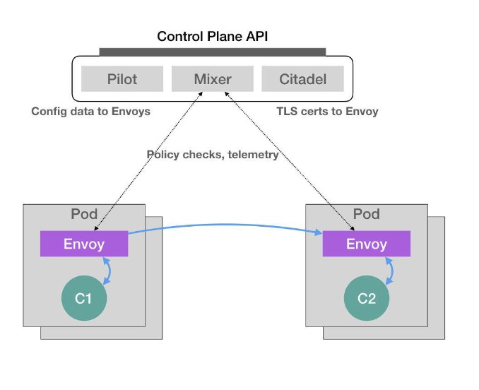

### [声明式 API 在实际使用时的重要意义 - istio](https://github.com/resouer/kubernetes-initializer-tutorial)
在 2017 年 5 月，Google、IBM 和 Lyft 公司，共同宣布了 Istio 开源项目的诞生。很快，这个项目就在技术圈儿里，掀起了一阵名叫“微服务”的热潮，把 Service Mesh 这个新的编排概念推到了风口浪尖。

而 Istio 项目，实际上就是一个基于 Kubernetes 项目的微服务治理框架。它的架构非常清晰，如下所示：

Istio 最根本的组件，是运行在每一个应用 Pod 里的 Envoy 容器。

这个 Envoy 项目是 Lyft 公司推出的一个高性能 C++ 网络代理，而 Istio 项目，则把这个代理服务以 sidecar 容器的方式，运行在了每一个被治理的应用Pod 中，Pod 里的所有容器都共享同一个 Network Namespace。所以，Envoy 容器就能够通过配置 Pod 里的 iptables 规则，把整个 Pod 的进出流量接管下来。这时候，Istio 的控制层（Control Plane）里的 Pilot 组件，就能够通过调用每个 Envoy容器的 API，对这个 Envoy 代理进行配置，从而实现微服务治理。

例子：
```text
假设这个 Istio 架构图左边的 Pod 是已经在运行的应用，而右边的 Pod 则是我们刚刚上线的应用的新版本。
这时候，Pilot 通过调节这两 Pod 里的 Envoy 容器的配置，从而将 90%的流量分配给旧版本的应用，将 10% 的流量分配给新版本应用，并且，还可以在后续的过程中随时调整。
这样，一个典型的“灰度发布”的场景就完成了。比如，Istio 可以调节这个流量从 90%-10%，改到 80%-20%，再到 50%-50%，最后到 0%-100%，就完成了这个灰度发布的过程。

更重要的是，在整个微服务治理的过程中，无论是对 Envoy 容器的部署，还是像上面这样对 Envoy 代理的配置，用户和应用都是完全“无感”的。

这时候可能会有所疑惑：Istio 项目明明需要在每个 Pod 里安装一个 Envoy 容器，又怎么能做到“无感”的呢？

实际上，Istio 项目使用的，是 Kubernetes 中的一个非常重要的功能，叫作 DynamicAdmission Control。

在 Kubernetes 项目中，当一个 Pod 或者任何一个 API 对象被提交给 APIServer 之后，总有一些“初始化”性质的工作需要在它们被 Kubernetes 项目正式处理之前进行。比如，自动为所有 Pod 加上某些标签（Labels）。

而这个“初始化”操作的实现，借助的是一个叫作 Admission 的功能。它其实是Kubernetes 项目里一组被称为 Admission Controller 的代码，可以选择性地被编译进APIServer 中，在 API 对象创建之后会被立刻调用到。

但这就意味着，如果你现在想要添加一些自己的规则到 Admission Controller，就会比较困难。因为，这要求重新编译并重启 APIServer。显然，这种使用方法对 Istio 来说，影响太大了。

所以，Kubernetes 项目额外提供了一种“热插拔”式的 Admission 机制，它就是Dynamic Admission Control，也叫作：Initializer。

如下应用pod：

apiVersion: v1
kind: Pod
metadata:  
  name: myapp-pod  
  labels:    
    app: myapp
spec:  
  containers:  
  - name: myapp-container    
    image: busybox    
    command: ['sh', '-c', 'echo Hello Kubernetes! && sleep 3600']
    
这个 Pod 里面只有一个用户容器，叫作：myapp-container。

接下来，Istio 项目要做的，就是在这个 Pod YAML 被提交给 Kubernetes 之后，在它对应的 API 对象里自动加上 Envoy 容器的配置，使这个对象变成如下所示的样子：

apiVersion: v1
kind: Pod
metadata:  
  name: myapp-pod  
  labels:    
    app: myapp
spec:  
  containers:  
  - name: myapp-container    
    image: busybox    
    command: ['sh', '-c', 'echo Hello Kubernetes! && sleep 3600']  
  - name: envoy    
    image: lyft/envoy:845747b88f102c0fd262ab234308e9e22f693a1    
    command: ["/usr/local/bin/envoy"]    
    ...    
    
可以看到，被 Istio 处理后的这个 Pod 里，除了用户自己定义的 myapp-container 容器之外，多出了一个叫作 envoy 的容器，它就是 Istio 要使用的 Envoy 代理。

那么，Istio 又是如何在用户完全不知情的前提下完成这个操作的呢？

Istio 要做的，就是编写一个用来为 Pod“自动注入”Envoy 容器的 Initializer。

首先，Istio 会将这个 Envoy 容器本身的定义，以 ConfigMap 的方式保存在Kubernetes 当中，这个 ConfigMap（名叫：envoy-initializer）的定义如下所示：

apiVersion: v1
kind: ConfigMap
metadata:  
  name: envoy-initializer
data:
  config: |    
    containers:      
      - name: envoy        
        image: lyft/envoy:845747db88f102c0fd262ab234308e9e22f693a1        
        command: ["/usr/local/bin/envoy"]        
        args:          
          - "--concurrency 4"          
          - "--config-path /etc/envoy/envoy.json"          
          - "--mode serve"        
        ports:          
          - containerPort: 80            
            protocol: TCP        
        resources:          
          limits:            
            cpu: "1000m"            
            memory: "512Mi"          
          requests:            
            cpu: "100m"            
            memory: "64Mi"        
        volumeMounts:          
          - name: envoy-conf            
            mountPath: /etc/envoy    
    volumes:      
      - name: envoy-conf        
        configMap:          
          name: envoy

这个 ConfigMap 的 data 部分，正是一个 Pod 对象的一部分定义。可以看到 Envoy 容器对应的 containers 字段，以及一个用来声明 Envoy配置文件的 volumes 字段。    

不难想到，Initializer 要做的工作，就是把这部分 Envoy 相关的字段，自动添加到用户提交的 Pod 的 API 对象里。可是，用户提交的 Pod 里本来就有 containers 字段和volumes 字段，所以 Kubernetes 在处理这样的更新请求时，就必须使用类似于 git merge 这样的操作，才能将这两部分内容合并在一起。

所以说，在 Initializer 更新用户的 Pod 对象的时候，必须使用 PATCH API 来完成。而这种 PATCH API，正是声明式 API 最主要的能力。

接下来，Istio 将一个编写好的 Initializer，作为一个 Pod 部署在 Kubernetes 中。这个Pod 的定义非常简单，如下所示：

apiVersion: v1
kind: Pod
metadata:  
  labels:    
    app: envoy-initializer  
    name: envoy-initializer
spec:  
  containers:    
  - name: envoy-initializer      
    image: envoy-initializer:0.0.1      
    imagePullPolicy: Always

可以看到，这个 envoy-initializer 使用的 envoy-initializer:0.0.1 镜像，就是一个事先编写好的“自定义控制器”（Custom Controller），这个控制器的主要功能如下：

Kubernetes 的控制器，实际上就是一个“死循环”：它不断地获取“实际状态”，然后与“期望状态”作对比，并以此为依据决定下一步的操作。

而 Initializer 的控制器，不断获取到的“实际状态”，就是用户新创建的 Pod。而它的“期望状态”，则是：这个 Pod 里被添加了 Envoy 容器的定义。    

Go 语言风格的伪代码，来为你描述这个控制逻辑，如下所示：
for {  
    // 获取新创建的 
    Pod  pod := client.GetLatestPod()  
    // Diff 一下，检查是否已经初始化过  
    if !isInitialized(pod) {    
        // 没有？那就来初始化一下    
        doSomething(pod)  
    }
}

如果这个 Pod 里面已经添加过 Envoy 容器，那么就“放过”这个 Pod，进入下一个检查周期。

而如果还没有添加过 Envoy 容器的话，它就要进行 Initialize 操作了，即：修改该 Pod的 API 对象（doSomething 函数）。

这时候，应该能想到，Istio 要往这个 Pod 里合并的字段，正是之前保存在envoy-initializer 这个 ConfigMap 里的数据（即：它的 data 字段的值）。

所以，在 Initializer 控制器的工作逻辑里，首先会从 APIServer 中拿到这个ConfigMap：
func doSomething(pod) {  
    cm := client.Get(ConfigMap, "envoy-initializer")
}

然后，把这个 ConfigMap 里存储的 containers 和 volumes 字段，直接添加进一个空的Pod 对象里：
func doSomething(pod) {  
    cm := client.Get(ConfigMap, "envoy-initializer")  
    newPod := Pod{}  
    newPod.Spec.Containers = cm.Containers  
    newPod.Spec.Volumes = cm.Volumes
}

Kubernetes 的 API 库，提供了一个方法，使得可以直接使用新旧两个 Pod 对象，生成一个 TwoWayMergePatch：
func doSomething(pod) {
    cm := client.Get(ConfigMap, "envoy-initializer")  
    newPod := Pod{}  
    newPod.Spec.Containers = cm.Containers  
    newPod.Spec.Volumes = cm.Volumes  
    // 生成 patch 数据  
    patchBytes := strategicpatch.CreateTwoWayMergePatch(pod, newPod)  
    // 发起 PATCH 请求，修改这个 pod 对象  
    client.Patch(pod.Name, patchBytes)
}

有了这个 TwoWayMergePatch 之后，Initializer 的代码就可以使用这个 patch 的数据，调用 Kubernetes 的 Client，发起一个 PATCH 请求。

这样，一个用户提交的 Pod 对象里，就会被自动加上 Envoy 容器相关的字段。
当然，Kubernetes 还允许你通过配置，来指定要对什么样的资源进行这个 Initialize 操作，比如下面这个例子：

apiVersion: admissionregistration.k8s.io/v1alpha1
kind: InitializerConfiguration
metadata:  
  name: envoy-config
initializers:  
  // 这个名字必须至少包括两个 "."  
  - name: envoy.initializer.kubernetes.io    
    rules:      
      - apiGroups:          
          - "" // 前面说过， "" 就是 core API Group 的意思        
        apiVersions:          
          - v1        
        resources:          
          - pods

这个配置，就意味着 Kubernetes 要对所有的 Pod 进行这个 Initialize 操作，并且，指定了负责这个操作的 Initializer，名叫：envoy-initializer。

而一旦这个 InitializerConfiguration 被创建，Kubernetes 就会把这个 Initializer 的名字，加在所有新创建的 Pod 的 Metadata 上，格式如下所示：

apiVersion: v1
kind: Pod
metadata:  
  initializers:    
    pending:      
      - name: envoy.initializer.kubernetes.io  
  name: myapp-pod  
  labels:    
    app: myapp
...          

这个 Metadata，正是接下来 Initializer 的控制器判断这个 Pod 有没有执行过自己所负责的初始化操作的重要依据（也就是伪代码中 isInitialized() 方法的含义）。

这也就意味着，当在 Initializer 里完成了要做的操作后，一定要记得将这个metadata.initializers.pending 标志清除掉。这一点，在编写 Initializer 代码的时候一定要非常注意。

此外，除了上面的配置方法，还可以在具体的 Pod 的 Annotation 里添加一个如下所示的字段，从而声明要使用某个 Initializer：
apiVersion: v1
kind: Pod
metadata:  
  annotations:    
    "initializer.kubernetes.io/envoy": "true"    
...

在这个 Pod 里，添加了一个 Annotation，写明：initializer.kubernetes.io/envoy=true，这样，就会使用到前面所定义的envoy-initializer 了。

上面就是关于 Initializer 最基本的工作原理和使用方法了。Istio项目的核心，就是由无数个运行在应用 Pod 中的 Envoy 容器组成的服务代理网格，这也正是 Service Mesh 的含义。

而这个机制得以实现的原理，正是借助了 Kubernetes 能够对 API 对象进行在线更新的能力，这也正是Kubernetes“声明式 API”的独特之处：

    首先，所谓“声明式”，指的就是我只需要提交一个定义好的 API 对象来“声明”，我所期望的状态是什么样子。
    其次，“声明式 API”允许有多个 API 写端，以 PATCH 的方式对 API 对象进行修改，而无需关心本地原始 YAML 文件的内容。
    最后，也是最重要的，有了上述两个能力，Kubernetes 项目才可以基于对 API 对象的增、删、改、查，在完全无需外界干预的情况下，完成对“实际状态”和“期望状态”的调谐（Reconcile）过程。

声明式 API，才是 Kubernetes 项目编排能力“赖以生存”的核心所在。

不难看到，无论是对 sidecar 容器的巧妙设计，还是对 Initializer 的合理利用，Istio项目的设计与实现，其实都依托于 Kubernetes 的声明式 API 和它所提供的各种编排能力。可以说，Istio 是在 Kubernetes 项目使用上的一位“集大成者”。
    
    一个 Istio 项目部署完成后，会在 Kubernetes 里创建大约 43 个API 对象。
    
Kubernetes 社区也看得很明白：Istio 项目有多火热，就说明 Kubernetes 这套“声明式 API”有多成功。这，既是 Google Cloud 喜闻乐见的事情，也是 Istio 项目一推出就被 Google 公司和整个技术圈儿热捧的重要原因。

而在使用 Initializer 的流程中，最核心的步骤，莫过于 Initializer“自定义控制器”的编写过程。它遵循的，正是标准的“Kubernetes 编程范式”，即：
    
    如何使用控制器模式，同 Kubernetes 里 API 对象的“增、删、改、查”进行协作，进而完成用户业务逻辑的编写过程。
       
```
