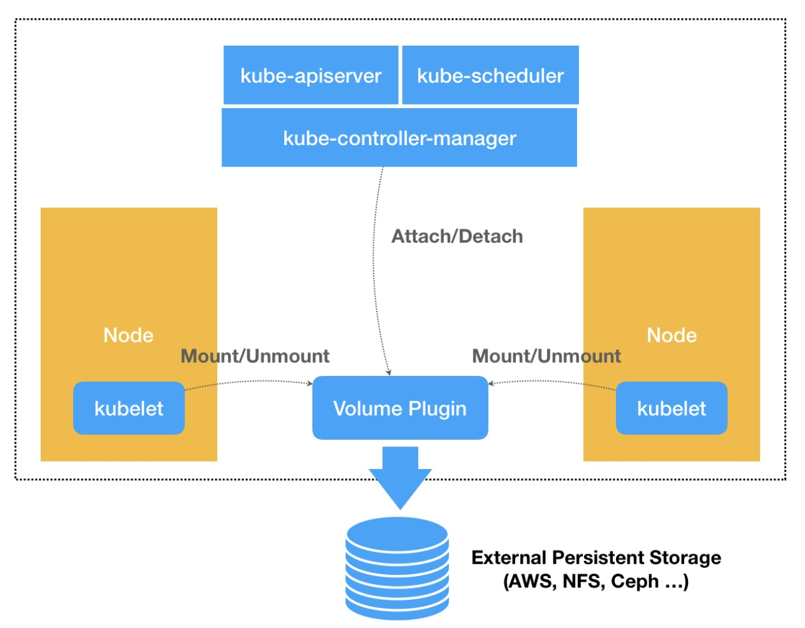
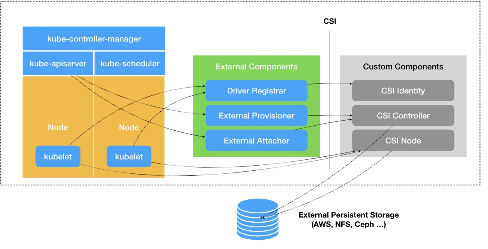

### 在 Kubernetes 中，存储插件的开发有两种方式：FlexVolume 和 CSI

#### FlexVolume 的原理和使用方法
举个例子，现在编写的是一个使用 NFS 实现的 FlexVolume 插件。

对于一个 FlexVolume 类型的 PV 来说，YAML 文件如下所示：
```yaml
apiVersion: v1
kind: PersistentVolume
metadata:
  name: pv-flex-nfs
spec:
  capacity:
    storage: 1Gi
  accessModes:
    - ReadWriteMany
  flexVolume:
    driver: "k8s/nfs"
    fsType: "nfs"
    options:
      server: "192.168.0.170" # nfs 服务地址
      share: "export" # 共享目录
```
可以看到，这个 PV 定义的 Volume 类型是 flexVolume。并且，指定了这个Volume 的 driver 叫作 k8s/nfs。

而 Volume 的 options 字段，则是一个自定义字段。也就是说，它的类型，其实是map[string]string，可以在这一部分自由地加上想要定义的参数。

在上面这个例子里，options 字段指定了 NFS 服务器的地址（server: “10.10.0.25”），以及 NFS 共享目录的名字（share: “export”）。当然，这里定义的所有参数，后面都会被 FlexVolume 拿到。

可以使用 [这个 Docker 镜像](https://github.com/ehough/docker-nfs-server) 轻松地部署一个试验用的 NFS 服务器。

像这样的一个 PV 被创建后，一旦和某个 PVC 绑定起来，这个 FlexVolume 类型的Volume 就会进入到 Volume 处理流程。

这个流程的名字叫作“两阶段处理”，即“Attach 阶段”和“Mount 阶段”。它们的主要作用，是在 Pod 所绑定的宿主机上，完成这个 Volume 目录的持久化过程，比如为虚拟机挂载磁盘（Attach），或者挂载一个 NFS 的共享目录（Mount）。

而在具体的控制循环中，这两个操作实际上调用的，正是 Kubernetes 的 pkg/volume 目录下的存储插件（Volume Plugin）。在这个例子里，就是 pkg/volume/flexvolume这个目录里的代码。

当然了，这个目录其实只是 FlexVolume 插件的入口，以“Mount 阶段”为例，在FlexVolume 目录里，它的处理过程非常简单，如下所示：
```text
// SetUpAt creates new directory.
func (f *flexVolumeMounter) SetUpAt(dir string, fsGroup *int64) error {  
    ...  
    call := f.plugin.NewDriverCall(mountCmd)  
    
    // Interface parameters  
    call.Append(dir)  
    
    extraOptions := make(map[string]string)  
    
    // pod metadata  
    extraOptions[optionKeyPodName] = f.podName  
    extraOptions[optionKeyPodNamespace] = f.podNamespace  
    
    ...  
    
    call.AppendSpec(f.spec, f.plugin.host, extraOptions)  
    _, err = call.Run()  
    
    ...  
    
    return nil
}
```
上面这个名叫 SetUpAt() 的方法，正是 FlexVolume 插件对“Mount 阶段”的实现位置。而 SetUpAt() 实际上只做了一件事，那就是封装出了一行命令（即：NewDriverCall），由 kubelet 在“Mount 阶段”去执行。

在这个例子中，kubelet 要通过插件在宿主机上执行的命令，如下所示：
```text
/usr/libexec/kubernetes/kubelet-plugins/volume/exec/k8s~nfs/nfs mount <mount dir> <json params>
```
其中，/usr/libexec/kubernetes/kubelet-plugins/volume/exec/k8s~nfs/nfs 就是插件的可执行文件的路径。这个名叫 nfs 的文件，正是要编写的插件的实现。它可以是一个二进制文件，也可以是一个脚本。总之，只要能在宿主机上被执行起来即可。

而且这个路径里的 k8s~nfs 部分，正是这个插件在 Kubernetes 里的名字，它是从driver="k8s/nfs"字段解析出来的。

这个 driver 字段的格式是：vendor/driver。比如，一家存储插件的提供商（vendor）的名字叫作 k8s，提供的存储驱动（driver）是 nfs，那么 Kubernetes 就会使用 k8s~nfs 来作为插件名。

所以说，当编写完了 FlexVolume 的实现之后，一定要把它的可执行文件放在每个节点的插件目录下。

紧跟在可执行文件后面的“mount”参数，定义的就是当前的操作。在 FlexVolume里，这些操作参数的名字是固定的，比如 init、mount、unmount、attach，以及dettach 等等，分别对应不同的 Volume 处理操作。

而跟在 mount 参数后面的两个字段：<mount dir>和<json params>，则是FlexVolume 必须提供给这条命令的两个执行参数。

其中第一个执行参数<mount dir>，正是 kubelet 调用 SetUpAt() 方法传递来的 dir 的值。它代表的是当前正在处理的 Volume 在宿主机上的目录。在上面例子里，这个路径如下所示：
```text
/var/lib/kubelet/pods/<Pod ID>/volumes/k8s~nfs/test
```
其中，test 正是前面定义的 PV 的名字；而 k8s~nfs，则是插件的名字。可以看到，插件的名字正是从你声明的 driver="k8s/nfs"字段里解析出来的。

而第二个执行参数<json params>，则是一个 JSON Map 格式的参数列表。在前面PV 里定义的 options 字段的值，都会被追加在这个参数里。此外，在 SetUpAt() 方法里可以看到，这个参数列表里还包括了 Pod 的名字、Namespace 等元数据（Metadata）。

在明白了存储插件的调用方式和参数列表之后，这个插件的可执行文件的实现部分就非常容易理解了。

在这个例子中，直接编写了一个简单的 shell 脚本来作为插件的实现，它对“Mount 阶段”的处理过程，如下所示：
```shell
domount(){
  MNTPATH=$1
  
  NFS_SERVER=$(echo $2 | jq -r '.server')
  SHARE=$(echo $2 | jq -r '.share')
  
  ...
  
  mkdir -p $(MNTPATH) &> /dev/null
  
  mount -t nfs $(NFS_SERVER):/$(SHARE) $(MNTPATH) &> /dev/null
  if [$? -ne 0]; then
    err "{\"status\":\"Failure\",\"message\":\"Failed to mount $(NFS_SERVER):$(SHARE) $(MNTPATH) &> /dev/null\"}"
    exit 1
  fi 
  log '{"status":"Success"}' 
  exit 0
}
```
可以看到，当 kubelet 在宿主机上执行“nfs mount <mount dir> <jsonparams>”的时候，这个名叫 nfs 的脚本，就可以直接从<mount dir>参数里拿到Volume 在宿主机上的目录，即：MNTPATH=$<json params>

有了这三个参数之后，这个脚本最关键的一步，当然就是执行：mount -t nfs MY_ZUES_CHAR {NFS_SERVER}:/${SHARE} ${MNTPATH}

需要注意的是，当这个 mount -t nfs 操作完成后，必须把一个 JOSN 格式的字符串，比如：{“status”: “Success”}，返回给调用者，也就是 kubelet。这是 kubelet 判断这次调用是否成功的唯一依据。

综上所述，在“Mount 阶段”，kubelet 的 VolumeManagerReconcile 控制循环里的一次“调谐”操作的执行流程，如下所示：
```text
kubelet 
    --> pkg/volume/flexvolume.SetUpAt() 
        --> /usr/libexec/kubernetes/kubelet-plugins/volume/exec/k8s~nfs/nfs mount <mount dir> <json params>
```

这个 NFS 的 FlexVolume 的完整实现，在这个 [GitHub 库](https://github.com/kubernetes/examples/blob/master/staging/volumes/flexvolume/nfs) 里，如果想用 Go 语言编写 FlexVolume 的话，可以用这个的 [例子](https://github.com/kubernetes/frakti/tree/master/pkg/flexvolume) 。

NFS 这样的文件系统存储，并不需要在宿主机上挂载磁盘或者块设备，所以，也就不需要实现 attach 和 dettach 操作了。

像这样的 FlexVolume 实现方式，虽然简单，但局限性却很大。

比如，跟 Kubernetes 内置的 NFS 插件类似，这个 NFS FlexVolume 插件，也不能支持Dynamic Provisioning（即：为每个 PVC 自动创建 PV 和对应的 Volume）。除非再为它编写一个专门的 External Provisioner。

再比如，插件在执行 mount 操作的时候，可能会生成一些挂载信息。这些信息，在后面执行 unmount 操作的时候会被用到。可是，在上述 FlexVolume 的实现里，没办法把这些信息保存在一个变量里，等到 unmount 的时候直接使用。

这个原因也很容易理解：FlexVolume 每一次对插件可执行文件的调用，都是一次完全独立的操作。所以，只能把这些信息写在一个宿主机上的临时文件里，等到 unmount的时候再去读取。

这也是为什么，需要有 Container Storage Interface（CSI）这样更完善、更编程友好的插件方式。

### CSI

#### CSI 插件体系的设计原理
其实，通过对 FlexVolume 的描述，应该可以明白，默认情况下，Kubernetes 里通过存储插件管理容器持久化存储的原理，可以用如下所示的示意图来描述：



可以看到，在上述体系下，无论是 FlexVolume，还是 Kubernetes 内置的其他存储插件，它们实际上担任的角色，仅仅是 Volume 管理中的“Attach 阶段”和“Mount 阶段”的具体执行者。而像 Dynamic Provisioning 这样的功能，就不是存储插件的责任，而是Kubernetes 本身存储管理功能的一部分。

相比之下，CSI 插件体系的设计思想，就是把这个 Provision 阶段，以及 Kubernetes 里的一部分存储管理功能，从主干代码里剥离出来，做成了几个单独的组件。这些组件会通过Watch API 监听 Kubernetes 里与存储相关的事件变化，比如 PVC 的创建，来执行具体的存储管理动作。

而这些管理动作，比如“Attach 阶段”和“Mount 阶段”的具体操作，实际上就是通过调用 CSI 插件来完成的。

这种设计思路，我可以用如下所示的一幅示意图来表示：


可以看到，这套存储插件体系多了三个独立的外部组件（External Components），即：Driver Registrar、External Provisioner 和 External Attacher，对应的正是从Kubernetes 项目里面剥离出来的那部分存储管理功能。

需要注意的是，External Components 虽然是外部组件，但依然由 Kubernetes 社区来开发和维护。

图中最右侧的部分，就是需要编写代码来实现的 CSI 插件，一个 CSI 插件只有一个二进制文件，但它会以 gRPC 的方式对外提供三个服务（gRPC Service），分别叫作：CSIIdentity、CSI Controller 和 CSI Node。

#### 三个 External Components
Driver Registrar 组件，负责将插件注册到 kubelet 里面（这可以类比为，将可执行文件放在插件目录下）。而在具体实现上，Driver Registrar 需要请求 CSI 插件的Identity 服务来获取插件信息。

External Provisioner 组件，负责的正是 Provision 阶段。在具体实现上，ExternalProvisioner 监听（Watch）了 APIServer 里的 PVC 对象。当一个 PVC 被创建时，它就会调用 CSI Controller 的 CreateVolume 方法，为你创建对应 PV。

此外，如果使用的存储是公有云提供的磁盘（或者块设备）的话，这一步就需要调用公有云（或者块设备服务）的 API 来创建这个 PV 所描述的磁盘（或者块设备）了。

不过，由于 CSI 插件是独立于 Kubernetes 之外的，所以在 CSI 的 API 里不会直接使用Kubernetes 定义的 PV 类型，而是会自己定义一个单独的 Volume 类型。

最后一个External Attacher 组件，负责的正是“Attach 阶段”，在具体实现上，它监听了 APIServer 里 VolumeAttachment 对象的变化。VolumeAttachment 对象是Kubernetes 确认一个 Volume 可以进入“Attach 阶段”的重要标志。

一旦出现了 VolumeAttachment 对象，External Attacher 就会调用 CSI Controller 服务的 ControllerPublish 方法，完成它所对应的 Volume 的 Attach 阶段。

而 Volume 的“Mount 阶段”，并不属于 External Components 的职责。当 kubelet 的VolumeManagerReconciler 控制循环检查到它需要执行 Mount 操作的时候，会通过pkg/volume/csi 包，直接调用 CSI Node 服务完成 Volume 的“Mount 阶段”。

在实际使用 CSI 插件的时候，会将这三个 External Components 作为 sidecar 容器和CSI 插件放置在同一个 Pod 中。由于 External Components 对 CSI 插件的调用非常频繁，所以这种 sidecar 的部署方式非常高效。

#### CSI 插件里三个服务：CSI Identity、CSI Controller 和 CSI Node

CSI 插件的 CSI Identity 服务，负责对外暴露这个插件本身的信息，如下所示：
```text
service Identity {  
    // return the version and name of the plugin  
    rpc GetPluginInfo(GetPluginInfoRequest)    
      returns (GetPluginInfoResponse) {}  
    // reports whether the plugin has the ability of serving the Controller interface  
    rpc GetPluginCapabilities(GetPluginCapabilitiesRequest)    
      returns (GetPluginCapabilitiesResponse) {}  
    // called by the CO just to check whether the plugin is running or not  
    rpc Probe (ProbeRequest)    
      returns (ProbeResponse) {}
}
```

CSI Controller 服务，定义的则是对 CSI Volume（对应 Kubernetes 里的 PV）的管理接口，比如：创建和删除 CSI Volume、对 CSI Volume 进行 Attach/Dettach（在 CSI里，这个操作被叫作 Publish/Unpublish），以及对 CSI Volume 进行 Snapshot 等，它们的接口定义如下所示：
```text
service Controller {  
    // provisions a volume  
    rpc CreateVolume (CreateVolumeRequest)    
      returns (CreateVolumeResponse) {}  
      
    // deletes a previously provisioned volume  
    rpc DeleteVolume (DeleteVolumeRequest)    
      returns (DeleteVolumeResponse) {}  
    
    // make a volume available on some required node  
    rpc ControllerPublishVolume (ControllerPublishVolumeRequest)    
      returns (ControllerPublishVolumeResponse) {} 
    
    // make a volume un-available on some required node  
    rpc ControllerUnpublishVolume (ControllerUnpublishVolumeRequest)    
      returns (ControllerUnpublishVolumeResponse) {}  
    
    ...
    
    // make a snapshot  
    rpc CreateSnapshot (CreateSnapshotRequest)    
      returns (CreateSnapshotResponse) {}  
      
    // Delete a given snapshot  
    rpc DeleteSnapshot (DeleteSnapshotRequest)    
      returns (DeleteSnapshotResponse) {}  
    
    ...
}
```
不难发现，CSI Controller 服务里定义的这些操作有个共同特点，那就是都无需在宿主机上进行，而是属于 Kubernetes 里 Volume Controller 的逻辑，也就是属于 Master 节点的一部分。

需要注意的是，正如在前面提到的那样，CSI Controller 服务的实际调用者，并不是Kubernetes（即：通过 pkg/volume/csi 发起 CSI 请求），而是 External Provisioner 和External Attacher。这两个 External Components，分别通过监听 PVC 和VolumeAttachement 对象，来跟 Kubernetes 进行协作。

而 CSI Volume 需要在宿主机上执行的操作，都定义在了 CSI Node 服务里面，如下所示：
```text
service Node {  
    // temporarily mount the volume to a staging path  
    rpc NodeStageVolume (NodeStageVolumeRequest)    
        returns (NodeStageVolumeResponse) {}  
        
    // unmount the volume from staging path  
    rpc NodeUnstageVolume (NodeUnstageVolumeRequest)    
        returns (NodeUnstageVolumeResponse) {}  
        
    // mount the volume from staging to target path  
    rpc NodePublishVolume (NodePublishVolumeRequest)    
        returns (NodePublishVolumeResponse) {}  
        
    // unmount the volume from staging path  
    rpc NodeUnpublishVolume (NodeUnpublishVolumeRequest)    
        returns (NodeUnpublishVolumeResponse) {}  
        
    // stats for the volume  
    rpc NodeGetVolumeStats (NodeGetVolumeStatsRequest)
        returns (NodeGetVolumeStatsResponse) {}  
    
    ...  
    
    // Similar to NodeGetId  
    rpc NodeGetInfo (NodeGetInfoRequest)    
        returns (NodeGetInfoResponse) {}
}
```
需要注意的是，“Mount 阶段”在 CSI Node 里的接口，是由 NodeStageVolume 和NodePublishVolume 两个接口共同实现的。

相比于 FlexVolume，CSI 的设计思想，把插件的职责从“两阶段处理”，扩展成了 Provision、Attach 和 Mount 三个阶段，其中，Provision 等价于“创建磁盘”，Attach 等价于“挂载磁盘到虚拟机”，Mount 等价于“将该磁盘格式化后，挂载在Volume 的宿主机目录上”。

当 AttachDetachController 需要进行“Attach”操作时（“Attach 阶段”），它实际上会执行到 pkg/volume/csi 目录中，创建一个 VolumeAttachment 对象，从而触发External Attacher 调用 CSI Controller 服务的 ControllerPublishVolume 方法。当 VolumeManagerReconciler 需要进行“Mount”操作时（“Mount 阶段”），它实际上也会执行到 pkg/volume/csi 目录中，直接向 CSI Node 服务发起调用NodePublishVolume 方法的请求。
