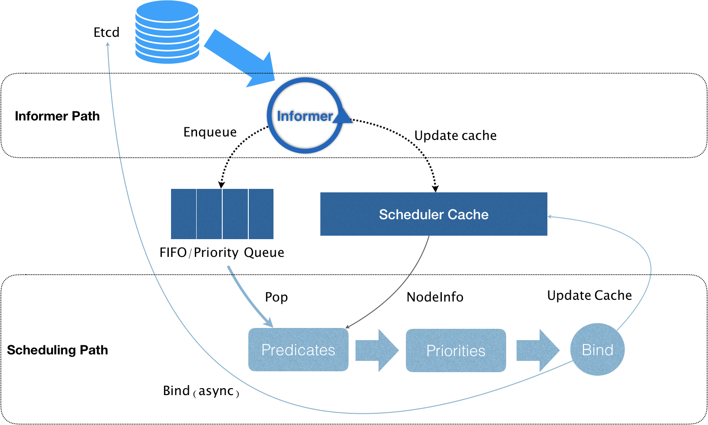

### [默认调度器](https://v1-19.docs.kubernetes.io/zh/docs/tasks/extend-kubernetes/configure-multiple-schedulers/)

### Kubernetes 的默认调度器（default scheduler）
- 在 Kubernetes 项目中，默认调度器的主要职责，就是为一个新创建出来的 Pod，寻找一个最合适的节点（Node）。

而这里“最合适”的含义，包括两层：
> 从集群所有的节点中，根据调度算法挑选出所有可以运行该 Pod 的节点；

> 从第一步的结果中，再根据调度算法挑选一个最符合条件的节点作为最终结果。

所以在具体的调度流程中，默认调度器会首先调用一组叫作 Predicate 的调度算法，来检查每个 Node。然后，再调用一组叫作 Priority 的调度算法，来给上一步得到的结果里的每个 Node 打分。最终的调度结果，就是得分最高的那个 Node。

调度器对一个 Pod 调度成功，实际上就是将它的 spec.nodeName 字段填上调度结果的节点名字。

在 Kubernetes 中，上述调度机制的工作原理，可以用如下所示的一幅示意图来表示。

可以看到，Kubernetes 的调度器的核心，实际上就是两个相互独立的控制循环。

其中，第一个控制循环，我们可以称之为 Informer Path。它的主要目的，是启动一系列 Informer，用来监听（Watch）Etcd 中 Pod、Node、Service 等与调度相关的 API 对象的变化。比如，当一个待调度 Pod（即：它的 nodeName 字段是空的）被创建出来之后，调度器就会通过 Pod Informer 的 Handler，将这个待调度 Pod 添加进调度队列。

在默认情况下，Kubernetes 的调度队列是一个 PriorityQueue（优先级队列），并且当某些集群信息发生变化的时候，调度器还会对调度队列里的内容进行一些特殊操作。这里的设计，主要是出于调度优先级和抢占的考虑。

