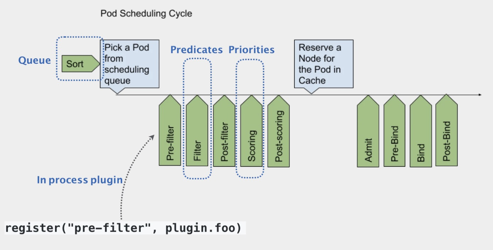

### [默认调度器](https://v1-19.docs.kubernetes.io/zh/docs/tasks/extend-kubernetes/configure-multiple-schedulers/)

### Kubernetes 的默认调度器（default scheduler）
- 在 Kubernetes 项目中，默认调度器的主要职责，就是为一个新创建出来的 Pod，寻找一个最合适的节点（Node）。

而这里“最合适”的含义，包括两层：
> 从集群所有的节点中，根据调度算法挑选出所有可以运行该 Pod 的节点；

> 从第一步的结果中，再根据调度算法挑选一个最符合条件的节点作为最终结果。

所以在具体的调度流程中，默认调度器会首先调用一组叫作 Predicate 的调度算法，来检查每个 Node。然后，再调用一组叫作 Priority 的调度算法，来给上一步得到的结果里的每个 Node 打分。最终的调度结果，就是得分最高的那个 Node。

调度器对一个 Pod 调度成功，实际上就是将它的 spec.nodeName 字段填上调度结果的节点名字。

在 Kubernetes 中，上述调度机制的工作原理，可以用如下所示的一幅示意图来表示。

可以看到，Kubernetes 的调度器的核心，实际上就是两个相互独立的控制循环。

其中，第一个控制循环，我们可以称之为 Informer Path。它的主要目的，是启动一系列 Informer，用来监听（Watch）Etcd 中 Pod、Node、Service 等与调度相关的 API 对象的变化。比如，当一个待调度 Pod（即：它的 nodeName 字段是空的）被创建出来之后，调度器就会通过 Pod Informer 的 Handler，将这个待调度 Pod 添加进调度队列。

在默认情况下，Kubernetes 的调度队列是一个 PriorityQueue（优先级队列），并且当某些集群信息发生变化的时候，调度器还会对调度队列里的内容进行一些特殊操作。这里的设计，主要是出于调度优先级和抢占的考虑。

此外，Kubernetes 的默认调度器还要负责对调度器缓存（即：scheduler cache）进行更新。事实上，Kubernetes 调度部分进行性能优化的一个最根本原则，就是尽最大可能将集群信息 Cache 化，以便从根本上提高 Predicate 和 Priority 调度算法的执行效率。

而第二个控制循环，是调度器负责 Pod 调度的主循环，我们可以称之为 Scheduling Path。

Scheduling Path 的主要逻辑，就是不断地从调度队列里出队一个 Pod。然后，调用 Predicates 算法进行“过滤”。这一步“过滤”得到的一组 Node，就是所有可以运行这个 Pod 的宿主机列表。当然，Predicates 算法需要的 Node 信息，都是从 Scheduler Cache 里直接拿到的，这是调度器保证算法执行效率的主要手段之一。

接下来，调度器就会再调用 Priorities 算法为上述列表里的 Node 打分，分数从 0 到 10。得分最高的 Node，就会作为这次调度的结果。

调度算法执行完成后，调度器就需要将 Pod 对象的 nodeName 字段的值，修改为上述 Node 的名字。这个步骤在 Kubernetes 里面被称作 Bind。

但是，为了不在关键调度路径里远程访问 APIServer，Kubernetes 的默认调度器在 Bind 阶段，只会更新 Scheduler Cache 里的 Pod 和 Node 的信息。这种基于“乐观”假设的 API 对象更新方式，在 Kubernetes 里被称作 Assume。

Assume 之后，调度器才会创建一个 Goroutine 来异步地向 APIServer 发起更新 Pod 的请求，来真正完成 Bind 操作。如果这次异步的 Bind 过程失败了，其实也没有太大关系，等 Scheduler Cache 同步之后一切就会恢复正常。

当然，正是由于上述 Kubernetes 调度器的“乐观”绑定的设计，当一个新的 Pod 完成调度需要在某个节点上运行起来之前，该节点上的 kubelet 还会通过一个叫作 Admit 的操作来再次验证该 Pod 是否确实能够运行在该节点上。这一步 Admit 操作，实际上就是把一组叫作 GeneralPredicates 的、最基本的调度算法，比如：“资源是否可用”“端口是否冲突”等再执行一遍，作为 kubelet 端的二次确认。

除了上述的“Cache 化”和“乐观绑定”，Kubernetes 默认调度器还有一个重要的设计，那就是“无锁化”。

在 Scheduling Path 上，调度器会启动多个 Goroutine 以节点为粒度并发执行 Predicates 算法，从而提高这一阶段的执行效率。而与之类似的，Priorities 算法也会以 MapReduce 的方式并行计算然后再进行汇总。而在这些所有需要并发的路径上，调度器会避免设置任何全局的竞争资源，从而免去了使用锁进行同步带来的巨大的性能损耗。

所以，在这种思想的指导下，如果你再去查看一下前面的调度器原理图，你就会发现，Kubernetes 调度器只有对调度队列和 Scheduler Cache 进行操作时，才需要加锁。而这两部分操作，都不在 Scheduling Path 的算法执行路径上。

当然，Kubernetes 调度器的上述设计思想，也是在集群规模不断增长的演进过程中逐步实现的。尤其是 “Cache 化”，这个变化其实是最近几年 Kubernetes 调度器性能得以提升的一个关键演化。

不过，随着 Kubernetes 项目发展到今天，它的默认调度器也已经来到了一个关键的十字路口。事实上，Kubernetes 现今发展的主旋律，是整个开源项目的“民主化”。也就是说，Kubernetes 下一步发展的方向，是组件的轻量化、接口化和插件化。所以，我们才有了 CRI、CNI、CSI、CRD、Aggregated APIServer、Initializer、Device Plugin 等各个层级的可扩展能力。可是，默认调度器，却成了 Kubernetes 项目里最后一个没有对外暴露出良好定义过的、可扩展接口的组件。

当然，这是有一定的历史原因的。在过去几年，Kubernetes 发展的重点，都是以功能性需求的实现和完善为核心。在这个过程中，它的很多决策，还是以优先服务公有云的需求为主，而性能和规模则居于相对次要的位置。

而现在，随着 Kubernetes 项目逐步趋于稳定，越来越多的用户开始把 Kubernetes 用在规模更大、业务更加复杂的私有集群当中。很多以前的 Mesos 用户，也开始尝试使用 Kubernetes 来替代其原有架构。在这些场景下，对默认调度器进行扩展和重新实现，就成了社区对 Kubernetes 项目最主要的一个诉求。

所以，Kubernetes 的默认调度器，是目前这个项目里为数不多的、正在经历大量重构的核心组件之一。这些正在进行的重构的目的，一方面是将默认调度器里大量的“技术债”清理干净；另一方面，就是为默认调度器的可扩展性设计进行铺垫。

而 Kubernetes 默认调度器的可扩展性设计，可以用如下所示的一幅示意图来描述：

可以看到，默认调度器的可扩展机制，在 Kubernetes 里面叫作 Scheduler Framework。顾名思义，这个设计的主要目的，就是在调度器生命周期的各个关键点上，为用户暴露出可以进行扩展和实现的接口，从而实现由用户自定义调度器的能力。

上图中，每一个绿色的箭头都是一个可以插入自定义逻辑的接口。比如，上面的 Queue 部分，就意味着你可以在这一部分提供一个自己的调度队列的实现，从而控制每个 Pod 开始被调度（出队）的时机。

而 Predicates 部分，则意味着你可以提供自己的过滤算法实现，根据自己的需求，来决定选择哪些机器。

需要注意的是，上述这些可插拔式逻辑，都是标准的 Go 语言插件机制（Go plugin 机制），也就是说，你需要在编译的时候选择把哪些插件编译进去。

有了上述设计之后，扩展和自定义 Kubernetes 的默认调度器就变成了一件非常容易实现的事情。这也意味着默认调度器在后面的发展过程中，必然不会在现在的实现上再添加太多的功能，反而还会对现在的实现进行精简，最终成为 Scheduler Framework 的一个最小实现。而调度领域更多的创新和工程工作，就可以交给整个社区来完成了。这个思路，是完全符合我在前面提到的 Kubernetes 的“民主化”设计的。

不过，这样的 Scheduler Framework 也有一个不小的问题，那就是一旦这些插入点的接口设计不合理，就会导致整个生态没办法很好地把这个插件机制使用起来。而与此同时，这些接口本身的变更又是一个费时费力的过程，一旦把控不好，就很可能会把社区推向另一个极端，即：Scheduler Framework 没法实际落地，大家只好都再次 fork kube-scheduler。

