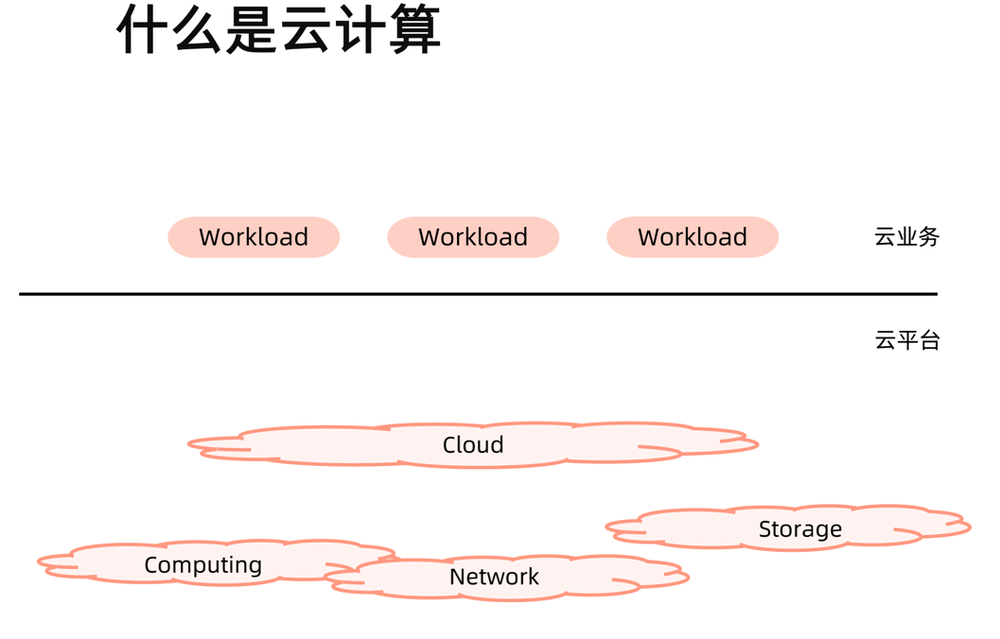
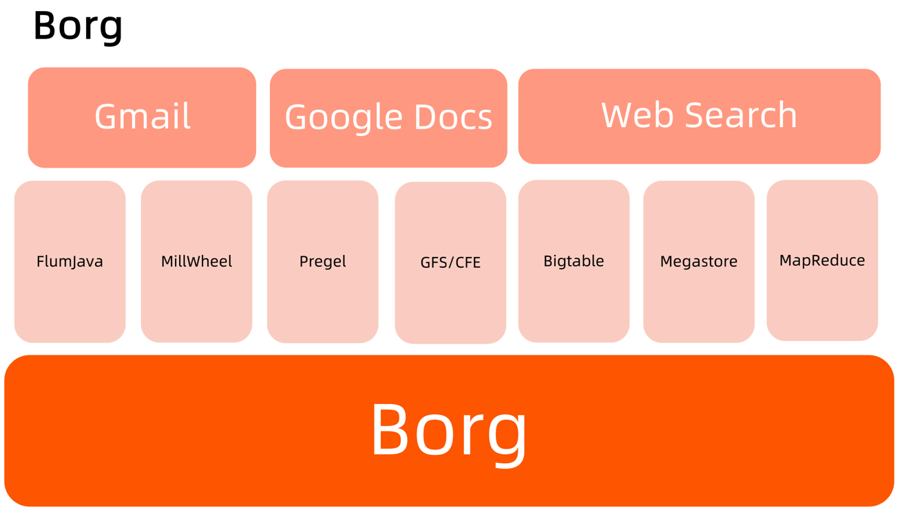
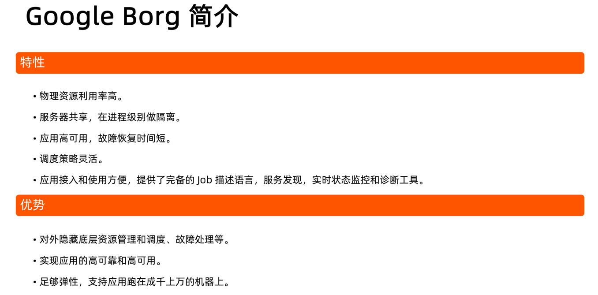

### cloud computing

### 云计算平台的分类

#### 以 Openstack 为典型的虚拟化平台

- 虚拟机构建和业务代码部署分离。

- 可变的基础架构使后续维护风险变大。

#### 以谷歌 borg 为典型的基于进程的作业调度平台

- 技术的迭代引发 borg 的换代需求。

- 早期的隔离依靠 chroot jail 实现，一些不合理的设计需要在新产品中改进。

    - 对象之间的强依赖 job 和 task 是强包含关系，不利于重组。

    - 所有容器共享 IP，会导致端口冲突，隔离困难等问题。

    - 为超级用户添加复杂逻辑导致系统过于复杂。

