What`s docker?

- 基于 Linux 内核的 Cgroup，Namespace，以及 Union FS 等技术，对进程进行封装隔离，属于操作系统层面的虚拟化技术，由于隔离的进程独立于宿主和其它的隔离的进程，因此也称其为容器。

- 最初实现是基于 LXC，从 0.7 以后开始去除 LXC，转而使用自行开发的 Libcontainer，从 1.11 开始，则进一步演进为使用 runC 和 Containerd。

- Docker 在容器的基础上，进行了进一步的封装，从文件系统、网络互联到进程隔离等等，极大的简化了容器的创建和维护，使得 Docker 技术比虚拟机技术更为轻便、快捷。

why use docker?

- 更高效地利用系统资源
- 更快速的启动时间
- 一致的运行环境
- 持续交付和部署
- 更轻松地迁移
- 更轻松地维护和扩展

install docker on ubuntu

```shell
#在 ubuntu 上安装 Docker 运行时，参考 https://docs.docker.com/engine/install/ubuntu/
$ sudo apt-get update
$ sudo apt-get install \
apt-transport-https \
ca-certificates \
curl \
gnupg-agent \
software-properties-common
$ curl -fsSL https://download.docker.com/linux/ubuntu/gpg | sudo apt-key add -
$ sudo add-apt-repository \
"deb [arch=amd64] https://download.docker.com/linux/ubuntu \
$(lsb_release -cs) \
stable"
$ sudo apt-get update
$ sudo apt-get install docker-ce docker-ce-cli containerd.io
```

order by docker?

```
启动：
• docker run
    -it 交互
    -d 后台运行
    -p 端口映射
    -v 磁盘挂载
• 启动已终止容器
    docker start
• 停止容器
    docker stop
• 查看容器进程
    docker ps
```

container operation

```text
• 查看容器细节：
    docker inspect <containerid> • 进入容器；
• Docker attach：
    通过 nsenter
    PID=$(docker inspect --format "{{ .State.Pid }}" 
<container>)
    $ nsenter --target $PID --mount --uts --ipc --net --pid
• 拷贝文件至容器内：
    docker cp file1 <containerid>:/file-to-path
• cat Dockerfile
    FROM ubuntu
    ENV MY_SERVICE_PORT=80
    ADD bin/amd64/httpserver /httpserver
    ENTRYPOINT /httpserver
• 将 Dockerfile 打包成镜像
    docker build -t cncamp/httpserver:${tag} .
    docker push cncamp/httpserver:v1.0
• 运行容器
    docker run -d cncamp/httpserver:v1.0    
```

容器标准

```text
• Open Container Initiative（OCI） 
    • 轻量级开放式管理组织（项目）
• OCI 主要定义两个规范
    • Runtime Specification
        • 文件系统包如何解压至硬盘，共运行时运行。
    • Image Specification
        • 如何通过构建系统打包，生成镜像清单（Manifest）、文件系统序列化文件、镜像配置。
```

# namespace

```text
• Linux Namespace 是一种 Linux Kernel 提供的资源隔离方案：
    • 系统可以为进程分配不同的 Namespace； 
    • 并保证不同的 Namespace 资源独立分配、进程彼此隔离，即不同的 Namespace 下的进程互不干扰 。
```

linux 进程数据结构

```text
struct task_struct {
    ...
    /* namespaces */
    struct nsproxy *nsproxy;
    ...
}
```

linux Namespace 数据结构

```text
struct nsproxy {
    atomic_t count;
    struct uts_namespace *uts_ns;
    struct ipc_namespace *ipc_ns;
    struct mnt_namespace *mnt_ns;
    struct pid_namespace *pid_ns_for_children;
    struct net *net_ns; 
}
```

linux Namespace 操作方法

```text
• clone
    在创建新进程的系统调用时，可以通过 flags 参数指定需要新建的 Namespace 类型：
    // CLONE_NEWCGROUP / CLONE_NEWIPC / CLONE_NEWNET / CLONE_NEWNS / CLONE_NEWPID / CLONE_NEWUSER / CLONE_NEWUTS
    int clone(int (*fn)(void *), void *child_stack, int flags, void *arg) 

• setns
    该系统调用可以让调用进程加入某个已经存在的 Namespace 中：
    Int setns(int fd, int nstype) 

• unshare
    该系统调用可以将调用进程移动到新的 Namespace 下：
    int unshare(int flags)
```

Namespace 类型 隔离资源 Kernel 版本

IPC System V IPC 和 POSIX 消息队列 2.6.19

Network 网络设备、网络协议栈、网络端口等 2.6.29

PID 进程 2.6.14

Mount 挂载点 2.4.19

UTS 主机名和域名 2.6.19

USR 用户和用户组 3.8

### Pid namespace

- 不同用户的进程就是通过 Pid namespace 隔离开的，且不同 namespace 中可以有相同 Pid。

- 有了 Pid namespace, 每个 namespace 中的 Pid 能够相互隔离。

### net namespace

- 网络隔离是通过 net namespace 实现的， 每个 net namespace 有独立的 network devices, IP addresses, IP routing tables, /proc/net 目录。

- Docker 默认采用 veth 的方式将 container 中的虚拟网卡同 host 上的一个 docker bridge: docker0 连接在一起。

### ipc namespace

- Container 中进程交互还是采用 linux 常见的进程间交互方法 （interprocess communication – IPC）, 包括常见的信号量、消息队列和共享内存。

- container 的进程间交互实际上还是 host上 具有相同 Pid namespace 中的进程间交互，因此需要在 IPC 资源申请时加入 namespace 信息 - 每个 IPC 资源有一个唯一的 32 位 ID。

### mnt namespace

- mnt namespace 允许不同 namespace 的进程看到的文件结构不同，这样每个 namespace 中的进程所看到的文件目录就被隔离开了。

### uts namespace

- UTS(“UNIX Time-sharing System”) namespace允许每个 container 拥有独立的 hostname 和 domain name, 使其在网络上可以被视作一个独立的节点而非 Host
  上的一个进程。

### user namespace

- 每个 container 可以有不同的 user 和 group id, 也就是说可以在 container 内部用 container 内部的用户执行程序而非 Host 上的用户。

## namespace 的常用操作

- 查看当前系统的 namespace： lsns –t <type>

- 查看某进程的 namespace： ls -la /proc/<pid>/ns/

- 进入某 namespace 运行命令： nsenter -t <pid> -n ip addr

- 在新 network namespace 执行 sleep 指令： unshare -fn sleep 60

- 查看进程信息 ps -ef|grep sleep root 955811 876959 0 00:42 pts/1 00:00:00 unshare -fn sleep 6000 root 955812 955811 0 00:42
  pts/1 00:00:00 sleep 6000

- 查看网络 Namespace lsns -t net 4026532650 net 2 955811 root unassigned unshare -fn sleep 6000

- 进入改进程所在 Namespace 查看网络配置，与主机不一致 nsenter -t 955811 -n ip a 1: lo: <LOOPBACK> mtu 65536 qdisc noop state DOWN group
  default qlen 1000 link/loopback 00:00:00:00:00:00 brd 00:00:00:00:00:00 2: tunl0@NONE: <NOARP> mtu 1480 qdisc noop
  state DOWN group default qlen 1000 link/ipip 0.0.0.0 brd 0.0.0.0

# Cgroups

- Cgroups （Control Groups）是 Linux 下用于对一个或一组进程进行资源控制和监控的机制；

- 可以对诸如 CPU 使用时间、内存、磁盘 I/O 等进程所需的资源进行限制；

- 不同资源的具体管理工作由相应的 Cgroup 子系统（Subsystem）来实现 ；

- 针对不同类型的资源限制，只要将限制策略在不同的的子系统上进行关联即可 ；

- Cgroups 在不同的系统资源管理子系统中以层级树（Hierarchy）的方式来组织管理：每个 Cgroup 都可以包含其他的子 Cgroup，因此子 Cgroup 能使用的资源除了受本 Cgroup
  配置的资源参数限制，还受到父Cgroup 设置的资源限制 。

linux 进程数据结构

```text
struct task_struct
{
    #ifdef CONFIG_CGROUPS
    struct css_set __rcu *cgroups; 
    struct list_head cg_list; 
    #endif
}
```

linux css_set 是 cgroup_subsys_state 对象的集合数据结构

```text
struct css_set {
    /*
    * Set of subsystem states, one for each subsystem. This array is
    * immutable after creation apart from the init_css_set during
    * subsystem registration (at boot time).
    */
    struct cgroup_subsys_state *subsys[CGROUP_SUBSYS_COUNT];
};
```

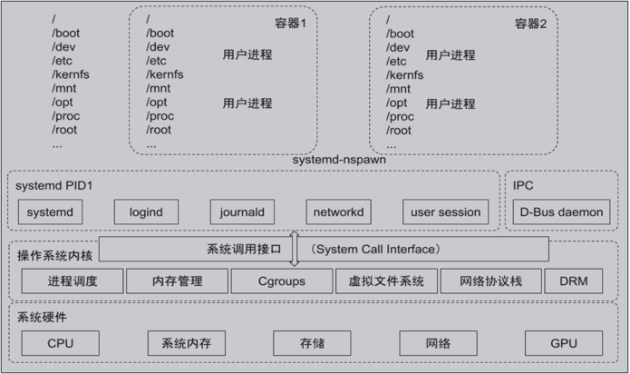

#### cgroups 实现了对资源的配额和度量

- blkio： 这个子系统设置限制每个块设备的输入输出控制。例如:磁盘，光盘以及 USB 等等。

- CPU： 这个子系统使用调度程序为 cgroup 任务提供 CPU 的访问。

- cpuacct： 产生 cgroup 任务的 CPU 资源报告。

- cpuset： 如果是多核心的 CPU，这个子系统会为 cgroup 任务分配单独的 CPU 和内存。

- devices： 允许或拒绝 cgroup 任务对设备的访问。

- freezer： 暂停和恢复 cgroup 任务。

- memory： 设置每个 cgroup 的内存限制以及产生内存资源报告。

- net_cls： 标记每个网络包以供 cgroup 方便使用。

- ns： 名称空间子系统。

- pid: 进程标识子系统。

#### CPU 子系统

- cpu.shares： 可出让的能获得 CPU 使用时间的相对值。

- cpu.cfs_period_us：cfs_period_us 用来配置时间周期长度，单位为 us（微秒）。

- cpu.cfs_quota_us：cfs_quota_us 用来配置当前 Cgroup 在 cfs_period_us 时间内最多能使用的 CPU 时间数，单位为 us（微秒）。

- cpu.stat ： Cgroup 内的进程使用的 CPU 时间统计。

- nr_periods ： 经过 cpu.cfs_period_us 的时间周期数量。

- nr_throttled ： 在经过的周期内，有多少次因为进程在指定的时间周期内用光了配额时间而受到限制。

- throttled_time ： Cgroup 中的进程被限制使用 CPU 的总用时，单位是 ns（纳秒）。

#### Linux 调度器

内核默认提供了5个调度器，Linux 内核使用 struct sched_class 来对调度器进行抽象：

- Stop 调度器，stop_sched_class：优先级最高的调度类，可以抢占其他所有进程，不能被其他进程抢占；

- Deadline 调度器，dl_sched_class：使用红黑树，把进程按照绝对截止期限进行排序，选择最小进程进行调度运行；

- RT 调度器， rt_sched_class：实时调度器，为每个优先级维护一个队列；

- CFS 调度器， cfs_sched_class：完全公平调度器，采用完全公平调度算法，引入虚拟运行时间概念；

- IDLE-Task 调度器， idle_sched_class：空闲调度器，每个 CPU 都会有一个 idle 线程，当没有其他进程可以调度时，调度运行 idle 线程。

#### CFS 调度器

- CFS 是 Completely Fair Scheduler 简称，即完全公平调度器。

- CFS 实现的主要思想是维护为任务提供处理器时间方面的平衡，这意味着应给进程分配相当数量的处理器。

- 分给某个任务的时间失去平衡时，应给失去平衡的任务分配时间，让其执行。

- CFS 通过虚拟运行时间（vruntime）来实现平衡，维护提供给某个任务的时间量。

vruntime = 实际运行时间*1024 / 进程权重

- 进程按照各自不同的速率在物理时钟节拍内前进，优先级高则权重大，其虚拟时钟比真实时钟跑得慢，但获得比较多的运行时间。

#### vruntime 红黑树

CFS 调度器没有将进程维护在运行队列中，而是维护了一个以虚拟运行时间为顺序的红黑树。 红黑树的主要特点有：

-
    1. 自平衡，树上没有一条路径会比其他路径长出俩倍。

-
    2. O(log n) 时间复杂度，能够在树上进行快速高效地插入或删除进程。

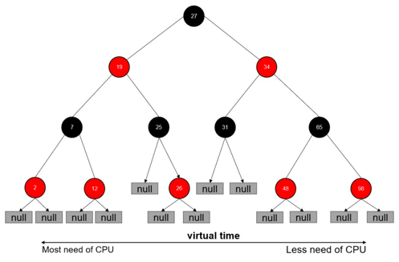

#### CFS进程调度

- 在时钟周期开始时，调度器调用 __schedule() 函数来开始调度的运行。

- __schedule() 函数调用 pick_next_task() 让进程调度器从就绪队列中选择一个最合适的进程 next，即红 黑树最左边的节点。

- 通过 context_switch() 切换到新的地址空间，从而保证 next 进程运行。

- 在时钟周期结束时，调度器调用 entity_tick() 函数来更新进程负载、进程状态以及 vruntime（当前vruntime + 该时钟周期内运行的时间）。

- 最后，将该进程的虚拟时间与就绪队列红黑树中最左边的调度实体的虚拟时间做比较，如果小于坐左边的时间，则不用触发调度，继续调度当前调度实体。

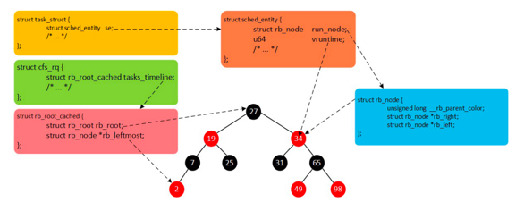

#### CPU 子系统实操

- 在 cgroup cpu 子系统目录中创建目录结构 cd /sys/fs/cgroup/cpu mkdir cpudemo cd cpudemo

- 运行 busyloop

- 执行 top 查看 CPU 使用情况，CPU 占用 200%

- 通过 cgroup 限制 cpu cd /sys/fs/cgroup/cpu/cpudemo

- 把进程添加到 cgroup 进程配置组 echo ps -ef|grep busyloop|grep -v grep|awk '{print $2}' > cgroup.procs

- 设置 cpuquota echo 10000 > cpu.cfs_quota_us

- 执行 top 查看 CPU 使用情况，CPU 占用变为10%

#### cpuacct 子系统

用于统计 Cgroup 及其子 Cgroup 下进程的 CPU 的使用情况。

- cpuacct.usage 包含该 Cgroup 及其子 Cgroup 下进程使用 CPU 的时间，单位是 ns（纳秒）。

- cpuacct.stat 包含该 Cgroup 及其子 Cgroup 下进程使用的 CPU 时间，以及用户态和内核态的时间。

#### Memory 子系统

- memory.usage_in_bytes cgroup 下进程使用的内存，包含 cgroup 及其子 cgroup 下的进程使用的内存

- memory.max_usage_in_bytes cgroup 下进程使用内存的最大值，包含子 cgroup 的内存使用量。

- memory.limit_in_bytes 设置 Cgroup 下进程最多能使用的内存。如果设置为 -1，表示对该 cgroup 的内存使用不做限制。

- memory.soft_limit_in_bytes 这个限制并不会阻止进程使用超过限额的内存，只是在系统内存足够时，会优先回收超过限额的内存，使之向限定值靠拢。

- memory.oom_control 设置是否在 Cgroup 中使用 OOM（Out of Memory）Killer，默认为使用。当属于该 cgroup 的进程使用的内存超过最大的限定值时，会立刻被 OOM Killer 处理。

#### Cgroup driver

systemd:

- 当操作系统使用 systemd 作为 init system 时，初始化进程生成一个根 cgroup 目录结构并作为 cgroup 管理器。

- systemd 与 cgroup 紧密结合，并且为每个 systemd unit 分配 cgroup。 cgroupfs:

- docker 默认用 cgroupfs 作为 cgroup 驱动。

存在问题：

- 在 systemd 作为 init system 的系统中，默认并存着两套 groupdriver。

- 这会使得系统中 Docker 和 kubelet 管理的进程被 cgroupfs 驱动管，而 systemd 拉起的服务由systemd 驱动管，让 cgroup 管理混乱且容易在资源紧张时引发问题。

因此 kubelet 会默认--cgroup-driver=systemd，若运行时 cgroup 不一致时，kubelet 会报错。

#### 文件系统

Union FS

- 将不同目录挂载到同一个虚拟文件系统下 （unite several directories into a single virtual filesystem）的文件系统

- 支持为每一个成员目录（类似Git Branch）设定 readonly、readwrite 和 whiteout-able 权限

- 文件系统分层, 对 readonly 权限的 branch 可以逻辑上进行修改(增量地, 不影响 readonly 部分的)。

- 通常 Union FS 有两个用途, 一方面可以将多个 disk 挂到同一个目录下, 另一个更常用的就是将一个readonly 的 branch 和一个 writeable 的 branch 联合在一起。

#### 容器镜像

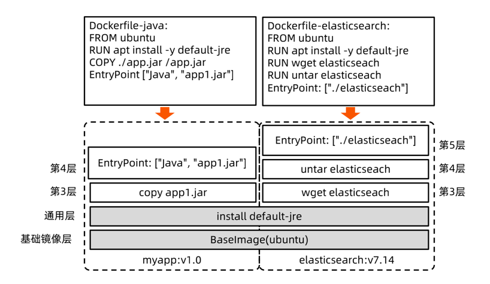

#### Docker 的文件系统

典型的 Linux 文件系统组成：

- Bootfs（boot file system）

> Bootloader - 引导加载 kernel，

> Kernel - 当 kernel 被加载到内存中后 umount bootfs。

- rootfs （root file system）

> /dev，/proc，/bin，/etc 等标准目录和文件。

> 对于不同的 linux 发行版, bootfs 基本是一致的，但 rootfs 会有差别。

#### Docker 启动

Linux

- 在启动后，首先将 rootfs 设置为 readonly, 进行一系列检查, 然后将其切换为 “readwrite”供用户使用。

Docker 启动

- 初始化时也是将 rootfs 以 readonly 方式加载并检查，然而接下来利用 union mount 的方式将一个readwrite 文件系统挂载在 readonly 的 rootfs 之上；

- 并且允许再次将下层的 FS（file system） 设定为 readonly 并且向上叠加。 • 这样一组 readonly 和一个 writeable 的结构构成一个 container 的运行时态, 每一个 FS 被称作一个 FS
  层。

#### 写操作

由于镜像具有共享特性，所以对容器可写层的操作需要依赖存储驱动提供的写时复制和用时分配机制，以此来支持对容器可写层的修改，进而提高对存储和内存资源的利用率。

##### 写时复制

- 写时复制，即 Copy-on-Write。

- 一个镜像可以被多个容器使用，但是不需要在内存和磁盘上做多个拷贝。

- 在需要对镜像提供的文件进行修改时，该文件会从镜像的文件系统被复制到容器的可写层的文件系统进行修改，而镜像里面的文件不会改变。

- 不同容器对文件的修改都相互独立、互不影响。

##### 用时分配

按需分配空间，而非提前分配，即当一个文件被创建出来后，才会分配空间。

#### 容器存储驱动

存储驱动 Docker Containerd

AUFS 在 Ubuntu 或者 Debian上支持 不支持

OverlayFS 支持 支持

Device Mapper 支持 支持

Btrfs 社区版本在 Ubuntu 或者 Debian 上支持，企业版本在SLES上支持 支持

ZFS 支持 不支持

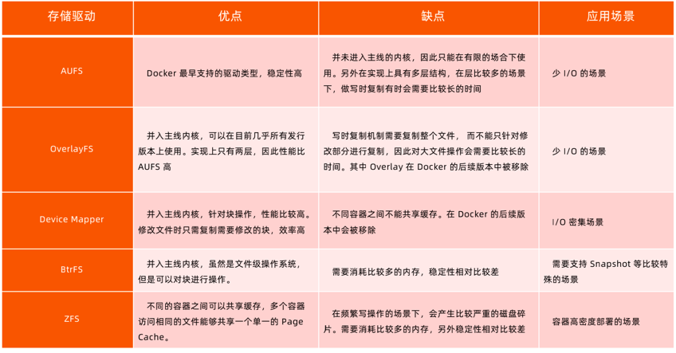

#### OverlayFS

OverlayFS 也是一种与 AUFS 类似的联合文件系统，同样属于文件级的存储驱动，包含了最初的 Overlay 和 更新更稳定的 overlay2。

Overlay 只有两层：upper 层和 lower 层，Lower 层代表镜像层，upper 层代表容器可写层。

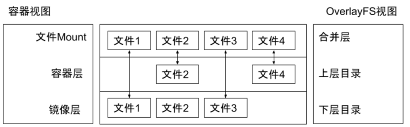

#### OCI 容器标准

Open Container Initiative

- OCI 组织于 2015 年创建，是一个致力于定义容器镜像标准和运行时标准的开放式组织。

- OCI 定义了镜像标准（Image Specification）、运行时标准（Runtime Specification）和分发标准 （Distribution Specification）

> 镜像标准定义应用如何打包

> 运行时标准定义如何解压应用包并运行

> 分发标准定义如何分发容器镜像

#### Docker 引擎架构

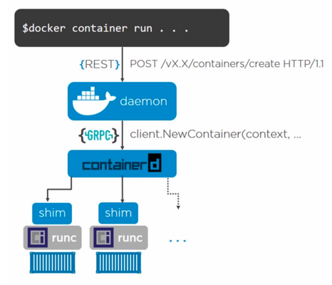

#### 网络

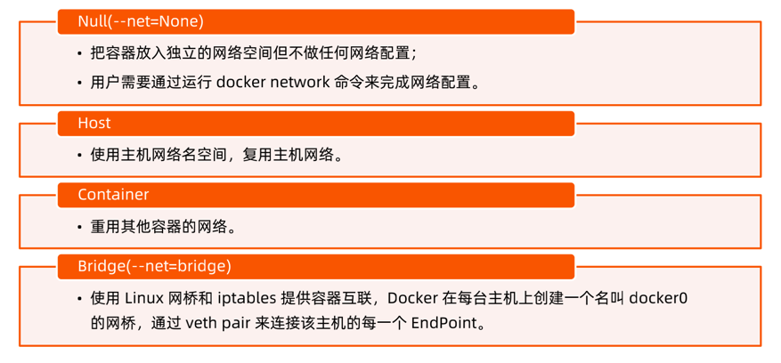

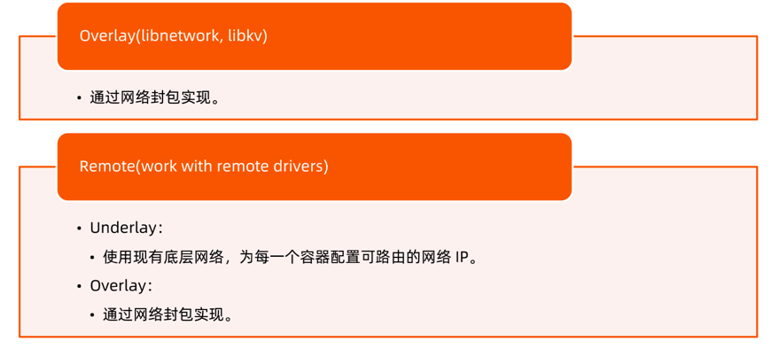

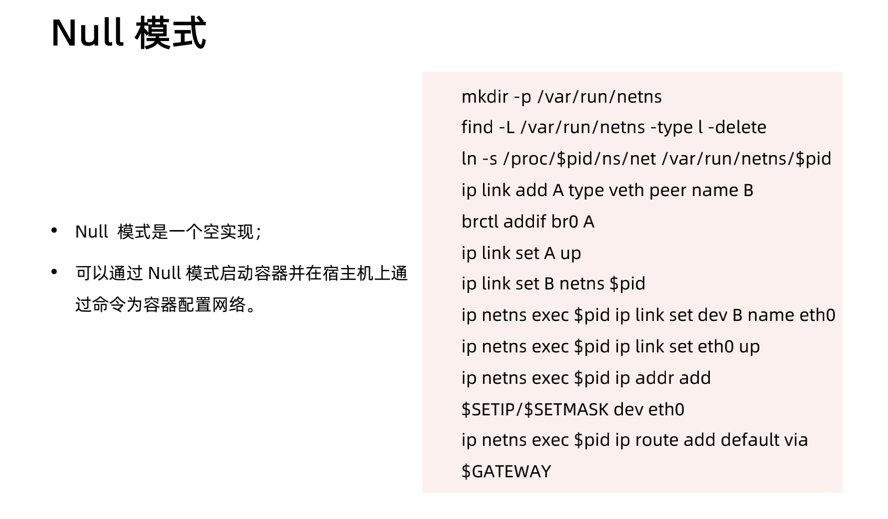

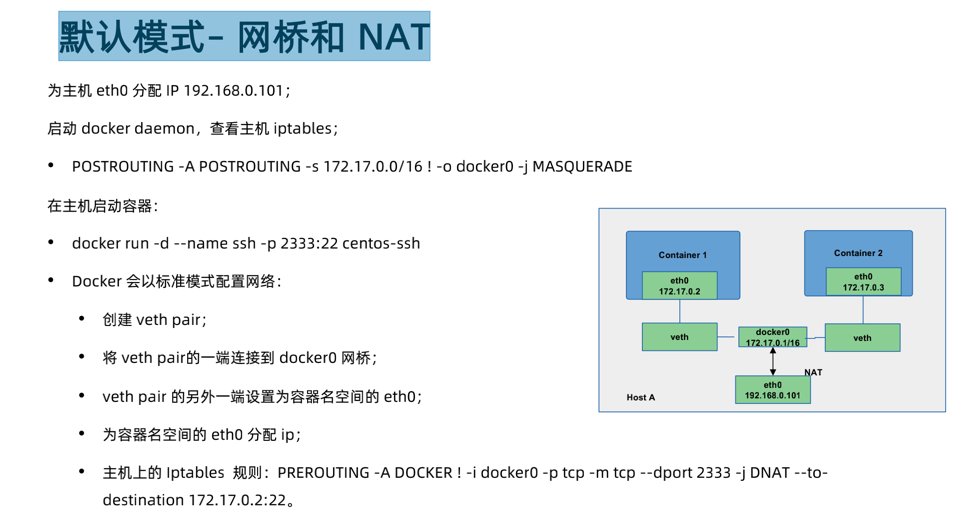

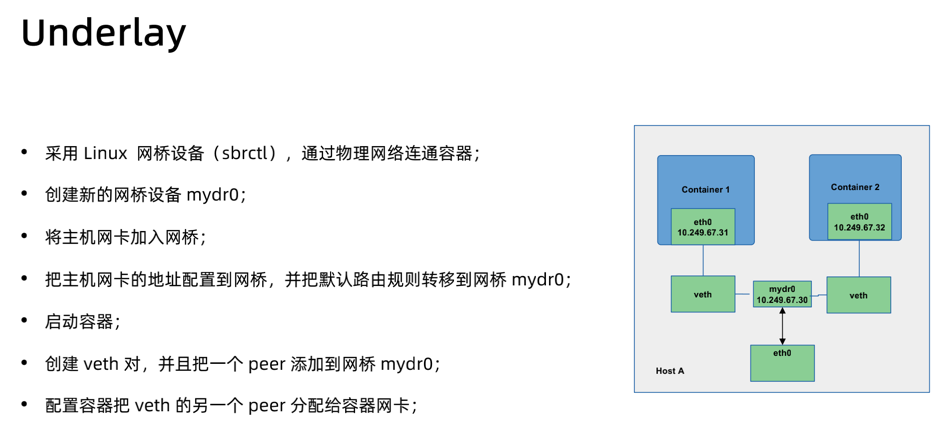

#### Docker Libnetwork Overlay

- Docker overlay 网络驱动原生支持多主机网络；

- Libnetwork 是一个内置的基于 VXLAN 的网络驱动。

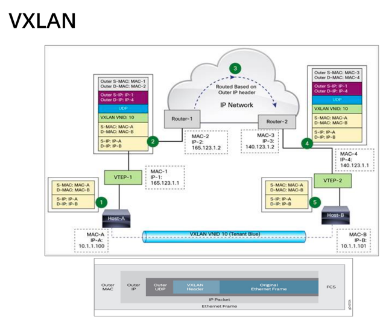

#### Overlay network sample – Flannel

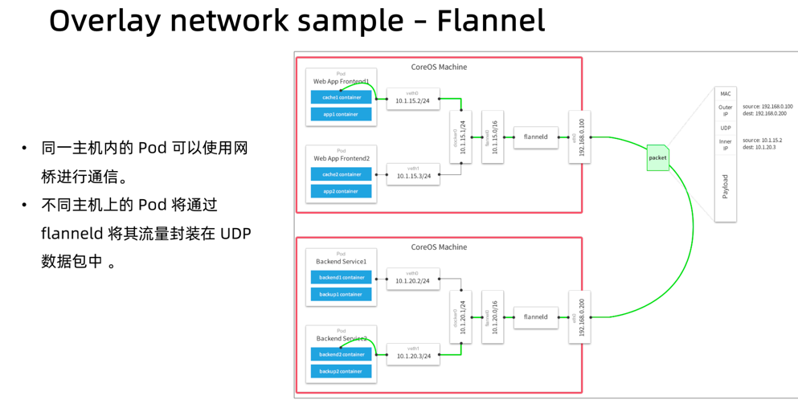

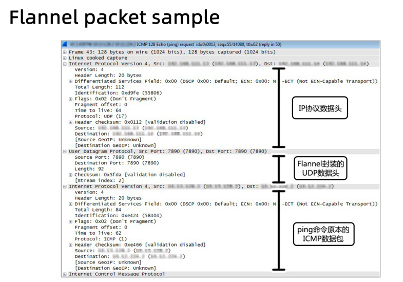

#### 理解构建上下文（Build Context）

- 当运行 docker build 命令时，当前工作目录被称为构建上下文。

- docker build 默认查找当前目录的 Dockerfile 作为构建输入，也可以通过 –f 指定 Dockerfile。

> docker build –f ./Dockerfile

- 当 docker build 运行时，首先会把构建上下文传输给 docker daemon，把没用的文件包含在构建上下文时，会导致传输时间长，构建需要的资源多，构建出的镜像大等问题。

> 试着到一个包含文件很多的目录运行下面的命令，会感受到差异；

> docker build -f $GOPATH/src/github.com/cncamp/golang/httpserver/Dockerfile ；

> docker build $GOPATH/src/github.com/cncamp/golang/httpserver/；

> 可以通过.dockerignore文件从编译上下文排除某些文件。

- 因此需要确保构建上下文清晰，比如创建一个专门的目录放置 Dockerfile，并在目录中运行 docker build。

#### Build Cache

构建容器镜像时，Docker 依次读取 Dockerfile 中的指令，并按顺序依次执行构建指令。

Docker 读取指令后，会先判断缓存中是否有可用的已存镜像，只有已存镜像不存在时才会重新构建。

- 通常 Docker 简单判断 Dockerfile 中的指令与镜像。

- 针对 ADD 和 COPY 指令，Docker 判断该镜像层每一个文件的内容并生成一个 checksum，与现存镜像比较时，Docker 比较的是二者的 checksum。

- 其他指令，比如 RUN apt-get -y update，Docker 简单比较与现存镜像中的指令字串是否一致。

- 当某一层 cache 失效以后，所有所有层级的 cache 均一并失效，后续指令都重新构建镜像。

#### Dockerfile 常用指令

- FROM：选择基础镜像，推荐 alpine FROM [--platform=<platform>] <image>[@<digest>] [AS <name>]

- LABELS：按标签组织项目 LABEL multi.label1="value1" multi.label2="value2" other="value3” 配合 label filter 可过滤镜像查询结果 docker
  images -f label=multi.label1="value1"

- RUN：执行命令 最常见的用法是 RUN apt-get update && apt-get install，这两条命令应该永远用&&连接，如果分开执行，RUN apt-get update 构建层被缓存，可能会导致新 package
  无法安装

- CMD：容器镜像中包含应用的运行命令，需要带参数 CMD ["executable", "param1", "param2"…]

- EXPOSE：发布端口 EXPOSE <port> [<port>/<protocol>...]

是镜像创建者和使用者的约定

在 docker run –P 时，docker 会自动映射 expose 的端口到主机大端口，如0.0.0.0:32768->80/tcp

- ENV 设置环境变量 ENV <key>=<value> ...


- ADD：从源地址（文件，目录或者 URL）复制文件到目标路径 ADD [--chown=<user>:<group>] <src>... <dest>
  ADD [--chown=<user>:<group>] [“<src>”,... “<dest>”] （路径中有空格时使用）

- ADD 支持 Go 风格的通配符，如 ADD check* /testdir/ • src 如果是文件，则必须包含在编译上下文中，ADD 指令无法添加编译上下文之外的文件

- src 如果是 URL 如果 dest 结尾没有/，那么 dest 是目标文件名，如果 dest 结尾有/，那么 dest 是目标目录名

- 如果 src 是一个目录，则所有文件都会被复制至 dest

- 如果 src 是一个本地压缩文件，则在 ADD 的同时完整解压操作

- 如果 dest 不存在，则 ADD 指令会创建目标目录

- 应尽量减少通过 ADD URL 添加 remote 文件，建议使用 curl 或者 wget && untar


- COPY：从源地址（文件，目录或者URL）复制文件到目标路径 COPY [--chown=<user>:<group>] <src>... <dest>

COPY [--chown=<user>:<group>] ["<src>",... "<dest>"] // 路径中有空格时使用

- COPY 的使用与 ADD 类似，但有如下区别

- COPY 只支持本地文件的复制，不支持 URL

- COPY 不解压文件

- COPY 可以用于多阶段编译场景，可以用前一个临时镜像中拷贝文件

- COPY --from=build /bin/project /bin/project

COPY 语义上更直白，复制本地文件时，优先使用 COPY

- ENTRYPOINT：定义可以执行的容器镜像入口命令

ENTRYPOINT ["executable", "param1", "param2"] // docker run参数追加模式

ENTRYPOINT command param1 param2 // docker run 参数替换模式

- docker run –entrypoint 可替换 Dockerfile 中定义的 ENTRYPOINT

- ENTRYPOINT 的最佳实践是用 ENTRYPOINT 定义镜像主命令，并通过 CMD 定义主要参数，如下所示

- ENTRYPOINT ["s3cmd"]

- CMD ["--help"]


- VOLUME： 将指定目录定义为外挂存储卷，Dockerfile 中在该指令之后所有对同一目录的修改都无效 VOLUME ["/data"] 等价于 docker run –v /data，可通过 docker inspect
  查看主机的 mount point， /var/lib/docker/volumes/<containerid>/_data

- USER：切换运行镜像的用户和用户组，因安全性要求，越来越多的场景要求容器应用要以 non-root 身份运行 USER <user>[:<group>]

- WORKDIR：等价于 cd，切换工作目录 WORKDIR /path/to/workdir

- 其他非常用指令 ARG

ONBUILD

STOPSIGNAL

HEALTHCHECK

SHELL

#### Dockerfile 最佳实践

- 不要安装无效软件包。

- 应简化镜像中同时运行的进程数，理想状况下，每个镜像应该只有一个进程。

- 当无法避免同一镜像运行多进程时，应选择合理的初始化进程（init process）。

- 最小化层级数

    - 最新的 docker 只有 RUN， COPY，ADD 创建新层，其他指令创建临时层，不会增加镜像大小。

        - 比如 EXPOSE 指令就不会生成新层。

    - 多条 RUN 命令可通过连接符连接成一条指令集以减少层数。

    - 通过多段构建减少镜像层数。

- 把多行参数按字母排序，可以减少可能出现的重复参数，并且提高可读性。

- 编写 dockerfile 的时候，应该把变更频率低的编译指令优先构建以便放在镜像底层以有效利用 build cache。

- 复制文件时，每个文件应独立复制，这确保某个文件变更时，只影响改文件对应的缓存。

目标：易管理、少漏洞、镜像小、层级少、利用缓存。

#### 多进程的容器镜像

- 选择适当的 init 进程

    - 需要捕获 SIGTERM 信号并完成子进程的优雅终止

    - 负责清理退出的子进程以避免僵尸进程

[开源项目](https://github.com/krallin/tini)

#### Docker 镜像管理

- docker save/load

- docker tag

- docker push/pull

#### 基于 Docker 镜像的版本管理

- Docker tag

    - docker tag 命令可以为容器镜像添加标签

    - docker tag 0e5574283393 hub.docker.com/cncamp/httpserver:v1.0

        - hub.docker.com： 镜像仓库地址，如果不填，则默认为 hub.docker.com

        - cncamp: repositry

        - httpserver：镜像名

        - v1.0：tag，常用来记录版本信息

#### Docker tag 与 github 的版本管理合力

- 以 Kubernetes 为例

    - 开发分支

        - git checkout master

    - Release 分支

        - git checkout –b release-1.21

    - 在并行期，所有的变更同时放进 master 和 release branch

    - 版本发布

        - 以 release branch 为基础构建镜像，并为镜像标记版本信息：docker tag 0e5574283393 k8s.io/kubernetes/apiserver:v1.21

    - 在 github 中保存 release 代码快照

        - git tag v1.21

#### 镜像仓库

Docker hub

- https://hub.docker.com/

创建私有镜像仓库

- sudo docker run -d -p 5000:5000 registry

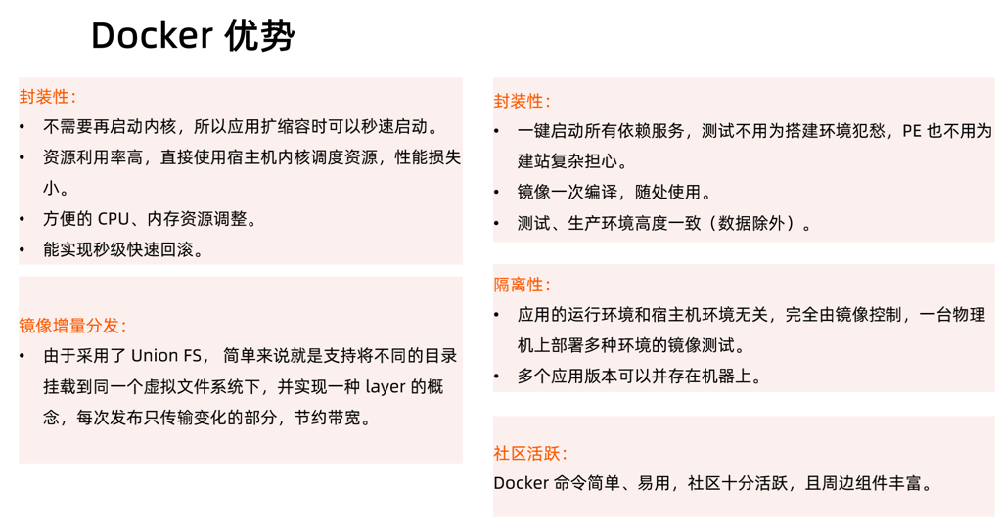

[资料一](https://www.cnblogs.com/XiaoliBoy/p/10410686.html)

[资料二](http://www.wowotech.net/process_management/451.html)


