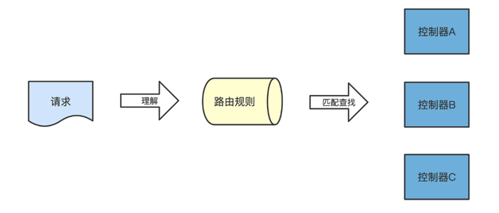
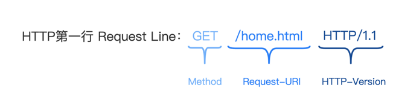
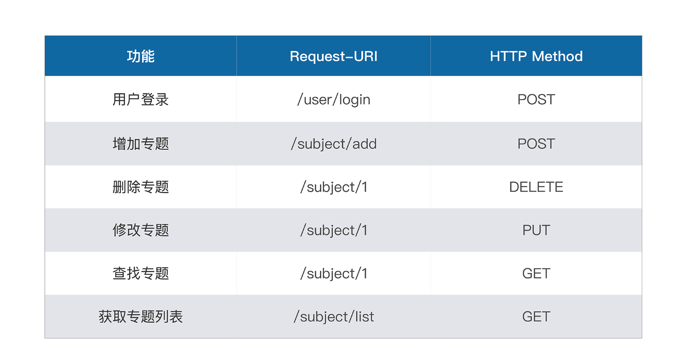
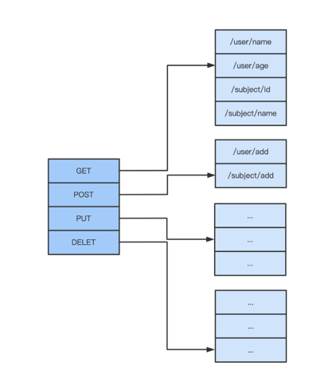
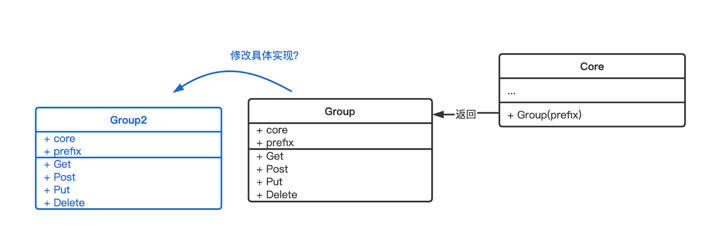
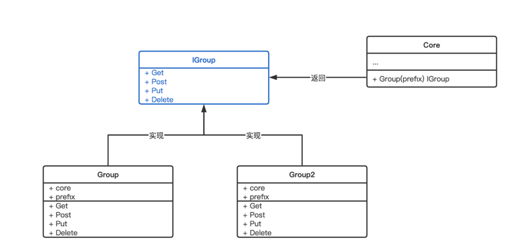
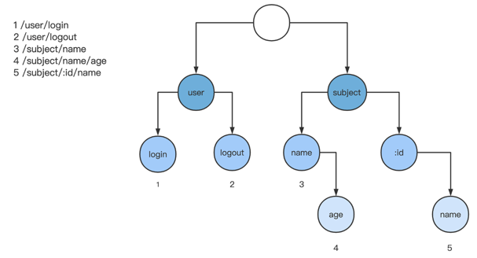

## 路由之如何让请求更快寻找到目标函数

### 路由设计思路
路由是干啥的，具体来说就是让 Web 服务器根据规则，理解 HTTP 请求中的信息，匹配查找出对应的控制器，再将请求传递给控制器执行业务逻辑，简单来说就是制定匹配规则。



但是就是这么简单的功能，路由的设计感不同，可用性有天壤之别。先理解制定路由规则需要的信息。

路由可以使用 HTTP 请求体中的哪些信息。

一个 HTTP 请求包含请求头和请求体。请求体内一般存放的是请求的业务数据，是基于具体控制业务需要的，所以，不会用来做路由。

而请求头中存放的是和请求状态有关的信息，比如 User-Agent 代表的是请求的浏览器信息，Accept 代表的是支持返回的文本类型。以下是一个标准请求头的示例：

```text
GET /home.html HTTP/1.1
Host: developer.mozilla.org
User-Agent: Mozilla/5.0 (Macintosh; Intel Mac OS X 10.9; rv:50.0) Gecko/20100101 Firefox/50.0
Accept: text/html,application/xhtml+xml,application/xml;q=0.9,*/*;q=0.8 
Accept-Language: en-US,en;q=0.5
Accept-Encoding: gzip, deflate, br
Referer: https://developer.mozilla.org/testpage.html
```

每一行的信息和含义都是非常大的议题，这里要关注的是 HTTP 请求的第一行，叫做 Request Line，由三个部分组成：Method、Request-URI 和 HTTP-Version（[RFC2616](https://www.rfc-editor.org/rfc/inline-errata/rfc2616.html)）。



Method 是 HTTP 的方法，标识对服务端资源的操作属性。它包含多个方法，每个方法都代表不同的操作属性。

```text
Method         = "OPTIONS"                ; Section 9.2
                      | "GET"                    ; Section 9.3
                      | "HEAD"                   ; Section 9.4
                      | "POST"                   ; Section 9.5
                      | "PUT"                    ; Section 9.6
                      | "DELETE"                 ; Section 9.7
                      | "TRACE"                  ; Section 9.8
                      | "CONNECT"                ; Section 9.9
                      | extension-method
       extension-method = token
```

Request-URI 是请求路径，也就是浏览器请求地址中域名外的剩余部分。

HTTP-Version 是 HTTP 的协议版本，目前常见的有 1.0、1.1、2.0。

Web Service 在路由中使用的就是 Method 和 Request-URI 这两个部分。了解制定路由规则时，请求体中可以使用的元素之后，再回答刚才的问题，什么是路由的设计感。

这里说的设计感指的是：框架设计者希望使用者如何用路由模块。

如果框架支持 REST 风格的路由设计，那么使用者在写业务代码的时候，就倾向于设计 REST 风格的接口；如果框架支持前缀匹配，那么使用者在定制 URI 的时候，也会倾向于把同类型的 URI 归为一类。

这些设计想法通通会体现在框架的路由规则上，最终影响框架使用者的研发习惯，这个就是设计感。所以其实，设计感和框架设计者偏好的研发风格直接相关，也没有绝对的优劣。

路由规则，是根据路由来查找控制器的逻辑，它本身就是一个框架需求。我们可以天马行空设想 100 条路由规则，并且全部实现它，也可以只设计 1、2 个最简单的路由规则。很多或者很少的路由规则，都不会根本性影响使用者，所以，并不是衡量一个框架好坏的标准。

### 路由规则的需求

按照从简单到复杂排序，路由需求我整理成下面四点：

- **需求 1：HTTP 方法匹配**

早期的 WebService 比较简单，HTTP 请求体中的 Request Line 或许只会使用到 Request-URI 部分，但是随着 REST 风格 WebService 的流行，为了让 URI 更具可读性，在现在的路由输入中，HTTP Method 也是很重要的一部分了，所以框架也需要支持多种 HTTP Method，比如 GET、POST、PUT、DELETE。

- **需求 2：静态路由匹配**

静态路由匹配是一个路由的基本功能，指的是路由规则中没有可变参数，即路由规则地址是固定的，与 Request-URI 完全匹配。

DefaultServerMux 这个路由器，从内部的 map 中直接根据 key 寻找 value ，这种查找路由的方式就是静态路由匹配。

- **需求 3：批量通用前缀**

因为业务模块的划分，我们会同时为某个业务模块注册一批路由，所以在路由注册过程中，为了路由的可读性，一般习惯统一定义这批路由的通用前缀。比如 /user/info、/user/login 都是以 /user 开头，很方便使用者了解页面所属模块。

所以如果路由有能力统一定义批量的通用前缀，那么在注册路由的过程中，会带来很大的便利。

- **需求 4：动态路由匹配**

这个需求是针对需求 2 改进的，因为 URL 中某个字段或者某些字段并不是固定的，是按照一定规则（比如是数字）变化的。那么，我们希望路由也能够支持这个规则，将这个动态变化的路由 URL 匹配出来。所以我们需要，使用自己定义的路由来补充，只支持静态匹配的 DefaultServerMux 默认路由。

现在四个最基本的需求我们已经整理出来了，接下来通过一个例子来解释下，比如我们需要能够支持一个日志网站的这些功能：



要匹配这样的路由列表，路由规则定义代码怎么写呢？ 代码如下
```text
// 注册路由规则
func registerRouter(core *framework.Core) {
    // 需求1+2:HTTP方法+静态路由匹配
  core.Post("/user/login", UserLoginController)
    
    // 需求3:批量通用前缀
    subjectApi := core.Group("/subject")
  {
    subjectApi.Post("/add", SubjectAddController)
        // 需求4:动态路由
    subjectApi.Delete("/:id", SubjectDelController)
    subjectApi.Put("/:id", SubjectUpdateController)
    subjectApi.Get("/:id", SubjectGetController)
        subjectApi.Get("/list/all", SubjectListController)
  }  
}
```

### 实现 HTTP 方法和静态路由匹配
首先看第一个需求和第二个需求。由于有两个待匹配的规则，Request-URI 和 Method，所以自然联想到可以使用两级哈希表来创建映射。



第一级 hash 是请求 Method，第二级 hash 是 Request-URI。

这个路由 map 我们会存放在定义的 Core 结构里，并且在初始化 Core 结构的时候，初始化第一层 map。

```text
// 框架核心结构
type Core struct {
}
// 初始化框架核心结构
func NewCore() *Core {
  return &Core{}
}
// 框架核心结构实现Handler接口
func (c *Core) ServeHTTP(response http.ResponseWriter, request *http.Request) {
  // TODO
}
```

接下来按框架使用者使用路由的顺序分成四步来完善这个结构：定义路由 map、注册路由、匹配路由、填充 ServeHTTP 方法。

首先，第一层 map 的每个 key 值都代表 Method，而且为了避免之后在匹配的时候，要转换一次大小写，将每个 key 都设置为大写。继续在框架文件夹中的 core.go 文件里写：

```text
// 框架核心结构
type Core struct {
  router map[string]map[string]ControllerHandler // 二级map
}
// 初始化框架核心结构
func NewCore() *Core {
    // 定义二级map
  getRouter := map[string]ControllerHandler{}
  postRouter := map[string]ControllerHandler{}
  putRouter := map[string]ControllerHandler{}
  deleteRouter := map[string]ControllerHandler{}
    // 将二级map写入一级map
  router := map[string]map[string]ControllerHandler{}
  router["GET"] = getRouter
  router["POST"] = postRouter
  router["PUT"] = putRouter
  router["DELETE"] = deleteRouter
  return &Core{router: router}
}
```

下一步就是路由注册，我们将路由注册函数按照 Method 名拆分为 4 个方法：Get、Post、Put 和 Delete。

```text
// 对应 Method = Get
func (c *Core) Get(url string, handler ControllerHandler) {
  upperUrl := strings.ToUpper(url)
  c.router["GET"][upperUrl] = handler
}
// 对应 Method = POST
func (c *Core) Post(url string, handler ControllerHandler) {
  upperUrl := strings.ToUpper(url)
  c.router["POST"][upperUrl] = handler
}
// 对应 Method = PUT
func (c *Core) Put(url string, handler ControllerHandler) {
  upperUrl := strings.ToUpper(url)
  c.router["PUT"][upperUrl] = handler
}
// 对应 Method = DELETE
func (c *Core) Delete(url string, handler ControllerHandler) {
  upperUrl := strings.ToUpper(url)
  c.router["DELETE"][upperUrl] = handler
}
```

这里将 URL 全部转换为大写了，在后续匹配路由的时候，也要记得把匹配的 URL 进行大写转换，这样我们的路由就会是“大小写不敏感”的，对使用者的容错性就大大增加了。

注册完路由之后，如何匹配路由就是我们第三步需要做的事情了。首先我们实现匹配路由方法，这个匹配路由的逻辑我用注释写在代码中了。继续在框架文件夹中的 core.go 文件里写入：

```text
// 匹配路由，如果没有匹配到，返回nil
func (c *Core) FindRouteByRequest(request *http.Request) ControllerHandler {
  // uri 和 method 全部转换为大写，保证大小写不敏感
  uri := request.URL.Path
  method := request.Method
  upperMethod := strings.ToUpper(method)
  upperUri := strings.ToUpper(uri)
  // 查找第一层map
  if methodHandlers, ok := c.router[upperMethod]; ok {
    // 查找第二层map
    if handler, ok := methodHandlers[upperUri]; ok {
      return handler
    }
  }
  return nil
}
```

代码很容易看懂，匹配逻辑就是去二层哈希 map 中一层层匹配，先查找第一层匹配 Method，再查第二层匹配 Request-URI。

最后，我们就可以填充未实现的 ServeHTTP 方法了，所有请求都会进到这个函数中处理。继续在框架文件夹中的 core.go 文件里写：

```text
func (c *Core) ServeHTTP(response http.ResponseWriter, request *http.Request) {
  // 封装自定义context
  ctx := NewContext(request, response)
  // 寻找路由
  router := c.FindRouteByRequest(request)
  if router == nil {
    // 如果没有找到，这里打印日志
    ctx.Json(404, "not found")
    return
  }
  // 调用路由函数，如果返回err 代表存在内部错误，返回500状态码
  if err := router(ctx); err != nil {
    ctx.Json(500, "inner error")
    return
  }
}
```

先封装创建的自定义 Context，然后使用 FindRouteByRequest 函数寻找我们需要的路由，如果没有找到路由，返回 404 状态码；如果找到了路由，就调用路由控制器，另外如果路由控制器出现内部错误，返回 500 状态码。

到这里，第一个和第二个需求就都完成了。

### 实现批量通用前缀
对于第三个需求，我们可以通过一个 Group 方法归拢路由前缀地址。修正在业务文件夹下的 route.go 文件，使用方法改成这样：

```text
// 注册路由规则
func registerRouter(core *framework.Core) {
  // 需求1+2:HTTP方法+静态路由匹配
  core.Get("/user/login", UserLoginController)
  // 需求3:批量通用前缀
  subjectApi := core.Group("/subject")
  {
    subjectApi.Get("/list", SubjectListController)
  }
}
```

看下这个 Group 方法，它的参数是一个前缀字符串，返回值应该是包含 Get、Post、Put、Delete 方法的一个结构，我们给这个结构命名 Group，在其中实现各种方法。

这么设计直接返回 Group 结构，确实可以实现功能，但试想一下，随着框架发展，如果我们发现 Group 结构的具体实现并不符合我们的要求了，需要引入实现另一个 Group2 结构，该怎么办？直接修改 Group 结构的具体实现么？



其实更好的办法是使用接口来替代结构定义。在框架设计之初，我们要保证框架使用者，在最少的改动中，就能流畅迁移到 Group2，这个时候，如果返回接口 IGroup，而不是直接返回 Group 结构，就不需要修改 core.Group 的定义了，只需要修改 core.Group 的具体实现，返回 Group2 就可以。



尽量使用接口来解耦合，是一种比较好的设计思路。

怎么实现呢，这里我们定义 IGroup 接口来作为 Group 方法的返回值。在框架文件夹下创建group.go 文件来存放分组相关的信息：

```text
// IGroup 代表前缀分组
type IGroup interface {
  Get(string, ControllerHandler)
  Post(string, ControllerHandler)
  Put(string, ControllerHandler)
  Delete(string, ControllerHandler)
}
```

并且继续搭好 Group 结构代码来实现这个接口：

```text
// Group struct 实现了IGroup
type Group struct {
  core   *Core
  prefix string
}
// 初始化Group
func NewGroup(core *Core, prefix string) *Group {
  return &Group{
    core:   core,
    prefix: prefix,
  }
}
// 实现Get方法
func (g *Group) Get(uri string, handler ControllerHandler) {
  uri = g.prefix + uri
  g.core.Get(uri, handler)
}
....
// 从core中初始化这个Group
func (c *Core) Group(prefix string) IGroup {
  return NewGroup(c, prefix)
}
```

这个 Group 结构包含自身的前缀地址和 Core 结构的指针。它的 Get、Put、Post、Delete 方法就是把这个 Group 结构的前缀地址和目标地址组合起来，作为 Core 的 Request-URI 地址。

这个选择并不仅仅是代码风格，而是关于框架设计、关于代码扩展性。

接口是一种协议，它忽略具体的实现，定义的是两个逻辑结构的交互，因为两个函数之间定义的是一种约定，不依赖具体的实现。

你可以这么判断：如果你觉得这个模块是完整的，而且后续希望有扩展的可能性，那么就应该尽量使用接口来替代实现。在代码中，多大程度使用接口进行逻辑结构的交互，是评价框架代码可扩展性的一个很好的标准。这种思维会贯穿在我们整个框架的设计中，后续我会时不时再提起的。

所以回到我们的路由，使用 IGroup 接口后，core.Group 这个方法返回的是一个约定，而不依赖具体的 Group 实现。

### 实现动态路由匹配
现在已经完成了前三个需求，下面我们考虑第四个需求，希望在写业务的时候能支持像下列这种动态路由：

```text
func registerRouter(core *framework.Core) {
  // 需求1+2:HTTP方法+静态路由匹配
  core.Get("/user/login", UserLoginController)
  // 需求3:批量通用前缀
  subjectApi := core.Group("/subject")
  {
    // 需求4:动态路由
    subjectApi.Delete("/:id", SubjectDelController)
    subjectApi.Put("/:id", SubjectUpdateController)
    subjectApi.Get("/:id", SubjectGetController)
    subjectApi.Get("/list/all", SubjectListController)
  }
}
```

如何实现？

首先，你要知道的是，一旦引入了动态路由匹配的规则，之前使用的哈希规则就无法使用了。因为有通配符，在匹配 Request-URI 的时候，请求 URI 的某个字符或者某些字符是动态变化的，无法使用 URI 做为 key 来匹配。那么，我们就需要其他的算法来支持路由匹配。

如果你对算法比较熟悉，会联想到这个问题本质是一个字符串匹配，而字符串匹配，比较通用的高效方法就是字典树，也叫 trie 树。

这里，我们先简单梳理下 trie 树的数据结构。trie 树不同于二叉树，它是多叉的树形结构，根节点一般是空字符串，而叶子节点保存的通常是字符串，一个节点的所有子孙节点都有相同的字符串前缀。

所以根据 trie 树的特性，我们结合前三条路由规则，可以构建出这样的结构：

```text
1 /user/login
2 /user/ut
3 /subject/name
4 /subject/name/age
5 /subject/:id/name
```

画成图更清晰一些：



这个 trie 树是按照路由地址的每个段 (segment) 来切分的，每个 segment 在 trie 树中都能找到对应节点，每个节点保存一个 segment。树中，每个叶子节点都代表一个 URI，对于中间节点来说，有的中间节点代表一个 URI（比如上图中的 /subject/name），而有的中间节点并不是一个 URI（因为没有路由规则对应这个 URI）。

现在分析清楚了，我们开始动手实现 trie 树。还是照旧先明确下可以分为几步：

- 定义树和节点的数据结构

- 编写函数：“增加路由规则”

- 编写函数：“查找路由”

- 将“增加路由规则”和“查找路由”添加到框架中

步骤非常清晰，一步一步来，首先定义对应的数据结构（node 和 tree）。先在框架文件夹下创建 tree.go 文件，存储 trie 树相关逻辑：

```text
// 代表树结构
type Tree struct {
  root *node // 根节点
}
// 代表节点
type node struct {
  isLast  bool              // 代表这个节点是否可以成为最终的路由规则。该节点是否能成为一个独立的uri, 是否自身就是一个终极节点
  segment string            // uri中的字符串，代表这个节点表示的路由中某个段的字符串
  handler ControllerHandler // 代表这个节点中包含的控制器，用于最终加载调用
  childs  []*node           // 代表这个节点下的子节点
}
```

Tree 结构中包含一个根节点，只是这个根节点是一个没有 segment 的空的根节点。

node 的结构定义了四个字段。childs 字段让 node 组成了一个树形结构，handler 是具体的业务控制器逻辑存放位置，segment 是树中的这个节点存放的内容，isLast 用于区别这个树中的节点是否有实际的路由含义。

有了数据结构后，第二步，我们就往 Tree 这个 trie 树结构中增加“路由规则”的逻辑。写之前，我们还是暂停一下想一想，会不会出现问题。之前提过会存在通配符，那直接加规则其实是有可能冲突的。比如：

```text
/user/name
/user/:id
```

这两个路由规则实际上就冲突了，如果请求地址是 /user/name，那么两个规则都匹配，无法确定哪个规则生效。所以在增加路由之前，我们需要判断这个路由规则是否已经在 trie 树中存在了。

这里，我们可以用 matchNode 方法，寻找某个路由在 trie 树中匹配的节点，如果有匹配节点，返回节点指针，否则返回 nil。matchNode 方法的参数是一个 URI，返回值是指向 node 的指针，它的实现思路是使用函数递归，我简单说明一下思路：

首先，将需要匹配的 URI 根据第一个分隔符 / 进行分割，只需要最多分割成为两个段。

如果只能分割成一个段，说明 URI 中没有分隔符了，这时候再检查下一级节点中是否有匹配这个段的节点就行。

如果分割成了两个段，我们用第一个段来检查下一个级节点中是否有匹配这个段的节点。

- 如果没有，说明这个路由规则在树中匹配不到。

- 如果下一级节点中有符合第一个分割段的（这里需要注意可能不止一个符合），我们就将所有符合的节点进行函数递归，重新应用于 matchNode 函数中，只不过这时候 matchNode 函数作用于子节点，参数变成了切割后的第二个段。

整个流程里，会频繁使用到“过滤下一层满足 segment 规则的子节点” ，所以我们也用一个函数 filterChildNodes 将它封装起来。这个函数的逻辑就比较简单了：遍历下一层子节点，判断 segment 是否匹配传入的参数 segment。

在框架文件夹中的 tree.go 中，我们完成 matchNode 和 filterChildNodes 完整代码实现。

```text
// 判断一个segment是否是通用segment，即以:开头
func isWildSegment(segment string) bool {
  return strings.HasPrefix(segment, ":")
}
// 过滤下一层满足segment规则的子节点
func (n *node) filterChildNodes(segment string) []*node {
  if len(n.childs) == 0 {
    return nil
  }
  // 如果segment是通配符，则所有下一层子节点都满足需求
  if isWildSegment(segment) {
    return n.childs
  }
  nodes := make([]*node, 0, len(n.childs))
  // 过滤所有的下一层子节点
  for _, cnode := range n.childs {
    if isWildSegment(cnode.segment) {
      // 如果下一层子节点有通配符，则满足需求
      nodes = append(nodes, cnode)
    } else if cnode.segment == segment {
      // 如果下一层子节点没有通配符，但是文本完全匹配，则满足需求
      nodes = append(nodes, cnode)
    }
  }
  return nodes
}
// 判断路由是否已经在节点的所有子节点树中存在了
func (n *node) matchNode(uri string) *node {
  // 使用分隔符将uri切割为两个部分
  segments := strings.SplitN(uri, "/", 2)
  // 第一个部分用于匹配下一层子节点
  segment := segments[0]
  if !isWildSegment(segment) {
    segment = strings.ToUpper(segment)
  }
  // 匹配符合的下一层子节点
  cnodes := n.filterChildNodes(segment)
  // 如果当前子节点没有一个符合，那么说明这个uri一定是之前不存在, 直接返回nil
  if cnodes == nil || len(cnodes) == 0 {
    return nil
  }
  // 如果只有一个segment，则是最后一个标记
  if len(segments) == 1 {
    // 如果segment已经是最后一个节点，判断这些cnode是否有isLast标志
    for _, tn := range cnodes {
      if tn.isLast {
        return tn
      }
    }
    // 都不是最后一个节点
    return nil
  }
  // 如果有2个segment, 递归每个子节点继续进行查找
  for _, tn := range cnodes {
    tnMatch := tn.matchNode(segments[1])
    if tnMatch != nil {
      return tnMatch
    }
  }
  return nil
}
```

现在有了 matchNode 和 filterChildNodes 函数，我们就可以开始写第二步里最核心的增加路由的函数逻辑了。

首先，确认路由是否冲突。我们先检查要增加的路由规则是否在树中已经有可以匹配的节点了。如果有的话，代表当前待增加的路由和已有路由存在冲突，这里我们用到了刚刚定义的 matchNode。更新刚才框架文件夹中的 tree.go 文件：

```text
// 增加路由节点
func (tree *Tree) AddRouter(uri string, handler ControllerHandler) error {
  n := tree.root
    // 确认路由是否冲突
  if n.matchNode(uri) != nil {
    return errors.New("route exist: " + uri)
  }
  ...
}
```

然后继续增加路由规则。我们增加路由的每个段时，先去树的每一层中匹配查找，如果已经有了符合这个段的节点，就不需要创建节点，继续匹配待增加路由的下个段；否则，需要创建一个新的节点用来代表这个段。这里，我们用到了定义的 filterChildNodes。

```text
// 增加路由节点
/*
/book/list
/book/:id (冲突)
/book/:id/name
/book/:student/age
/:user/name(冲突)
/:user/name/:age
*/
func (tree *Tree) AddRouter(uri string, handler ControllerHandler) error {
  n := tree.root
  if n.matchNode(uri) != nil {
    return errors.New("route exist: " + uri)
  }
  segments := strings.Split(uri, "/")
  // 对每个segment
  for index, segment := range segments {
    // 最终进入Node segment的字段
    if !isWildSegment(segment) {
      segment = strings.ToUpper(segment)
    }
    isLast := index == len(segments)-1
    var objNode *node // 标记是否有合适的子节点
    childNodes := n.filterChildNodes(segment)
    // 如果有匹配的子节点
    if len(childNodes) > 0 {
      // 如果有segment相同的子节点，则选择这个子节点
      for _, cnode := range childNodes {
        if cnode.segment == segment {
          objNode = cnode
          break
        }
      }
    }
    if objNode == nil {
      // 创建一个当前node的节点
      cnode := newNode()
      cnode.segment = segment
      if isLast {
        cnode.isLast = true
        cnode.handler = handler
      }
      n.childs = append(n.childs, cnode)
      objNode = cnode
    }
    n = objNode
  }
  return nil
}
```

到这里，第二步增加路由的规则逻辑已经有了，我们要开始第三步，编写“查找路由”的逻辑。这里你会发现，由于我们之前已经定义过 matchNode（匹配路由节点），所以这里只需要复用这个函数就行了。

```text
// 匹配uri
func (tree *Tree) FindHandler(uri string) ControllerHandler {
    // 直接复用matchNode函数，uri是不带通配符的地址
  matchNode := tree.root.matchNode(uri)
  if matchNode == nil {
    return nil
  }
  return matchNode.handler
}
```

前三步已经完成了，最后一步，我们把“增加路由规则”和“查找路由”添加到框架中。还记得吗，在静态路由匹配的时候，在 Core 中使用哈希定义的路由，这里将哈希替换为 trie 树。还是在框架文件夹中的 core.go 文件，找到对应位置作修改：

```text
type Core struct {
  router map[string]*Tree // all routers
}
```

对应路由增加的方法，也从哈希的增加逻辑，替换为 trie 树的“增加路由规则”逻辑。同样更新 core.go 文件中的下列方法：

```text
// 初始化Core结构
func NewCore() *Core {
  // 初始化路由
  router := map[string]*Tree{}
  router["GET"] = NewTree()
  router["POST"] = NewTree()
  router["PUT"] = NewTree()
  router["DELETE"] = NewTree()
  return &Core{router: router}
}
// 匹配GET 方法, 增加路由规则
func (c *Core) Get(url string, handler ControllerHandler) {
  if err := c.router["GET"].AddRouter(url, handler); err != nil {
    log.Fatal("add router error: ", err)
  }
}
// 匹配POST 方法, 增加路由规则
func (c *Core) Post(url string, handler ControllerHandler) {
  if err := c.router["POST"].AddRouter(url, handler); err != nil {
    log.Fatal("add router error: ", err)
  }
}
// 匹配PUT 方法, 增加路由规则
func (c *Core) Put(url string, handler ControllerHandler) {
  if err := c.router["PUT"].AddRouter(url, handler); err != nil {
    log.Fatal("add router error: ", err)
  }
}
// 匹配DELETE 方法, 增加路由规则
func (c *Core) Delete(url string, handler ControllerHandler) {
  if err := c.router["DELETE"].AddRouter(url, handler); err != nil {
    log.Fatal("add router error: ", err)
  }
}
```

之前在 Core 中定义的匹配路由函数的实现逻辑，从哈希匹配修改为 trie 树匹配就可以了。继续更新 core.go 文件：

```text
// 匹配路由，如果没有匹配到，返回nil
func (c *Core) FindRouteByRequest(request *http.Request) ControllerHandler {
  // uri 和 method 全部转换为大写，保证大小写不敏感
  uri := request.URL.Path
  method := request.Method
  upperMethod := strings.ToUpper(method)
  // 查找第一层map
  if methodHandlers, ok := c.router[upperMethod]; ok {
    return methodHandlers.FindHandler(uri)
  }
  return nil
}
```

动态匹配规则就改造完成了。

### 验证

现在，四个需求都已经实现了。验证一下：定义包含有静态路由、批量通用前缀、动态路由的路由规则，每个控制器我们就直接输出控制器的名字，然后启动服务。

这个时候我们就可以去修改业务文件夹下的路由文件 route.go：

```text
// 注册路由规则
func registerRouter(core *framework.Core) {
  // 需求1+2:HTTP方法+静态路由匹配
  core.Get("/user/login", UserLoginController)
  // 需求3:批量通用前缀
  subjectApi := core.Group("/subject")
  {
    // 需求4:动态路由
    subjectApi.Delete("/:id", SubjectDelController)
    subjectApi.Put("/:id", SubjectUpdateController)
    subjectApi.Get("/:id", SubjectGetController)
    subjectApi.Get("/list/all", SubjectListController)
  }
}
```

同时在业务文件夹下创建对应的业务控制器 user_controller.go 和 subject_controller.go。具体里面的逻辑代码就是打印出对应的控制器名字，比如

```text
func UserLoginController(c *framework.Context) error {
   // 打印控制器名字
   c.Json(, "ok, UserLoginController")
   return nil
}
```

