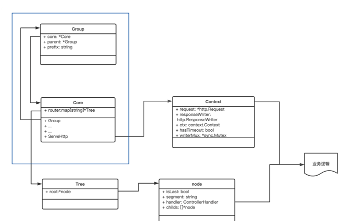

## 中间件模式（提高框架的可拓展性）

到目前为止已经完成了 Web 框架的基础部分，使用 net/http 启动了一个 Web 服务，并且定义了自己的 Context，可以控制请求超时。

之前在讲具体实现的时候，反复强调要注意代码的优化。那么如何优化呢？具体来说，很重要的一点就是封装。所以今天就回顾一下之前写的代码，看看如何通过封装来进一步提高代码扩展性。

在正式执行业务逻辑之前，创建了一个具有定时器功能的 Context，然后开启一个 Goroutine 执行正式的业务逻辑，并且监听定时器和业务逻辑，哪个先完成，就先输出内容。

首先从代码功能分析，这个控制器像由两部分组成。

一部分是业务逻辑，也就是 time.Sleep 函数所代表的逻辑，在实际生产过程中，这里会有很重的业务逻辑代码；而另一部分是非业务逻辑，比如创建 Context、通道等待 finish 信号等。很明显，这个非业务逻辑是非常通用的需求，可能在多个控制器中都会使用到。

而且考虑复用性，这里只是写了一个控制器，那如果有多个控制器呢，难道要为每个控制器都写上这么一段超时代码吗？那就非常冗余了。

所以，能不能设计一个机制，将这些非业务逻辑代码抽象出来，封装好，提供接口给控制器使用。这个机制的实现，就是中间件。

怎么实现这个中间件呢？

代码的组织顺序很清晰，先预处理请求，再处理业务逻辑，最后处理返回值，你发现没有这种顺序，其实很符合设计模式中的装饰器模式。装饰器模式，顾名思义，就是在核心处理模块的外层增加一个又一个的装饰，类似洋葱。


现在，抽象出中间件的思路是不是就很清晰了，把核心业务逻辑先封装起来，然后一层一层添加装饰，最终让所有请求正序一层层通过装饰器，进入核心处理模块，再反序退出装饰器。原理就是这么简单，不难理解，接着看该如何实现。

### 使用函数嵌套方式实现中间件

装饰器模式是一层一层的，所以具体实现其实也不难想到，就是使用函数嵌套。

首先，封装核心的业务逻辑。就是说，这个中间件的输入是一个核心的业务逻辑 ControllerHandler，输出也应该是一个 ControllerHandler。所以对于一个超时控制器，可以定义一个中间件为 TimeoutHandler。

在框架文件夹中，创建一个 timeout.go 文件来存放这个中间件。

```text
func TimeoutHandler(fun ControllerHandler, d time.Duration) ControllerHandler {
  // 使用函数回调
  return func(c *Context) error {
    finish := make(chan struct{}, 1)
    panicChan := make(chan interface{}, 1)
    // 执行业务逻辑前预操作：初始化超时 context
    durationCtx, cancel := context.WithTimeout(c.BaseContext(), d)
    defer cancel()
    c.request.WithContext(durationCtx)
    go func() {
      defer func() {
        if p := recover(); p != nil {
          panicChan <- p
        }
      }()
      // 执行具体的业务逻辑
      fun(c)
      finish <- struct{}{}
    }()
    // 执行业务逻辑后操作
    select {
    case p := <-panicChan:
      log.Println(p)
      c.responseWriter.WriteHeader(500)
    case <-finish:
      fmt.Println("finish")
    case <-durationCtx.Done():
      c.SetHasTimeout()
      c.responseWriter.Write([]byte("time out"))
    }
    return nil
  }
}
```

仔细看下这段代码，中间件函数的返回值是一个匿名函数，这个匿名函数实现了 ControllerHandler 函数结构，参数为 Context，返回值为 error。

在这个匿名函数中，先创建了一个定时器 Context，然后开启一个 Goroutine，在 Goroutine 中执行具体的业务逻辑。这个 Goroutine 会在业务逻辑执行结束后，通过一个 finish 的 channel 来传递结束信号；也会在业务出现异常的时候，通过 panicChan 来传递异常信号。

而在业务逻辑之外的主 Goroutine 中，会同时进行多个信号的监听操作，包括结束信号、异常信号、超时信号，耗时最短的信号到达后，请求结束。这样就完成了设置业务超时的任务。

于是在业务文件夹 route.go 中，路由注册就可以修改为：

```text
// 在核心业务逻辑 UserLoginController 之外，封装一层 TimeoutHandler
core.Get("/user/login", framework.TimeoutHandler(UserLoginController, time.Second))
```

这种函数嵌套方式，让下层中间件是上层中间件的参数，通过一层层嵌套实现了中间件的装饰器模式。

但是你再想一步，就会发现，这样实现的中间件机制有两个问题：

1. 中间件是循环嵌套的，当有多个中间件的时候，整个嵌套长度就会非常长，非常不优雅的，比如：

> TimeoutHandler(LogHandler(recoveryHandler(UserLoginController)))

2. 刚才的实现，只能为单个业务控制器设置中间件，不能批量设置。开发的路由是具有同前缀分组功能的（IGroup），需要批量为某个分组设置一个超时时长。

所以，要对刚才实现的简单中间件代码做一些改进。怎么做呢？

### 使用 pipeline 思想改造中间件

一层层嵌套不好用，如果将每个核心控制器所需要的中间件，使用一个数组链接（Chain）起来，形成一条流水线（Pipeline），就能完美解决这两个问题了。

请求流的流向如下图所示：


这个 Pipeline 模型和前面的洋葱模型不一样的点在于，Middleware 不再以下一层的 ControllerHandler 为参数了，它只需要返回有自身中间件逻辑的 ControllerHandler。

也就是在框架文件夹中的 timeout.go 中，将 Middleware 的形式从刚才的：

```text
func TimeoutHandler(fun ControllerHandler, d time.Duration) ControllerHandler {
  // 使用函数回调
  return func(c *Context) error {
   //...
    }
}
```

变成这样：

```text
// 超时控制器参数中ControllerHandler结构已经去掉
func Timeout(d time.Duration) framework.ControllerHandler {
  // 使用函数回调
  return func(c *framework.Context) error {
      //...
    }
}
```

但是在中间件注册的回调函数中，如何调用下一个 ControllerHandler 呢？在回调函数中，只有 framework.Context 这个数据结构作为参数。

所以就需要在 Context 这个数据结构中想一些办法了。回顾下目前有的数据结构：Core、Context、Tree、Node、Group。


它们基本上都是以 Core 为中心，在 Core 中设置路由 router，实现了 Tree 结构，在 Tree 结构中包含路由节点 node；在注册路由的时候，将对应的业务核心处理逻辑 handler ，放在 node 结构的 handler 属性中。

而 Core 中的 ServeHttp 方法会创建 Context 数据结构，然后 ServeHttp 方法再根据 Request-URI 查找指定 node，并且将 Context 结构和 node 中的控制器 ControllerHandler 结合起来执行具体的业务逻辑。

结构都梳理清楚了，怎么改造成流水线呢？

可以将每个中间件构造出来的 ControllerHandler 和最终的业务逻辑的 ControllerHandler 结合在一起，成为一个 ControllerHandler 数组，也就是控制器链。在最终执行业务代码的时候，能一个个调用控制器链路上的控制器。

这个想法其实是非常自然的，因为中间件中创造出来的 ControllerHandler 匿名函数，和最终的控制器业务逻辑 ControllerHandler，都是同样的结构，所以我们可以选用 Controllerhander 的数组，来表示某个路由的业务逻辑。

对应到代码上，我们先搞清楚使用链路的方式，再看如何注册和构造链路。

### 如何使用控制器链路
首先，我们研究下如何使用这个控制器链路，即图中右边部分的改造。


- 第一步，需要修改路由节点 node。

在 node 节点中将原先的 Handler，替换为控制器链路 Handlers。这样在寻找路由节点的时候，就能找到对应的控制器链路了。修改框架文件夹中存放 trie 树的 trie.go 文件：

```text
// 代表节点
type node struct {
  ...
  handlers []ControllerHandler // 中间件+控制器 
    ...
}
```

- 第二步，修改 Context 结构。
  
由于上文提到，在中间件注册的回调函数中，只有 framework.Context 这个数据结构作为参数，所以在 Context 中也需要保存这个控制器链路 (handlers)，并且要记录下当前执行到了哪个控制器（index）。修改框架文件夹的 context.go 文件：

```text
// Context代表当前请求上下文
type Context struct {
  ...
  // 当前请求的handler链条
  handlers []ControllerHandler
  index    int // 当前请求调用到调用链的哪个节点
}
```

- 第三步，来实现链条调用方式。

为了控制实现链条的逐步调用，为 Context 实现一个 Next 方法。这个 Next 方法每调用一次，就将这个控制器链路的调用控制器，往后移动一步。继续在框架文件夹中的 context.go 文件里写：

```text
// 核心函数，调用context的下一个函数
func (ctx *Context) Next() error {
  ctx.index++
  if ctx.index < len(ctx.handlers) {
    if err := ctx.handlers[ctx.index](ctx); err != nil {
      return err
    }
  }
  return nil
}
```

这里 Next() 函数是整个链路执行的重点，要好好理解，它通过维护 Context 中的一个下标，来控制链路移动，这个下标表示当前调用 Next 要执行的控制器序列。

Next() 函数会在框架的两个地方被调用：

- 第一个是在此次请求处理的入口处，即 Core 的 ServeHttp；

- 第二个是在每个中间件的逻辑代码中，用于调用下个中间件。


这里要注意，index 下标表示当前调用 Next 要执行的控制器序列，它的初始值应该为 -1，每次调用都会自增 1，这样才能保证第一次调用的时候 index 为 0，定位到控制器链条的下标为 0 的控制器，即第一个控制器。

在框架文件夹 context.go 的初始化 Context 函数中，代码如下：

```text
// NewContext 初始化一个Context
func NewContext(r *http.Request, w http.ResponseWriter) *Context {
  return &Context{
    ...
    index:          -1,
  }
}
```

被调用的第一个地方，在入口处调用的代码，写在框架文件夹中的 core.go 文件中：

```text
// 所有请求都进入这个函数, 这个函数负责路由分发
func (c *Core) ServeHTTP(response http.ResponseWriter, request *http.Request) {
  // 封装自定义context
  ctx := NewContext(request, response)
  // 寻找路由
  handlers := c.FindRouteByRequest(request)
  if handlers == nil {
    // 如果没有找到，这里打印日志
    ctx.Json(404, "not found")
    return
  }
    // 设置context中的handlers字段
  ctx.SetHandlers(handlers)
  // 调用路由函数，如果返回err 代表存在内部错误，返回500状态码
  if err := ctx.Next(); err != nil {
    ctx.Json(500, "inner error")
    return
  }
}
```

被调用的第二个位置在中间件中，每个中间件都通过调用 context.Next 来调用下一个中间件。所以可以在框架文件夹中创建 middleware 目录，其中创建一个 test.go 存放的测试中间件：

```text
func Test1() framework.ControllerHandler {
  // 使用函数回调
  return func(c *framework.Context) error {
    fmt.Println("middleware pre test1")
    c.Next()  // 调用Next往下调用，会自增context.index
    fmt.Println("middleware post test1")
    return nil
  }
}
func Test2() framework.ControllerHandler {
  // 使用函数回调
  return func(c *framework.Context) error {
    fmt.Println("middleware pre test2")
    c.Next() // 调用Next往下调用，会自增context.index
    fmt.Println("middleware post test2")
    return nil
  }
}
```

### 如何注册控制器链路

再看控制器链路如何注册，就是之前 UML 图的左边部分。



很明显，现有的函数没有包含注册中间件逻辑，所以需要为 Group 和 Core 两个结构增加注册中间件入口，要设计两个地方：

- Core 和 Group 单独设计一个 Use 函数，为其数据结构负责的路由批量设置中间件

- 为 Core 和 Group 注册单个路由的 Get / Post / Put / Delete 函数，设置中间件

先看下批量设置中间件的 Use 函数，在框架文件夹中的 core.go 修改：

```text
// 注册中间件
func (c *Core) Use(middlewares ...ControllerHandler) {
  c.middlewares = middlewares
}
// 注册中间件
func (g *Group) Use(middlewares ...ControllerHandler) {
  g.middlewares = middlewares
}
```

注意下这里的参数，使用的是 Golang 的可变参数，这个可变参数代表，可以传递 0～n 个 ControllerHandler 类型的参数，这个设计会增加函数的易用性。它在业务文件夹中使用起来的形式是这样的，在 main.go 中：

```text
// core中使用use注册中间件
core.Use(
    middleware.Test1(),
    middleware.Test2())
// group中使用use注册中间件
subjectApi := core.Group("/subject")
subjectApi.Use(middleware.Test3())
```

再看单个路由设置中间件的函数，也使用可变参数，改造注册路由的函数（Get /Post /Delete /Put），继续在框架文件夹中的 core.go 里修改：

```text
// Core的Get方法进行改造
func (c *Core) Get(url string, handlers ...ControllerHandler) {
  // 将core的middleware 和 handlers结合起来
  allHandlers := append(c.middlewares, handlers...)
  if err := c.router["GET"].AddRouter(url, allHandlers); err != nil {
    log.Fatal("add router error: ", err)
  }
}
... 
```

同时修改框架文件夹中的 group.go：

```text
// 改造IGroup 的所有方法
type IGroup interface {
  // 实现HttpMethod方法
  Get(string, ...ControllerHandler)
  Post(string, ...ControllerHandler)
  Put(string, ...ControllerHandler)
  Delete(string, ...ControllerHandler)
  //..
}
// 改造Group的Get方法
func (g *Group) Get(uri string, handlers ...ControllerHandler) {
  uri = g.getAbsolutePrefix() + uri
  allHandlers := append(g.getMiddlewares(), handlers...)
  g.core.Get(uri, allHandlers...)
}
...
```

这样，回到业务文件夹中的 router.go，注册路由的使用方法就可以变成如下形式：

```text
// 注册路由规则
func registerRouter(core *framework.Core) {
  // 在core中使用middleware.Test3() 为单个路由增加中间件
  core.Get("/user/login", middleware.Test3(), UserLoginController)
  // 批量通用前缀
  subjectApi := core.Group("/subject")
  {
        ...
        // 在group中使用middleware.Test3() 为单个路由增加中间件
    subjectApi.Get("/:id", middleware.Test3(), SubjectGetController)
  }
}
```

不管是通过批量注册中间件，还是单个注册中间件，最终都要汇总到路由节点 node 中，所以这里调用最终增加路由的函数 Tree.AddRouter，把将这个请求对应的 Core 结构里的中间件和 Group 结构里的中间件，都聚合起来，成为最终路由节点的中间件。

聚合的逻辑在 group.go 和 core.go 中都有，实际上就是将 Handler 和 Middleware 一起放在一个数组中。

```text
// 获取某个group的middleware
// 这里就是获取除了Get/Post/Put/Delete之外设置的middleware
func (g *Group) getMiddlewares() []ControllerHandler {
  if g.parent == nil {
    return g.middlewares
  }
  return append(g.parent.getMiddlewares(), g.middlewares...)
}
// 实现Get方法
func (g *Group) Get(uri string, handlers ...ControllerHandler) {
  uri = g.getAbsolutePrefix() + uri
  allHandlers := append(g.getMiddlewares(), handlers...)
  g.core.Get(uri, allHandlers...)
}
```

在 core.go 文件夹里写：

```text
// 匹配GET 方法, 增加路由规则
func (c *Core) Get(url string, handlers ...ControllerHandler) {
  // 将core的middleware 和 handlers结合起来
  allHandlers := append(c.middlewares, handlers...)
  if err := c.router["GET"].AddRouter(url, allHandlers); err != nil {
    log.Fatal("add router error: ", err)
  }
}
```

到这里，使用 pipeline 思想对中间件的改造就完成了, 最终的 UML 类图如下：


- 第一步使用控制器链路，改造了 node 和 Context 两个数据结构。为 node 增加了 handlers，存放这个路由注册的所有中间件；Context 也增加了 handlers，在 Core.ServeHttp 的函数中，创建 Context 结构，寻找到请求对应的路由节点，然后把路由节点的 handlers 数组，复制到 Context 中的 handlers。

为了实现真正的链路调用，需要在框架的两个地方调用 Context.Next() 方法，一个是启动业务逻辑的地方，一个是每个中间件的调用。

- 第二步如何注册控制器链路，改造了 Group 和 Core 两个数据结构，为它们增加了注册中间件的入口，一处是批量增加中间件函数 Use，一处是在注册单个路由的 Get / Post / Delete / Put 方法中，为单个路由设置中间件。在设计入口的时候，使用了可变参数的设计，提高注册入口的可用性。

### 基本的中间件: Recovery

现在已经将中间件机制搭建并运行起来了， 但是具体需要实现哪些中间件呢？。

这里演示一个最基本的中间件：Recovery。

中间件那么多，比如超时中间件、统计中间件、日志中间件，为什么说 Recovery 是最基本的呢？可以先思考这个问题：在编写业务核心逻辑的时候，如果出现了一个 panic，而且在业务核心逻辑函数中未捕获处理，会发生什么？

基于 net/http 的主流程逻辑来思考，关键结论有一点是，每个 HTTP 连接都会开启一个 Goroutine 为其服务，所以很明显， net/http 的进程模型是单进程、多协程。


在 Golang 的这种模型中，每个协程是独立且平等的，即使是创建子协程的父协程，在 Goroutine 中也无法管理子协程。所以，每个协程需要自己保证不会外抛 panic，一旦外抛 panic 了，整个进程就认为出现异常，会终止进程。

这一点搞清楚了，再看 Recovery 为什么必备就很简单。在 net/http 处理业务逻辑的协程中，要捕获在自己这个协程中抛出的 panic，就必须自己实现 Recovery 机制。

而 Recovery 中间件就是用来为每个协程增加 Recovery 机制的。在框架的 middleware 文件夹中增加 recovery.go 存放这个中间件：

```text
// recovery机制，将协程中的函数异常进行捕获
func Recovery() framework.ControllerHandler {
  // 使用函数回调
  return func(c *framework.Context) error {
    // 核心在增加这个recover机制，捕获c.Next()出现的panic
    defer func() {
      if err := recover(); err != nil {
        c.Json(500, err)
      }
    }()
    // 使用next执行具体的业务逻辑
    c.Next()
    return nil
  }
}
```

这个中间件就是在 context.Next() 之前设置了 defer 函数，这个函数的作用就是捕获 c.Next() 中抛出的异常 panic。之后在业务文件夹中的 main.go，就可以通过 Core 结构的 Use 方法，对所有的路由都设置这个中间件。

```text
core.Use(middleware.Recovery())
```

### 总结
最终为框架增加了中间件机制。中间件机制的本质就是装饰器模型，对核心的逻辑函数进行装饰、封装，所以一开始就使用函数嵌套的方式实现了中间件机制。

但是实现之后，发现函数嵌套的弊端：一是不优雅，二是无法批量设置中间件。所以引入了 pipeline 的思想，将所有中间件做成一个链条，通过这个链条的调用，来实现中间件机制。

最后，选了最基础的 Recovery 中间件演示如何具体实现，一方面作为中间件机制的示例，另一方面，也在功能上为框架增强了健壮性。

中间件机制是必须要掌握的机制，很多 Web 框架中都有这个逻辑。在架构层面，中间件机制就相当于，在每个请求的横切面统一注入了一个逻辑。这种统一处理的逻辑是非常有用的，比如统一打印日志、统一打点到统计系统、统一做权限登录验证等。
