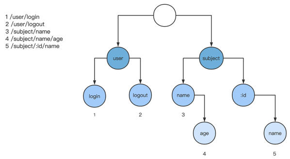

## 封装（如何让你的框架更好用）

### 如何封装请求和返回

目标是尽量在 context 这个数据结构中，封装“读取请求数据”和“封装返回数据”中的方法。

- 读取请求数据

要读取请求数据包含哪些内容呢？

HTTP 消息体分为两个部分：HTTP 头部和 HTTP Body 体。头部描述的一般是和业务无关但与传输相关的信息，比如请求地址、编码格式、缓存时长等；Body 里面主要描述的是与业务相关的信息。

所以针对请求数据的这两部分，应该设计不同的方法。

Header 信息中，包含 HTTP 的一些基础信息，比如请求地址、请求方法、请求 IP、请求域名、Cookie 信息等，是经常读取使用的，为了方便，我们需要一一提供封装。

而另外一些更细节的内容编码格式、缓存时长等，由于涉及的 HTTP 协议细节内容比较多，我们很难将每个细节都封装出来，但是它们都是以 key=value 的形式传递到服务端的，所以这里也考虑封装一个通用的方法。

Body 信息中，HTTP 是已经以某种形式封装好的，可能是 JSON 格式、XML 格式，也有可能是 Form 表单格式。其中 Form 表单注意一下，它可能包含 File 文件，请求参数和返回值肯定和其他的 Form 表单字段是不一样的，需要我们对其单独封装一个函数。

- 封装返回数据

封装返回数据，指的是将处理后的数据返回给浏览器。同样，它也分为两个部分，Header 头部和 Body 体。

Header 头部，我们经常要设置的是返回状态码和 Cookie，所以单独为其封装。其他的 Header 同样是 key=value 形式设置的，设置一个通用的方法即可。

返回数据的 Body 体是有不同形式的，比如 JSON、JSONP、XML、HTML 或者其他文本格式，所以我们要针对不同的 Body 体形式，进行不同的封装。

一路分析下来，再列出这样一个思维导图就非常清晰了。


### 定义接口让封装更明确

**对于比较完整的功能模块，先定义接口，再具体实现**。

首先，定义一个清晰的、包含若干个方法的接口，可以让使用者非常清楚：这个功能模块提供了哪些函数、哪些函数是我要的、哪些函数是我不要的，在用的时候，查找也更方便。如果你有过，在超过 20 个函数的结构体中，查找你需要的函数的惨痛经历，你就会觉得这一点尤为重要了。

其次，定义接口能做到“实现解耦”。使用接口作为参数、返回值，能够让使用者在写具体函数的时候，有不同的实现；而且在不同实现中，只需要做到接口一致，就能很简单进行替换，而不用修改使用方的任何代码。

好，明白这两点，我们再回到封装需求上，先定义两个接口：IRequest 和 IResponse，分别对应“读取请求数据”和“封装返回数据” 这两个功能模块。

我们分别在框架目录下创建 request.go 和 response.go 来存放这两个接口及其实现。

### IRequest 接口定义

读取请求数据 IRequest，我们定义的方法如下，在 request.go 中进行修改：
```go
// 代表请求包含的方法
type IRequest interface {
  // 请求地址 url 中带的参数
  // 形如: foo.com?a=1&b=bar&c[]=bar
  QueryInt(key string, def int) (int, bool)
  QueryInt64(key string, def int64) (int64, bool)
  QueryFloat64(key string, def float64) (float64, bool)
  QueryFloat32(key string, def float32) (float32, bool)
  QueryBool(key string, def bool) (bool, bool)
  QueryString(key string, def string) (string, bool)
  QueryStringSlice(key string, def []string) ([]string, bool)
  Query(key string) interface{}
  // 路由匹配中带的参数
  // 形如 /book/:id
  ParamInt(key string, def int) (int, bool)
  ParamInt64(key string, def int64) (int64, bool)
  ParamFloat64(key string, def float64) (float64, bool)
  ParamFloat32(key string, def float32) (float32, bool)
  ParamBool(key string, def bool) (bool, bool)
  ParamString(key string, def string) (string, bool)
  Param(key string) interface{}
  // form 表单中带的参数
  FormInt(key string, def int) (int, bool)
  FormInt64(key string, def int64) (int64, bool)
  FormFloat64(key string, def float64) (float64, bool)
  FormFloat32(key string, def float32) (float32, bool)
  FormBool(key string, def bool) (bool, bool)
  FormString(key string, def string) (string, bool)
  FormStringSlice(key string, def []string) ([]string, bool)
  FormFile(key string) (*multipart.FileHeader, error)
  Form(key string) interface{}
  // json body
  BindJson(obj interface{}) error
  // xml body
  BindXml(obj interface{}) error
  // 其他格式
  GetRawData() ([]byte, error)
  // 基础信息
  Uri() string
  Method() string
  Host() string
  ClientIp() string
  // header
  Headers() map[string]string
  Header(key string) (string, bool)
  // cookie
  Cookies() map[string]string
  Cookie(key string) (string, bool)
}
```

简单说明一下，我们使用了 QueryXXX 的系列方法来代表从 URL 的参数后缀中获取的参数；使用 ParamXXX 的系列方法来代表从路由匹配中获取的参数；使用 FormXXX 的系列方法来代表从 Body 的 form 表单中获取的参数。

不知道你发现了没有，这三个系列的方法，我们统一了参数和返回值。

- 参数一般都有两个：一个是 key，代表从参数列表中查找参数的关键词；另外一个是 def，代表如果查找不到关键词，会使用哪个默认值进行返回。

- 返回值返回两个：一个代表对应 key 的匹配值，而另一个 bool 返回值代表是否有这个返回值。

这样的设计，在获取参数的时候，能让需要处理的两个逻辑，默认参数和是否有参数，都得到很好的处理；同时对于 JSON 格式、XML 格式的 Body 结构读取，也提供了对应的方法。

对基础信息，我们提供了 URI、Method、Host、ClinetIp 等方法；对 Header 头，我们提供根据 key 获取 Header 值的通用方法；同时，也对 Cookie 单独提供了批量获取 Cookie 和按照关键词获取 Cookie 的两个方法。

### IResponse 接口定义

对于封装返回数据 IResponse，我们在 response.go 中定义的方法如下：
```go
// IResponse 代表返回方法
type IResponse interface {
  // Json 输出
  Json(obj interface{}) IResponse
  // Jsonp 输出
  Jsonp(obj interface{}) IResponse
  //xml 输出
  Xml(obj interface{}) IResponse
  // html 输出
  Html(template string, obj interface{}) IResponse
  // string
  Text(format string, values ...interface{}) IResponse
  // 重定向
  Redirect(path string) IResponse
  // header
  SetHeader(key string, val string) IResponse
  // Cookie
  SetCookie(key string, val string, maxAge int, path, domain string, secure, httpOnly bool) IResponse
  // 设置状态码
  SetStatus(code int) IResponse
  // 设置 200 状态
  SetOkStatus() IResponse
}
```

对于 Header 部分，设计了状态码的设置函数 SetStatus/SetOkStatus/Redirect，还设计了 Cookie 的设置函数 SetCookie，同时，我们提供了通用的设置 Header 的函数 SetHeader。

对于 Body 部分，我们设计了 JSON、JSONP、XML、HTML、Text 等方法来输出不同格式的 Body。

这里注意下，很多方法的返回值使用 IResponse 接口本身， 这个设计能允许使用方进行链式调用。链式调用的好处是，能很大提升代码的阅读性，比如在业务逻辑代码 controller.go 里这个调用方法：

> c.SetOkStatus().Json("ok, UserLoginController: " + foo)

就能很好地阅读：“返回成功，并且输出 JSON 字符串”。这种通过返回值返回接口本身的小技巧。

### 实现具体的接口

需要实现这两个接口，直接将 Context 这个数据结构，实现这两个接口定义的方法就行了。因为在 Golang 中，只要包含了接口所带的函数就是实现了接口，并不需要显式标记继承。

#### 请求相关接口实现

先将注意力专注在 Request 请求相关的方法上，首先处理刚才在 request.go 中定义的 Query 相关的参数请求方法。

```go
// 请求地址 url 中带的参数
// 形如: foo.com?a=1&b=bar&c[]=bar
QueryInt(key string, def int) (int, bool)
QueryInt64(key string, def int64) (int64, bool)
QueryFloat64(key string, def float64) (float64, bool)
QueryFloat32(key string, def float32) (float32, bool)
QueryBool(key string, def bool) (bool, bool)
QueryString(key string, def string) (string, bool)
QueryStringSlice(key string, def []string) ([]string, bool)
Query(key string) interface{}
```

如何获取请求参数呢，我们可以从 http.Request 结构中，通过 Query 方法，获取到请求 URL 中的参数。

#### Query 请求方法实现
所以，在 request.go 中，我们先创建一个 QueryAll() 方法。

```go
// 获取请求地址中所有参数
func (ctx *Context) QueryAll() map[string][]string {
  if ctx.request != nil {
    return map[string][]string(ctx.request.URL.Query())
  }
  return map[string][]string{}
}
```

接着要做的，就是将这个 QueryAll 查询出来的 map 结构根据 key 查询，并且转换为其他类型的数据结构，比如 Int、Int64、Float64、Float32 等。

这里推荐一个第三方库 cast，这个库实现了多种常见类型之间的相互转换，返回最符合直觉的结果，通过这个网站可以查看其提供的所有方法，这里展示部分你可以看看：

```go
...
func ToUint(i interface{}) uint
func ToUint16(i interface{}) uint16
func ToUint16E(i interface{}) (uint16, error)
func ToUint32(i interface{}) uint32
func ToUint32E(i interface{}) (uint32, error)
func ToUint64(i interface{}) uint64
func ToUint64E(i interface{}) (uint64, error)
func ToUint8(i interface{}) uint8
func ToUint8E(i interface{}) (uint8, error)
func ToUintE(i interface{}) (uint, error)
...
```

归纳起来，cast 提供类型转换方法，参数可以是任意类型，转换为对应的目标类型，每种转换会提供两组方法，一组是带 error 返回值的方法，一组是不带 error 返回值的。如果使用 cast 库，我们将 request.go 中 QueryXXX 方式的实现修改一下：
```go
// 获取 Int 类型的请求参数
func (ctx *Context) QueryInt(key string, def int) (int, bool) {
  params := ctx.QueryAll()
  if vals, ok := params[key]; ok {
    if len(vals) > 0 {
      // 使用 cast 库将 string 转换为 Int
      return cast.ToInt(vals[0]), true
    }
  }
  return def, false
}
```

QueryAll 返回一个 map 结构，根据 key 查找出对应的参数值，并且通过 cast 库将对应的参数值转化成目标数据结构。

Query 的参数请求方法就实现完成了。Form 表单相关的请求方法是从 HTTP Body 中获取参数，同 Query 方法相类似，我们就不再重复，简单说下思路：可以从 http.Request 中获取到 Form 的请求参数，然后再用 cast 库进行类型转换。

#### Param 请求方法实现

接下来，我们需要实现 Param 相关的请求方法。

Param 的请求方法是：通过路由解析请求地址，抽取请求地址中包含通配符的段。比如路由规则为 /subject/:id，真实请求 URI 为 /subject/1，那么获取 key 为 id 的 Param 值就为 1。

怎么实现路由，用 trie 树实现了路由规则。当请求进入的时候，将请求的 URI 地址根据分隔符分成不同的段，用这个段去匹配 trie 树。只有当每个段都匹配 trie 树中某个路径的时候，我们才将路径终止节点里的 Handlers ，作为这个请求的最终处理函数。



而在这个匹配路径中，有的节点是根据通配符进行匹配的，这些节点就是我们要查找的 Param 参数。

现在就要获取路由解析过程中的这些通配符参数，最朴素的想法就是：查找出这个匹配路径，然后查找出其中的通配符节点，再和请求 URI 对应，获取这些通配符参数。我们看这个想法如何实现。

之前查找路由的时候，查到的是匹配路径的最终节点，如何追溯到整个匹配路径呢？这里我们可以考虑构造一个双向链表：改造 node 节点，增加一个 parent 指针，指向父节点，将 trie 树变成一个双向指针。来修改框架目录中的 trie.go：

```go
// 代表节点
type node struct {
  ...
  parent   *node               // 父节点，双向指针
}
```

在增加路由规则（AddRouter）的时候，创建子节点也要同时修改这个 parent 指针，继续写：
```go
func (tree *Tree) AddRouter(uri string, handlers []ControllerHandler) error {
  ...
  // 对每个 segment
  for index, segment := range segments {
    ...
    if objNode == nil {
      // 创建一个当前 node 的节点
      cnode := newNode()
      cnode.segment = segment
      if isLast {
        cnode.isLast = true
        cnode.handlers = handlers
      }
      // 父节点指针修改
      cnode.parent = n
      n.childs = append(n.childs, cnode)
      objNode = cnode
    }
    n = objNode
  }
  return nil
}
```

这样，双向链表就修改完了。接着就根据最终匹配的节点和请求 URI，查找出整个匹配链路中的通配符节点和对应 URI 中的分段，还是在 trie.go 里继续写：
```go
// 将 uri 解析为 params
func (n *node) parseParamsFromEndNode(uri string) map[string]string {
  ret := map[string]string{}
  segments := strings.Split(uri, "/")
  cnt := len(segments)
  cur := n
  for i := cnt - 1; i >= 0; i-- {
    if cur.segment == "" {
      break
    }
    // 如果是通配符节点
    if isWildSegment(cur.segment) {
      // 设置 params
      ret[cur.segment[1:]] = segments[i]
    }
    cur = cur.parent
  }
  return ret
}
```

接下来，为了让 context 中有 map 结构的路由参数，我们将解析出来的 params 存储到 context 结构中。这里修改框架目录中的 core.go 文件：

```go
// 所有请求都进入这个函数, 这个函数负责路由分发
func (c *Core) ServeHTTP(response http.ResponseWriter, request *http.Request) {
  // 封装自定义 context
  ctx := NewContext(request, response)
  // 寻找路由
  node := c.FindRouteNodeByRequest(request)
  ...
  // 设置路由参数
  params := node.parseParamsFromEndNode(request.URL.Path)
  ctx.SetParams(params)
  ...
}
```

最后，回到框架目录的 request.go，我们还是使用 cast 库来将这个 Param 系列方法完成：
```go
// 获取路由参数
func (ctx *Context) Param(key string) interface{} {
  if ctx.params != nil {
    if val, ok := ctx.params[key]; ok {
      return val
    }
  }
  return nil
}
// 路由匹配中带的参数
// 形如 /book/:id
func (ctx *Context) ParamInt(key string, def int) (int, bool) {
  if val := ctx.Param(key); val != nil {
    // 通过 cast 进行类型转换
    return cast.ToInt(val), true
  }
  return def, false
}
```

#### Bind 请求方法实现

到这里，ParamXXX 系列函数就完成了，接下来我们看下 BindXXX 系列函数，比如 BindJson。它的实现只需要简单 2 步：读取 Body 中的文本、解析 body 文本到结构体。所以修改 response.go 中的函数：

```go
// 将 body 文本解析到 obj 结构体中
func (ctx *Context) BindJson(obj interface{}) error {
  if ctx.request != nil {
    // 读取文本
    body, err := ioutil.ReadAll(ctx.request.Body)
    if err != nil {
      return err
    }
    // 重新填充 request.Body，为后续的逻辑二次读取做准备
    ctx.request.Body = ioutil.NopCloser(bytes.NewBuffer(body))
    // 解析到 obj 结构体中
    err = json.Unmarshal(body, obj)
    if err != nil {
      return err
    }
  } else {
    return errors.New("ctx.request empty")
  }
  return nil
}
```

读取 Body 中的文本，我们使用 ioutil.ReadAll 方法，解析 Body 文本到结构体中，使用 json.Unmarshal 方法。

这里要注意，request.Body 的读取是一次性的，读取一次之后，下个逻辑再去 request.Body 中是读取不到数据内容的。所以我们读取完 request.Body 之后，还要再复制一份 Body 内容，填充到 request.Body 里。

#### 返回相关接口实现

返回接口中的 JSON、XML、TEXT 的输出是比较简单的，将输出数据结构进行序列化就行，这里重点讲比较复杂的两种实现 JSONP 输出和 HTML 输出。

##### JSONP 输出方法实现

JSONP 是一种我们常用的解决跨域资源共享的方法，简要介绍下这个方法的原理。

在 JavaScript 中使用 HTTP 请求（Ajax）会受到同源策略的限制。比如说 A 网站的页面不能在 JavaScript 中跨域访问 B 网站的资源。但是，如果我们希望能跨域访问怎么办？

我们知道 HTML 中标签 <script> 中的请求是不受同源策略影响的，那如果能将 B 网站的资源数据，通过 script 标签返回来，是不是就直接解决了跨域问题？确实，JSONP 就是这么设计的，通过 script 标签的源地址，返回数据资源 + JavaScript 代码。

比如 A 网站的网页如下，它希望从 B 网站中获取数据，填充进 id 为"context"的 div 标签中。

```html
<html>
  <body>
    <div id="context"></div>
  </body>
</html>
<script>
  function callfun(data) {
     document.getElementById('context').innerHTML = data;
  }
</script>
<script src="http://B.com/jsonp?callback=callfun"></script>
```

使用 ajax 请求的时候，做不到这一点的，因为同源策略限制了网页和数据必须在同一个源下。但是如果 B 网站的接口支持了 JSONP，它能根据请求参数返回一段 JavaScript 代码，类似：

```text
callfunc({"id":1, "name": jianfengye})
```

这时 A 网站的网页，就能直接调用 callfunc 方法，并且获取到 B 网站返回的数据。

了解了 JSONP 的原理，我们回到服务端实现 JSONP 的方法中。这个方法要做的事情就是：获取请求中的参数作为函数名，获取要返回的数据 JSON 作为函数参数，将函数名 + 函数参数作为返回文本。

在 response.go 中补充 Jsonp 方法。

```text
// Jsonp 输出
func (ctx *Context) Jsonp(obj interface{}) IResponse {
  // 获取请求参数 callback
  callbackFunc, _ := ctx.QueryString("callback", "callback_function")
  ctx.SetHeader("Content-Type", "application/javascript")
  // 输出到前端页面的时候需要注意下进行字符过滤，否则有可能造成 XSS 攻击
  callback := template.JSEscapeString(callbackFunc)
  // 输出函数名
  _, err := ctx.responseWriter.Write([]byte(callback))
  if err != nil {
    return ctx
  }
  // 输出左括号
  _, err = ctx.responseWriter.Write([]byte("("))
  if err != nil {
    return ctx
  }
  // 数据函数参数
  ret, err := json.Marshal(obj)
  if err != nil {
    return ctx
  }
  _, err = ctx.responseWriter.Write(ret)
  if err != nil {
    return ctx
  }
  // 输出右括号
  _, err = ctx.responseWriter.Write([]byte(")"))
  if err != nil {
    return ctx
  }
  return ctx
}
```

##### HTML 输出方法实现

接下来我们分析下 HTML 输出。

HTML 函数输出的就是一个纯 HTML 页面。现在的 HTML 页面，基本都是动态页面，也就是说页面基本内容都是一样，但是根据不同请求、不同逻辑，页面中的数据部分是不同的。所以，我们在输出 HTML 页面内容的时候，常用“模版 + 数据”的方式。

模版中存放的是页面基本内容，包括布局信息（CSS）、通用脚本（JavaScript）、页面整体结构（HTML）。但是页面结构中，某个标签的具体内容、具体数值，就表示成数据，在模版中保留数据的位置，在最终渲染 HTML 内容的时候，把数据填充进入模版就行了。

在 Golang 中，这种“模版 + 数据”的文本渲染方式是有一个官方库来实现的 html/template ，它的模版使用{{.XX}} 作为数据的占位符，表示传入的数据结构的某个字段：

```text
<h1>{{.PageTitle}}</h1>
<ul>
    {{range .Todos}}
        {{if .Done}}
            <li class="done">{{.Title}}</li>
        {{else}}
            <li>{{.Title}}</li>
        {{end}}
    {{end}}
</ul>
```

传入的数据结构为：

```text
data := TodoPageData{
    PageTitle: "My TODO list",
    Todos: []Todo{
        {Title: "Task 1", Done: false},
        {Title: "Task 2", Done: true},
        {Title: "Task 3", Done: true},
    },
}
```

所以具体的渲染可以分成两步：先根据模版创造出 template 结构；再使用 template.Execute 将传入数据和模版结合。

我们的 HTML 函数可以使用 html/template，修改框架目录 response.go 中的 Html 方法：

```text
// html 输出
func (ctx *Context) Html(file string, obj interface{}) IResponse {
  // 读取模版文件，创建 template 实例
  t, err := template.New("output").ParseFiles(file)
  if err != nil {
    return ctx
  }
  // 执行 Execute 方法将 obj 和模版进行结合
  if err := t.Execute(ctx.responseWriter, obj); err != nil {
    return ctx
  }
  ctx.SetHeader("Content-Type", "application/html")
  return ctx
}
```

参数为模版文件和输出对象，先使用 ParseFiles 来读取模版文件，创建一个 template 数据结构，然后使用 Execute 方法，将数据对象和模版进行结合，并且输出到 responseWriter 中。


