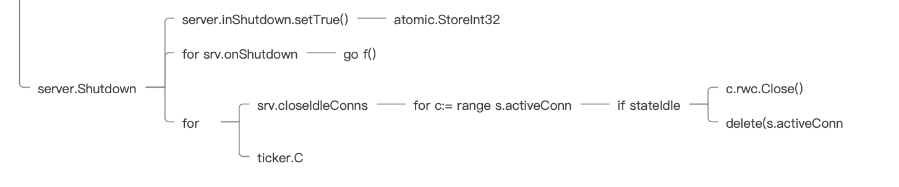

## 如何优雅关闭

什么叫优雅关闭？你可以对比着想，不优雅的关闭比较简单，就是什么都不管，强制关闭进程，这明显会导致有些连接被迫中断。

或许你并没有意识到这个问题的严重性，不妨试想下，当一个用户在购买产品的时候，由于不优雅关闭，请求进程中断，导致用户的钱包已经扣费了，但是商品还未进入用户的已购清单中。这就会给用户带来实质性的损失。

所以，优雅关闭服务，其实说的就是，关闭进程的时候，不能暴力关闭进程，而是要等进程中的所有请求都逻辑处理结束后，才关闭进程。按照这个思路，需要研究两个问题“如何控制关闭进程的操作” 和 “如何等待所有逻辑都处理结束”。

当我们了解了如何控制进程关闭操作，就可以延迟关闭进程行为，设置为等连接的逻辑都处理结束后，再关闭进程。

### 如何控制关闭进程的操作

那么第一个问题，如何控制关闭进程的操作怎么解决？你可以先想想平时关闭一个进程的方法有哪些，如果这些方法都有办法控制关闭操作，那么是不是就达到目的了。

- Ctrl+C

在终端，在非后台模式下启动一个进程的时候，要想关闭，我们在控制台会使用 Ctrl+C 来关闭进程。不管在 Unix 类的系统，还是在 Windows 系统中，Ctrl+C 都是向进程发送信号 SIGINT，这个信号代表的是中断，常用在通过键盘通知前台进程关闭程序的情景中。这个信号是可以被阻塞和处理的。

- Ctrl+\

这个键盘操作是向进程发送信号 SIGQUIT，这个信号其实和 SIGINT 差不多，也是可以被阻塞和处理的，它们都是为了通知进程结束，唯一不同的是，进程处理 QUIT 退出的时候，默认行为会产生 core 文件。

- Kill 命令

当使用后台模式挂起一个进程的时候，操作系统会给这个进程分配一个进程号 pid， 我们可以通过 kill pid 或者 kill -9 pid 来杀死某个进程。

kill pid 会向进程发送 SIGTERM 信号，而 kill -9 会向进程发送 SIGKILL 信号。这两个信号都用于立刻结束进程，但是 SIGTERM 是可以被阻塞和处理的，而 SIGKILL 信号是不能被阻塞和处理的。

用表格总结一下终止进程的这几个信号和对应的操作：


除了 SIGKILL 信号无法被捕获之外，其他的信号都能捕获，所以，只要在程序中捕获住这些信号，就能实现控制关闭进程操作了。那么接下来要解决的问题就是，在 Golang 中如何捕获信号呢？

对于这个问题，标准库提供了 os/signal 这个库。

### os/signal 库

所以，第一步我们使用  go doc os/signal|grep "^func" 来了解下这个库的函数，看看提供了哪些功能。

```text
// 忽略某个信号
func Ignore(sig ...os.Signal){}
// 判断某个信号是否被忽略了
func Ignored(sig os.Signal) bool{}
// 关注某个/某些/全部 信号
func Notify(c chan<- os.Signal, sig ...os.Signal){}
// 取消使用 notify 对信号产生的效果
func Reset(sig ...os.Signal){}
// 停止所有向 channel 发送的效果
func Stop(c chan<- os.Signal){}
```

这个库提供了订阅信号的方法 Notify 和忽略信号的方法 Ignore ，为了全局管理方便，也提供了停止所有订阅的 Stop 函数。另外还有，停止某些订阅的 Reset 函数，当我们已经订阅了某些信号之后，想重新将其中的某些信号不进行订阅，那么可以使用 Reset 方法。

然后就是第二、第三步，通过  go doc os/signal|grep "^type" 了解到，这个库比较简单，没有任何结构定义和结构函数，因为管理信号只需要几个库函数即可，不需要进行更多的模块划分和数据结构抽象。在 Golang 的官方类库中，有不少都是这样只提供库函数，而没有自定义的模块数据结构的。

理解完了捕获信号的 os/signal 库，我们就明白了，要控制这些信号量可以使用 Notify 方法，所以在业务 main.go 里补充：

```text
func main() {
  ...
  // 这个 Goroutine 是启动服务的 Goroutine
  go func() {
    server.ListenAndServe()
  }()
  // 当前的 Goroutine 等待信号量
  quit := make(chan os.Signal)
  // 监控信号：SIGINT, SIGTERM, SIGQUIT
  signal.Notify(quit, syscall.SIGINT, syscall.SIGTERM, syscall.SIGQUIT)
  // 这里会阻塞当前 Goroutine 等待信号
  <-quit
  ...
}
```

注意下这里有两个 Goroutine，一个 Goroutine 是提供启动服务的，另外一个 Goroutine 用于监听信号并且结束进程。那么哪个 Goroutine 用于监听信号呢？

答案是 main 函数所在的当前 Goroutine。因为使用 Ctrl 或者 kill 命令，它们发送的信号是进入 main 函数的，即只有 main 函数所在的 Goroutine 会接收到，所以必须在 main 函数所在的 Goroutine 监听信号。

在监听信号的 Goroutine 中，我们先创建了一个等待信号量的 channel，然后通过 Notify 方法，订阅 SIGINT、SIGTERM、SIGQUIT 三个可以捕获处理的信号量，并且将信号量导入到 channel 中。

最后，使用 channel 的导出操作，来阻塞当前 Goroutine，让当前 Goroutine 只有捕获到结束进程的信号之后，才进行后续的关闭操作。这样就实现了第一个问题进程关闭的可控。

### 如何等待所有逻辑都处理结束

在 Golang 1.8 版本之前，net/http 是没有提供方法的，所以当时开源社区涌现了不少第三方解决方案： manners 、 graceful 、 grace 。

它们的思路都差不多：自定义一个 Server 数据结构，其中包含 net/http 的 Server 数据结构，以及和 net/http 中 Server 一样的启动服务函数，在这个函数中，除了调用启动服务，还设计了一个监听事件的函数。监听事件结束后，通过 channel 等机制来等待主流程结束。

而在 1.8 版本之后，net/http 引入了 server.Shutdown 来进行优雅重启。

server.Shutdown 方法是个阻塞方法，一旦执行之后，它会阻塞当前 Goroutine，并且在所有连接请求都结束之后，才继续往后执行。实现非常容易，思路也和之前的第三方解法差不多，所以就重点理解这个方法。

#### server.Shutdown 源码

来看 server.Shutdown 的源码，同样你可以通过 IDE 跳转工具直接跳转到 Shutdown 源码进行阅读，列出 Shutdown 函数的代码逻辑流程图。



第一层，在运行 Shutdown 方法的时候，先做一个标记，将 server 中的 isShutdown 标记为 true。

```text
srv.inShutdown.setTrue()

func (b *atomicBool) setTrue()    { atomic.StoreInt32((*int32)(b), 1) 
```

这里标准库实现的就很细节了。inShutdown 是一个标记，它用来标记服务器是否正在关闭，标记的时候，还使用了 atomic 操作来保证标记的原子性。这里要琢磨一下，为什么要使用 atomic 操作呢？

在 Golang 中，所有的赋值操作都不能保证是原子的，比如 int 类型的 a=a+1，或者 bool 类型的 a=true，这些赋值操作，在底层并不一定是由一个独立的 CPU 指令完成的。所以在并发场景下，我们并不能保证并发赋值的操作是安全的。

比如有两个操作同时对 a 变量进行读写，写 a 变量的线程如果不是原子的，那么读 a 变量的线程就有可能读到写了一半的 a 变量。

所以为保证原子性，Golang 提供了一个 atomic 包，当对一个字段赋值的时候，如果你无法保证其是否原子操作，你可以使用 atomic 包来对这个字段进行赋值。atomic 包，在底层一定会保证，这个操作是在一个单独的 CPU 指令内完成的。

因为这里的 srv.inShutdown 是一个非常重要的标记位。一旦由于任何原因，它读取错误，会发生严重问题，比如进程已经在处理结束的时候，启动 server 的进程还继续监听请求，这个时候会导致新接收的请求有服务错误。所以，这里为了保险起见，使用了一个标准库 atomic 来保证其原子性操作。

然后是逻辑代码：
```text
for _, f := range srv.onShutdown {
  go f()
}
```

onShutdown 在 server 结构中按需求设置。这个字段保存的是回调方法，即用户希望 server 在关闭时进行的回调操作。比如用户可以设置在服务结束的时候，打印一个日志或者调用一个通知机制。如果用户设置了回调，则执行这些回调条件，如果没有设置，可以忽略。

### for 循环

接下来进入这一层最重要的 for 循环。这个 for 循环是一个无限循环，它使用 ticker 来控制每次循环的节奏，通过 return 来控制循环的终止条件。这个写法很值得我们学习。

```text
ticker := time.NewTicker(shutdownPollInterval) // 设置轮询时间
  defer ticker.Stop()
  for {
        // 真正的操作
    if srv.closeIdleConns() && srv.numListeners() == 0 {
      return lnerr
    }
    select {
    case <-ctx.Done(): // 如果ctx有设置超时，有可能触发超时结束
      return ctx.Err()
    case <-ticker.C:  // 如果没有结束，最长等待时间，进行轮询
    }
  }
```

我们在工作中经常会遇到类似的需求：每隔多少时间，执行一次操作，应该有不少同学会使用 time.Sleep 来做间隔时长，而这里演示了如何使用 time.Ticker 来进行轮询设置。这两种方式其实都能完成“每隔多少时间做一次操作”，但是又有一些不同。

time.Sleep 是用阻塞当前 Goroutine 的方式来实现的，它需要调度先唤醒当前 Goroutine，才能唤醒后续的逻辑。而 Ticker 创建了一个底层数据结构定时器 runtimeTimer，并且监听 runtimeTimer 计时结束后产生的信号。

这个 runtimeTimer 是 Golang 定义的定时器，做了一些比较复杂的优化。比如在有海量定时器的场景下，runtimeTimer 会为每个核，创建一个 runtimeTimer，进行统一调度，所以它的 CPU 消耗会远低于 time.Sleep。所以说，使用 ticker 是 Golang 中最优的定时写法。


再回到源码思维导图中，可以看到真正执行操作的是 closeIdleConns 方法。这个方法的逻辑就是：判断所有连接中的请求是否已经完成操作（是否处于 Idle 状态），如果完成，关闭连接，如果未完成，则跳过，等待下次循环。

```text
// closeIdleConns 关闭所有的连接并且记录是否服务器的连接已经全部关闭
func (s *Server) closeIdleConns() bool {
  s.mu.Lock()
  defer s.mu.Unlock()
  quiescent := true
  for c := range s.activeConn {
    st, unixSec := c.getState()
    // Issue 22682: 这里预留5s以防止在第一次读取连接头部信息的时候超过5s
    if st == StateNew && unixSec < time.Now().Unix()-5 {
      st = StateIdle
    }
    if st != StateIdle || unixSec == 0 {
      // unixSec == 0 代表这个连接是非常新的连接，则标记位需要标记false
      quiescent = false
      continue
    }
    c.rwc.Close()
    delete(s.activeConn, c)
  }
  return quiescent
}
```

这个函数返回的 quiescent 标记位，是用来标记是否所有的连接都已经关闭。如果有一个连接还未关闭，标记位返回 false，否则返回 true。

现在源码就梳理好了，再整理一下。

为了实现先阻塞，然后等所有连接处理完再结束退出，Shutdown 使用了两层循环。其中：

- 第一层循环是定时无限循环，每过 ticker 的间隔时间，就进入第二层循环；

- 第二层循环会遍历连接中的所有请求，如果已经处理完操作处于 Idle 状态，就关闭连接，直到所有连接都关闭，才返回。

所以可以在业务代码 main.go 中这么写：
```text
func main() {
  ...
  // 当前的 Goroutine 等待信号量
  quit := make(chan os.Signal)
  // 监控信号：SIGINT, SIGTERM, SIGQUIT
  signal.Notify(quit, syscall.SIGINT, syscall.SIGTERM, syscall.SIGQUIT)
  // 这里会阻塞当前 Goroutine 等待信号
  <-quit
  // 调用Server.Shutdown graceful结束
  if err := server.Shutdown(context.Background()); err != nil {
    log.Fatal("Server Shutdown:", err)
  }
}
```

在监听到关闭进程的信号之后，直接执行 server.Shutdown 操作，等待这个程序执行结束，再结束 main 函数，就可以了。

### 验证

到这里，我们就完成了优雅关闭的逻辑。最后验证成果，写一个 10s 才能结束的控制器：

```text
func UserLoginController(c *framework.Context) error {
  foo, _ := c.QueryString("foo", "def")
  // 等待10s才结束执行
  time.Sleep(10 * time.Second)
  // 输出结果
  c.SetOkStatus().Json("ok, UserLoginController: " + foo)
  return nil
}
```

按顺序执行下列操作，就能检验出你的关闭逻辑能不能跑通了。
```text
1、在控制台启动 Web 服务

2、在浏览器启动一个请求进入 10s 才能结束的控制器

3、10s 内在控制台执行 Ctrl+C 关闭程序

4、观察控制台程序是否不会立刻结束，而是在 10s 后结束

5、浏览器端正常输出
```

依次操作后，你在控制台可以看到，在执行完成 URI 之后，程序才退出。

而且，浏览器中正常输出控制器结果。说明你已经完整完成了优雅关闭逻辑！

