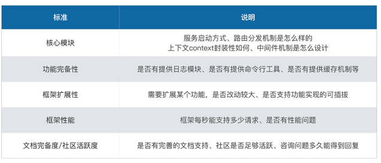
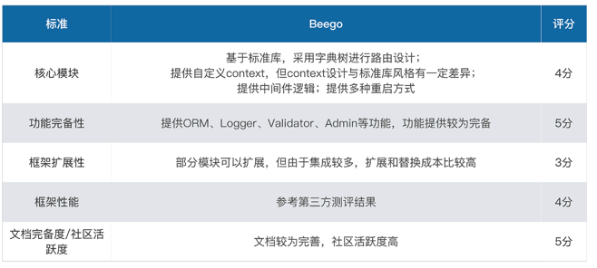
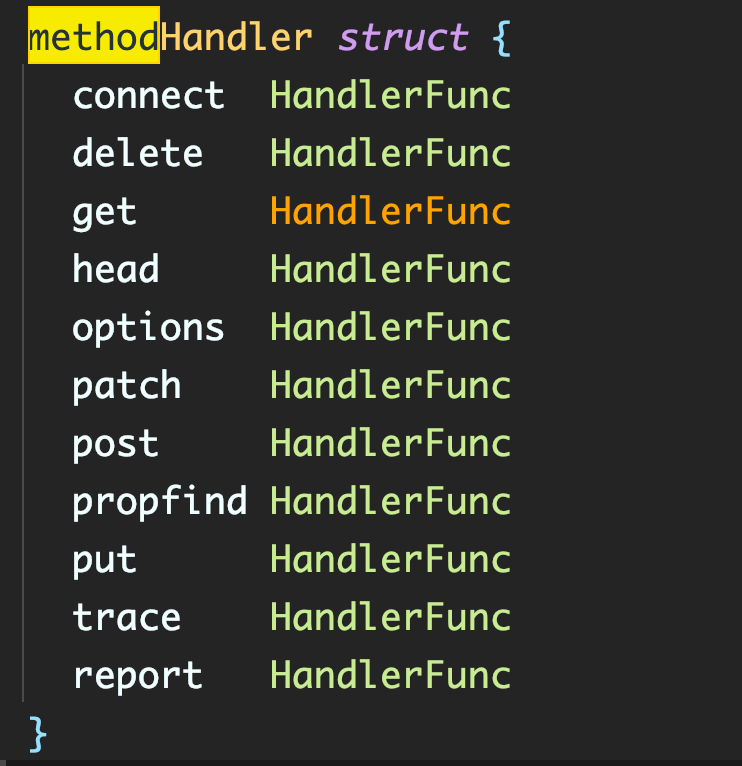
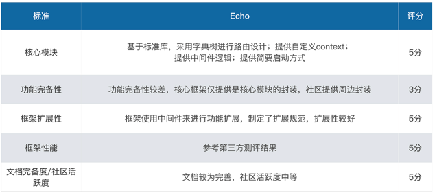
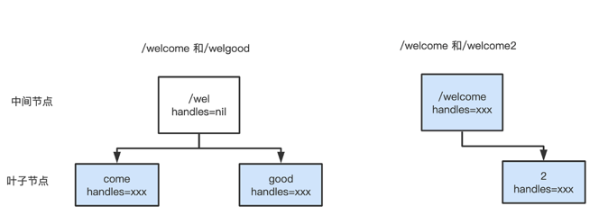
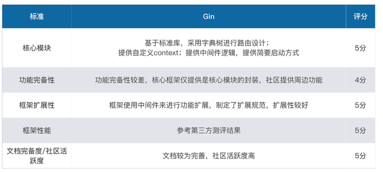

## 开源框架怎么比较

先进入开源世界，对比开源世界中现有的各种 Web 框架，理解一下它们的实现选择和意图。

Golang 语言的 Web 开发有很多的框架可以用，但是选择太多也不是好事，因为在技术群里我总会遇到群友有这些疑问：哪款框架比较好呢？我要选择哪款框架呢？这些疑问至少暴露出两个问题：一不知道如何比较开源框架、二不了解这些开源框架，那么接下来我们一一解答。

如何比较开源框架？说到比较，是一定要有标准的。但是衡量一个 Web 框架是多维度的事情，也没有定论。

### 核心模块

一个框架最核心的几个部分就是：HTTP 服务的启动方式、路由、Context、中间件、重启方式，它们的实现非常关键，往往影响到整个框架的表现，也能直接体现出框架作者的开发水平。

框架的核心模块就好像是汽车的引擎，一旦核心模块出了问题，或者有隐性的缺陷，后果往往是无法弥补的。理想的核心模块必须要有设计感，有自己的思想，代码质量、性能都不能出问题。

### 功能完备性

框架最好能尽可能多地提供功能或者规范，比如有自己的日志模块、脚手架、命令行工具，甚至自己的 ORM、缓存等等。

要知道，框架的本质还是在于提高开发效率，在团队中，我们希望不同水平的同学能写出基本一样的代码，那就要靠框架这个顶层设计来规范了。试想一下，如果框架中提供了很方便的参数验证规范，那在开发应用的时候，还有谁愿意走解析和正则匹配来验证参数呢?

在功能完备性的选择上，我们往往会根据之后是否希望自定义需求来确定。这里说的自定义需求，指的是定制自己的日志、ORM 等模块的需求。

### 框架扩展性
理想的框架，它的扩展性一定要好。框架要做的事情应该是定义模块与模块之间的交互标准，而不应该直接定义模块的具体实现方式。我可以在这个标准上扩展出我需要的功能，这样整个框架才会比较灵活。

Web 领域的技术边界在不断扩展，谁也无法保证框架中所用的库，哪怕是最基本的日志库，能永远满足需求。当框架使用者想为应用增加一个功能，或者替换某个第三方库的时候，如果改动的地方非常多，要大动干戈，甚至根本就无法支持替换和增加，那这个框架的扩展性就比较弱了。

### 框架性能
虽然大部分框架都是封装 net/http，但是封装程度不同以及具体的实现选择不同（使用的路由匹配、上下文机制等），就会有不同的性能表现。

我们选择框架之后，最终是要在框架上运行代码的，如果运行效率有指数级别的差距，是不能接受的。市面上所有框架的性能，你可以参考这个第三方测评结果。

其实对框架性能来说，大部分场景里，我们是不会有极致性能需求的。所以看各种框架的性能评估，我们不应该把各个框架孤立出来看，应该将差不多量级的性能归为一组。不要去比较单个框架的性能差异，而应该去比较不同量级组之间的性能差异，因为在相同量级下，其实框架和框架之间的性能差别并不是很大。

### 文档完备度及社区活跃度
开源不仅仅是将代码分享出去，同时分享的还有使用文档，官方必须提供足够的介绍资料，包括文档、视频、demo 等。

文档和社区是需要不断运营的，因为在使用的过程中，我们一定会遇到各种各样的问题，官方的回复以及一个活跃的社区是保障问题能得到解决的必要条件。

所以当我们选择一个框架的时候，官网、GitHub 的 star、issue 都是很好的衡量标准。当选择框架之后，不妨每天花一点时间在这个项目的官网、GitHub 或者邮件组上，你会得到很多真实信息。

现在基本了解这五点评判标准了，我们可以用这把尺子衡量一下市面上的框架，帮助你迅速熟悉起来。

### 比较开源框架
在开源社区有个 go-web-framework-stars 项目，把 41 款 Go Web 框架按流行程度做了个列表，其中 Gin、Beego、Echo 这三个框架是 Star 数排名前三的，下面我们就针对这三个框架来分析。

在刚才的五个维度中，我们会重点分析这三个框架的核心模块和功能完备性这两点，另外三点扩展性、性能以及文档完备性资料很多，我只在表格中简单说明一下。

### Beego
Beego 是一款国人开发的 Web 框架，它出现得非常早，中间经历过一次比较大的改版，目前版本定位在 2.0.0。

先来看 Beego 的核心模块，我们还是从 HTTP 服务的启动方式、路由、Context、中间件、重启方式这五个方面来分析。

Beego 提供多种服务启动方式：HTTP/HTTPS、CGI、Graceful。

它的路由原理是为每个 HTTP 方法建立一个路由树，这个路由树结构的每个叶子节点是具体的执行控制器，每个中间节点是 HTTP 请求中斜杠“/”分隔的节。比如 /user/name 从根到叶子节点的通路就是：1 个根节点、1 个中间节点 user、一个叶子节点 name。

Beego 的自动匹配路由和注解路由是比较有特色的，这里我简单解释一下：

- 自动匹配路由的意思是，如果我们把一个控制器注册到自动路由中，路由寻址的时候，会根据“控制器名称 + 控制器类”中的方法名，自动进行映射匹配。

- 注解路由是指在注册路由树的时候，会根据控制器类中某个方法的注释来解析并创建路由树。

Context 的设计方面，Beego 的 Context 是藏在 controller 结构中的，而不是每个函数的第一个参数带着 Context，这个和现在 Golang 提倡的“函数第一个参数为 Context”的规范是有些不同的，可能也是因为 Beego 出现的时间比较早。

在功能完备性方面，Beego 框架提供了很多周边的功能。比如 Beego 提供了一个原生的 ORM 框架、自定义的 Logger 库、参数验证 Validate 库，甚至还默认提供了管理 GC、Goroutine 等管理接口。

总体来说，使用 Beego 的最大感受就是“全”。这是一个很全的框架，开发 Web 应用所需要的所有组件基本都能在这里找到，如果选择它做业务开发，功能完备性是最重要的因素。所以在从零开始，希望快速开发的场景中，我们会尽量选择使用这个框架。

### Echo
Echo 框架目前最新版本是 v4.0.0。它的底层也是基于 net/http，但并没有提供类似 Beego 通过信号的 Graceful 启动方式，而是暴露标准库的 ShutDown 方法进行请求的关闭接口，具体使用的方式是开关还是配置，都交由使用者决定。

在路由方面，Echo 的路由也是使用字典树的结构。和 Beego 的树不同，它并不是为每个 HTTP 方法建立一个树，而是只整体建立一个树，在叶子节点中，根据不同的 HTTP 方法存放了不同的控制处理函数，所以你可以在它的叶子节点中看到如下这么一个 methodHandler 结构：

Echo 也封装了自己的 Context 接口，提供了一系列像 JSON、Validate、Bind 等很好用的对 request 和 response 的封装。

相较于 Beego 库，Echo 库非常轻量，除了基本的路由、Context 之外，大部分功能都以 Middleware 的形式提供出来。Echo 的 Middleware 是一个 echo.MiddlewareFunc 结构体的无参数函数。在框架的 middleware 文件夹中，提供了诸如 logger、jwt、csrf 等中间件。

总体来说，Echo 的使用者更看中扩展性和框架性能。和定位一样，它是一种高性能、可扩展、轻量级的 Web 框架，但麻雀虽小，五脏俱全。目前看起来，它的社区活跃度比 Gin 框架稍差一些（从两者的中间件贡献数可以看出）。所以我感觉，Echo 框架更适合个人开发者，而且需要有一定的扩展框架能力。

### Gin
Gin 和 Echo 一样属于非常轻量级的应用，基本实现的就是 Web 框架最核心的部分。

路由方面，和 Echo 一样使用字典树，但是又和 Echo/Beego 不一样的是，它的中间节点并不是斜杠分隔的请求路由，而是相同的字符串部分。

比如下图左边的例子，/welcome 和 /welgood 会创建一个中间节点 (/wel) 和两个叶子节点 (come) 和 (good)，而且并不是只有叶子节点才包含控制器处理函数，中间节点也可能存在控制器节点函数。比如下图的右边例子，/welcome 和 /welcome2 包含中间节点 (/welcome) 和叶子节点 (2)，中间节点 /welcome 也包含了一个处理函数。

Gin 的路由还有一个特色就是，使用索引来加速子树查询效率。再看图中左边的例子，/wel 中间节点还带着一个索引 cg，代表的是子树的第一个字母。所以路由查找的时候，会先去索引 cg 中查找，当前路由除“/wel”的第一个字母，是否在索引中，如果在，索引的下标序列就代表第几个子树节点。

不过，Gin 的路由并不是这个框架作者原创的，使用的是第三方的 httprouter 包。Gin 使用这个核心包的方法也不是直接 import 第三方包，而是将其 copy 进自己的代码库，当然可以这么用也是因为 httprouter 第三方库使用的是 BSD 这种有很大自由度的许可证协议。

Context 基本就和 Echo/Beego 的设计一样，自己封装了 Context 结构。但是，Gin 的 Context 结构实现了标准库定义的 Context 接口，即 Deadline、Done 等接口。所以按照 Golang 中定义的鸭子类型概念（长得像鸭子，那么就是鸭子），我们可以把 Gin 中的 Context 当作标准库的 Context 一样使用，这点在实际开发工作中是非常方便的。

在中间件上，Gin 框架没有定义所有的 middleware，而是定义了 middleware 函数：

> HandlerFunc func(*Context)

链式加载和调用 middleware，并将这个 middleware 的具体实现开放给社区，设计了 社区贡献 organizations ，让社区的开源贡献者把自己实现的中间件统一放在这个 organizations 中，提供给所有人使用，而 Gin 的核心代码及相关则放在另一个 organizations 中。这种为开源社区制定标准，并且不断推进和审核开源贡献代码的做法，也是 Gin 社区活跃度如此之高的原因之一。

总体来说，Gin 比较适合企业级团队使用。它的社区活跃度较高，社区贡献的功能模块较多，能很好补充其功能完备性；同时 Gin 的扩展性也很好，我们可以在社区贡献模块和自研模块中做出很好的取舍。

