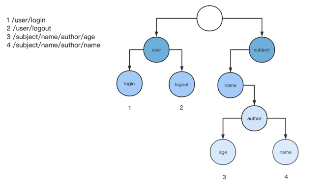
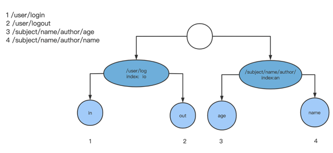

## 集成 Gin 到现有框架中

### Recovery 的错误捕获

- 自定义的实现

```text
// recovery 机制，将协程中的函数异常进行捕获
func Recovery() framework.ControllerHandler {
  // 使用函数回调
  return func(c *framework.Context) error {
    // 核心在增加这个 recover 机制，捕获 c.Next()出现的 panic
    defer func() {
      if err := recover(); err != nil {
        c.Json(500, err)
      }
    }()
    // 使用 next 执行具体的业务逻辑
    c.Next()
    return nil
  }
}
```

这个中间件的作用是捕获协程中的函数异常。我们使用 defer、recover 函数，捕获了 c.Next 中抛出的异常，并且在 HTTP 请求中返回 500 内部错误的状态码。

乍看这段代码，是没有什么问题的。但是再仔细思考下是否有需要完善的细节？

首先是异常类型，我们原先认为，所有异常都可以通过状态码，直接将异常状态返回给调用方，但是这里是有问题的。这里的异常，除了业务逻辑的异常，是不是也有可能是底层连接的异常？

以底层连接中断异常为例，对于这种连接中断，我们是没有办法通过设置 HTTP 状态码来让浏览器感知的，并且一旦中断，后续的所有业务逻辑都没有什么作用了。同时，如果我们持续给已经中断的连接发送请求，会在底层持续显示网络连接错误（broken pipe）。

所以在遇到这种底层连接异常的时候，应该直接中断后续逻辑。来看看 Gin 对于连接中断的捕获是怎么处理的。

- gin 实现

```text
return func(c *Context) {
    defer func() {
      if err := recover(); err != nil {
        // 判断是否是底层连接异常，如果是的话，则标记 brokenPipe
        var brokenPipe bool
        if ne, ok := err.(*net.OpError); ok {
          if se, ok := ne.Err.(*os.SyscallError); ok {
            if strings.Contains(strings.ToLower(se.Error()), "broken pipe") || strings.Contains(strings.ToLower(se.Error()), "connection reset by peer") {
              brokenPipe = true
            }
          }
        }
        ...
                
        if brokenPipe {
          // 如果有标记位，我们不能写任何的状态码
          c.Error(err.(error)) // nolint: errcheck
          c.Abort()
        } else {
          handle(c, err)
        }
      }
    }()
    c.Next()
  }
```

这段代码先判断了底层抛出的异常是否是网络异常（net.OpError），如果是的话，再根据异常内容是否包含“broken pipe”或者“connection reset by peer”，来判断这个异常是否是连接中断的异常。如果是，就设置标记位，并且直接使用 c.Abort() 来中断后续的处理逻辑。

这个处理异常的逻辑可以说是非常细节了，区分了网络连接错误的异常和普通的逻辑异常，并且进行了不同的处理逻辑。这一点，可能是绝大多数的开发者都没有考虑到的。

### Recovery 的日志打印
首先，打印异常内容是一定得有的。这里直接使用 logger.Printf 就可以打印出来了。

> logger.Printf("%s\n%s%s", err, ...)

其次，异常是由某个请求触发的，所以触发这个异常的请求内容，也是必要的调试信息，需要打印。

```text
httpRequest, _ := httputil.DumpRequest(c.Request, false)
headers := strings.Split(string(httpRequest), "\r\n")
// 如果 header 头中有认证信息，隐藏，不打印。
for idx, header := range headers {
current := strings.Split(header, ":")
  if current[0] == "Authorization" {
      headers[idx] = current[0] + ": *"
  }
}
headersToStr := strings.Join(headers, "\r\n")
```

分析一下这段代码，Gin 使用了一个 DumpRequest 来输出请求中的数据，包括了 HTTP header 头和 HTTP Body。

这里值得注意的是，为了安全考虑 Gin 还注意到了，如果请求头中包含 Authorization 字段，即包含 HTTP 请求认证信息，在输出的地方会进行隐藏处理，不会由于 panic 就把请求的认证信息输出在日志中。这一个细节，可能大多数开发者也都没有考虑到。

最后看堆栈信息打印，Gin 也有其特别的实现。我们打印堆栈一般是使用 runtime 库的 Caller 来打印：

```text
// 打印堆栈信息，是否有这个堆栈
func Caller(skip int) (pc uintptr, file string, line int, ok bool)
```

caller 方法返回的是堆栈函数所在的函数指针、文件名、函数所在行号信息。但是在使用过程中你就会发现，使用 Caller 是打印不出真实代码的。

比如下面这个例子，我们使用 Caller 方法，将文件名、行号、堆栈函数打印出来：

```text
// 在 prog.go 文件，main 库中调用 call 方法
func call(skip int) bool {   //24 行
  pc,file,line,ok := runtime.Caller(skip) //25 行
  pcName := runtime.FuncForPC(pc).Name()  //26 行
  fmt.Println(fmt.Sprintf("%v %s %d %s",pc,file,line,pcName)) //27 行
  return ok //28 行
} //29 行
```

打印出的第一层堆栈函数的信息：

> 4821380 /tmp/sandbox064396492/prog.go 25 main.call

这个堆栈信息并不友好，它告诉我们，第一层信息所在地址为 prog.go 文件的第 25 行，在 main 库的 call 函数里面。所以如果想了解下第 25 行有什么内容，用这个堆栈信息去源码中进行文本查找，是做不到的。这个时候就非常希望信息能打印出具体的真实代码。

在 Gin 中，打印堆栈的时候就有这么一个逻辑：先去本地查找是否有这个源代码文件，如果有的话，获取堆栈所在的代码行数，将这个代码行数直接打印到控制台中。

```text
// 打印具体的堆栈信息
func stack(skip int) []byte {
  ...
    // 循环从第 skip 层堆栈到最后一层
  for i := skip; ; i++ { 
    pc, file, line, ok := runtime.Caller(i)
    // 获取堆栈函数所在源文件
    if file != lastFile {
      data, err := ioutil.ReadFile(file)
      if err != nil {
        continue
      }
      lines = bytes.Split(data, []byte{'\n'})
      lastFile = file
    }
        // 打印源代码的内容
    fmt.Fprintf(buf, "\t%s: %s\n", function(pc), source(lines, line))
  }
  return buf.Bytes()
}
```

这样，打印出来的堆栈信息形如：
```text
github.com/gin-gonic/gin@v1.7.2/context.go:165 (0x1385b5a)
        (*Context).Next: c.handlers[c.index](c)
```

这个堆栈信息就友好多了，它告诉我们，这个堆栈函数发生在文件的 165 行，它的代码为 c.handlersc.index， 这行代码所在的父级别函数为 (*Context).Next。

最终，Gin 打印出来的 panic 信息形式如下：
```text
/08/15 14:18:57 [Recovery] /08/15 - 14:18:57 panic recovered:
GET /first HTTP/1.1
Host: localhost:8080
Accept: text/html,application/xhtml+xml,application/xml;q=0.9,image/avif,image/webp,image/apng,*/ *;q=0.8,application/signed-exchange;v=b3;q=0.9
Accept-Encoding: gzip, deflate, br
...
User-Agent: Mozilla/5.0 (Macintosh; Intel Mac OS X 10_15_7) AppleWebKit/537.36 (KHTML, like Gecko) Chrome/92.0.4515.131 Safari/537.36
%!s(int=121321321)
/Users/xxxx/UGit/gindemo/main.go:19 (0x1394214)
        main.func1: panic(121321321)
/Users/xxxx/gopath/pkg/mod/github.com/gin-gonic/gin@v1.7.2/context.go:165 (0x1385b5a)
        (*Context).Next: c.handlers[c.index](c)
/Users/xxxx/gopath/pkg/mod/github.com/gin-gonic/gin@v1.7.2/recovery.go:99 (0x1392c48)
        CustomRecoveryWithWriter.func1: c.Next()
/Users/xxxx/gopath/pkg/mod/github.com/gin-gonic/gin@v1.7.2/context.go:165 (0x1385b5a)
        (*Context).Next: c.handlers[c.index](c)
...
/usr/local/Cellar/go/1.15.5/libexec/src/net/http/server.go:1925 (0x12494ac)
        (*conn).serve: serverHandler{c.server}.ServeHTTP(w, w.req)
/usr/local/Cellar/go/1.15.5/libexec/src/runtime/asm_amd64.s:1374 (0x106bb00)
        goexit: BYTE    $0x90   // NOP
```

可以说这个调试信息就非常丰富了，对我们在实际工作中的调试会有非常大的帮助。但是这些丰富的细节都是在开源过程中，不断补充起来的。

### 路由对比

刚才只挑 Recovery 中间件的错误捕获和日志打印简单说了一下，可以再挑核心一些的功能，例如比较一下实现的路由和 Gin 的路由的区别。

使用 trie 树实现了一个路由，它的每一个节点是一个 segment。



而 Gin 框架的路由选用的是一种压缩后的基数树（radix tree），它和我们之前实现的 trie 树相比最大的区别在于，它并不是把按照分隔符切割的 segment 作为一个节点，而是把整个 URL 当作字符串，尽可能匹配相同的字符串作为公共前缀。



为什么 Gin 选了这个模型？其实 radix tree 和 trie 树相比，最大的区别就在于它节点的压缩比例最大化。直观比较上面两个图就能看得出来，对于 URL 比较长的路由规则，trie 树的节点数就比 radix tree 的节点数更多，整个数的层级也更深。

针对路由这种功能模块，创建路由树的频率远低于查找路由点频率，那么减少节点层级，无异于能提高查找路由的效率，整体路由模块的性能也能得到提高，所以 Gin 用 radix tree 是更好的选择。

另外在路由查找中，Gin 也有一些细节做得很好。首先，从父节点查找子节点，并不是像我们之前实现的那样，通过遍历所有子节点来查找是否有子节点。Gin 在每个 node 节点保留一个 indices 字符串，这个字符串的每个字符代表子节点的第一个字符：

在 Gin 源码的tree.go中可以看到。
```text
// node 节点
type node struct {
  path      string
  indices   string  // 子节点的第一个字符
  ...
  children  []*node // 子节点
    ...
}
```

这个设计是为了加速子节点的查询效率。使用 Hash 查找的时间复杂度为 O(1)，而我们使用遍历子节点的方式进行查找的效率为 O(n)。

在拼接 indices 字符串的时候，这里 Gin 还有一个代码方面的细节值得注意，在 tree.go 中有一段这样的代码：
```text
path = path[i:]
  c := path[0]
  ...
  // 插入子节点
  if c != ':' && c != '*' && n.nType != catchAll {
    // []byte for proper unicode char conversion, see #65
        // 将字符串拼接进入 indices
    n.indices += bytesconv.BytesToString([]byte{c})
    ...
    n.addChild(child)
    ...
```

而在 Gin 的第 #2206 号提交中，有开源贡献者就使用自研的 bytesconv 包，将 Gin 中的字符数组和 string 的转换统一做了一次修改。
```text
package bytesconv
// 字符串转化为字符数组，不需要创建新的内存
func StringToBytes(s string) []byte {
  return *(*[]byte)(unsafe.Pointer(
    &struct {
      string
      Cap int
    }{s, len(s)},
  ))
}

// 字符数组转换为字符串，不需要创建新的内存
func BytesToString(b []byte) string {
  return *(*string)(unsafe.Pointer(&b))
}
```

bytesconv 包的原理就是，直接使用 unsafe.Pointer 来强制转换字符串或者字符数组的类型。

这些细节的修改，一定程度上减少了 Gin 包内路由的内存占用空间。类似的细节点还有很多，需要每一行代码琢磨过去，而且这里的每一个细节优化点都是，开源贡献者在生产环境中长期使用 Gin 才提炼出来的。

不要小看这些看似非常细小的修改。因为细节往往是积少成多的，所有的这些细节逐渐优化、逐渐完善，才让 Gin 框架的实用度得到持久的提升，和其他框架的差距就逐渐体现出来了，这样才让 Gin 框架成了生产环境中首选的框架。

### 生态
一个开源项目的成功，最重要的是两个事情，第一个是质量，开源项目的代码质量是摆在第一位的，但是还有一个是不能被忽略的：生态的完善。

一个好的开源框架项目，不仅仅只有代码，还需要围绕着核心代码打造文档、框架扩展、辅助命令等。这些代码周边的组件和功能的打造，虽然从难度上看，并没有核心代码那么重要，但是它是一个长期推进和完善的过程。

Gin 的整个生态环境是非常优质的，在开源中间件、社区上都能看到其优势。

从 2014 年至今 Gin 已有多个开源共享者为其共享了开源中间件，目前官方 GitHub组织收录的中间件有 23 个，非收录官方，但是在官方 README记录的也有 45 个。

这些中间件包含了 Web 开发各个方面的功能，比如提供跨域请求的 cors 中间件、提供本地缓存的 cache 中间件、集成了 pprof 工具的 pprof 中间件、自动生成全链路 trace 的 opengintracing 中间件等等。如果你用一个自己的框架，就需要重建生态一一开发，这是非常烦琐的，而且工作量巨大。

Gin 的 GitHub 官网的社区活跃度比较高，对于已有的一些问题，在官网的 issue 提出来立刻就会有人回复，在 Google 或者 Baidu 上搜索 Gin，也会有很多资料。所以对于工作中必然会出现的问题，我们可以在网络上很方便找寻到这个框架的解决办法。这也是 Gin 大受欢迎的原因之一。

其实除了 Gin 框架，我们可以从不少其他语言的框架中看到生态的重要性。比如前端的 Vue 框架，它不仅仅提供了最核心的 Vue 的框架代码，还提供了脚手架工具 Vue-CLI、Vue 的 Chrome 插件、Vue 的官方论坛和聊天室、Vue 的示例文档 Cookbook。这些周边生态对 Vue 框架的成功起到了至关重要的作用。


