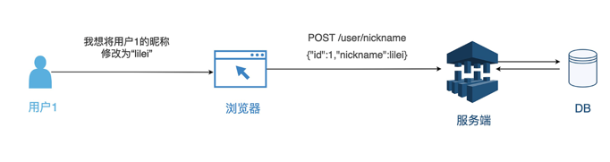
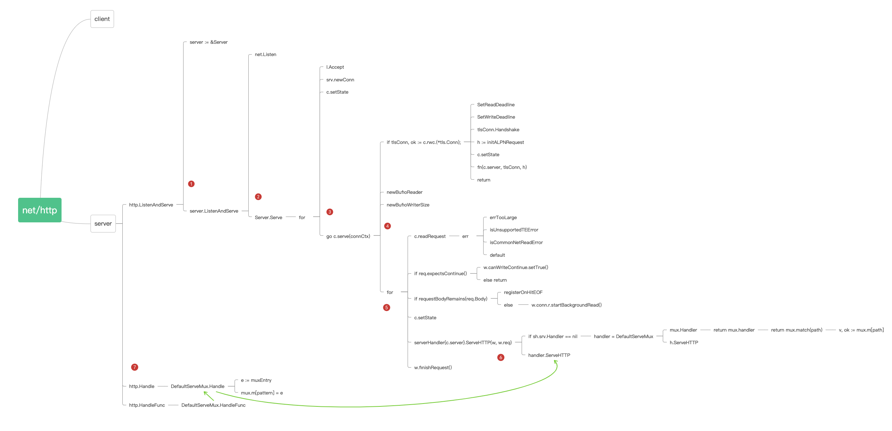
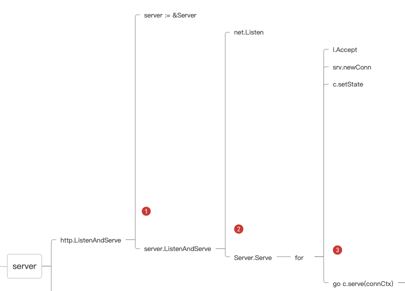
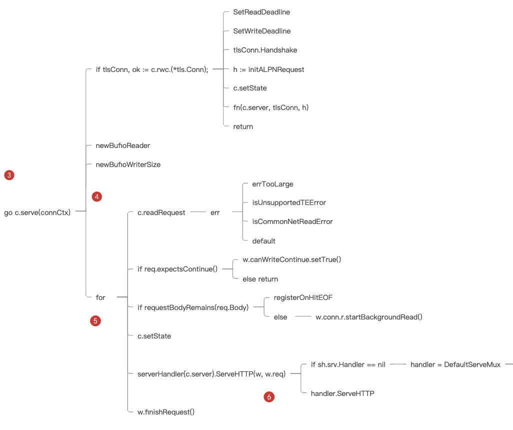
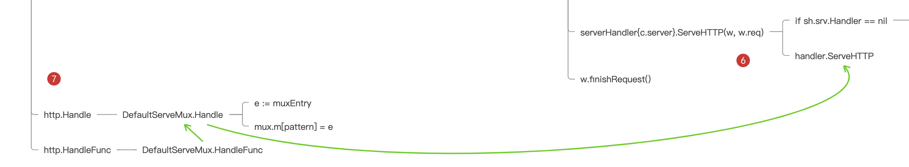

## net/http：使用标准库搭建Server并不是那么简单

### Web Server 的本质
Web Server，维基百科上是这么解释的，Web Server 是一个通过 HTTP 协议处理 Web 请求的计算机系统。

HTTP 协议，在 OSI 网络体系结构中，是基于 TCP/IP 之上第七层应用层的协议，全称叫做超文本传输协议。啥意思？就是说 HTTP 协议传输的都是文本字符，只是这些字符是有规则排列的。这些字符的排列规则，就是一种约定，也就是协议。这个协议还有一个专门的描述文档，就是 [RFC 2616](https://www.rfc-editor.org/rfc/inline-errata/rfc2616.html)。

对于 HTTP 协议，无论是请求还是响应，传输的消息体都可以分为两个部分：HTTP 头部和 HTTP Body 体。头部描述的一般是和业务无关但与传输相关的信息，比如请求地址、编码格式、缓存时长等；Body 里面主要描述的是与业务相关的信息。



Web Server 的本质，实际上就是接收、解析 HTTP 请求传输的文本字符，理解这些文本字符的指令，然后进行计算，再将返回值组织成 HTTP 响应的文本字符，通过 TCP 网络传输回去。

### 一定要用标准库吗
对 Web Server 来说，Golang 提供了 net 库和 net/http 库，分别对应 OSI 的 TCP 层和 HTTP 层，它们两个负责的就是 HTTP 的接收和解析。

一般我们会使用 net/http 库解析 HTTP 消息体。但是可能会有人问，如果我想实现 Web 服务，可不可以不用 net/http 库呢？比如我直接用 net 库，逐字读取消息体，然后自己解析获取的传输字符。

答案是可以的，如果你有兼容其它协议、追求极致性能的需求，而且你有把握能按照 HTTP 的 RFC 标准进行解析，那完全可以自己封装一个 HTTP 库。

其实在一些大厂中确实是这么做的，每当有一些通用的协议需求，比如一个服务既要支持 HTTP，又要支持 Protocol Buffers，又或者想要支持自定义的协议，那么他们就可能抛弃 HTTP 库，甚至抛弃 net 库，直接自己进行网络事件驱动，解析 HTTP 协议。

有个开源库，叫 [FastHTTP](https://github.com/valyala/fasthttp)，它就是抛弃标准库 net/http 来实现的。作者为了追求极高的 HTTP 性能，自己封装了网络事件驱动，解析了 HTTP 协议。你感兴趣的话，可以去看看。

但是现在绝大部分的 Web 框架，都是基于 net/http 标准库的。原因主要有两点：

- 第一是相信官方开源的力量。自己实现 HTTP 协议的解析，不一定会比标准库实现得更好，即使当前标准库有一些不足之处，我们也都相信，随着开源贡献者越来越多，标准库也会最终达到完美。

- 第二是 Web 服务架构的变化。随着容器化、Kubernetes 等技术的兴起，业界逐渐达成共识，单机并发性能并不是评判 Web 服务优劣的唯一标准了，易用性、扩展性也是底层库需要考量的。

所以总体来说，net/http 标准库，作为官方开源库，其易用性和扩展性都经过开源社区和 Golang 官方的认证，是我们目前构建 Web Server 首选的 HTTP 协议库。

### net/http 标准库怎么学
想要在 net/http 标准库纷繁复杂的代码层级和调用中，弄清楚主流程不是一件容易事。要快速熟悉一个标准库，就得找准方法。

这里教给你一个快速掌握代码库的技巧：库函数 > 结构定义 > 结构函数。

简单来说，就是当你在阅读一个代码库的时候，不应该从上到下阅读整个代码文档，而应该先阅读整个代码库提供的对外库函数（function），再读这个库提供的结构（struct/class），最后再阅读每个结构函数（method）。


为什么要这么学呢？因为这种阅读思路和代码库作者的思路是一致的。

首先搞清楚这个库要提供什么功能（提供什么样的对外函数），然后为了提供这些功能，我要把整个库分为几个核心模块（结构），最后每个核心模块，我应该提供什么样的能力（具体的结构函数）来满足我的需求。

### 库函数（功能）
按照这个思路，我们来阅读 net/http 库，先看提供的对外库函数是为了实现哪些功能。

你直接通过  go doc net/http | grep "^func" 命令行能查询出 net/http 库所有的对外库函数：
```text
func CanonicalHeaderKey(s string) string
func DetectContentType(data []byte) string
func Error(w ResponseWriter, error string, code int)
func Get(url string) (resp *Response, err error)
func Handle(pattern string, handler Handler)
func HandleFunc(pattern string, handler func(ResponseWriter, *Request))
func Head(url string) (resp *Response, err error)
func ListenAndServe(addr string, handler Handler) error
func ListenAndServeTLS(addr, certFile, keyFile string, handler Handler) error
func MaxBytesReader(w ResponseWriter, r io.ReadCloser, n int64) io.ReadCloser
func NewRequest(method, url string, body io.Reader) (*Request, error)
func NewRequestWithContext(ctx context.Context, method, url string, body io.Reader) (*Request, error)
func NotFound(w ResponseWriter, r *Request)
func ParseHTTPVersion(vers string) (major, minor int, ok bool)
func ParseTime(text string) (t time.Time, err error)
func Post(url, contentType string, body io.Reader) (resp *Response, err error)
func PostForm(url string, data url.Values) (resp *Response, err error)
func ProxyFromEnvironment(req *Request) (*url.URL, error)
func ProxyURL(fixedURL *url.URL) func(*Request) (*url.URL, error)
func ReadRequest(b *bufio.Reader) (*Request, error)
func ReadResponse(r *bufio.Reader, req *Request) (*Response, error)
func Redirect(w ResponseWriter, r *Request, url string, code int)
func Serve(l net.Listener, handler Handler) error
func ServeContent(w ResponseWriter, req *Request, name string, modtime time.Time, ...)
func ServeFile(w ResponseWriter, r *Request, name string)
func ServeTLS(l net.Listener, handler Handler, certFile, keyFile string) error
func SetCookie(w ResponseWriter, cookie *Cookie)
func StatusText(code int) string
```

在这个库提供的方法中，我们去掉一些 New 和 Set 开头的函数，因为你从命名上可以看出，这些函数是对某个对象或者属性的设置。

- 为服务端提供创建 HTTP 服务的函数，名字中一般包含 Serve 字样，比如 Serve、ServeFile、ListenAndServe 等。

- 为客户端提供调用 HTTP 服务的类库，以 HTTP 的 method 同名，比如 Get、Post、Head 等。

- 提供中转代理的一些函数，比如 ProxyURL、ProxyFromEnvironment 等。

如何创建一个 HTTP 服务，所以关注包含 Serve 字样的函数就可以了。

```text
/ 通过监听的URL地址和控制器函数来创建HTTP服务
func ListenAndServe(addr string, handler Handler) error{}
// 通过监听的URL地址和控制器函数来创建HTTPS服务
func ListenAndServeTLS(addr, certFile, keyFile string, handler Handler) error{}
// 通过net.Listener结构和控制器函数来创建HTTP服务
func Serve(l net.Listener, handler Handler) error{}
// 通过net.Listener结构和控制器函数来创建HTTPS服务
func ServeTLS(l net.Listener, handler Handler, certFile, keyFile string) error{}
```

### 结构定义（模块）
然后，过一遍这个库提供的所有 struct，看看核心模块有哪些，同样使用 go doc:

> go doc net/http | grep "^type" | grep struct

你可以看到整个库最核心的几个结构：

```text
type Client struct{ ... }
type Cookie struct{ ... }
type ProtocolError struct{ ... }
type PushOptions struct{ ... }
type Request struct{ ... } 
type Response struct{ ... }
type ServeMux struct{ ... }
type Server struct{ ... }
type Transport struct{ ... }
```

看结构的名字或者 go doc 查看结构说明文档，能逐渐了解它们的功能：

- Client 负责构建 HTTP 客户端；

- Server 负责构建 HTTP 服务端；

- ServerMux 负责 HTTP 服务端路由；

- Transport、Request、Response、Cookie 负责客户端和服务端传输对应的不同模块。

现在通过库方法（function）和结构体（struct），对整个库的结构和功能有大致印象了。整个库承担了两部分功能，一部分是构建 HTTP 客户端，一部分是构建 HTTP 服务端。

构建的 HTTP 服务端除了提供真实服务之外，也能提供代理中转服务，它们分别由 Client 和 Server 两个数据结构负责。除了这两个最重要的数据结构之外，HTTP 协议的每个部分，比如请求、返回、传输设置等都有具体的数据结构负责。

### 结构函数（能力）
下面从具体的需求出发，来阅读具体的结构函数（method）。

当前的需求是创建 HTTP 服务，开头我举了一个最简单的例子：

```text
// 创建一个Foo路由和处理函数
http.Handle("/foo", fooHandler)

// 创建一个bar路由和处理函数
http.HandleFunc("/bar", func(w http.ResponseWriter, r *http.Request) {
  fmt.Fprintf(w, "Hello, %q", html.EscapeString(r.URL.Path))
})

// 监听8080端口
log.Fatal(http.ListenAndServe(":8080", nil))
```

我们跟着 http.ListenAndServe 这个函数来理一下 net/http 创建服务的主流程逻辑。

阅读具体的代码逻辑用 go doc 命令明显就不够了，你需要两个东西：

一个是可以灵活进行代码跳转的 IDE，VS Code 和 GoLand 都是非常好的工具。以我们现在要查看的 http.ListenAndServe 这个函数为例，我们可以从上面的例子代码中，直接通过 IDE 跳转到这个函数的源码中阅读，有一个能灵活跳转的 IDE 工具是非常必要的。

另一个是可以方便记录代码流程的笔记，这里我的个人方法是使用思维导图。

具体方法是将要分析的代码从入口处一层层记录下来，每个函数，我们只记录其核心代码，然后对每个核心代码一层层解析。记得把思维导图的结构设置为右侧分布，这样更直观。

比如下面这张图，就是解析部分 HTTP 库服务端画的代码分析图。

具体方法是将要分析的代码从入口处一层层记录下来，每个函数，我们只记录其核心代码，然后对每个核心代码一层层解析。记得把思维导图的结构设置为右侧分布，这样更直观。

比如下面这张图，就是我解析部分 HTTP 库服务端画的代码分析图。



这张图看上去层级复杂，不过不用担心，对照着思维导图，我带你一层一层阅读，讲解每一层的逻辑，带你看清楚代码背后的设计思路。

我们先顺着 http.ListenAndServe 的脉络读。

**第一层**，http.ListenAndServe 本质是通过创建一个 Server 数据结构，调用 server.ListenAndServe 对外提供服务，这一层完全是比较简单的封装，目的是，将 Server 结构创建服务的方法 ListenAndServe ，直接作为库函数对外提供，增加库的易用性。



进入到**第二层**，创建服务的方法 ListenAndServe 先定义了监听信息 net.Listen，然后调用 Serve 函数。

而在**第三层** Serve 函数中，用了一个 for 循环，通过 l.Accept不断接收从客户端传进来的请求连接。当接收到了一个新的请求连接的时候，通过 srv.NewConn创建了一个连接结构（http.conn），并创建一个 Goroutine 为这个请求连接对应服务（c.serve）。

从**第四层**开始，后面就是单个连接的服务逻辑了。



在第四层，c.serve函数先判断本次  HTTP 请求是否需要升级为 HTTPs，接着创建读文本的 reader 和写文本的 buffer，再进一步读取本次请求数据，然后第五层调用最关键的方法 serverHandler{c.server}.ServeHTTP(w, w.req) ，来处理这次请求。

这个关键方法是为了实现自定义的路由和业务逻辑，调用写法是比较有意思的：

> serverHandler{c.server}.ServeHTTP(w, w.req)

serverHandler 结构体，是标准库封装的，代表“请求对应的处理逻辑”，它只包含了一个指向总入口服务 server 的指针。

这个结构将总入口的服务结构 Server 和每个连接的处理逻辑巧妙联系在一起了，你可以看接着的第六层逻辑：

```text
// serverHandler 结构代表请求对应的处理逻辑
type serverHandler struct {
  srv *Server
}

// 具体处理逻辑的处理函数
func (sh serverHandler) ServeHTTP(rw ResponseWriter, req *Request) {
  handler := sh.srv.Handler
  if handler == nil {
    handler = DefaultServeMux
  }
  ...
  handler.ServeHTTP(rw, req)
}
```

如果入口服务 server 结构已经设置了 Handler，就调用这个 Handler 来处理此次请求，反之则使用库自带的 DefaultServerMux。

这里的 serverHandler 设计，能同时保证这个库的扩展性和易用性：你可以很方便使用默认方法处理请求，但是一旦有需求，也能自己扩展出方法处理请求。

那么 DefaultServeMux 是怎么寻找 Handler 的呢，这就是思维导图的最后一部分第七层。



DefaultServeMux.Handle 是一个非常简单的 map 实现，key 是路径（pattern），value 是这个 pattern 对应的处理函数（handler）。它是通过 mux.match(path) 寻找对应 Handler，也就是从 DefaultServeMux 内部的 map 中直接根据 key 寻找到 value 的。

这种根据 map 直接查找路由的方式是不是可以满足我们的路由需求呢？

好，HTTP 库 Server 的代码流程就梳理完成了，整个逻辑线大致是：

> 创建服务 -> 创建连接 -> 监听请求 -> 处理请求

如果觉得层次比较多，对照着思维导图多看几遍就顺畅了。这里也给你整理了一下逻辑线各层的关键结论：

- 第一层，标准库创建 HTTP 服务是通过创建一个 Server 数据结构完成的；

- 第二层，Server 数据结构在 for 循环中不断监听每一个连接；

- 第三层，每个连接默认开启一个 Goroutine 为其服务；

- 第四、五层，serverHandler 结构代表请求对应的处理逻辑，并且通过这个结构进行具体业务逻辑处理；

- 第六层，Server 数据结构如果没有设置处理函数 Handler，默认使用 DefaultServerMux 处理请求；

- 第七层，DefaultServerMux 是使用 map 结构来存储和查找路由规则。

### 创建框架的 Server 结构

其中第一层的关键结论就是：net/http 标准库创建服务，实质上就是通过创建 Server 数据结构来完成的。所以接下来，我们就来创建一个 Server 数据结构。

通过 go doc net/http.Server 我们可以看到 Server 的结构：

```text
type Server struct {
    // 请求监听地址
  Addr string
    // 请求核心处理函数
  Handler Handler 
  ...
}
```

其中最核心的是 Handler 这个字段，从主流程中我们知道（第六层关键结论），当 Handler 这个字段设置为空的时候，它会默认使用 DefaultServerMux 这个路由器来填充这个值，但是我们一般都会使用自己定义的路由来替换这个默认路由。

所以在框架代码中，我们要创建一个自己的核心路由结构，实现 Handler。

所有的框架代码都存放在 framework 文件夹中，而所有的示例业务代码都存放在 framework 文件夹之外。这里为了后面称呼方便，我们就把 framework 文件夹叫框架文件夹，而把外层称为业务文件夹。

当然 GitHub 上的这个 coreweb 。成品在hade 项目里，你可以先看看，在最后发布的时候，我们会将整个项目进行发布。在一个新的业务中，如果要使用到我们自己写好的框架，可以直接通过引用 “import 项目地址 /framework” 来引入，在最后一部分做实战项目的时候我们会具体演示。

好，下面我们来一步步实现这个项目。

创建一个 framework 文件夹，新建 core.go，在里面写入。

```text
package framework
import "net/http"
// 框架核心结构
type Core struct {
}
// 初始化框架核心结构
func NewCore() *Core {
  return &Core{}
}
// 框架核心结构实现Handler接口
func (c *Core) ServeHTTP(response http.ResponseWriter, request *http.Request) {
  // TODO
}
```

而在业务文件夹中创建 main.go，其中的 main 函数就变成这样：

```text
func main() {
  server := &http.Server{
        // 自定义的请求核心处理函数
    Handler: framework.NewCore(),
        // 请求监听地址
    Addr:    ":8080",
  }
  server.ListenAndServe()
}
```

整理下这段代码，通过自己创建了 Server 数据结构，并且在数据结构中创建了自定义的 Handler（Core 数据结构）和监听地址，实现了一个 HTTP 服务。这个服务的具体业务逻辑都集中在我们自定义的 Core 结构中，后续要做的事情就是不断丰富这个 Core 数据结构的功能逻辑。

HTTP 库提供 FileServer 来封装对文件读取的 HTTP 服务。实现代码也非常简单：

```text
fs := http.FileServer(http.Dir("/home/bob/static"))
http.Handle("/static/", http.StripPrefix("/static", fs))
```

